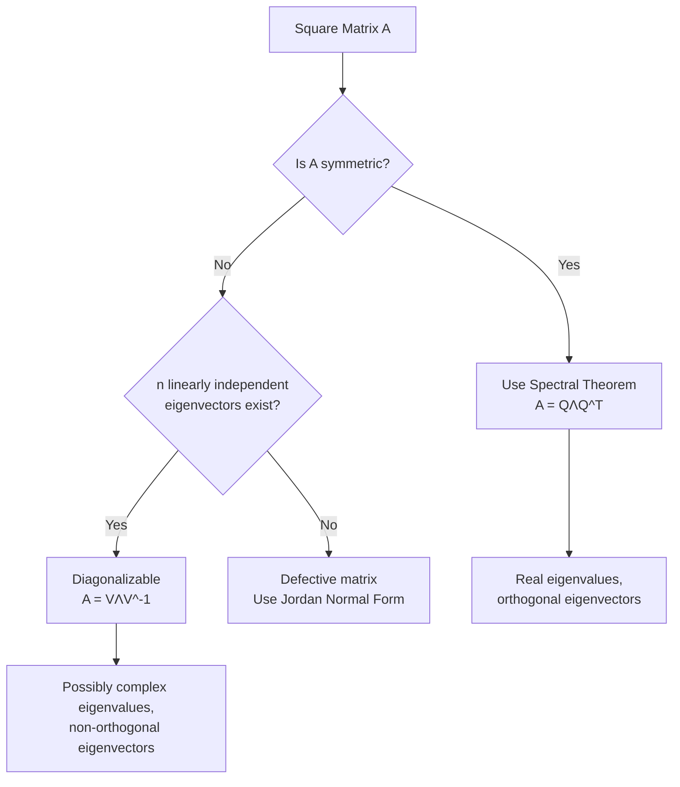

## Eigen Decomposition Revisited

### Overview

Eigen decomposition factors a diagonalizable matrix $A$ into a set of eigenvectors and eigenvalues, expressing it as:

$$A = V \Lambda V^{-1}$$

This revisit extends the foundational concept with deeper treatment of diagonalizability conditions, geometric versus algebraic multiplicity, complex eigenvalues, and the special case of symmetric matrices, which is particularly relevant to machine learning applications like PCA and spectral methods.

### Definition Recap

For a square matrix $A \in \mathbb{R}^{n \times n}$, a nonzero vector $v$ is an eigenvector with corresponding eigenvalue $\lambda$ if:

$$Av = \lambda v$$

If $A$ has $n$ linearly independent eigenvectors, it can be diagonalized as:

$$A = V \Lambda V^{-1}$$

where:
- $V \in \mathbb{R}^{n \times n}$ has the eigenvectors of $A$ as its columns
- $\Lambda \in \mathbb{R}^{n \times n}$ is a diagonal matrix containing the corresponding eigenvalues

### Existence and Diagonalizability

Not every square matrix is diagonalizable. The conditions determine whether an eigen decomposition of this form exists.

**Key Points**
- A matrix is diagonalizable if and only if it has $n$ linearly independent eigenvectors, equivalently, if the geometric multiplicity of every eigenvalue equals its algebraic multiplicity.
- **Algebraic multiplicity** is the multiplicity of an eigenvalue as a root of the characteristic polynomial $\det(A - \lambda I) = 0$.
- **Geometric multiplicity** is the dimension of the eigenspace (null space of $A - \lambda I$) associated with that eigenvalue.
- Matrices where geometric multiplicity is strictly less than algebraic multiplicity for some eigenvalue are called **defective** and cannot be diagonalized in the standard sense; such matrices instead require a Jordan normal form.
- Symmetric real matrices are always diagonalizable, and moreover diagonalizable by an orthogonal matrix, a property with significant computational and theoretical implications. [Fact, following the Spectral Theorem]

### The Spectral Theorem (Symmetric Case)

For a real symmetric matrix $A$ (i.e., $A = A^T$), the eigen decomposition takes a particularly favorable form:

$$A = Q \Lambda Q^T$$

where $Q$ is orthogonal ($Q^TQ = I$) and $\Lambda$ contains real eigenvalues.

**Key Points**
- All eigenvalues of a real symmetric matrix are guaranteed to be real (no complex components).
- Eigenvectors corresponding to distinct eigenvalues are automatically orthogonal; when eigenvalues repeat, an orthogonal basis can still be chosen for the corresponding eigenspace.
- This decomposition avoids the need for matrix inversion ($Q^{-1} = Q^T$), improving numerical stability and computational efficiency compared to the general non-symmetric case.

### Computing Eigen Decomposition

#### Characteristic Polynomial Method (Conceptual)

For small matrices, eigenvalues can be found by solving:

$$\det(A - \lambda I) = 0$$

Once eigenvalues are known, eigenvectors are found by solving $(A - \lambda I)v = 0$ for each $\lambda$.

**Key Points**
- This method is primarily pedagogical; it is numerically unstable and computationally impractical for matrices larger than roughly 4×4, since root-finding for high-degree polynomials is highly sensitive to coefficient errors. [Unverified: practical size threshold varies by conditioning and precision requirements]

#### Iterative Numerical Methods

In practice, eigen decomposition is computed using iterative algorithms rather than the characteristic polynomial.

- **Power iteration**: Repeatedly applies $A$ to a vector and normalizes, converging to the eigenvector associated with the largest-magnitude eigenvalue.
- **QR algorithm**: Applies repeated QR decompositions (see prior topic) to iteratively converge $A$ toward a diagonal (or block-triangular) form, revealing eigenvalues on the diagonal.
- **Jacobi eigenvalue algorithm**: Uses a sequence of Givens-like rotations to zero out off-diagonal entries, particularly effective for symmetric matrices.

**Example**

Power iteration on $A = \begin{pmatrix} 2 & 1 \\ 1 & 2 \end{pmatrix}$ starting from $x_0 = (1, 0)^T$:

$$x_1 = Ax_0 = (2, 1)^T, \quad \text{normalized: } (0.89, 0.45)^T$$

$$x_2 = Ax_1 \approx (2.34, 1.79)^T, \quad \text{normalized: } (0.79, 0.61)^T$$

Continuing this process converges toward the dominant eigenvector $(0.71, 0.71)^T$, corresponding to eigenvalue $\lambda = 3$.

### Complex Eigenvalues

Non-symmetric real matrices can have complex eigenvalues, which occur in conjugate pairs.

**Key Points**
- A rotation matrix, for example, has purely complex (non-real) eigenvalues, reflecting the absence of any real direction left invariant under rotation (except in degenerate cases like 0° or 180°).
- When complex eigenvalues occur, $V$ and $\Lambda$ in $A = V\Lambda V^{-1}$ contain complex entries even though $A$ itself is real.
- [Inference] In machine learning contexts, complex eigenvalues most often arise in dynamical systems analysis (e.g., recurrent neural network stability analysis) rather than in typical static data matrices, which are frequently symmetric (e.g., covariance matrices).

### Geometric Interpretation

<svg xmlns="http://www.w3.org/2000/svg" viewBox="0 0 800 320">
  <text x="400" y="25" font-size="16" font-weight="bold" text-anchor="middle" fill="#1a1a1a">Eigenvectors as Invariant Directions (svg_diagram)</text>

  <line x1="100" y1="170" x2="700" y2="170" stroke="#bdbdbd" stroke-width="1" />
  <line x1="400" y1="50" x2="400" y2="290" stroke="#bdbdbd" stroke-width="1" />

  <text x="150" y="90" font-size="13" fill="#5f6368">Before transformation</text>
  <circle cx="400" cy="170" r="70" fill="none" stroke="#4285f4" stroke-width="1.5" stroke-dasharray="4,3" />
  <line x1="400" y1="170" x2="450" y2="150" stroke="#ea4335" stroke-width="2" marker-end="url(#arrow2)" />
  <line x1="400" y1="170" x2="370" y2="200" stroke="#34a853" stroke-width="2" marker-end="url(#arrow2)" />
  <text x="460" y="145" font-size="11" fill="#ea4335">v1</text>
  <text x="355" y="215" font-size="11" fill="#34a853">v2</text>

  <text x="550" y="90" font-size="13" fill="#5f6368">After A applied</text>
  <ellipse cx="620" cy="170" rx="105" ry="45" fill="none" stroke="#4285f4" stroke-width="1.5" transform="rotate(-22 620 170)" />
  <line x1="620" y1="170" x2="695" y2="126" stroke="#ea4335" stroke-width="2.5" marker-end="url(#arrow2)" />
  <line x1="620" y1="170" x2="580" y2="215" stroke="#34a853" stroke-width="2" marker-end="url(#arrow2)" />
  <text x="700" y="120" font-size="11" fill="#ea4335">λ1·v1</text>
  <text x="565" y="230" font-size="11" fill="#34a853">λ2·v2</text>

  <text x="220" y="290" font-size="11" fill="#5f6368" text-anchor="middle">Eigenvectors keep their direction,</text>
  <text x="220" y="305" font-size="11" fill="#5f6368" text-anchor="middle">only scaled by their eigenvalue λ</text>

  </svg>

### Eigen Decomposition vs. SVD

A common point of confusion is the relationship between eigen decomposition and Singular Value Decomposition.

| Property | Eigen Decomposition | SVD |
|---|---|---|
| Applicable matrices | Square, diagonalizable only | Any $m \times n$ matrix |
| Decomposition form | $A = V\Lambda V^{-1}$ | $A = U\Sigma V^T$ |
| Orthogonality of factors | Only guaranteed if $A$ symmetric | $U$, $V$ always orthogonal |
| Values on diagonal | Eigenvalues (can be negative, complex) | Singular values (always real, non-negative) |
| Numerical stability | Can be poor for non-symmetric matrices | Generally more stable |

**Key Points**
- For a symmetric positive semi-definite matrix, eigen decomposition and SVD coincide: eigenvalues equal singular values, and eigenvectors equal both left and right singular vectors.
- SVD's applicability to non-square, non-diagonalizable matrices makes it the more general-purpose tool, but eigen decomposition remains essential when the analysis specifically requires eigenvalues (e.g., stability analysis, spectral graph theory).

### Applications in Machine Learning

**Key Points**
- **Principal Component Analysis (PCA)**: Eigen decomposition of the covariance matrix $\Sigma = \frac{1}{n}X^TX$ (assuming centered data) yields eigenvectors that define principal component directions, with eigenvalues indicating variance explained along each direction.
- **Spectral clustering**: Uses eigenvectors of a graph Laplacian matrix to embed data into a lower-dimensional space where clusters become more separable.
- **Markov chains and PageRank**: The stationary distribution of a Markov chain corresponds to the eigenvector associated with eigenvalue 1 of the transition matrix.
- **Stability analysis of recurrent networks**: Eigenvalues of weight matrices [Inference] can offer insight into whether gradients vanish or explode over time steps, since eigenvalue magnitudes relate to how repeated matrix multiplication scales vectors, though actual training dynamics depend on additional factors like activation functions and initialization.
- **Covariance matrix analysis**: Eigen decomposition underlies whitening transformations used in preprocessing pipelines to decorrelate and normalize feature variance.

### Numerical Stability Considerations

- Computing eigen decomposition via the characteristic polynomial is avoided in practice due to sensitivity to small perturbations in matrix entries; production libraries (e.g., LAPACK's `dsyev` for symmetric matrices, `dgeev` for general matrices) use iterative methods instead.
- Symmetric matrices benefit from specialized, more stable algorithms (such as the symmetric QR algorithm or divide-and-conquer methods) compared to general non-symmetric matrices.
- Near-defective matrices (where geometric multiplicity is close to, but not exactly, algebraic multiplicity) can cause numerical algorithms to behave unpredictably, and results should be interpreted cautiously in such cases. [Unverified: specific numerical behavior is implementation-dependent]

### Process Flow

### Conclusion

Eigen decomposition provides a powerful lens for understanding linear transformations through their invariant directions and associated scaling factors. While the general case involves important caveats around diagonalizability and complex eigenvalues, the symmetric case — central to many machine learning applications like PCA and covariance analysis — benefits from the strong guarantees of the Spectral Theorem, making it both theoretically elegant and computationally favorable.

**Related Topics**
- Singular Value Decomposition (SVD) and Its Relationship to Eigen Decomposition
- Principal Component Analysis (PCA) Derivation
- Jordan Normal Form for Defective Matrices
- Spectral Graph Theory and Graph Laplacians
- Power Iteration and Convergence Analysis
- Positive Definite and Positive Semi-Definite Matrices
- Markov Chains and Stationary Distributions
- Matrix Diagonalization in Differential Equations