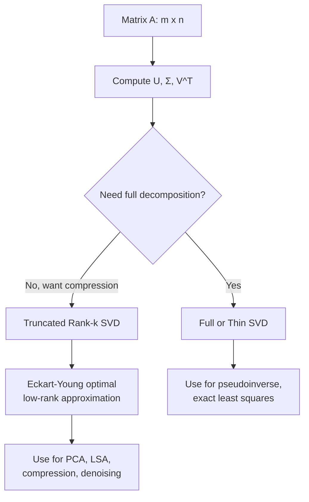

## SVD Revisited

### Overview

Singular Value Decomposition (SVD) factors any matrix $A$ — square or rectangular, full-rank or rank-deficient — into three components that reveal its fundamental geometric action:

$$A = U \Sigma V^T$$

This revisit builds on the earlier introduction and prior discussions of QR and eigen decomposition, focusing on derivation from eigen decomposition, geometric interpretation, low-rank approximation via the Eckart-Young theorem, and computational considerations relevant to machine learning.

### Definition Recap

For a matrix $A \in \mathbb{R}^{m \times n}$, the SVD expresses:

$$A = U \Sigma V^T$$

where:
- $U \in \mathbb{R}^{m \times m}$ is orthogonal, with columns called **left singular vectors**
- $\Sigma \in \mathbb{R}^{m \times n}$ is diagonal (in the generalized rectangular sense), containing non-negative **singular values** $\sigma_1 \geq \sigma_2 \geq \dots \geq 0$ on the diagonal
- $V \in \mathbb{R}^{n \times n}$ is orthogonal, with columns called **right singular vectors**

**Key Points**
- SVD exists for every real (or complex) matrix, regardless of shape or rank, unlike eigen decomposition, which requires a square, diagonalizable matrix.
- Singular values are always real and non-negative, in contrast to eigenvalues, which can be negative or complex.

### Derivation from Eigen Decomposition

SVD can be derived directly from the eigen decomposition of related symmetric matrices, connecting the two topics covered previously.

**Key Points**
- The right singular vectors $V$ are the eigenvectors of $A^TA$, since $A^TA = V\Sigma^TU^TU\Sigma V^T = V\Sigma^2V^T$, which is precisely an eigen decomposition of the symmetric positive semi-definite matrix $A^TA$.
- The left singular vectors $U$ are the eigenvectors of $AA^T$, by symmetric reasoning.
- Singular values are the square roots of the eigenvalues of $A^TA$ (equivalently, of $AA^T$): $\sigma_i = \sqrt{\lambda_i}$.
- Because $A^TA$ and $AA^T$ are always symmetric positive semi-definite, their eigenvalues are guaranteed real and non-negative, which is precisely why singular values inherit these properties even when $A$ itself is not symmetric or square.

### Geometric Interpretation

SVD describes the action of any linear map as a sequence of three simple operations: rotation, scaling, and rotation.

$$A = U \Sigma V^T \quad \Rightarrow \quad \text{rotate (}V^T\text{)} \rightarrow \text{scale (}\Sigma\text{)} \rightarrow \text{rotate (}U\text{)}$$

<svg xmlns="http://www.w3.org/2000/svg" viewBox="0 0 800 300">
  <text x="400" y="25" font-size="16" font-weight="bold" text-anchor="middle" fill="#1a1a1a">SVD as Rotate-Scale-Rotate (svg_diagram)</text>

  <text x="120" y="70" font-size="12" text-anchor="middle" fill="#5f6368">Unit circle</text>
  <circle cx="120" cy="160" r="55" fill="none" stroke="#4285f4" stroke-width="1.5" />
  <line x1="120" y1="160" x2="175" y2="160" stroke="#ea4335" stroke-width="1.5" marker-end="url(#arrow3)" />
  <line x1="120" y1="160" x2="120" y2="105" stroke="#34a853" stroke-width="1.5" marker-end="url(#arrow3)" />

  <text x="270" y="160" font-size="20" fill="#5f6368" text-anchor="middle">→</text>
  <text x="270" y="180" font-size="10" fill="#5f6368" text-anchor="middle">V^T</text>

  <text x="380" y="70" font-size="12" text-anchor="middle" fill="#5f6368">Rotated</text>
  <ellipse cx="380" cy="160" rx="55" ry="55" fill="none" stroke="#4285f4" stroke-width="1.5" transform="rotate(30 380 160)" />
  <line x1="380" y1="160" x2="428" y2="132" stroke="#ea4335" stroke-width="1.5" marker-end="url(#arrow3)" />
  <line x1="380" y1="160" x2="352" y2="112" stroke="#34a853" stroke-width="1.5" marker-end="url(#arrow3)" />

  <text x="530" y="160" font-size="20" fill="#5f6368" text-anchor="middle">→</text>
  <text x="530" y="180" font-size="10" fill="#5f6368" text-anchor="middle">Σ</text>

  <text x="650" y="70" font-size="12" text-anchor="middle" fill="#5f6368">Scaled ellipse</text>
  <ellipse cx="650" cy="160" rx="90" ry="35" fill="none" stroke="#4285f4" stroke-width="1.5" transform="rotate(30 650 160)" />
  <line x1="650" y1="160" x2="728" y2="115" stroke="#ea4335" stroke-width="2" marker-end="url(#arrow3)" />
  <line x1="650" y1="160" x2="632" y2="125" stroke="#34a853" stroke-width="1.5" marker-end="url(#arrow3)" />

  <text x="230" y="260" font-size="11" fill="#5f6368">V^T rotates input basis</text>
  <text x="450" y="260" font-size="11" fill="#5f6368">Σ scales along axes by σ1, σ2</text>
  <text x="650" y="280" font-size="11" fill="#5f6368" text-anchor="middle">U then rotates result (not shown)</text>

  </svg>

**Key Points**
- $V^T$ rotates (or reflects) the input space to align with the right singular vector basis.
- $\Sigma$ stretches or compresses along each axis by the corresponding singular value, mapping the unit sphere to an ellipsoid.
- $U$ rotates the result into the output space, aligning with the left singular vector basis.
- This interpretation holds for any matrix, making SVD a universal geometric descriptor of linear transformations, whereas eigen decomposition's geometric interpretation (invariant directions) applies more narrowly, mainly to square matrices with real eigenvalues.

### Full vs. Reduced (Thin) SVD

In practice, especially for machine learning applications with $m \gg n$ or $n \gg m$, the reduced form is more commonly used.

| Form | $U$ shape | $\Sigma$ shape | $V$ shape | Use Case |
|---|---|---|---|---|
| Full SVD | $m \times m$ | $m \times n$ | $n \times n$ | Theoretical completeness |
| Thin (reduced) SVD | $m \times r$ | $r \times r$ | $n \times r$ | Storage and compute efficiency, where $r = \min(m,n)$ |
| Truncated SVD (rank-$k$) | $m \times k$ | $k \times k$ | $n \times k$ | Low-rank approximation, dimensionality reduction |

**Key Points**
- Full SVD retains all singular vectors, including those corresponding to zero singular values (spanning the null space), which is rarely needed in applied settings.
- Thin SVD discards the extra orthogonal directions in $U$ or $V$ that correspond only to padding zeros in $\Sigma$, retaining exactly the same information as full SVD with less storage.
- Truncated SVD keeps only the top $k$ singular values/vectors and is the basis for most practical low-rank approximation techniques in machine learning.

### Low-Rank Approximation and the Eckart-Young Theorem

**Key Points**
- The Eckart-Young theorem states that the best rank-$k$ approximation of a matrix $A$ (in both Frobenius norm and spectral/operator norm) is given by truncating its SVD to the top $k$ singular values and corresponding vectors: $A_k = \sum_{i=1}^{k} \sigma_i u_i v_i^T$.
- This makes truncated SVD the theoretically optimal choice for compressing a matrix while minimizing reconstruction error, among all matrices of rank $k$ or less.
- The approximation error in Frobenius norm has a closed form: $\|A - A_k\|_F = \sqrt{\sum_{i=k+1}^{r} \sigma_i^2}$, meaning the discarded singular values directly quantify information loss.

**Example**

For a matrix with singular values $\sigma = (10, 6, 2, 0.5)$, retaining $k=2$ components captures the two largest directions of variance, discarding $\sigma_3, \sigma_4$. The relative reconstruction error is:

$$\frac{\|A - A_2\|_F}{\|A\|_F} = \frac{\sqrt{2^2 + 0.5^2}}{\sqrt{10^2+6^2+2^2+0.5^2}} \approx \frac{2.06}{11.87} \approx 0.174$$

indicating roughly 17.4% of the matrix's Frobenius-norm "energy" is lost at rank 2, or equivalently about 82.6% retained. [Inference: interpretation as "energy retained" is a common heuristic framing, not a formal information-theoretic guarantee]

### Computing SVD

**Key Points**
- Directly forming $A^TA$ or $AA^T$ to compute SVD via eigen decomposition is numerically discouraged, since this squares the condition number of $A$, amplifying numerical errors, especially for ill-conditioned matrices. [Fact, well-established in numerical linear algebra]
- Production implementations (e.g., LAPACK's `dgesvd` or `dgesdd`) instead use methods that avoid explicitly forming $A^TA$, typically starting with a bidiagonalization step (often via Householder reflections) followed by an iterative diagonalization phase.
- For very large or sparse matrices common in machine learning, randomized SVD algorithms approximate the top singular values/vectors efficiently without computing the full decomposition, trading some accuracy for substantial speed gains. [Unverified: accuracy tradeoffs vary by algorithm variant and matrix structure]

### SVD vs. Eigen Decomposition vs. QR

Building on the two prior topics, this table consolidates the relationships among all three decompositions:

| Property | QR | Eigen Decomposition | SVD |
|---|---|---|---|
| Applicable matrices | Any $m \times n$ | Square, diagonalizable only | Any $m \times n$ |
| Output form | $A = QR$ | $A = V\Lambda V^{-1}$ | $A = U\Sigma V^T$ |
| Reveals rank | Indirectly (via pivoted QR) | Not directly | Directly (count of nonzero $\sigma_i$) |
| Reveals invariant directions | No | Yes | No (reveals principal directions of stretching instead) |
| Optimal low-rank approximation | No | No | Yes (Eckart-Young) |
| Numerical stability | High (Householder) | Variable (poor if non-symmetric) | High |

### Applications in Machine Learning

**Key Points**
- **Dimensionality reduction**: Truncated SVD underlies PCA when applied to a centered data matrix; the right singular vectors correspond to principal component directions, and singular values relate to explained variance ($\lambda_i = \sigma_i^2 / (n-1)$).
- **Recommender systems**: Matrix factorization techniques for collaborative filtering (e.g., approximating a sparse user-item ratings matrix) are conceptually rooted in low-rank SVD approximation, often with regularization and specialized optimization rather than exact SVD.
- **Latent Semantic Analysis (LSA)**: Applies truncated SVD to term-document matrices in natural language processing to uncover latent topic structure.
- **Pseudoinverse and least squares**: The Moore-Penrose pseudoinverse $A^+ = V\Sigma^+U^T$ (where $\Sigma^+$ inverts nonzero singular values) provides a numerically stable way to solve least-squares problems, including underdetermined or ill-conditioned systems where direct inversion fails.
- **Image compression**: Representing images as matrices and retaining only top-$k$ singular components is a common illustrative example of lossy compression via low-rank approximation.
- **Whitening and noise reduction**: Small singular values often correspond to noise directions in data; truncating them can improve robustness of downstream models, though this assumes noise is concentrated in low-variance directions, which [Inference] may not hold for all datasets.

### Process Flow

### Numerical Stability Considerations

- SVD is regarded as one of the most numerically stable matrix decompositions available, largely because production algorithms avoid forming $A^TA$ explicitly and rely on orthogonal transformations throughout.
- Singular values are well-conditioned with respect to perturbations in $A$: small changes in $A$ produce correspondingly small changes in $\sigma_i$, a property that does not hold as reliably for eigenvalues of non-symmetric matrices.
- Determining numerical rank via SVD (counting singular values above a threshold) is generally considered more reliable than pivoted QR or eigenvalue-based approaches, though the choice of threshold remains somewhat heuristic and problem-dependent. [Unverified: threshold selection conventions vary by domain and library defaults]

### Conclusion

SVD stands as arguably the most versatile and numerically robust of the three decompositions covered in this sequence, applicable to any matrix shape and rank while directly supporting optimal low-rank approximation through the Eckart-Young theorem. Its close relationship to eigen decomposition (via $A^TA$ and $AA^T$) and its role as a common downstream consumer of QR-based bidiagonalization illustrate how these decompositions form an interconnected toolkit rather than isolated techniques, with SVD frequently serving as the preferred choice when rank, compression, or stability are primary concerns.

**Related Topics**
- Principal Component Analysis (PCA) via SVD
- Moore-Penrose Pseudoinverse and Least Squares
- Randomized SVD Algorithms for Large-Scale Data
- Latent Semantic Analysis in NLP
- Matrix Factorization for Recommender Systems
- Low-Rank Matrix Completion
- Condition Numbers and Numerical Rank
- Whitening Transformations and Data Preprocessing