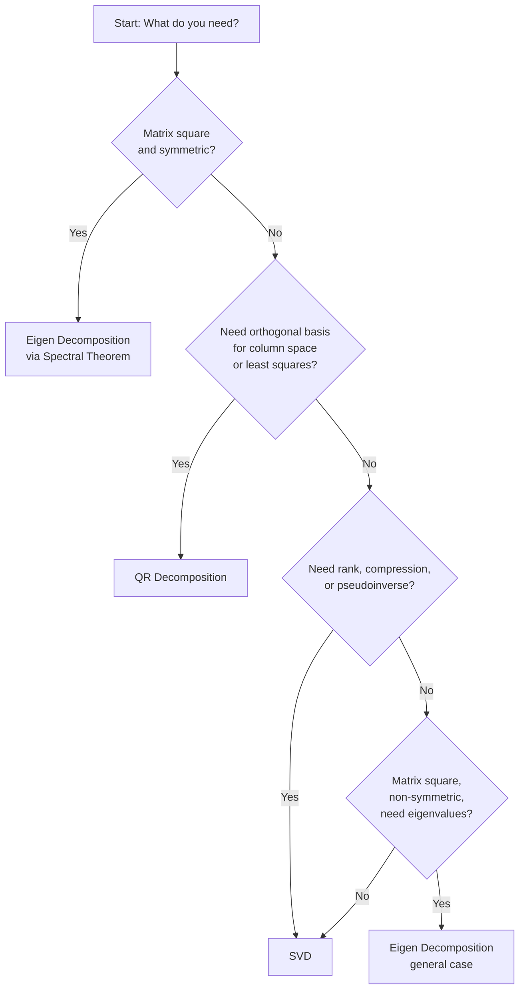

## Choosing the Right Decomposition

### Overview

With QR, eigen decomposition, and SVD each covered in depth, the practical challenge becomes selecting the appropriate decomposition for a given machine learning task. This topic consolidates the prior three into a decision-oriented framework, comparing them along dimensions of applicability, computational cost, numerical stability, and typical use case.

### Decision Framework

The choice of decomposition typically depends on four questions: the shape of the matrix, whether it is symmetric, what information is needed (basis, eigenvalues, or rank/compression), and the acceptable computational budget.

### Comparison Matrix

| Criterion | QR | Eigen Decomposition | SVD |
|---|---|---|---|
| Matrix shape required | Any $m \times n$ | Square only | Any $m \times n$ |
| Requires diagonalizability | No | Yes | No (always exists) |
| Typical cost (dense, $n \times n$) | $O(n^3)$ | $O(n^3)$ (iterative) | $O(n^3)$, often with larger constant |
| Numerical stability | High (Householder) | Variable (poor if non-symmetric) | High |
| Reveals rank | Indirectly (pivoted) | No | Directly |
| Gives optimal low-rank approximation | No | No | Yes (Eckart-Young) |
| Interprets invariant directions | No | Yes | No |
| Common ML role | Least squares solving | PCA (via covariance), spectral graph methods | PCA, compression, pseudoinverse, LSA |

[Inference: cost figures are asymptotic and assume dense general-purpose implementations; actual runtime depends on library, hardware, and matrix structure]

### Decision Guidance by Scenario

**Key Points**
- **Solving least squares problems** ($\min_x \|Ax-b\|_2$): QR decomposition is typically preferred over the normal equations, since it avoids forming $A^TA$ and its associated squared condition number, improving numerical stability. SVD can also solve least squares (via the pseudoinverse) and is preferable specifically when $A$ is rank-deficient or ill-conditioned, since QR alone does not handle rank deficiency as robustly without additional pivoting.
- **Computing PCA**: Either eigen decomposition of the covariance matrix or direct SVD of the centered data matrix can be used. SVD is generally preferred in practice, since it avoids explicitly forming the covariance matrix $X^TX$, which — as with least squares — squares the condition number and can degrade numerical accuracy, particularly when the number of features is large relative to samples. [Fact: this preference is well-documented in standard numerical linear algebra references]
- **Analyzing dynamical systems or stability** (e.g., recurrent network behavior, Markov chains): Eigen decomposition is the natural choice, since eigenvalues directly describe how repeated application of a matrix scales vectors over time, a property SVD does not directly capture for non-symmetric matrices.
- **Compressing a matrix or approximating it at lower rank** (e.g., image compression, recommender systems, denoising): SVD is the standard choice due to the Eckart-Young optimality guarantee; eigen decomposition lacks this optimality property in the non-symmetric case, and QR does not natively support arbitrary-rank truncation.
- **Orthogonalizing a set of vectors or building an orthonormal basis**: QR (typically via Householder or modified Gram-Schmidt) is the direct tool, since this is precisely what the decomposition computes.
- **Determining numerical rank of a matrix**: SVD is generally considered the most reliable method, since singular values degrade gracefully and predictably under perturbation; pivoted QR is a cheaper but somewhat less robust alternative. [Unverified: relative robustness depends on specific matrix conditioning and threshold choices]

### Cost-Stability Tradeoff

<svg xmlns="http://www.w3.org/2000/svg" viewBox="0 0 800 320">
  <text x="400" y="25" font-size="16" font-weight="bold" text-anchor="middle" fill="#1a1a1a">Relative Cost vs. Stability (svg_diagram)</text>

  <line x1="90" y1="270" x2="750" y2="270" stroke="#5f6368" stroke-width="1.5" marker-end="url(#arrow4)" />
  <line x1="90" y1="270" x2="90" y2="50" stroke="#5f6368" stroke-width="1.5" marker-end="url(#arrow4)" />
  <text x="420" y="300" font-size="12" text-anchor="middle" fill="#5f6368">Computational Cost →</text>
  <text x="40" y="160" font-size="12" fill="#5f6368" transform="rotate(-90 40 160)">Numerical Stability →</text>

  <circle cx="230" cy="110" r="9" fill="#4285f4" />
  <text x="230" y="90" font-size="12" text-anchor="middle" fill="#1a1a1a">QR</text>
  <text x="230" y="130" font-size="10" text-anchor="middle" fill="#5f6368">(Householder)</text>

  <circle cx="420" cy="230" r="9" fill="#ea4335" />
  <text x="420" y="215" font-size="12" text-anchor="middle" fill="#1a1a1a">Eigen Decomp.</text>
  <text x="420" y="250" font-size="10" text-anchor="middle" fill="#5f6368">(non-symmetric case)</text>

  <circle cx="420" cy="120" r="9" fill="#34a853" />
  <text x="470" y="105" font-size="12" fill="#1a1a1a">Eigen Decomp.</text>
  <text x="470" y="122" font-size="10" fill="#5f6368">(symmetric case)</text>

  <circle cx="580" cy="90" r="9" fill="#a142f4" />
  <text x="580" y="70" font-size="12" text-anchor="middle" fill="#1a1a1a">SVD</text>

  </svg>

[Inference: this chart depicts qualitative, relative positioning rather than precisely measured values, and exact placement would vary by implementation and matrix characteristics]

### Practical Heuristics

**Key Points**
- When in doubt and the matrix is not symmetric, **SVD is often the safest general-purpose default** in machine learning pipelines, since it always exists, is numerically stable, and provides rank and low-rank approximation information as a byproduct — at the cost of somewhat higher computation than QR or symmetric eigen decomposition.
- For symmetric matrices specifically (covariance matrices, kernel/Gram matrices, graph Laplacians), **specialized symmetric eigenvalue solvers** should be preferred over general eigen decomposition routines, since they exploit symmetry for both speed and stability.
- **Avoid forming $A^TA$ or $A^TX$ explicitly** when it can be avoided, whether the goal is least squares (favor QR or SVD) or PCA (favor SVD of the data matrix directly), since this operation is a recurring source of numerical instability across multiple decomposition workflows. [Fact, consistent with numerical linear algebra best practices]
- For very large-scale machine learning problems, **randomized or iterative variants** (randomized SVD, Lanczos iteration for eigenvalues, iterative QR updates) are often necessary in practice, since exact dense decomposition can become computationally prohibitive as dimensionality grows. [Unverified: specific scalability thresholds depend on hardware, library, and matrix sparsity]

### Common Pitfalls

**Key Points**
- Using eigen decomposition on a non-symmetric matrix and expecting orthogonal eigenvectors or real eigenvalues is a frequent conceptual error; this guarantee only holds for symmetric matrices under the Spectral Theorem.
- Assuming QR decomposition reveals rank as reliably as SVD; standard QR (without column pivoting) does not reliably reveal near rank-deficiency, since small pivots can be masked by later operations.
- Forming the normal equations ($A^TA x = A^Tb$) for least squares by default, rather than considering QR or SVD, remains a common but numerically risky habit, particularly for ill-conditioned or high-dimensional data.
- Treating SVD, eigen decomposition, and QR as interchangeable "any decomposition will do" tools, rather than recognizing that each provides fundamentally different structural information (orthogonal basis vs. invariant directions vs. optimal low-rank structure).

### Conclusion

No single decomposition is universally superior; the right choice depends on matrix properties (shape, symmetry, conditioning) and the specific downstream goal (solving a system, understanding dynamics, or compressing data). As a general pattern in machine learning: QR supports stable least-squares solving and orthogonalization, eigen decomposition (especially in the symmetric case) supports spectral interpretation and stability analysis, and SVD offers the most general-purpose, numerically robust tool for rank-related tasks and optimal low-rank approximation — with the three decompositions frequently used together within a single pipeline rather than in isolation.

**Related Topics**
- Numerical Stability and Condition Numbers in Depth
- Randomized Linear Algebra for Large-Scale ML
- Matrix Factorization Techniques Beyond SVD (e.g., NMF)
- Iterative Solvers: Lanczos and Arnoldi Methods
- Practical Library Usage: NumPy, SciPy, and LAPACK Routines for Decompositions
- Positive Definite Matrices and Cholesky Decomposition Revisited
- Sparse Matrix Decomposition Techniques