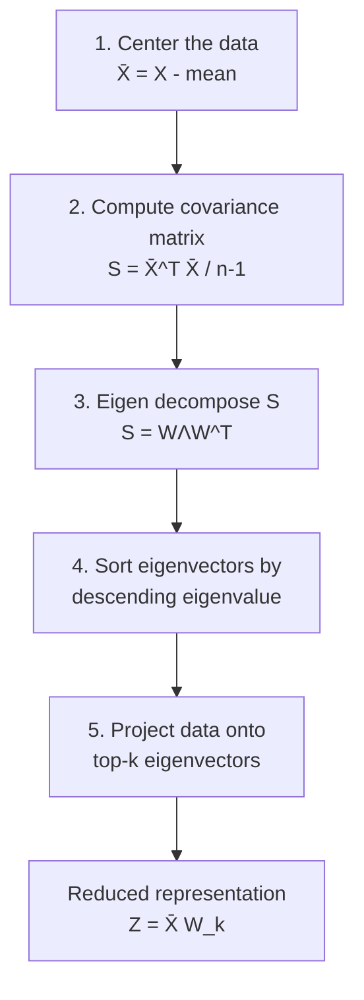

## PCA via Eigen Decomposition

### Overview

This section provides a complete, self-contained computational walkthrough of PCA using the eigen decomposition route (Route A introduced in the derivation topic), applied directly to the covariance matrix computed in the prior topic. It covers the full algorithmic procedure, a worked numerical example, dimensionality reduction and reconstruction, and a critical assessment of when this route is appropriate relative to the SVD alternative covered in the next topic.

### Algorithmic Procedure

Given a data matrix $X \in \mathbb{R}^{n \times d}$, the eigen decomposition route to PCA follows five steps:

**Key Points**
- Step 1 (centering) and Step 2 (covariance computation) were covered in detail in the prior topic, including the numerical stability considerations around the naive versus centered formula.
- Step 3 relies directly on the Spectral Theorem from the eigen decomposition topic: because $S$ is symmetric, $W$ is guaranteed orthogonal and $\Lambda$ contains real, non-negative eigenvalues.
- Step 4 is necessary because eigen decomposition routines do not universally guarantee sorted output; explicit sorting by descending eigenvalue magnitude ensures $w_1$ corresponds to the direction of maximum variance, as required by the PCA derivation.

### Worked Numerical Example

Consider a small dataset with $n=5$ samples and $d=2$ features:

$$X = \begin{pmatrix} 2.5 & 2.4 \\ 0.5 & 0.7 \\ 2.2 & 2.9 \\ 1.9 & 2.2 \\ 3.1 & 3.0 \end{pmatrix}$$

**Step 1 — Center the data.** The feature means are $\bar{x} = (2.04, 2.24)$, giving:

$$\bar{X} = \begin{pmatrix} 0.46 & 0.16 \\ -1.54 & -1.54 \\ 0.16 & 0.66 \\ -0.14 & -0.04 \\ 1.06 & 0.76 \end{pmatrix}$$

**Step 2 — Compute the covariance matrix.**

$$S = \frac{1}{n-1}\bar{X}^T\bar{X} \approx \begin{pmatrix} 0.72 & 0.62 \\ 0.62 & 0.68 \end{pmatrix}$$

**Step 3 — Eigen decompose $S$.** Solving $\det(S - \lambda I) = 0$:

$$\lambda_1 \approx 1.28, \qquad \lambda_2 \approx 0.12$$

with corresponding (unit-norm) eigenvectors:

$$w_1 \approx (0.71, 0.71)^T, \qquad w_2 \approx (-0.71, 0.71)^T$$

**Step 4 — Sort by descending eigenvalue.** $\lambda_1 > \lambda_2$, so $w_1$ is already the first principal component.

**Output**

$$\text{Explained variance ratio: } \frac{\lambda_1}{\lambda_1+\lambda_2} \approx \frac{1.28}{1.40} \approx 91.4\%$$

The first principal component alone captures roughly 91.4% of total variance in this example. [Unverified: figures rounded for illustration; exact values depend on precise floating-point computation]

### Geometric Visualization

<svg xmlns="http://www.w3.org/2000/svg" viewBox="0 0 800 320">
  <text x="400" y="25" font-size="16" font-weight="bold" text-anchor="middle" fill="#1a1a1a">Principal Components on Centered Data (svg_diagram)</text>

  <line x1="80" y1="170" x2="720" y2="170" stroke="#bdbdbd" stroke-width="1" />
  <line x1="400" y1="50" x2="400" y2="290" stroke="#bdbdbd" stroke-width="1" />

  <circle cx="480" cy="145" r="5" fill="#4285f4" />
  <circle cx="245" cy="245" r="5" fill="#4285f4" />
  <circle cx="415" cy="105" r="5" fill="#4285f4" />
  <circle cx="390" cy="175" r="5" fill="#4285f4" />
  <circle cx="565" cy="90" r="5" fill="#4285f4" />

  <line x1="230" y1="255" x2="580" y2="80" stroke="#ea4335" stroke-width="2.5" marker-end="url(#arrow6)" />
  <text x="590" y="72" font-size="12" fill="#ea4335">w1 (λ1 ≈ 1.28)</text>

  <line x1="450" y1="115" x2="380" y2="160" stroke="#34a853" stroke-width="2" marker-end="url(#arrow6)" />
  <text x="330" y="185" font-size="12" fill="#34a853">w2 (λ2 ≈ 0.12)</text>

  <text x="400" y="310" font-size="11" fill="#5f6368" text-anchor="middle">w1 aligns with the direction of greatest spread; w2 is orthogonal and captures far less variance</text>

  </svg>

### Dimensionality Reduction (Projection)

To reduce the data to $k=1$ dimension, project the centered data onto $w_1$:

$$z_i = \bar{x}_i^T w_1$$

This produces $Z \in \mathbb{R}^{n \times k}$, the low-dimensional representation, computed as $Z = \bar{X}W_k$ where $W_k$ contains the top $k$ eigenvectors as columns.

**Key Points**
- Each row $z_i$ is a scalar (in this $k=1$ example) representing the sample's position along the principal axis, replacing the original two coordinates with a single summary value.
- For general $k$, $Z \in \mathbb{R}^{n \times k}$ has orthogonal columns (though not necessarily unit norm, since the projected variances differ along each axis), inheriting orthogonality from $W_k$'s columns.
- This projected representation is what is typically used as input to downstream models (e.g., a classifier trained on reduced features), rather than the original high-dimensional data.

### Reconstruction from Reduced Dimensions

The original data can be approximately reconstructed from the reduced representation:

$$\hat{X} = ZW_k^T + \mathbf{1}\bar{x}^T = \bar{X}W_kW_k^T + \mathbf{1}\bar{x}^T$$

**Key Points**
- Reconstruction is only exact when $k = d$ (all components retained); for $k < d$, $\hat{X}$ is an approximation, with error determined by the discarded eigenvalues $\sum_{i=k+1}^{d}\lambda_i$, consistent with the reconstruction-error-minimization view established in the derivation topic.
- This reconstruction formula is frequently used to assess reconstruction quality visually (e.g., in image compression demonstrations) or to detect anomalies, where samples with unusually high reconstruction error may indicate outliers relative to the learned principal subspace. [Inference: this anomaly-detection use is a common application pattern rather than a guaranteed property of PCA itself]
- Adding back the mean $\bar{x}$ is essential, since the eigen decomposition operates entirely on centered data; omitting this step produces a reconstruction offset from the original data by the mean vector.

### Practical Implementation Considerations

**Key Points**
- Most eigenvalue solvers (e.g., NumPy's `eigh`, specialized for symmetric matrices) return eigenvalues in **ascending** order by default, requiring an explicit reversal step to obtain the descending order convention used in PCA; overlooking this is a common implementation mistake. [Unverified: default ordering conventions vary by specific library and function]
- Because $S$ is symmetric positive semi-definite, using a symmetric-specific eigenvalue routine (rather than a general eigenvalue solver) is both faster and more numerically stable, as established in the computational cost comparison topic.
- Sign ambiguity (noted in the derivation topic) means that $w_1$ and $-w_1$ are equally valid outputs from different runs or library versions; this can cause visually "flipped" PCA plots between implementations without indicating any error. [Fact: this is a well-known and expected property of eigenvector computation, not a bug]

### Limitations of the Eigen Decomposition Route

**Key Points**
- As emphasized in both the covariance computation and decomposition-selection topics, explicitly forming $S = \bar{X}^T\bar{X}/(n-1)$ squares the condition number relative to $\bar{X}$, which can degrade the numerical accuracy of the resulting eigenvectors, particularly for high-dimensional or ill-conditioned data.
- When $n \leq d$ (more features than samples), $S$ becomes a large $d \times d$ matrix that may be computationally and memory-expensive to form and decompose directly, whereas the SVD route (covered next) avoids this by working with $\bar{X}$'s smaller dimension directly. [Fact, direct consequence of $S$'s dimensionality being determined by $d$ regardless of $n$, as noted in the covariance topic]
- This eigen decomposition route remains pedagogically valuable and computationally reasonable for datasets where $d$ is modest, but is generally superseded by direct SVD of $\bar{X}$ in production machine learning pipelines, especially for high-dimensional data.

### Conclusion

The eigen decomposition route to PCA directly operationalizes the variance-maximization derivation from two topics prior, translating the abstract eigenvalue problem $Sw = \lambda w$ into a concrete five-step algorithm: center, compute covariance, decompose, sort, and project. While mathematically sound and useful for building intuition, this route inherits the numerical fragility of explicitly forming the covariance matrix, motivating the direct-SVD alternative examined next, which sidesteps this limitation while producing mathematically equivalent results.

**Related Topics**
- PCA via Singular Value Decomposition
- Anomaly Detection Using PCA Reconstruction Error
- Choosing the Number of Principal Components
- Symmetric Eigenvalue Solver Implementations (LAPACK dsyev/dsyevd)
- Image Compression as an Illustrative PCA Application
- Kernel PCA for Nonlinear Structure
- Incremental PCA for Streaming or Out-of-Core Data