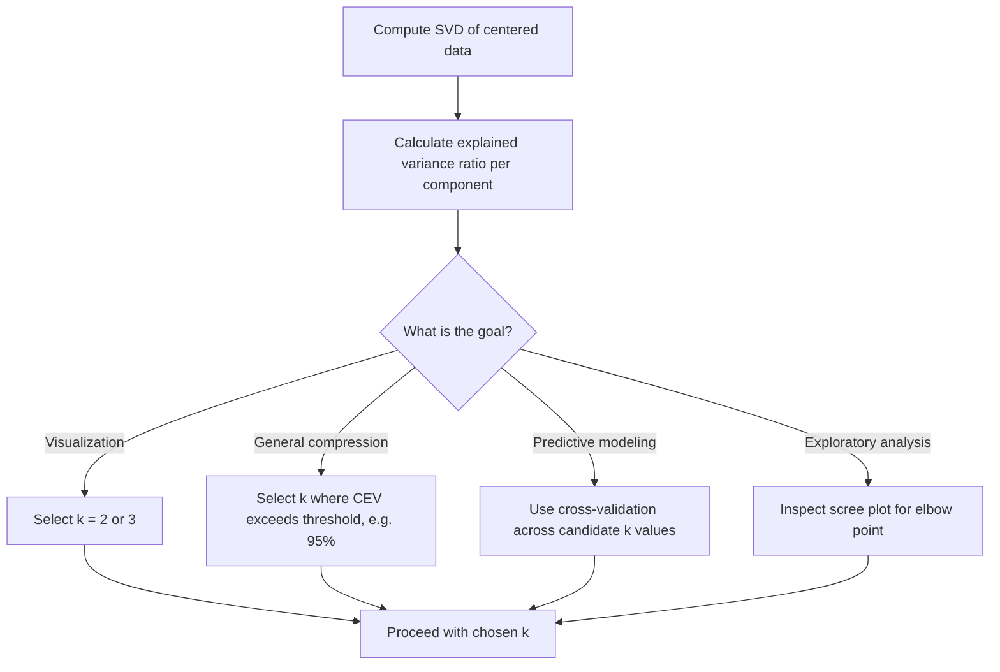

## Explained Variance and Component Selection

### Overview

After performing PCA via SVD, a central practical question arises: how many principal components should be retained? Explained variance provides the quantitative basis for this decision, balancing the competing goals of dimensionality reduction and information preservation.

### Prerequisite Concepts

- $Singular values$ ($\sigma_i$) and their relationship to variance
- $Eigenvalues$ of the covariance matrix
- Cumulative sums and ratios
- Basic familiarity with PCA via SVD

### Defining Explained Variance

Given singular values $\sigma_1 \geq \sigma_2 \geq \dots \geq \sigma_d \geq 0$ obtained from the SVD of centered data $X_c = U\Sigma V^T$, the variance captured by the $i$-th principal component is proportional to:

$$\lambda_i = \frac{\sigma_i^2}{n-1}$$

using the unbiased estimator convention (some implementations use $n$ instead of $n-1$; this affects absolute scale but not relative proportions).

**Explained variance ratio** for component $i$:

$$\text{EVR}_i = \frac{\sigma_i^2}{\sum_{j=1}^{d} \sigma_j^2}$$

This quantity does not depend on whether $n$ or $n-1$ is used in the denominator convention, since the normalization constant cancels.

### Cumulative Explained Variance

To decide how many components $k$ to retain, the cumulative explained variance is typically examined:

$$\text{CEV}(k) = \sum_{i=1}^{k} \text{EVR}_i = \frac{\sum_{i=1}^{k} \sigma_i^2}{\sum_{j=1}^{d} \sigma_j^2}$$

**Key Points**
- $\text{CEV}(k)$ is monotonically non-decreasing in $k$
- $\text{CEV}(d) = 1$ always, since all variance is captured when all components are retained
- A common goal is finding the smallest $k$ such that $\text{CEV}(k) \geq \tau$ for some threshold $\tau$ (e.g., 0.90, 0.95, 0.99)

### Choosing a Variance Threshold

[Inference] Threshold selection is context-dependent rather than governed by a universal rule. Commonly cited conventions in applied practice include:

| Threshold | Typical Use Case |
|---|---|
| 90% | Aggressive compression, visualization, exploratory analysis |
| 95% | General-purpose balance between compression and fidelity |
| 99% | Applications sensitive to information loss (e.g., preprocessing for downstream models where signal preservation matters) |

These figures are heuristic conventions observed in practice rather than theoretically derived constants, and appropriate thresholds vary by dataset, noise level, and downstream task. [Unverified — no single threshold is correct across all domains]

### The Scree Plot Method

A scree plot displays $\sigma_i^2$ (or $\text{EVR}_i$) against component index $i$. The heuristic is to look for an "elbow" — a point where the marginal variance contribution drops sharply and subsequent components contribute comparatively little.

### Diagram: Scree Plot with Elbow Point

<svg xmlns="http://www.w3.org/2000/svg" viewBox="0 0 700 380">
  <text x="350" y="25" font-size="16" font-weight="bold" text-anchor="middle" fill="#1a1a1a">Scree Plot: Explained Variance by Component (svg_diagram)</text>

  <line x1="80" y1="320" x2="640" y2="320" stroke="#1a1a1a" stroke-width="1.5" />
  <line x1="80" y1="320" x2="80" y2="60" stroke="#1a1a1a" stroke-width="1.5" />

  <text x="360" y="355" font-size="13" text-anchor="middle" fill="#1a1a1a">Principal Component Index</text>
  <text x="30" y="190" font-size="13" text-anchor="middle" fill="#1a1a1a" transform="rotate(-90, 30, 190)">Explained Variance Ratio</text>

  <text x="80" y="335" font-size="11" text-anchor="middle" fill="#5f6368">1</text>
  <text x="150" y="335" font-size="11" text-anchor="middle" fill="#5f6368">2</text>
  <text x="220" y="335" font-size="11" text-anchor="middle" fill="#5f6368">3</text>
  <text x="290" y="335" font-size="11" text-anchor="middle" fill="#5f6368">4</text>
  <text x="360" y="335" font-size="11" text-anchor="middle" fill="#5f6368">5</text>
  <text x="430" y="335" font-size="11" text-anchor="middle" fill="#5f6368">6</text>
  <text x="500" y="335" font-size="11" text-anchor="middle" fill="#5f6368">7</text>
  <text x="570" y="335" font-size="11" text-anchor="middle" fill="#5f6368">8</text>

  <polyline points="80,80 150,140 220,220 290,270 360,290 430,300 500,308 570,313" fill="none" stroke="#4285f4" stroke-width="2.5" />

  <circle cx="80" cy="80" r="5" fill="#4285f4" />
  <circle cx="150" cy="140" r="5" fill="#4285f4" />
  <circle cx="220" cy="220" r="5" fill="#ea4335" />
  <circle cx="290" cy="270" r="5" fill="#4285f4" />
  <circle cx="360" cy="290" r="5" fill="#4285f4" />
  <circle cx="430" cy="300" r="5" fill="#4285f4" />
  <circle cx="500" cy="308" r="5" fill="#4285f4" />
  <circle cx="570" cy="313" r="5" fill="#4285f4" />

  <line x1="220" y1="220" x2="220" y2="240" stroke="#ea4335" stroke-width="1.5" stroke-dasharray="4,3" />
  <text x="220" y="255" font-size="12" text-anchor="middle" fill="#ea4335" font-weight="bold">Elbow point</text>
  <text x="220" y="270" font-size="11" text-anchor="middle" fill="#ea4335">(diminishing returns begin)</text>
</svg>

**Key Points**
- The elbow method is qualitative and subjective — different observers may identify different elbow points on the same plot
- [Inference] It tends to work best when there is a clear separation between "signal" components (steep drop) and "noise" components (flat tail); ambiguous or gradually decaying spectra make the elbow harder to identify reliably

### Kaiser Criterion

An alternative heuristic retains only components with eigenvalue $\lambda_i > 1$ when PCA is performed on the **correlation matrix** (i.e., standardized data with unit variance per feature). The rationale is that a component should explain at least as much variance as a single original standardized variable to be considered meaningful.

[Unverified] The Kaiser criterion has been criticized in statistical literature for being arbitrary and sometimes retaining too many or too few components depending on $d$; it is presented here as a documented heuristic rather than a recommended default.

### Cross-Validation-Based Selection

For component selection tied to downstream predictive performance rather than variance alone:

1. Split data into training and validation sets
2. For a range of $k$ values, fit PCA on training data and project both sets
3. Train a downstream model (e.g., regression, classifier) on the projected training data
4. Evaluate performance on the projected validation data
5. Select $k$ that optimizes validation performance (or balances performance against dimensionality)

**Key Points**
- This approach directly ties $k$ selection to task performance rather than an intermediate proxy like variance
- Computationally more expensive than scree/threshold methods, since it requires refitting downstream models across candidate $k$ values
- [Inference] More appropriate when the end goal is a predictive model rather than pure data compression or visualization, since variance-maximizing directions do not always align with directions most useful for a specific prediction task

### Diagram: Component Selection Decision Flow

### Worked Example

Suppose SVD on a centered dataset with $d = 5$ features yields singular values:

$$\sigma = [10, 6, 3, 1, 0.5]$$

**Step 1 — Compute squared singular values:**

$$\sigma^2 = [100, 36, 9, 1, 0.25]$$

**Step 2 — Total variance:**

$$\sum \sigma_i^2 = 100 + 36 + 9 + 1 + 0.25 = 146.25$$

**Step 3 — Explained variance ratios:**

| Component | $\sigma_i^2$ | EVR | Cumulative EVR |
|---|---|---|---|
| 1 | 100 | 0.684 | 0.684 |
| 2 | 36 | 0.246 | 0.930 |
| 3 | 9 | 0.062 | 0.992 |
| 4 | 1 | 0.007 | 0.998 |
| 5 | 0.25 | 0.002 | 1.000 |

**Interpretation:** To reach a 95% cumulative explained variance threshold, $k = 3$ components are required (CEV jumps from 0.930 to 0.992 at the third component). This also matches an intuitive "elbow" in the spectrum, since components 4 and 5 contribute negligibly.

### Practical Implementation Notes

- In scikit-learn, `PCA(n_components=0.95)` directly selects the minimum number of components needed to reach 95% cumulative explained variance [Unverified — exact parameter behavior may vary across library versions; consult current documentation before relying on this in production code]
- Explained variance should always be examined alongside the actual downstream use case; a threshold that works well for visualization may discard information relevant to a predictive task
- When features are on different scales, explained variance results are heavily influenced by whether data was standardized prior to PCA — unstandardized high-variance features can dominate the top components regardless of their true relevance

### Common Pitfalls

- Selecting $k$ based solely on a fixed variance threshold without considering the downstream task, which can discard components with low variance but high task relevance [Inference]
- Applying the Kaiser criterion to a covariance matrix (rather than a correlation matrix) — this criterion assumes standardized variables and produces different, likely inconsistent, results otherwise
- Treating the elbow method as objective or automatable without acknowledging its subjective, visually-driven nature
- Assuming high cumulative explained variance guarantees good performance on all downstream tasks — variance and task-relevant signal are related but not identical concepts

### Conclusion

Explained variance provides a principled, quantitative foundation for selecting the number of retained principal components, but the choice of method — fixed threshold, scree plot elbow, Kaiser criterion, or cross-validation — should be guided by the specific goal of the analysis (compression, visualization, or predictive performance) rather than applied mechanically.

**Related Topics**
- Randomized and truncated SVD for efficient large-scale variance computation
- Parallel analysis as a more rigorous alternative to the Kaiser criterion
- Reconstruction error as a complementary metric to explained variance
- Effect of feature standardization on PCA outcomes
- PCA whitening and its relationship to explained variance
- Minka's automatic dimensionality selection via Bayesian model selection