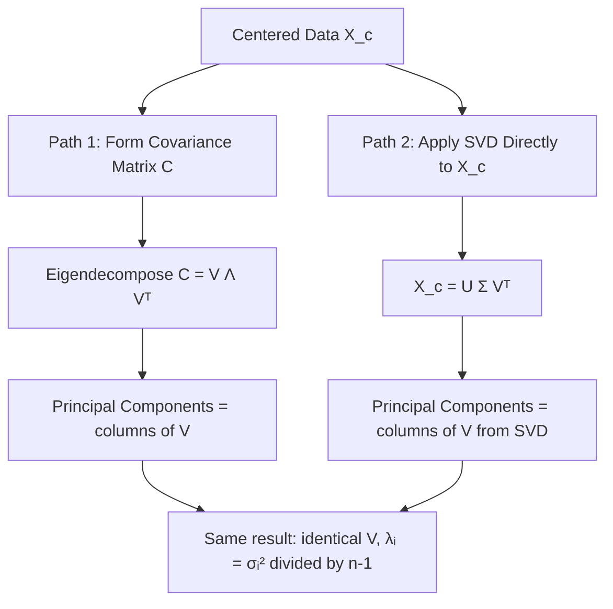

## Relationship Between PCA and SVD

### Overview

PCA and SVD are deeply connected: PCA is a statistical technique defined in terms of variance maximization and eigendecomposition, while SVD is a general matrix factorization technique. In practice, PCA is almost always computed *using* SVD, and understanding their precise mathematical relationship clarifies why this is both correct and advantageous. This topic consolidates and formalizes connections introduced piecewise in earlier material on PCA.

### Prerequisite Concepts

- $Eigendecomposition$ of symmetric matrices
- $Singular Value Decomposition$ (full derivation)
- $Covariance matrix$ construction
- Orthogonal and orthonormal matrices
- Rank and matrix approximation concepts

### Two Independent Starting Points

**PCA (statistical definition):** Find orthogonal directions that sequentially maximize the variance of projected data, subject to each new direction being orthogonal to all previous ones.

**SVD (algebraic definition):** Factorize any matrix $A \in \mathbb{R}^{n \times d}$ as $A = U\Sigma V^T$, where $U$ and $V$ are orthogonal and $\Sigma$ is diagonal with non-negative entries.

These originate from different mathematical motivations, yet applying SVD to centered data produces exactly the PCA solution. This equivalence is not a coincidence — it follows directly from the algebraic structure of the covariance matrix.

### Formal Derivation of the Equivalence

Let $X_c \in \mathbb{R}^{n \times d}$ be mean-centered data. The covariance matrix is:

$$C = \frac{1}{n-1} X_c^T X_c$$

$C$ is symmetric and positive semi-definite, so it admits an eigendecomposition:

$$C = V \Lambda V^T$$

with $V$ orthogonal and $\Lambda$ diagonal containing non-negative eigenvalues $\lambda_1 \geq \lambda_2 \geq \dots \geq \lambda_d \geq 0$. By the classical PCA derivation (via Lagrange multipliers on the variance maximization problem), the columns of $V$ are exactly the principal component directions.

Now consider the SVD of $X_c$ directly:

$$X_c = U\Sigma V_{\text{svd}}^T$$

Substituting into the covariance matrix:

$$C = \frac{X_c^T X_c}{n-1} = \frac{V_{\text{svd}} \Sigma^T U^T U \Sigma V_{\text{svd}}^T}{n-1} = V_{\text{svd}} \left(\frac{\Sigma^T \Sigma}{n-1}\right) V_{\text{svd}}^T$$

Since $U^TU = I$, this reduces to:

$$C = V_{\text{svd}} \Lambda_{\text{svd}} V_{\text{svd}}^T, \quad \Lambda_{\text{svd}} = \frac{\Sigma^T \Sigma}{n-1}$$

Comparing to $C = V\Lambda V^T$, and given that eigendecomposition of a symmetric matrix is unique up to sign and ordering of tied eigenvalues:

$$V_{\text{svd}} = V, \qquad \lambda_i = \frac{\sigma_i^2}{n-1}$$

**This is the core identity linking PCA and SVD**: the right singular vectors of centered data are the principal components, and the eigenvalues of the covariance matrix relate to the singular values by $\lambda_i = \sigma_i^2 / (n-1)$.

### Diagram: Two Paths to the Same Result

### Summary Correspondence Table

| PCA Quantity | SVD Equivalent | Relationship |
|---|---|---|
| Principal component directions | Right singular vectors ($V$) | Identical (up to sign) |
| Eigenvalues of $C$ ($\lambda_i$) | Singular values squared ($\sigma_i^2$) | $\lambda_i = \sigma_i^2 / (n-1)$ |
| Projected data (PC scores) | $U\Sigma$ | $X_c V = U\Sigma$ |
| Explained variance ratio | $\sigma_i^2 / \sum_j \sigma_j^2$ | Identical formula either way |
| Covariance matrix $C$ | Never explicitly needed | SVD bypasses forming $C$ |

### Why This Matters Practically

**Key Points**
- Computing $C = X_c^T X_c / (n-1)$ and then eigendecomposing it is mathematically valid but numerically riskier, since forming $X_c^T X_c$ squares the condition number of the data
- SVD applied directly to $X_c$ avoids this squaring, offering better numerical stability, particularly for data that is close to rank-deficient or has a wide range of feature scales
- [Inference] This numerical advantage is generally more pronounced as dimensionality or ill-conditioning increases; for small, well-conditioned datasets, the practical difference between the two approaches may be negligible
- For $n < d$ (more features than samples), computing $C$ explicitly requires forming a $d \times d$ matrix, which can be memory-prohibitive for very large $d$; SVD-based approaches (especially thin/truncated SVD) avoid this

### Connection to Low-Rank Matrix Approximation

The Eckart–Young–Mirsky theorem states that the best rank-$k$ approximation of a matrix $A$ (in terms of minimizing Frobenius norm reconstruction error) is given by truncating its SVD to the top $k$ singular values/vectors:

$$A_k = U_k \Sigma_k V_k^T$$

Since PCA's dimensionality reduction to $k$ components is precisely $Z = X_c V_k = U_k\Sigma_k$, and reconstruction is $\hat{X}_c = U_k \Sigma_k V_k^T$, **PCA with $k$ components is mathematically the best rank-$k$ linear approximation of the centered data matrix in the least-squares sense.**

**Key Points**
- This provides an alternative, purely algebraic justification for PCA: it is not only the variance-maximizing projection, but also the optimal low-rank reconstruction of the data under squared error
- This dual interpretation (variance maximization and optimal reconstruction) is one of the reasons PCA appears across statistics, signal processing, and applied linear algebra under different framings

### Worked Example

Given centered data:

$$X_c = \begin{bmatrix} 1 & 1 \\ -1 & -1 \\ 2 & 2 \\ -2 & -2 \end{bmatrix}$$

**Step 1 — Recognize structure:** Both columns are identical, so the data lies entirely along the direction $(1,1)/\sqrt{2}$ — this is a rank-1 matrix.

**Step 2 — Expected SVD outcome:** Since the data has rank 1, SVD should produce exactly one non-zero singular value, with $\sigma_2 = 0$.

**Step 3 — Covariance matrix:**

$$C = \frac{X_c^T X_c}{n-1} = \frac{1}{3}\begin{bmatrix} 10 & 10 \\ 10 & 10 \end{bmatrix} = \begin{bmatrix} 3.33 & 3.33 \\ 3.33 & 3.33 \end{bmatrix}$$

**Step 4 — Eigenvalues of $C$:** This matrix has eigenvalues $\lambda_1 = 6.67$ and $\lambda_2 = 0$, consistent with rank 1.

**Step 5 — Cross-check with SVD relationship:** Using $\lambda_i = \sigma_i^2/(n-1) = \sigma_i^2/3$, solving $6.67 = \sigma_1^2/3$ gives $\sigma_1 \approx 4.47$, and $\sigma_2 = 0$ as expected.

**Interpretation:** Both the covariance eigendecomposition route and the direct SVD route agree exactly on the rank structure and the relationship $\lambda_i = \sigma_i^2/(n-1)$, confirming the theoretical equivalence in a concrete case.

### Points of Divergence in Practice

Although mathematically equivalent, the two approaches can diverge in **practical implementation details**:

- **Sign ambiguity**: both eigendecomposition and SVD solvers may return eigenvectors/singular vectors with arbitrary sign flips; different libraries or even different runs may produce $V$ or $-V$ for the same direction [Unverified — exact sign convention behavior is implementation-dependent]
- **Tie-breaking for repeated eigenvalues**: when two or more eigenvalues are equal (as in the earlier symmetric 4-point example), the corresponding eigenvector/singular vector directions within that subspace are not uniquely defined, and different solvers may choose different orthogonal bases for that subspace
- **Numerical precision**: extremely small singular values that should theoretically be zero may appear as small non-zero values due to floating-point arithmetic, requiring a tolerance threshold to correctly identify rank

### Common Pitfalls

- Believing PCA and SVD are "the same algorithm" in an unqualified sense — they are equivalent specifically when SVD is applied to *centered* data; applying SVD to uncentered data does not produce PCA's principal components
- Forgetting the $\sigma_i^2/(n-1)$ (or $\sigma_i^2/n$, depending on convention) relationship and conflating raw singular values directly with eigenvalues or explained variance without the correct scaling
- Assuming eigendecomposition of $C$ and direct SVD of $X_c$ will always produce numerically identical results to machine precision — they are mathematically equivalent but can differ slightly due to different numerical algorithms and floating-point rounding paths [Unverified — exact discrepancy magnitude depends on solver implementation]

### Conclusion

PCA and SVD are two different mathematical lenses converging on the same solution: PCA's variance-maximizing directions are exactly the right singular vectors of centered data, with eigenvalues of the covariance matrix directly determined by the singular values. This equivalence explains why virtually all practical PCA implementations compute results via SVD rather than direct covariance eigendecomposition, combining statistical interpretability with superior numerical properties.

**Related Topics**
- Eckart–Young–Mirsky theorem and optimal low-rank approximation in depth
- Randomized SVD algorithms for large-scale PCA computation
- Numerical stability comparisons: eigendecomposition vs. SVD in ill-conditioned settings
- Truncated SVD as a direct dimensionality reduction tool independent of the PCA framing
- Relationship between SVD and matrix condition number
- Probabilistic PCA as a generative-model reinterpretation of the same underlying structure