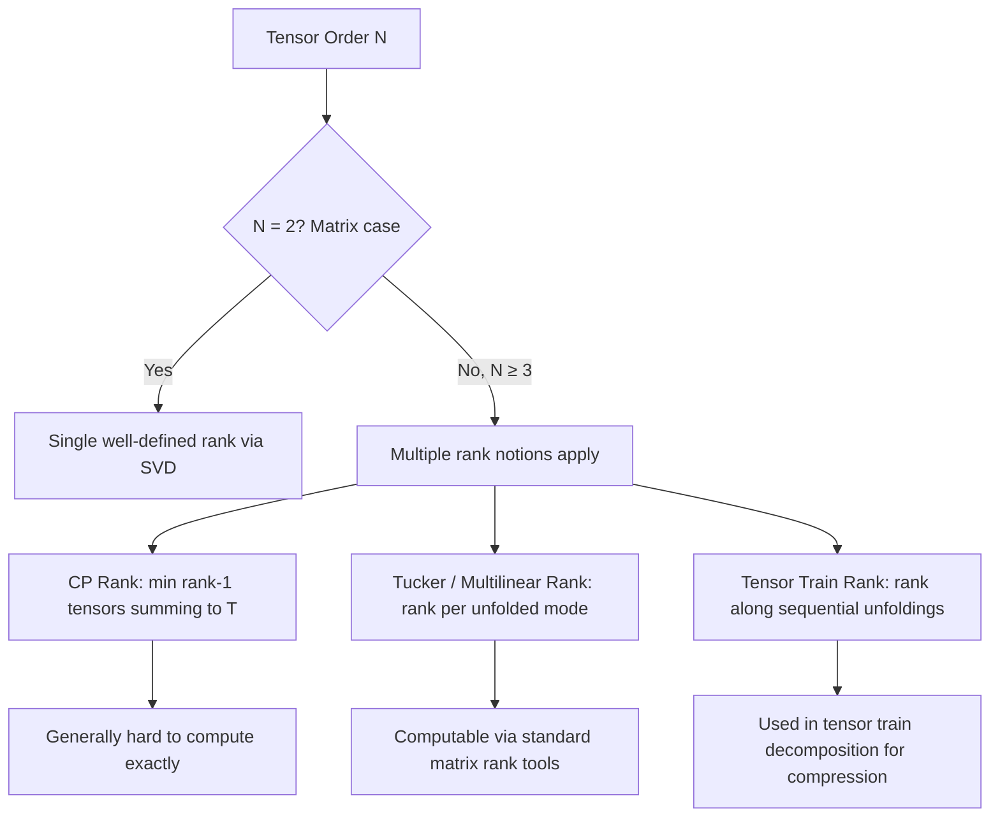

## Tensor Definition and Rank

### Overview

Tensors generalize scalars, vectors, and matrices to arbitrary numbers of dimensions (or "axes"). In machine learning, tensors are the fundamental data structure underlying nearly all frameworks (e.g., multi-dimensional arrays storing images, batches, embeddings, and model weights). Understanding tensor rank and its distinction from matrix rank is essential for correctly reasoning about data shapes and linear algebra operations in ML pipelines.

### Prerequisite Concepts

- $Scalars$, $vectors$, and $matrices$ as low-dimensional special cases
- $Matrix rank$ (from standard linear algebra)
- Basic indexing and array/dimension terminology
- $Linear independence$

### What Is a Tensor

A tensor is a multi-dimensional array of numbers, generalizing:

- A **scalar** (0-dimensional tensor): a single number
- A **vector** (1-dimensional tensor): an ordered list of numbers
- A **matrix** (2-dimensional tensor): a 2D grid of numbers
- A **tensor** (N-dimensional, $N \geq 3$): an array indexed by $N$ indices

**Key Points**
- In pure mathematics, "tensor" carries a more formal definition rooted in multilinear algebra (a tensor is a multilinear map satisfying specific transformation rules under change of basis)
- In machine learning practice, "tensor" is used more loosely to mean any multi-dimensional array, largely following the terminology of frameworks such as NumPy, PyTorch, and TensorFlow [Unverified — terminology conventions vary by community and are not universally standardized]
- This distinction matters primarily in theoretical contexts; for applied ML work, the array-based definition is standard and sufficient

### The Concept of "Order" (or "Ways")

The **order** of a tensor (also called its number of "ways" or "modes") is the number of indices required to specify an individual element.

| Structure | Order | Example |
|---|---|---|
| Scalar | 0 | A single loss value |
| Vector | 1 | A feature vector $x \in \mathbb{R}^d$ |
| Matrix | 2 | A weight matrix $W \in \mathbb{R}^{m \times n}$ |
| 3-tensor | 3 | A batch of grayscale images: (batch, height, width) |
| 4-tensor | 4 | A batch of color images: (batch, height, width, channels) |
| N-tensor | N | Arbitrary higher-order data structures |

**Key Points**
- "Order," "ways," and "modes" are used interchangeably across different sources; "dimension" is sometimes also used but can cause confusion since it overlaps with the term describing the *size* of a single axis
- The term "rank" is also sometimes used to mean "order" in casual ML usage, but this is a significant terminological collision with the formal linear algebra definition of rank, described below

### Diagram: Tensor Order Progression

<svg xmlns="http://www.w3.org/2000/svg" viewBox="0 0 800 260">
  <text x="400" y="25" font-size="16" font-weight="bold" text-anchor="middle" fill="#1a1a1a">Tensor Order: Scalar to N-Dimensional (svg_diagram)</text>

  <text x="70" y="55" font-size="12" text-anchor="middle" fill="#1a1a1a" font-weight="bold">Scalar (order 0)</text>
  <rect x="45" y="70" width="50" height="50" fill="#e8f0fe" stroke="#4285f4" stroke-width="2" />
  <text x="70" y="100" font-size="14" text-anchor="middle" fill="#1a1a1a">5</text>

  <text x="230" y="55" font-size="12" text-anchor="middle" fill="#1a1a1a" font-weight="bold">Vector (order 1)</text>
  <rect x="180" y="70" width="30" height="30" fill="#fef7e0" stroke="#f9ab00" stroke-width="1.5" />
  <rect x="210" y="70" width="30" height="30" fill="#fef7e0" stroke="#f9ab00" stroke-width="1.5" />
  <rect x="240" y="70" width="30" height="30" fill="#fef7e0" stroke="#f9ab00" stroke-width="1.5" />
  <text x="195" y="90" font-size="11" text-anchor="middle" fill="#1a1a1a">1</text>
  <text x="225" y="90" font-size="11" text-anchor="middle" fill="#1a1a1a">4</text>
  <text x="255" y="90" font-size="11" text-anchor="middle" fill="#1a1a1a">2</text>

  <text x="430" y="55" font-size="12" text-anchor="middle" fill="#1a1a1a" font-weight="bold">Matrix (order 2)</text>
  <g stroke="#34a853" stroke-width="1.5" fill="#e6f4ea">
    <rect x="380" y="70" width="30" height="30" />
    <rect x="410" y="70" width="30" height="30" />
    <rect x="380" y="100" width="30" height="30" />
    <rect x="410" y="100" width="30" height="30" />
  </g>

  <text x="620" y="55" font-size="12" text-anchor="middle" fill="#1a1a1a" font-weight="bold">3-Tensor (order 3)</text>
  <g stroke="#ea4335" stroke-width="1.5" fill="#fce8e6">
    <rect x="560" y="70" width="30" height="30" />
    <rect x="590" y="70" width="30" height="30" />
    <rect x="575" y="55" width="30" height="30" />
    <rect x="605" y="55" width="30" height="30" />
    <rect x="560" y="100" width="30" height="30" />
    <rect x="590" y="100" width="30" height="30" />
    <rect x="575" y="85" width="30" height="30" />
    <rect x="605" y="85" width="30" height="30" />
  </g>

  <text x="400" y="180" font-size="12" text-anchor="middle" fill="#5f6368">Order = number of indices needed to address a single element</text>
  <text x="400" y="200" font-size="12" text-anchor="middle" fill="#5f6368">e.g., a 4th-order tensor element requires T[i,j,k,l] to specify</text>
</svg>

### Tensor Shape Notation

A tensor's **shape** specifies the size along each axis. For example, a tensor with shape $(32, 128, 128, 3)$ might represent a batch of 32 RGB images, each $128 \times 128$ pixels with 3 color channels.

**Key Points**
- Shape and order are distinct: two tensors can have the same order (e.g., both order-3) but different shapes (e.g., $(10, 10, 10)$ vs. $(5, 20, 3)$)
- The total number of elements in a tensor equals the product of all shape dimensions

### Matrix Rank: The Classical Definition

Before addressing tensor rank, it is necessary to be precise about matrix rank, since the term becomes ambiguous when extended to tensors.

For a matrix $A \in \mathbb{R}^{m \times n}$, the **rank** is the dimension of the vector space spanned by its columns (equivalently, its rows) — the maximum number of linearly independent columns (or rows).

$$\text{rank}(A) = \dim(\text{column space of } A) = \dim(\text{row space of } A)$$

**Key Points**
- Rank is always well-defined and computable via Gaussian elimination, SVD (number of non-zero singular values), or other standard methods
- $\text{rank}(A) \leq \min(m, n)$ always holds
- Via SVD, $A = U\Sigma V^T$, the rank equals the number of non-zero singular values in $\Sigma$

### Why Tensor Rank Is More Complicated

For tensors of order 3 or higher, the notion of "rank" does not generalize as cleanly, and multiple inequivalent definitions exist.

**Tensor rank (CP rank)** is typically defined as the minimum number of rank-1 tensors whose sum reconstructs the original tensor:

$$T = \sum_{r=1}^{R} a_r \otimes b_r \otimes c_r$$

where $\otimes$ denotes the outer product, and $R$ is the tensor rank (also called CP rank, after the CANDECOMP/PARAFAC decomposition).

**Key Points**
- Unlike matrix rank, computing the exact tensor rank of a given higher-order tensor is [Unverified — widely cited in tensor decomposition literature as NP-hard in general, though this claim should be verified against current literature for the specific tensor rank definition in question]
- Tensor rank can behave counter-intuitively: for example, the rank of a tensor can depend on whether the underlying field is real or complex numbers, unlike matrix rank
- Multiple distinct notions of "rank" exist for higher-order tensors (CP rank, Tucker rank / multilinear rank, tensor train rank), and they are generally **not equivalent** to one another

### Matrix Rank vs. Tensor Rank: Key Contrasts

| Property | Matrix Rank | Tensor Rank (order ≥ 3) |
|---|---|---|
| Well-defined, single notion | Yes | No — multiple inequivalent definitions exist |
| Efficiently computable | Yes (via Gaussian elimination or SVD) | [Unverified] Generally considered computationally hard for exact CP rank |
| Upper bound | $\min(m, n)$ | No simple analogous bound in general |
| Field-dependence | Rank is the same over $\mathbb{R}$ and $\mathbb{C}$ | Can differ between real and complex fields |
| Best low-rank approximation guaranteed to exist | Yes (Eckart–Young–Mirsky) | [Unverified] Not always guaranteed to exist for CP decomposition in the same clean sense; approximation problems can be ill-posed |

### Multilinear Rank (Tucker Rank)

An alternative and more computationally tractable notion is the **multilinear rank** (or Tucker rank), defined as a tuple of ranks — one per mode — where the rank along a given mode is the rank of the matrix obtained by "unfolding" (flattening) the tensor along that mode.

**Key Points**
- For an order-3 tensor $T$, the multilinear rank is a triple $(r_1, r_2, r_3)$, where each $r_i$ is a standard matrix rank of a corresponding unfolding
- Multilinear rank is well-defined and computable using standard matrix rank tools applied to each unfolding, unlike CP rank
- This forms the basis of the **Tucker decomposition**, a common tensor decomposition technique in machine learning applications such as compressing neural network weight tensors [Inference — based on documented use cases in model compression literature]

### Diagram: Tensor Rank Concepts Overview

### Relevance to Machine Learning

- **Data representation**: images, video, and multi-channel sensor data are naturally represented as higher-order tensors, making tensor operations foundational to deep learning frameworks
- **Weight tensor compression**: Tucker and tensor-train decompositions are used to compress large weight tensors in neural networks, reducing parameter counts while approximating original layer behavior [Inference — documented technique, though effectiveness varies by architecture and layer type]
- **Multi-way data analysis**: tensor decompositions extend PCA-like ideas (finding low-dimensional structure) to inherently multi-dimensional data, such as time-varying networks or multi-modal sensor arrays
- **Automatic differentiation frameworks**: PyTorch, TensorFlow, and JAX represent essentially all data and parameters as tensors, making tensor shape and rank reasoning a practical daily concern in model implementation, independent of the deeper mathematical rank theory

### Common Pitfalls

- Conflating "tensor rank" (order — number of axes) with "rank" in the linear algebra sense (dimension of spanned subspace) — this is one of the most common sources of confusion in applied ML discussions, since framework documentation often uses "rank" to mean "number of dimensions/axes"
- Assuming tensor rank generalizes matrix rank's clean computational properties (uniqueness, polynomial-time computability, guaranteed best low-rank approximation) — these properties largely do not carry over to order-3-and-above tensors
- Treating all tensor decomposition methods (CP, Tucker, tensor train) as interchangeable — they have different computational properties, different notions of rank, and different appropriate use cases
- Assuming a low multilinear rank implies a correspondingly low CP rank, or vice versa — these are distinct quantities that do not map onto each other simply [Unverified — relationship is nontrivial and decomposition-specific]

### Conclusion

Tensors generalize vectors and matrices to arbitrary order, and while low-order cases (vectors, matrices) enjoy a clean, well-established notion of rank, this cleanliness breaks down for higher-order tensors, where multiple distinct and generally inequivalent rank definitions (CP rank, multilinear/Tucker rank, tensor train rank) coexist, each with different computational tractability. This distinction is essential background for understanding tensor decomposition methods used in ML model compression and multi-way data analysis.

**Related Topics**
- CP (CANDECOMP/PARAFAC) decomposition in detail
- Tucker decomposition and higher-order SVD (HOSVD)
- Tensor train decomposition and its use in compressing sequential models
- Tensor unfolding (matricization) operations
- Applications of tensor decomposition in neural network compression
- Multi-way data analysis and its relationship to classical PCA