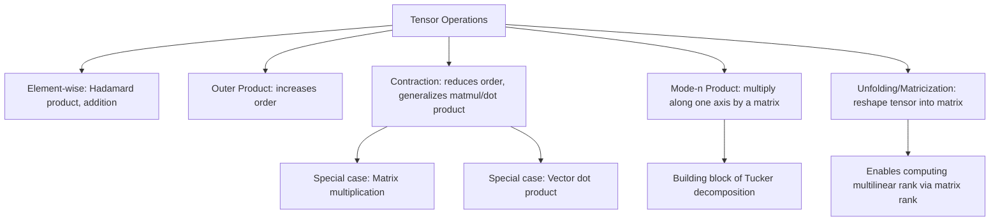

## Tensor Operations

### Overview

Building on tensor notation and indexing, this topic covers the core operations performed on tensors in machine learning: element-wise operations, tensor contraction, mode-n products, outer products, and broadcasting. These operations form the computational backbone of nearly all neural network and multi-way data analysis implementations.

### Prerequisite Concepts

- Tensor definition, order, and shape
- Tensor notation and indexing (including Einstein summation)
- Matrix multiplication fundamentals
- Basic understanding of $vector spaces$

### Element-Wise Operations

Element-wise (or Hadamard-style) operations apply a function independently to each corresponding element of one or more tensors of the same shape.

$$(\mathcal{A} \circ \mathcal{B})_{i_1,\dots,i_N} = \mathcal{A}_{i_1,\dots,i_N} \cdot \mathcal{B}_{i_1,\dots,i_N}$$

where $\circ$ denotes the Hadamard (element-wise) product.

**Key Points**
- Element-wise operations require operands to have identical shapes, or shapes compatible via broadcasting (discussed later)
- Common element-wise operations include addition, subtraction, multiplication, division, and applying nonlinear functions (e.g., ReLU, sigmoid) independently to each element
- Element-wise operations preserve the shape of the input tensors

### Tensor Addition and Scalar Multiplication

These follow the same rules as vector/matrix arithmetic, generalized to arbitrary order:

$$(\mathcal{A} + \mathcal{B})_{i_1,\dots,i_N} = \mathcal{A}_{i_1,\dots,i_N} + \mathcal{B}_{i_1,\dots,i_N}$$

$$(c \cdot \mathcal{A})_{i_1,\dots,i_N} = c \cdot \mathcal{A}_{i_1,\dots,i_N}$$

**Key Points**
- Tensors of the same shape, under element-wise addition and scalar multiplication, form a vector space — the same algebraic structure as ordinary vectors, just with more indices
- This means familiar vector space properties (associativity, commutativity of addition, distributivity of scalar multiplication) all carry over directly

### The Outer Product

The **outer product** combines lower-order tensors into a higher-order tensor. For two vectors $\mathbf{a} \in \mathbb{R}^{I}$ and $\mathbf{b} \in \mathbb{R}^{J}$:

$$(\mathbf{a} \otimes \mathbf{b})_{ij} = a_i b_j$$

producing a matrix of shape $(I, J)$.

Extending to three vectors $\mathbf{a}, \mathbf{b}, \mathbf{c}$:

$$(\mathbf{a} \otimes \mathbf{b} \otimes \mathbf{c})_{ijk} = a_i b_j c_k$$

producing an order-3 tensor.

**Key Points**
- Outer products increase order: combining two vectors (order 1 each) produces a matrix (order 2); combining three produces an order-3 tensor
- This is the operation underlying the CP (CANDECOMP/PARAFAC) decomposition mentioned in tensor rank discussions, where a tensor is expressed as a sum of outer products of vectors
- The outer product is distinct from the inner (dot) product, which *reduces* order rather than increasing it

### Diagram: Outer Product Building an Order-3 Tensor

<svg xmlns="http://www.w3.org/2000/svg" viewBox="0 0 780 260">
  <text x="390" y="25" font-size="16" font-weight="bold" text-anchor="middle" fill="#1a1a1a">Outer Product: Vectors to Order-3 Tensor (svg_diagram)</text>

  <text x="90" y="60" font-size="12" text-anchor="middle" fill="#1a1a1a">vector a</text>
  <rect x="60" y="70" width="20" height="60" fill="#e8f0fe" stroke="#4285f4" stroke-width="1.5" />
  <rect x="60" y="130" width="20" height="60" fill="#e8f0fe" stroke="#4285f4" stroke-width="1.5" />

  <text x="200" y="60" font-size="14" text-anchor="middle" fill="#5f6368">⊗</text>

  <text x="230" y="60" font-size="12" text-anchor="middle" fill="#1a1a1a">vector b</text>
  <rect x="200" y="70" width="60" height="20" fill="#fef7e0" stroke="#f9ab00" stroke-width="1.5" />
  <rect x="260" y="70" width="60" height="20" fill="#fef7e0" stroke="#f9ab00" stroke-width="1.5" />

  <text x="360" y="60" font-size="14" text-anchor="middle" fill="#5f6368">⊗</text>

  <text x="390" y="60" font-size="12" text-anchor="middle" fill="#1a1a1a">vector c</text>
  <rect x="375" y="70" width="30" height="30" fill="#e6f4ea" stroke="#34a853" stroke-width="1.5" />

  <text x="450" y="120" font-size="16" text-anchor="middle" fill="#5f6368">=</text>

  <text x="620" y="60" font-size="12" text-anchor="middle" fill="#1a1a1a">Order-3 Tensor</text>
  <g stroke="#ea4335" stroke-width="1.5" fill="#fce8e6">
    <rect x="560" y="90" width="25" height="25" />
    <rect x="585" y="90" width="25" height="25" />
    <rect x="572" y="78" width="25" height="25" />
    <rect x="597" y="78" width="25" height="25" />
    <rect x="560" y="115" width="25" height="25" />
    <rect x="585" y="115" width="25" height="25" />
    <rect x="572" y="103" width="25" height="25" />
    <rect x="597" y="103" width="25" height="25" />
  </g>
  <text x="620" y="215" font-size="11" text-anchor="middle" fill="#5f6368">Shape (I, J, K), rank-1 tensor</text>
  <text x="620" y="230" font-size="11" text-anchor="middle" fill="#5f6368">T[i,j,k] = a[i]·b[j]·c[k]</text>
</svg>

### Tensor Contraction

**Tensor contraction** generalizes matrix multiplication and the dot product: it sums over one or more shared indices between two tensors, reducing the combined order.

**General contraction** (single shared index, generalizing matrix multiplication):

$$C_{i_1,\dots,i_{N-1}, k_1,\dots,k_{M-1}} = \sum_{j} \mathcal{A}_{i_1,\dots,i_{N-1}, j} \, \mathcal{B}_{j, k_1,\dots,k_{M-1}}$$

**Key Points**
- Matrix multiplication is a special case of tensor contraction where both operands are order-2 tensors and exactly one index is summed
- The dot product is a special case where both operands are order-1 (vectors) and the single available index is summed, reducing order all the way to a scalar (order 0)
- Contraction reduces the combined order of the operation: contracting an order-$M$ and order-$N$ tensor over one shared index each produces an order-$(M+N-2)$ result

### Mode-$n$ Product

The **mode-$n$ product** multiplies a tensor by a matrix along a specific mode (axis), a fundamental operation in tensor decompositions such as Tucker decomposition and HOSVD (Higher-Order SVD).

For a tensor $\mathcal{T} \in \mathbb{R}^{I_1 \times I_2 \times \dots \times I_N}$ and a matrix $M \in \mathbb{R}^{J \times I_n}$, the mode-$n$ product $\mathcal{T} \times_n M$ produces a tensor of shape $(I_1, \dots, I_{n-1}, J, I_{n+1}, \dots, I_N)$:

$$(\mathcal{T} \times_n M)_{i_1,\dots,i_{n-1}, j, i_{n+1},\dots,i_N} = \sum_{i_n} \mathcal{T}_{i_1,\dots,i_N} \, M_{j, i_n}$$

**Key Points**
- The mode-$n$ product replaces the size along mode $n$ (originally $I_n$) with the new size $J$ determined by the multiplying matrix
- This operation is the building block of Tucker decomposition, where a tensor is expressed as a smaller "core" tensor multiplied by a factor matrix along each mode
- [Inference] Understanding mode-$n$ products is a practical prerequisite for implementing or interpreting Tucker-based neural network compression techniques, since these methods are defined directly in terms of this operation

### Tensor Unfolding (Matricization)

**Unfolding** (or matricization) reshapes a tensor into a matrix by grouping one mode against all others. The mode-$n$ unfolding of tensor $\mathcal{T} \in \mathbb{R}^{I_1 \times \dots \times I_N}$, denoted $T_{(n)}$, is a matrix of shape $(I_n, \prod_{k \neq n} I_k)$.

**Key Points**
- Unfolding is essential for computing multilinear (Tucker) rank, since the rank along mode $n$ is defined as the standard matrix rank of $T_{(n)}$
- Different sources use different index-ordering conventions for how the "flattened" columns are arranged, meaning the exact matrix produced by unfolding can differ between conventions even for the same tensor and mode [Unverified — always confirm the specific unfolding convention used by a given source or software library before comparing results]
- Unfolding allows tensor problems to be reduced to matrix problems, enabling reuse of well-established matrix tools (SVD, rank computation, etc.)

### Diagram: Tensor Operations Overview



### Broadcasting

**Broadcasting** allows element-wise operations between tensors of different but compatible shapes, by implicitly expanding smaller tensors without copying data.

**Broadcasting rules** (as commonly implemented in NumPy-style frameworks):
1. Align shapes from the rightmost (last) dimension
2. Two dimensions are compatible if they are equal, or if one of them is 1
3. Missing dimensions on the smaller tensor are treated as size 1 and expanded

**Example**

Adding a vector of shape $(3,)$ to a matrix of shape $(4, 3)$:

$$\begin{bmatrix} 1 & 2 & 3 \\ 4 & 5 & 6 \\ 7 & 8 & 9 \\ 10 & 11 & 12 \end{bmatrix} + \begin{bmatrix} 100 & 200 & 300 \end{bmatrix}$$

The vector is implicitly broadcast across all 4 rows, producing:

$$\begin{bmatrix} 101 & 202 & 303 \\ 104 & 205 & 306 \\ 107 & 208 & 309 \\ 110 & 211 & 312 \end{bmatrix}$$

**Key Points**
- Broadcasting is a computational and memory optimization — no actual copying of the smaller tensor occurs in most efficient implementations; the operation is conceptually equivalent to first expanding, but is executed more efficiently
- Broadcasting is extremely common in ML code (e.g., adding a bias vector to every row of an activation matrix), making it practically essential to understand precisely
- [Unverified — implementation details vary] Exact broadcasting rule edge cases can differ subtly between frameworks; the general rules above hold across NumPy, PyTorch, and TensorFlow, but always consult framework-specific documentation for edge cases

### Worked Example: Contraction via Einsum

Given a batch of feature vectors $X \in \mathbb{R}^{B \times D}$ (batch size $B$, feature dimension $D$) and a weight matrix $W \in \mathbb{R}^{D \times K}$, compute batched linear transformation output $Y \in \mathbb{R}^{B \times K}$.

**Step 1 — Identify the contraction:** The shared dimension $D$ must be summed over, matching standard matrix multiplication.

**Step 2 — Einstein notation:**

$$Y_{bk} = \sum_d X_{bd} W_{dk} = X_{bd} W_{dk}$$

**Step 3 — Code implementation:**

```python
import numpy as np
Y = np.einsum('bd,dk->bk', X, W)
```

**Interpretation:** This is mathematically identical to standard matrix multiplication `X @ W`, but expressing it via `einsum` makes the underlying index contraction explicit — a pattern that generalizes naturally to more complex multi-tensor contractions that plain matrix multiplication notation cannot easily express.

### Common Pitfalls

- Confusing the outer product (order-increasing) with the inner/contracted product (order-reducing) — these have effectively opposite effects on tensor order
- Applying broadcasting rules incorrectly by misaligning dimensions from the left rather than the right, leading to shape mismatches or, worse, silently incorrect broadcasting against unintended axes
- Assuming a single, universal unfolding (matricization) convention — differing column-ordering conventions across sources can produce different-looking matrices from the same tensor and mode, complicating comparison of results across libraries or papers
- Using element-wise (Hadamard) operations where a contraction (matrix-multiplication-like) operation was intended, or vice versa — these produce different shapes and different mathematical results, and the distinction is not always obvious from casual notation
- Forgetting that mode-$n$ product changes the size along only one mode, leaving all other modes' sizes unchanged — miscounting which mode is affected is a common source of shape errors when implementing Tucker-based operations

### Conclusion

Tensor operations — element-wise arithmetic, outer products, contractions, mode-$n$ products, unfolding, and broadcasting — extend familiar vector and matrix operations to arbitrary order, with contraction and the mode-$n$ product serving as particularly important generalizations of matrix multiplication that underlie tensor decomposition methods used throughout machine learning.

**Related Topics**
- Higher-Order SVD (HOSVD) and its relationship to mode-n products and unfolding
- The Kronecker product and its relationship to the outer product
- Automatic differentiation through tensor contraction operations
- Performance considerations: memory layout and broadcasting efficiency in large-scale training
- Tensor decomposition methods (CP, Tucker, tensor train) built from these primitive operations
- Practical `einsum` patterns for common deep learning operations (attention mechanisms, batched matrix multiplication)