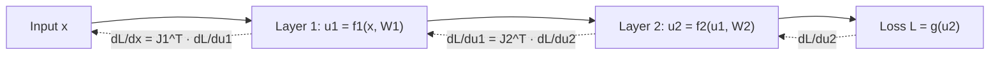

## Chain Rule in Matrix Calculus

### Definition

The chain rule in matrix calculus extends the scalar chain rule to functions composed of vector or matrix-valued intermediate steps. It describes how to compute the derivative of a composite function by multiplying the derivatives (Jacobians) of each stage in the composition.

For scalars, the familiar form is:

$$\frac{dy}{dx} = \frac{dy}{du} \cdot \frac{du}{dx}$$

Matrix calculus generalizes this to vectors and matrices, where the "multiplication" becomes matrix multiplication of Jacobians, and care must be taken with the order and shape of each term.

### Vector Chain Rule

For $\mathbf{y} = \mathbf{g}(\mathbf{u})$ and $\mathbf{u} = \mathbf{h}(\mathbf{x})$, where $\mathbf{x} \in \mathbb{R}^n$, $\mathbf{u} \in \mathbb{R}^k$, $\mathbf{y} \in \mathbb{R}^m$:

$$\frac{\partial \mathbf{y}}{\partial \mathbf{x}} = \frac{\partial \mathbf{y}}{\partial \mathbf{u}} \cdot \frac{\partial \mathbf{u}}{\partial \mathbf{x}}$$

In Jacobian notation:

$$J_{\mathbf{y}, \mathbf{x}} = J_{\mathbf{y}, \mathbf{u}} \, J_{\mathbf{u}, \mathbf{x}}$$

where $J_{\mathbf{y},\mathbf{u}} \in \mathbb{R}^{m \times k}$ and $J_{\mathbf{u},\mathbf{x}} \in \mathbb{R}^{k \times n}$, giving a result of shape $m \times n$, consistent with the dimensions of $J_{\mathbf{y},\mathbf{x}}$.

### Scalar-Output Composition

A common case in machine learning is a scalar loss $L$ that depends on $\mathbf{x}$ through an intermediate vector $\mathbf{u} = \mathbf{h}(\mathbf{x})$:

$$\nabla_{\mathbf{x}} L = \left(\frac{\partial \mathbf{u}}{\partial \mathbf{x}}\right)^T \nabla_{\mathbf{u}} L = J_{\mathbf{u},\mathbf{x}}^T \, \nabla_{\mathbf{u}} L$$

This form appears directly in backpropagation: the gradient with respect to an earlier layer's output is obtained by multiplying the transposed Jacobian of the intermediate transformation by the gradient with respect to the later layer.

### Chain Rule Through Multiple Layers

For a composition of several functions, $\mathbf{x}_0 \to \mathbf{x}_1 \to \mathbf{x}_2 \to \cdots \to \mathbf{x}_L \to L$ (a scalar), the gradient with respect to an intermediate layer's output is:

$$\nabla_{\mathbf{x}_i} L = J_{\mathbf{x}_{i+1}, \mathbf{x}_i}^T \, \nabla_{\mathbf{x}_{i+1}} L$$

Applied recursively from the output back to the input, this recursive application is the mathematical basis of the backpropagation algorithm used to train multi-layer neural networks. This describes the standard mathematical formulation; [Unverified] the specific way any given deep learning framework implements this recursion internally (e.g., graph construction, caching, or memory management) is not confirmed here and would need to be checked against that framework's documentation.

### Matrix-Argument Chain Rule

When the intermediate or final variable is a matrix rather than a vector, the chain rule can be expressed using differentials, which tend to generalize more cleanly than direct index-based derivatives. For a scalar function $L$ depending on $Y = f(X)$:

$$dL = \text{tr}\left( \left(\frac{\partial L}{\partial Y}\right)^T dY \right)$$

and if $dY$ can be expressed in terms of $dX$, substitution yields $\frac{\partial L}{\partial X}$ by matching the resulting expression to the form $\text{tr}\left(\left(\frac{\partial L}{\partial X}\right)^T dX\right)$.

[Inference] This differential-based approach is commonly presented in matrix calculus references (such as the *Matrix Cookbook*) as a systematic technique for deriving matrix derivative identities, but I do not have access to confirm the exact phrasing or section of any specific reference within this conversation, so this should be treated as a general technique description rather than a verified quotation.

### Example: Two-Layer Composition

Let $\mathbf{x} \in \mathbb{R}^2$, and define:

$$\mathbf{u} = A\mathbf{x}, \qquad L = \|\mathbf{u}\|_2^2$$

where $A \in \mathbb{R}^{2 \times 2}$ is a constant matrix.

**Step 1** — Compute $\nabla_{\mathbf{u}} L$:

$$\nabla_{\mathbf{u}} L = 2\mathbf{u}$$

**Step 2** — Compute the Jacobian $J_{\mathbf{u}, \mathbf{x}}$:

$$J_{\mathbf{u}, \mathbf{x}} = A$$

**Step 3** — Apply the chain rule:

$$\nabla_{\mathbf{x}} L = A^T (2\mathbf{u}) = 2A^T A \mathbf{x}$$

This matches the known identity for $L = \|A\mathbf{x}\|_2^2$, confirming internal consistency of the chain rule application in this case.

Concretely, with:

$$A = \begin{bmatrix} 1 & 2 \\ 0 & 1 \end{bmatrix}, \quad \mathbf{x} = \begin{bmatrix} 1 \\ 1 \end{bmatrix}$$

then $\mathbf{u} = A\mathbf{x} = [3, 1]^T$, and:

$$\nabla_{\mathbf{x}} L = 2A^T A \mathbf{x} = 2\begin{bmatrix} 1 & 0 \\ 2 & 1 \end{bmatrix}\begin{bmatrix} 1 & 2 \\ 0 & 1 \end{bmatrix}\begin{bmatrix} 1 \\ 1 \end{bmatrix} = 2\begin{bmatrix} 1 & 2 \\ 2 & 5 \end{bmatrix}\begin{bmatrix} 1 \\ 1 \end{bmatrix} = 2\begin{bmatrix} 3 \\ 7 \end{bmatrix} = \begin{bmatrix} 6 \\ 14 \end{bmatrix}$$

### Diagram: Chain Rule Through a Computation Graph

<svg xmlns="http://www.w3.org/2000/svg" viewBox="0 0 700 260">
  <text x="20" y="25" font-size="16" font-weight="bold" fill="#222">Chain Rule Through a Computation Graph (svg_diagram)</text>

  <circle cx="60" cy="140" r="30" fill="#dbe9ff" stroke="#3366cc" stroke-width="1.5" />
  <text x="48" y="145" font-size="13" fill="#222">x</text>

  <circle cx="230" cy="140" r="30" fill="#ffe6cc" stroke="#cc6600" stroke-width="1.5" />
  <text x="215" y="145" font-size="13" fill="#222">u=h(x)</text>

  <circle cx="420" cy="140" r="30" fill="#e6ffe6" stroke="#339933" stroke-width="1.5" />
  <text x="405" y="145" font-size="13" fill="#222">y=g(u)</text>

  <circle cx="600" cy="140" r="30" fill="#ffd6e0" stroke="#cc3366" stroke-width="1.5" />
  <text x="585" y="145" font-size="13" fill="#222">L</text>

  <line x1="90" y1="140" x2="200" y2="140" stroke="#666" stroke-width="1.5" marker-end="url(#arrowc)" />
  <line x1="260" y1="140" x2="390" y2="140" stroke="#666" stroke-width="1.5" marker-end="url(#arrowc)" />
  <line x1="450" y1="140" x2="570" y2="140" stroke="#666" stroke-width="1.5" marker-end="url(#arrowc)" />

  <text x="80" y="200" font-size="12" fill="#555">Forward pass: left to right</text>
  <text x="80" y="220" font-size="12" fill="#555">Backward pass (chain rule): gradients flow right to left,</text>
  <text x="80" y="238" font-size="12" fill="#555">each step multiplying by the local Jacobian transpose.</text>
</svg>

### Backpropagation as Repeated Chain Rule Application

Backpropagation applies the vector/matrix chain rule layer by layer, from the output loss back toward the input:

At each layer, the local Jacobian (with respect to both the layer's input and its parameters) is used to propagate the gradient backward. [Inference] This general description matches the standard mathematical formulation of backpropagation found in common machine learning references, but specific implementation details (e.g., how a given framework structures or executes this computation graph) vary and are not confirmed here without checking that framework's documentation directly.

### Applications in Machine Learning

- **Backpropagation in neural networks**: The core training algorithm for multi-layer networks is a direct, repeated application of the matrix/vector chain rule across layers.
- **Gradient computation for composite loss functions**: Loss functions built from multiple nested transformations (e.g., regularization terms combined with data-fitting terms) require chain rule application across each component.
- **Automatic differentiation systems**: [Inference] Reverse-mode automatic differentiation is commonly described as implementing the chain rule computationally by traversing a computation graph, but I do not have access to verify implementation-specific details of any particular automatic differentiation library without checking its documentation directly.

### Behavioral Disclaimer

[Unverified] Claims about how any specific automatic differentiation framework (e.g., PyTorch, TensorFlow, JAX) constructs computation graphs, applies the chain rule internally, or manages memory during backpropagation would require checking that framework's documentation directly. Behavior can vary by framework and version, and no such framework-specific claims are made in this document beyond the general mathematical formulation.

### Next Steps

- Backpropagation algorithm: full worked derivation
- Automatic differentiation: forward mode vs. reverse mode
- Computation graphs and their role in deep learning frameworks
- Differentials and the trace trick for matrix derivative identities
- Jacobian-vector products and vector-Jacobian products
- Gradient checking and numerical differentiation for verification