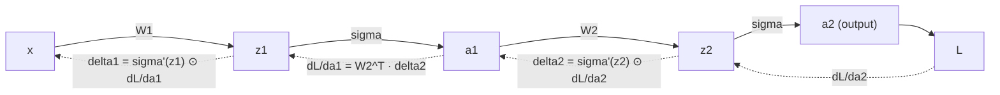

## Backpropagation as Matrix Calculus

### Definition

Backpropagation is an algorithm for computing gradients of a scalar loss function with respect to all parameters in a layered (composite) computational model, such as a neural network. Mathematically, it is a systematic, efficient application of the multivariate chain rule, organized to reuse intermediate results rather than recomputing derivatives from scratch for each parameter.

### Setup: A Layered Model

Consider a network with $L$ layers. Define the forward pass as a sequence of transformations:

$$\mathbf{z}^{(l)} = W^{(l)} \mathbf{a}^{(l-1)} + \mathbf{b}^{(l)}, \qquad \mathbf{a}^{(l)} = \sigma(\mathbf{z}^{(l)})$$

for $l = 1, \ldots, L$, where $\mathbf{a}^{(0)} = \mathbf{x}$ is the input, $W^{(l)}$ and $\mathbf{b}^{(l)}$ are the weight matrix and bias vector for layer $l$, $\sigma$ is an elementwise activation function, and $\mathbf{a}^{(L)}$ produces the final output used to compute a scalar loss $L(\mathbf{a}^{(L)}, \mathbf{y})$ against a target $\mathbf{y}$.

### Forward Pass Jacobians

Each layer defines two local Jacobians relevant to backpropagation:

$$\frac{\partial \mathbf{z}^{(l)}}{\partial \mathbf{a}^{(l-1)}} = W^{(l)}, \qquad \frac{\partial \mathbf{a}^{(l)}}{\partial \mathbf{z}^{(l)}} = \text{diag}\left(\sigma'(z_1^{(l)}), \ldots, \sigma'(z_n^{(l)})\right)$$

The first follows from the linear transformation Jacobian rule. The second follows from the elementwise-function Jacobian rule, since $\sigma$ is applied independently to each entry of $\mathbf{z}^{(l)}$.

### The Backward Recursion

Define the "error signal" at layer $l$ as $\boldsymbol{\delta}^{(l)} = \dfrac{\partial L}{\partial \mathbf{z}^{(l)}}$. Using the chain rule:

$$\boldsymbol{\delta}^{(l)} = \left(\frac{\partial \mathbf{a}^{(l)}}{\partial \mathbf{z}^{(l)}}\right)^T \frac{\partial L}{\partial \mathbf{a}^{(l)}} = \sigma'(\mathbf{z}^{(l)}) \odot \frac{\partial L}{\partial \mathbf{a}^{(l)}}$$

where $\odot$ denotes elementwise multiplication (valid here because the Jacobian of an elementwise function is diagonal, which reduces matrix-vector multiplication to an elementwise product).

The gradient with respect to the previous layer's activation is obtained via:

$$\frac{\partial L}{\partial \mathbf{a}^{(l-1)}} = \left(\frac{\partial \mathbf{z}^{(l)}}{\partial \mathbf{a}^{(l-1)}}\right)^T \boldsymbol{\delta}^{(l)} = (W^{(l)})^T \boldsymbol{\delta}^{(l)}$$

Combining these gives the standard backward recursion:

$$\boldsymbol{\delta}^{(l-1)} = \sigma'(\mathbf{z}^{(l-1)}) \odot \left( (W^{(l)})^T \boldsymbol{\delta}^{(l)} \right)$$

This recursion propagates the error signal from the output layer back toward the input, one layer at a time.

### Parameter Gradients

Once $\boldsymbol{\delta}^{(l)}$ is known for a given layer, the gradients with respect to that layer's parameters follow from the outer-product identity (covered in the earlier outer product topic) combined with the chain rule:

$$\frac{\partial L}{\partial W^{(l)}} = \boldsymbol{\delta}^{(l)} (\mathbf{a}^{(l-1)})^T, \qquad \frac{\partial L}{\partial \mathbf{b}^{(l)}} = \boldsymbol{\delta}^{(l)}$$

The weight gradient is an outer product between the layer's error signal and the previous layer's activation — directly connecting this topic back to the outer product definition covered earlier in this sequence.

### Summary Table

| Quantity | Formula |
|---|---|
| Error signal at output layer | $\boldsymbol{\delta}^{(L)} = \sigma'(\mathbf{z}^{(L)}) \odot \dfrac{\partial L}{\partial \mathbf{a}^{(L)}}$ |
| Backward recursion | $\boldsymbol{\delta}^{(l-1)} = \sigma'(\mathbf{z}^{(l-1)}) \odot \left((W^{(l)})^T \boldsymbol{\delta}^{(l)}\right)$ |
| Weight gradient | $\dfrac{\partial L}{\partial W^{(l)}} = \boldsymbol{\delta}^{(l)} (\mathbf{a}^{(l-1)})^T$ |
| Bias gradient | $\dfrac{\partial L}{\partial \mathbf{b}^{(l)}} = \boldsymbol{\delta}^{(l)}$ |

### Example: Two-Layer Network

Consider a minimal network with one hidden layer, input $\mathbf{x} \in \mathbb{R}^2$, and scalar output, using $\sigma(z) = z$ (identity activation, for simplicity of this worked example):

$$\mathbf{z}^{(1)} = W^{(1)}\mathbf{x}, \qquad a^{(1)} = z^{(1)}, \qquad z^{(2)} = W^{(2)} a^{(1)}, \qquad L = \frac{1}{2}(z^{(2)} - y)^2$$

with:

$$W^{(1)} = \begin{bmatrix} 1 & 0 \\ 0 & 1 \end{bmatrix}, \quad W^{(2)} = \begin{bmatrix} 1 & 1 \end{bmatrix}, \quad \mathbf{x} = \begin{bmatrix} 2 \\ 3 \end{bmatrix}, \quad y = 4$$

**Forward pass**: $\mathbf{z}^{(1)} = [2, 3]^T$, $z^{(2)} = 1(2) + 1(3) = 5$, $L = \frac{1}{2}(5-4)^2 = 0.5$

**Backward pass**:

$$\delta^{(2)} = \frac{\partial L}{\partial z^{(2)}} = (z^{(2)} - y) = 1$$

$$\frac{\partial L}{\partial \mathbf{a}^{(1)}} = (W^{(2)})^T \delta^{(2)} = \begin{bmatrix} 1 \\ 1 \end{bmatrix}(1) = \begin{bmatrix} 1 \\ 1 \end{bmatrix}$$

Since $\sigma$ is the identity here, $\sigma' = 1$, so $\boldsymbol{\delta}^{(1)} = \begin{bmatrix} 1 \\ 1 \end{bmatrix}$.

**Weight gradients**:

$$\frac{\partial L}{\partial W^{(2)}} = \delta^{(2)} (\mathbf{a}^{(1)})^T = (1)[2, 3] = [2, 3]$$

$$\frac{\partial L}{\partial W^{(1)}} = \boldsymbol{\delta}^{(1)} \mathbf{x}^T = \begin{bmatrix} 1 \\ 1 \end{bmatrix}[2, 3] = \begin{bmatrix} 2 & 3 \\ 2 & 3 \end{bmatrix}$$

### Diagram: Forward and Backward Pass Through a Layered Network

### Diagram: Outer Product Structure of Weight Gradients

<svg xmlns="http://www.w3.org/2000/svg" viewBox="0 0 620 240">
  <text x="20" y="25" font-size="16" font-weight="bold" fill="#222">Weight Gradient as Outer Product (svg_diagram)</text>

  <text x="20" y="70" font-size="14" fill="#333">δ (error signal)</text>
  <rect x="20" y="80" width="30" height="80" fill="#ffe6cc" stroke="#cc6600" stroke-width="1.5" />

  <text x="120" y="70" font-size="14" fill="#333">a^T (previous activation)</text>
  <rect x="120" y="80" width="90" height="25" fill="#dbe9ff" stroke="#3366cc" stroke-width="1.5" />

  <text x="260" y="70" font-size="14" fill="#333">=</text>

  <text x="300" y="70" font-size="14" fill="#333">∂L/∂W (outer product)</text>
  <rect x="300" y="80" width="90" height="80" fill="#e6ffe6" stroke="#339933" stroke-width="1.5" />

  <text x="20" y="200" font-size="12" fill="#555">Each layer's weight gradient reuses the outer product pattern</text>
  <text x="20" y="218" font-size="12" fill="#555">introduced earlier for constructing rank-1 matrices from vectors.</text>
</svg>

### Computational Efficiency of Backpropagation

The recursive structure of backpropagation avoids redundant computation by reusing $\boldsymbol{\delta}^{(l)}$ across all parameter gradients at that layer, rather than recomputing partial derivatives independently for each individual weight. [Inference] This reuse is commonly cited as the reason backpropagation is more computationally efficient than naive numerical differentiation of each parameter individually, though I do not have access to specific benchmark figures comparing the two approaches, and actual computational cost depends on network architecture and implementation.

### Applications in Machine Learning

- **Training multi-layer neural networks**: Backpropagation is the standard method for computing gradients used in gradient-based optimizers (SGD, Adam, etc.) to update network parameters.
- **Convolutional and recurrent architectures**: [Inference] The same chain-rule-based principles extend to convolutional and recurrent layers, though the specific Jacobian structures differ (e.g., weight sharing in convolutions, unrolled time steps in recurrent networks), and I do not have access to verify implementation-specific details of any particular architecture without checking a dedicated source.
- **Gradient-based meta-learning**: Some techniques compute gradients through the backpropagation process itself (gradients of gradients), relying on the same underlying chain rule machinery applied recursively. [Unverified] I do not have access to confirm specific implementation details or current adoption of any particular meta-learning method.

### Behavioral Disclaimer

[Unverified] Claims about how any specific deep learning framework (PyTorch, TensorFlow, JAX, etc.) implements backpropagation internally — including computation graph construction, memory management, or gradient accumulation behavior — would require checking that framework's documentation directly. Behavior may vary by framework and version, and no such framework-specific claims are made in this document beyond the general mathematical formulation.

### Next Steps

- Automatic differentiation: forward mode vs. reverse mode implementation
- Vanishing and exploding gradients in deep networks
- Backpropagation through convolutional layers
- Backpropagation through recurrent layers and time (BPTT)
- Gradient descent optimizers built on backpropagation (SGD, Adam, RMSProp)
- Computation graphs as a general framework for automatic differentiation