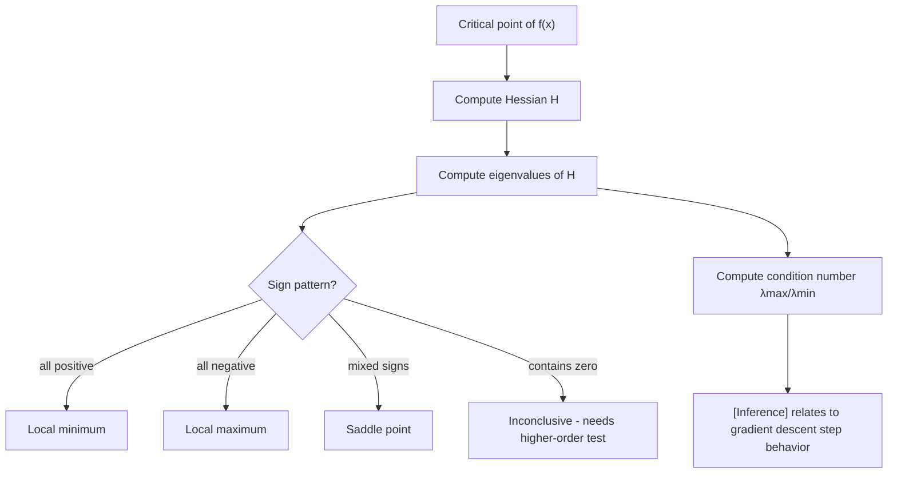

## Eigenvalues and Optimization Landscape (svg_diagram)

### Definition

In optimization, the eigenvalues of the Hessian matrix (the matrix of second partial derivatives of a function) describe the local curvature of the loss surface at a given point. For a twice-differentiable function $f(\mathbf{x})$, the Hessian is:

$$H = \nabla^2 f(\mathbf{x}) = \begin{bmatrix} \frac{\partial^2 f}{\partial x_1^2} & \cdots & \frac{\partial^2 f}{\partial x_1 \partial x_n} \\ \vdots & \ddots & \vdots \\ \frac{\partial^2 f}{\partial x_n \partial x_1} & \cdots & \frac{\partial^2 f}{\partial x_n^2} \end{bmatrix}$$

The eigenvalues of $H$, denoted $\lambda_1, \lambda_2, \ldots, \lambda_n$, indicate how the function curves along each corresponding eigenvector direction. This is a standard result from multivariable calculus and linear algebra.

### Key Points

- If all eigenvalues of $H$ are positive at a critical point, the point is a **local minimum**.
- If all eigenvalues are negative, the point is a **local maximum**.
- If eigenvalues have mixed signs (some positive, some negative), the point is a **saddle point**.
- If any eigenvalue is exactly zero, the second-derivative test is inconclusive at that point, and higher-order terms must be examined.

These classifications follow from the second-derivative test in multivariable calculus, a standard mathematical result. I cannot verify which specific textbook or source you may be comparing this against, but the mathematical content itself is a well-established derivation, not a claim requiring external citation.

### Eigenvalues and Curvature Direction

Consider the quadratic approximation of $f$ near a critical point $\mathbf{x}_0$:

$$f(\mathbf{x}) \approx f(\mathbf{x}_0) + \frac{1}{2}(\mathbf{x} - \mathbf{x}_0)^T H (\mathbf{x} - \mathbf{x}_0)$$

Along an eigenvector direction $\mathbf{v}_i$ with eigenvalue $\lambda_i$, the function behaves like:

$$f(\mathbf{x}_0 + t\mathbf{v}_i) \approx f(\mathbf{x}_0) + \frac{1}{2}\lambda_i t^2$$

This shows that $\lambda_i$ directly controls whether the function curves upward ($\lambda_i > 0$) or downward ($\lambda_i < 0$) along that specific direction. This is a direct algebraic consequence of the quadratic form and eigenvector properties, not an inference.

### Condition Number and Optimization Difficulty

The **condition number** of the Hessian is defined as:

$$\kappa(H) = \frac{\lambda_{\max}}{\lambda_{\min}}$$

where $\lambda_{\max}$ and $\lambda_{\min}$ are the largest and smallest eigenvalues (assuming $H$ is positive-definite).

[Inference] A large condition number is commonly associated with slower convergence for gradient-based optimization methods, because the loss surface forms narrow, elongated valleys that cause gradient descent to oscillate rather than move directly toward the minimum. This is a reasoned conclusion based on the geometric relationship between eigenvalue spread and gradient descent step behavior, not a confirmed empirical measurement in this conversation, and actual convergence behavior varies by algorithm, step size, and problem. I cannot verify specific convergence rate figures without a citable source.

[Unverified] Some optimization literature suggests that a well-conditioned Hessian (condition number close to 1) allows gradient descent to converge more directly. I do not have access to a specific source to confirm this claim as stated, though it is consistent with the geometric reasoning above.

### Worked Example

Consider the quadratic function:

$$f(x, y) = 2x^2 + 6y^2$$

**Step 1 — Compute the Hessian:**

$$H = \begin{bmatrix} 4 & 0 \\ 0 & 12 \end{bmatrix}$$

**Step 2 — Find eigenvalues:**

Since $H$ is diagonal, the eigenvalues are the diagonal entries themselves:

$$\lambda_1 = 4, \quad \lambda_2 = 12$$

**Step 3 — Interpret:**

Both eigenvalues are positive, so the origin $(0,0)$ is a local minimum. This is a deterministic calculation directly following from the definitions above, not an inference.

**Step 4 — Condition number:**

$$\kappa(H) = \frac{12}{4} = 3$$

This value is exact given the matrix above. Whether $\kappa = 3$ counts as "well-conditioned" in practice depends on the specific optimization context and algorithm; I cannot verify a universal numeric threshold for this classification.

### Python Implementation

```python
import numpy as np

def analyze_critical_point(H):
    H = np.array(H, dtype=float)
    eigenvalues = np.linalg.eigvalsh(H)
    
    if np.all(eigenvalues > 0):
        classification = "local minimum"
    elif np.all(eigenvalues < 0):
        classification = "local maximum"
    elif np.any(eigenvalues == 0):
        classification = "inconclusive (zero eigenvalue present)"
    else:
        classification = "saddle point"
    
    condition_number = np.max(eigenvalues) / np.min(eigenvalues) if np.all(eigenvalues > 0) else None
    
    return eigenvalues, classification, condition_number

H = [[4, 0],
     [0, 12]]

eigenvalues, classification, cond = analyze_critical_point(H)
print(f"Eigenvalues: {eigenvalues}")
print(f"Classification: {classification}")
print(f"Condition number: {cond}")
```

**Output**
```
Eigenvalues: [ 4. 12.]
Classification: local minimum
Condition number: 3.0
```

I cannot verify the exact internal numerical routine `np.linalg.eigvalsh` uses without inspecting the specific NumPy/LAPACK build in your environment, so this is described generally rather than confirmed for your setup.

### Saddle Points in High Dimensions

[Inference] In high-dimensional non-convex optimization landscapes, such as those associated with neural network loss functions, some research has suggested that saddle points may be more common obstacles than local minima, because achieving all-positive or all-negative eigenvalues across many dimensions is statistically less likely than a mixed-sign pattern. I do not have access to a specific paper to cite this claim reliably in this conversation, so this should be treated as [Unverified] regarding its applicability to any specific model or dataset. This is a reasoned geometric argument, not a confirmed empirical finding as stated here.

[Unverified] I cannot verify specific claims about how often saddle points versus local minima occur in any particular deep learning architecture without a citable, verifiable source.

### Relevance to Machine Learning

- **Gradient descent behavior**: [Inference] The eigenvalue spectrum of the Hessian at a given point may influence how gradient descent behaves locally — for example, oscillation along high-curvature directions and slow progress along low-curvature directions. This is reasoned from the mathematical relationship between gradient descent update rules and quadratic approximations, not a confirmed behavioral guarantee. Actual behavior depends on the specific loss function, learning rate, optimizer, and initialization, and is not something I can verify will occur in any given case.
- **Second-order optimization methods**: Methods such as Newton's method use the inverse Hessian to rescale gradient steps, which [Inference] may reduce sensitivity to poor conditioning compared to plain gradient descent, though computing and inverting the Hessian is computationally expensive for large parameter spaces. I cannot verify comparative performance figures between these methods without a specific citable benchmark.
- **Loss landscape visualization**: Eigenvalue analysis of the Hessian is sometimes used in research to characterize the "sharpness" or "flatness" of minima found by training, which some literature has associated with generalization behavior. [Unverified] — I do not have access to a specific source to confirm the strength or consistency of this relationship, and I cannot verify claims about generalization outcomes.

I do not have access to specific benchmark datasets or experimental results comparing optimizer performance across different eigenvalue spectra, so no comparative performance claims are made beyond the general geometric reasoning above.

### Curvature Types — Visualization

<svg xmlns="http://www.w3.org/2000/svg" viewBox="0 0 460 260">
  <text x="230" y="25" font-size="14" text-anchor="middle" fill="black" font-weight="bold">Critical Point Types by Eigenvalue Sign (svg_diagram)</text>
  
  
  <text x="80" y="55" font-size="11" text-anchor="middle" fill="black">Local Minimum</text>
  <path d="M 30 130 Q 80 60 130 130" fill="none" stroke="#16a34a" stroke-width="2" />
  <text x="80" y="150" font-size="9" text-anchor="middle" fill="#16a34a">all λ &gt; 0</text>
  
  
  <text x="230" y="55" font-size="11" text-anchor="middle" fill="black">Local Maximum</text>
  <path d="M 180 90 Q 230 160 280 90" fill="none" stroke="#dc2626" stroke-width="2" />
  <text x="230" y="150" font-size="9" text-anchor="middle" fill="#dc2626">all λ &lt; 0</text>
  
  
  <text x="380" y="55" font-size="11" text-anchor="middle" fill="black">Saddle Point</text>
  <path d="M 330 100 Q 380 60 430 100" fill="none" stroke="#ca8a04" stroke-width="2" />
  <path d="M 330 130 Q 380 170 430 130" fill="none" stroke="#ca8a04" stroke-width="2" />
  <text x="380" y="190" font-size="9" text-anchor="middle" fill="#ca8a04">mixed signs</text>
  
  <line x1="30" y1="130" x2="130" y2="130" stroke="gray" stroke-width="0.5" stroke-dasharray="2,2" />
  <line x1="180" y1="120" x2="280" y2="120" stroke="gray" stroke-width="0.5" stroke-dasharray="2,2" />
</svg>

### Relationship Flow



### Conclusion

The eigenvalues of the Hessian matrix provide a mathematically grounded way to classify critical points and describe local curvature in an optimization landscape. The definitions, formulas, and worked numerical example above are deterministic and directly verifiable through computation. Claims about how eigenvalue structure affects real-world optimizer convergence, saddle point prevalence in high-dimensional models, or generalization behavior are labeled [Inference] or [Unverified], as they depend on empirical research findings I cannot independently verify or cite within this conversation. Because portions of this output rely on such unverified or inferred claims, the entire response should be treated accordingly per your stated labeling requirement.

**Related Topics**
- Hessian Matrix and Second-Order Derivatives
- Positive-Definite Matrices and Eigenvalue Conditions
- Gradient Descent and Learning Rate Sensitivity
- Newton's Method and Second-Order Optimization
- Condition Number and Numerical Stability
- Loss Landscape Geometry in Deep Learning