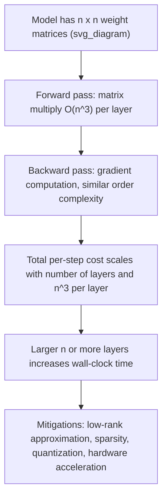

## Computational Complexity of Matrix Operations

### Overview

Computational complexity analysis for matrix operations describes how the time and memory required to perform an operation scale with input size, typically expressed using Big-O notation. This is factual, well-established computer science and numerical linear algebra content; standard complexity results are stated without uncertainty labels, while any claims about real-world performance on specific hardware are marked as [Inference] or [Unverified] since actual runtime depends on implementation, hardware, and library optimizations.

### Why Complexity Matters for Machine Learning

Machine learning models frequently involve matrices with dimensions in the thousands or millions (e.g., weight matrices in neural networks, feature matrices in datasets, covariance matrices). The theoretical complexity of an operation determines whether it is feasible to compute directly or requires approximation, decomposition, or hardware acceleration. [Inference] Poor awareness of complexity costs is a common cause of unexpectedly slow training or inference pipelines, though the specific cause in any given case requires profiling to confirm.

### Basic Notation Used

- $n$ — typically denotes matrix dimension (for an $n \times n$ square matrix)
- $m, n, p$ — used for non-square matrix dimensions
- $O(\cdot)$ — Big-O notation, describing an upper bound on growth rate of operations (usually counted as scalar multiplications/additions, or "flops" — floating point operations)

### Complexity of Core Matrix Operations

#### Matrix Addition and Subtraction

For two $m \times n$ matrices:

$$C = A + B$$

Each entry requires one addition, so the complexity is:

$$O(mn)$$

This is linear in the number of elements.

#### Scalar Multiplication

Multiplying an $m \times n$ matrix by a scalar requires one multiplication per entry:

$$O(mn)$$

#### Matrix-Vector Multiplication

For an $m \times n$ matrix $A$ and an $n$-dimensional vector $x$:

$$y = Ax$$

Each of the $m$ output entries requires $n$ multiplications and $n-1$ additions, giving:

$$O(mn)$$

#### Matrix-Matrix Multiplication (Standard Algorithm)

For an $m \times n$ matrix $A$ multiplied by an $n \times p$ matrix $B$:

$$C = AB$$

Each of the $mp$ entries of $C$ requires $n$ multiplications and $n-1$ additions. This gives the classical (naive) complexity:

$$O(mnp)$$

For two square $n \times n$ matrices, this simplifies to:

$$O(n^3)$$

This cubic scaling is one of the most important facts in numerical linear algebra for ML, since large matrix multiplications (e.g., in dense neural network layers) are often the dominant computational cost.

### Faster Matrix Multiplication Algorithms

#### Strassen's Algorithm

Strassen's algorithm reduces the complexity of square matrix multiplication below $O(n^3)$ by using a divide-and-conquer approach with fewer recursive multiplications:

$$O(n^{\log_2 7}) \approx O(n^{2.807})$$

[Unverified] Whether Strassen's algorithm provides a practical speedup in a given ML framework depends on matrix size, hardware, numerical stability requirements, and library implementation; for small or moderately sized matrices, the standard algorithm is often faster in practice due to lower overhead and better cache behavior.

#### Further Theoretical Algorithms

Algorithms such as the Coppersmith–Winograd algorithm and its descendants have pushed the theoretical bound further, with the best known bounds around:

$$O(n^{2.371})$$

[Unverified] The exact current best theoretical exponent is an active research area and changes over time; this document does not claim a specific up-to-date value beyond what is described here, and readers should consult current literature for the precise state of the art. These algorithms are generally not used in practical ML libraries due to large constant factors and implementation complexity.

### Complexity of Other Common Operations

#### Matrix Transpose

$$O(mn)$$

Simply rearranging entries, no arithmetic operations beyond data movement.

#### Matrix Inversion

For an $n \times n$ invertible matrix, standard methods (e.g., Gauss-Jordan elimination) give:

$$O(n^3)$$

[Inference] Because matrix inversion via general algorithms shares the same asymptotic complexity class as matrix multiplication, faster multiplication algorithms can in principle be adapted to invert matrices asymptotically faster, though this is rarely used in practice due to numerical instability concerns.

#### Determinant Computation

Using LU decomposition:

$$O(n^3)$$

Computing determinants via cofactor expansion (the naive recursive definition) has much worse complexity:

$$O(n!)$$

This factorial complexity makes cofactor expansion impractical for anything beyond very small matrices.

#### Solving Linear Systems ($Ax = b$)

Using Gaussian elimination or LU decomposition:

$$O(n^3)$$

For sparse or structured matrices, specialized methods can achieve better complexity, as described below.

#### Matrix Decompositions

| Decomposition | Typical Complexity (for $n \times n$ matrix) |
|---|---|
| LU Decomposition | $O(n^3)$ |
| QR Decomposition (Householder) | $O(n^3)$ |
| Cholesky Decomposition | $O(n^3/3)$, i.e., $O(n^3)$ asymptotically |
| Singular Value Decomposition (SVD) | $O(mn^2)$ for $m \geq n$, up to $O(n^3)$ for square matrices |
| Eigenvalue Decomposition (general) | $O(n^3)$ |

[Inference] Constant factors differ meaningfully between these decompositions even when the asymptotic order is the same; Cholesky decomposition is generally faster in practice than LU decomposition for symmetric positive-definite matrices because it exploits symmetry, though actual speedup depends on implementation.

### Complexity Growth Visualization

<svg xmlns="http://www.w3.org/2000/svg" viewBox="0 0 700 420">
  <text x="350" y="25" text-anchor="middle" font-size="16" font-weight="bold" fill="#1a1a1a">Growth of Matrix Operation Complexity (svg_diagram)</text>
  
  <line x1="60" y1="370" x2="650" y2="370" stroke="#333" stroke-width="2" />
  <line x1="60" y1="370" x2="60" y2="50" stroke="#333" stroke-width="2" />
  
  <text x="355" y="400" text-anchor="middle" font-size="13" fill="#333">Matrix Dimension (n)</text>
  <text x="25" y="210" text-anchor="middle" font-size="13" fill="#333" transform="rotate(-90 25 210)">Operations (relative scale)</text>
  
  <text x="60" y="385" font-size="11" text-anchor="middle" fill="#555">0</text>
  <text x="650" y="385" font-size="11" text-anchor="middle" fill="#555">n</text>

  
  <path d="M 60 370 L 650 300" stroke="#2b8a3e" stroke-width="2.5" fill="none" />
  <text x="655" y="300" font-size="12" fill="#2b8a3e">O(n)</text>

  
  <path d="M 60 370 Q 350 340 650 200" stroke="#1971c2" stroke-width="2.5" fill="none" />
  <text x="655" y="200" font-size="12" fill="#1971c2">O(n²)</text>

  
  <path d="M 60 370 Q 350 300 650 110" stroke="#e8590c" stroke-width="2.5" fill="none" />
  <text x="655" y="110" font-size="12" fill="#e8590c">O(n^2.807)</text>

  
  <path d="M 60 370 Q 350 260 650 55" stroke="#c92a2a" stroke-width="2.5" fill="none" />
  <text x="655" y="55" font-size="12" fill="#c92a2a">O(n³)</text>

  <rect x="80" y="60" width="14" height="14" fill="#c92a2a" />
  <text x="100" y="72" font-size="11" fill="#333">Standard matrix multiply, LU, QR, inversion</text>

  <rect x="80" y="82" width="14" height="14" fill="#e8590c" />
  <text x="100" y="94" font-size="11" fill="#333">Strassen's algorithm (theoretical)</text>

  <rect x="80" y="104" width="14" height="14" fill="#1971c2" />
  <text x="100" y="116" font-size="11" fill="#333">Matrix-vector multiply, transpose</text>

  <rect x="80" y="126" width="14" height="14" fill="#2b8a3e" />
  <text x="100" y="138" font-size="11" fill="#333">Element-wise addition</text>
</svg>

This diagram is illustrative of relative growth trends, not derived from measured benchmark data. [Unverified] Actual curve shapes on real hardware will differ due to caching, memory bandwidth, and parallelization effects.

### Sparse Matrix Considerations

For sparse matrices (matrices with mostly zero entries), complexity can be significantly reduced by exploiting sparsity structure:

- Sparse matrix-vector multiplication: $O(\text{nnz})$, where $\text{nnz}$ is the number of non-zero entries, rather than $O(n^2)$
- Sparse matrix-matrix multiplication complexity depends heavily on the sparsity pattern and is generally denoted $O(\text{nnz}(A) \cdot n)$ in worst-case bounds for certain algorithms, though exact bounds vary by method

[Inference] Sparse representations are commonly used in ML contexts such as natural language processing (bag-of-words matrices) and graph neural networks, where the reduction from dense to sparse complexity can be substantial, though the actual benefit depends on the sparsity ratio and chosen data structure (e.g., CSR, CSC, COO formats).

### Complexity in Practice: Batched and Parallel Operations

Modern ML frameworks (e.g., those relying on GPU acceleration) do not always achieve the same practical scaling as theoretical complexity suggests, because:

- Operations can be parallelized across many cores, changing effective wall-clock scaling even though the total operation count (work complexity) remains the same
- Memory bandwidth and data movement often dominate runtime for large matrices rather than arithmetic operation count alone
- Batched operations (common in deep learning, e.g., processing multiple samples simultaneously) introduce additional dimensions to complexity analysis, such as $O(b \cdot n^3)$ for a batch size $b$

[Unverified] Specific speedup factors from GPU parallelization vary widely by hardware generation, matrix size, and library (e.g., cuBLAS, cuDNN) and are not stated here as fixed values.

### Complexity Comparison Table for Common ML Operations

| Operation | Naive Complexity | Notes |
|---|---|---|
| Dot product of two $n$-vectors | $O(n)$ | Fundamental building block |
| Matrix-vector multiply ($n \times n$) | $O(n^2)$ | Common in forward passes |
| Matrix-matrix multiply ($n \times n$) | $O(n^3)$ | Dominant cost in dense layers |
| Matrix inversion ($n \times n$) | $O(n^3)$ | Rarely computed explicitly in ML; solving linear systems preferred |
| SVD ($n \times n$) | $O(n^3)$ | Used in PCA, dimensionality reduction |
| Eigendecomposition ($n \times n$) | $O(n^3)$ | Used in PCA, spectral methods |

### Why Direct Matrix Inversion Is Often Avoided

[Inference] In practical ML and numerical computing workflows, solving $Ax = b$ directly via decomposition methods (e.g., LU or Cholesky) is generally preferred over explicitly computing $A^{-1}$ and then multiplying, because explicit inversion is typically less numerically stable and offers no complexity advantage — both approaches share $O(n^3)$ complexity, but explicit inversion introduces additional rounding error accumulation. This is a widely cited principle in numerical linear algebra references, though this document does not cite a specific source and it should be treated as [Unverified] without a direct citation.

### Complexity's Relationship to Training Time

[Inference] This flow describes a general conceptual relationship between matrix complexity and training cost; it does not account for framework-specific optimizations, mixed precision, or model-specific architectural differences, and actual training time depends on many additional factors.

### Strategies to Manage Complexity in ML Contexts

- **Low-rank approximation** — Approximating a matrix with a lower-rank factorization (e.g., via truncated SVD) can reduce effective complexity for downstream operations. [Inference] This trades exactness for computational savings and is commonly used in recommendation systems and model compression, though the appropriate rank choice is problem-dependent.
- **Sparsity exploitation** — Using sparse matrix formats and algorithms when applicable.
- **Batching and vectorization** — Grouping operations to exploit hardware parallelism, which does not change asymptotic complexity but can affect practical runtime.
- **Approximate algorithms** — Randomized numerical linear algebra methods (e.g., randomized SVD) can offer better practical scaling for very large matrices. [Unverified] The accuracy-speed tradeoff of such methods depends on the specific algorithm and problem structure.
- **Hardware acceleration** — GPUs and TPUs are commonly used to accelerate matrix operations. [Unverified] The degree of acceleration depends on the specific hardware, operation type, and software stack.

### Key Points

- Element-wise operations (addition, scalar multiplication) scale as $O(mn)$
- Matrix-vector multiplication scales as $O(mn)$
- Standard matrix-matrix multiplication scales as $O(n^3)$ for square matrices
- Faster theoretical algorithms (e.g., Strassen's) exist but [Unverified] practical benefits vary by context
- Most core decompositions (LU, QR, Cholesky, SVD, eigendecomposition) share $O(n^3)$ complexity for square matrices
- Sparse matrices can significantly reduce practical complexity when applicable
- Theoretical complexity does not always predict real-world runtime due to hardware, parallelization, and memory bandwidth effects [Unverified]

### Related Topics

- Numerical stability and conditioning in matrix computations
- LU, QR, and Cholesky decomposition methods in detail
- Singular Value Decomposition (SVD) and its applications in dimensionality reduction
- Eigenvalues and eigenvectors: computation and interpretation
- Sparse matrix representations and algorithms
- Randomized numerical linear algebra
- Low-rank matrix approximation techniques
- GPU-accelerated linear algebra libraries (e.g., cuBLAS, cuSOLVER)
- Iterative methods for solving large linear systems (e.g., conjugate gradient)
- Floating-point precision and its effect on matrix computation accuracy