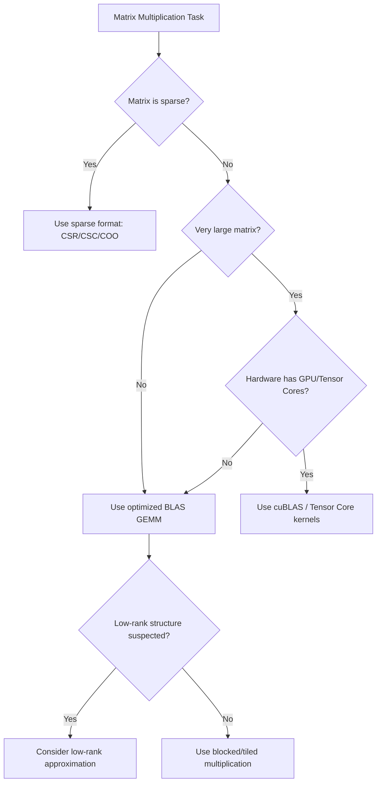

## Efficient Matrix Multiplication Algorithms

### Overview

Matrix multiplication is one of the most computationally expensive and frequently invoked operations in machine learning, underlying forward passes, backpropagation, kernel computations, and embedding transformations. The naive algorithm has cubic time complexity, and much of numerical linear algebra engineering is devoted to reducing this cost or exploiting hardware to execute it faster.

### Naive Matrix Multiplication

For matrices $A \in \mathbb{R}^{m \times n}$ and $B \in \mathbb{R}^{n \times p}$, the product $C = AB$ is defined element-wise as:

$$C_{ij} = \sum_{k=1}^{n} A_{ik}B_{kj}$$

**Key Points**
- Computing each entry $C_{ij}$ requires $n$ multiplications and $n-1$ additions.
- There are $m \times p$ entries to compute.
- Total scalar operations: $O(mnp)$, commonly simplified to $O(n^3)$ for square $n \times n$ matrices.
- This cubic scaling makes naive multiplication a bottleneck for large matrices, such as those found in dense neural network layers.

### Why Naive Multiplication Is Inefficient at Scale

**Key Points**
- Doubling matrix dimension increases naive computation cost by roughly 8x ($2^3$).
- Memory access patterns in naive implementations often cause poor cache utilization, since elements of $B$ are accessed column-wise while stored row-wise (or vice versa), leading to cache misses.
- [Inference] On modern hardware, memory bandwidth limitations frequently constrain performance as much as or more than raw arithmetic throughput, though the exact bottleneck depends on matrix size, hardware architecture, and implementation.

### Strassen's Algorithm

Strassen's algorithm reduces the asymptotic complexity below $O(n^3)$ by using a divide-and-conquer strategy that trades some additions for fewer multiplications.

**Key Points**
- Partitions each $n \times n$ matrix into four $n/2 \times n/2$ submatrices.
- Instead of the 8 multiplications required by the naive block method, Strassen's algorithm computes the result using 7 cleverly combined multiplications and additional additions/subtractions.
- Achieves a time complexity of approximately $O(n^{2.807})$, since $\log_2 7 \approx 2.807$.

**Example**

For block matrices:

$$A = \begin{pmatrix} A_{11} & A_{12} \\ A_{21} & A_{22} \end{pmatrix}, \quad B = \begin{pmatrix} B_{11} & B_{12} \\ B_{21} & B_{22} \end{pmatrix}$$

Strassen's method computes seven products $M_1$ through $M_7$ (each a combination of block additions/subtractions followed by one multiplication), then reconstructs the four blocks of $C$ from linear combinations of these seven products.

**Key Points**
- [Unverified] Practical speedups from Strassen's algorithm over naive multiplication depend heavily on matrix size, implementation, and hardware; crossover points where Strassen's algorithm becomes faster in practice are implementation-specific and not universally fixed.
- Numerical stability of Strassen's algorithm differs from naive multiplication; the recursive subtraction and addition steps can amplify floating-point rounding errors in some cases. [Inference] This makes Strassen's algorithm less commonly used in production numerical libraries compared to highly optimized naive-style blocked implementations, though this varies by library and use case.

### Beyond Strassen: Theoretical Algorithms

**Key Points**
- Subsequent algorithms, including the Coppersmith–Winograd algorithm and its refinements, have pushed the theoretical exponent lower, toward approximately $O(n^{2.373})$.
- [Unverified] These algorithms are generally considered impractical for real-world use due to enormous constant factors that make them slower than simpler algorithms except at matrix sizes far beyond what typically occurs in machine learning workloads.
- Machine learning libraries in practice rely on highly optimized $O(n^3)$-based implementations rather than these asymptotically faster theoretical algorithms.

### Blocked (Tiled) Matrix Multiplication

**Key Points**
- Divides matrices into smaller blocks (tiles) sized to fit in fast cache memory (L1/L2 cache).
- Reduces the number of slow main-memory accesses by reusing data already loaded into cache across multiple computations.
- Forms the basis of most high-performance CPU matrix multiplication libraries, such as those used in BLAS (Basic Linear Algebra Subprograms) implementations.

**Example**

Instead of computing $C = AB$ directly across full rows and columns, blocked multiplication processes submatrices of size $b \times b$ (where $b$ is chosen to fit cache constraints), computing partial sums for $C$ block by block before moving to the next block pair.

### BLAS and Optimized Libraries

**Key Points**
- BLAS defines a standard interface for linear algebra operations, with implementations such as OpenBLAS, Intel MKL, and ATLAS providing highly tuned matrix multiplication routines.
- BLAS Level 3 routines (matrix-matrix operations, including `GEMM` for general matrix multiplication) are the operations most relevant to efficient ML computation.
- [Inference] These libraries typically combine blocking, vectorization (SIMD instructions), multi-threading, and hardware-specific tuning to approach the theoretical peak floating-point throughput of a given CPU, though actual achieved performance varies by hardware, matrix shape, and library version.
- Deep learning frameworks such as PyTorch and TensorFlow typically delegate matrix multiplication to these underlying optimized libraries rather than implementing naive multiplication themselves. [Unverified] Exact delegation behavior depends on framework version, backend configuration, and hardware target.

### GPU-Accelerated Matrix Multiplication

**Key Points**
- GPUs parallelize matrix multiplication across thousands of cores, exploiting the operation's inherent parallelism (each output entry can, in principle, be computed independently).
- Libraries such as cuBLAS (NVIDIA) provide GPU-optimized `GEMM` implementations.
- Specialized hardware units, such as NVIDIA's Tensor Cores, are designed specifically to accelerate mixed-precision matrix multiplication and are heavily used in deep learning training and inference.
- [Unverified] Specific throughput figures (e.g., FLOPs achieved) vary significantly across GPU generations, precision modes, and matrix dimensions, and are not stated here as fixed values.

### Matrix Multiplication Order and Associativity

**Key Points**
- Matrix multiplication is associative: $(AB)C = A(BC)$, but the computational cost of evaluating the product differs depending on the order in which multiplications are performed when more than two matrices are involved.
- This is known as the matrix chain multiplication problem, solvable optimally using dynamic programming in $O(n^3)$ time for $n$ matrices (where $n$ here refers to the number of matrices, not their dimensions).

**Example**

For matrices $A$ (10×100), $B$ (100×5), $C$ (5×50):

- Computing $(AB)C$ requires $10 \times 100 \times 5 + 10 \times 5 \times 50 = 5{,}000 + 2{,}500 = 7{,}500$ scalar multiplications.
- Computing $A(BC)$ requires $100 \times 5 \times 50 + 10 \times 100 \times 50 = 25{,}000 + 50{,}000 = 75{,}000$ scalar multiplications.
- Choosing $(AB)C$ is substantially more efficient in this case.

**Key Points**
- [Inference] In deep learning frameworks with automatic differentiation, computation graphs are generally not automatically reordered for optimal chain multiplication cost unless the framework specifically implements such an optimization; behavior depends on the specific framework and version.

### Sparse Matrix Multiplication

**Key Points**
- Many ML applications involve sparse matrices (matrices with a large proportion of zero entries), such as one-hot encoded features, adjacency matrices in graph neural networks, or pruned neural network weights.
- Specialized sparse matrix formats (e.g., CSR — Compressed Sparse Row, CSC — Compressed Sparse Column, COO — Coordinate list) avoid storing and computing with zero entries.
- Sparse matrix multiplication algorithms can achieve significant computational savings when sparsity is high, though [Inference] the actual speedup depends on the sparsity pattern, chosen format, and hardware support, and dense algorithms can sometimes outperform naive sparse implementations at low sparsity levels due to overhead.

### Low-Rank Approximation for Efficiency

**Key Points**
- When a matrix can be well-approximated by a lower-rank matrix, multiplication cost can be reduced by decomposing $A \approx UV^T$ where $U$ and $V$ have far fewer columns than $A$ has rows/columns.
- This technique is used in techniques such as low-rank adaptation (LoRA) for efficient fine-tuning of large models, where weight updates are constrained to a low-rank subspace to reduce computational and memory cost.
- [Inference] The effectiveness of low-rank approximation depends on how well the true matrix structure aligns with a low-rank assumption; not all matrices benefit equally from this approach.

### Mixed and Reduced Precision Computation

**Key Points**
- Reducing numerical precision (e.g., from 32-bit floating point to 16-bit floating point or 8-bit integer representations) can significantly reduce the computational and memory cost of matrix multiplication.
- Modern hardware often includes specialized units for lower-precision arithmetic, offering higher throughput than full-precision computation.
- [Unverified] The degree of speedup and any resulting accuracy tradeoffs are hardware- and workload-dependent, and mixed-precision techniques do not universally maintain identical accuracy to full-precision computation across all models and tasks.

### Complexity Comparison Diagram

<svg xmlns="http://www.w3.org/2000/svg" viewBox="0 0 700 420">
  <text x="350" y="30" text-anchor="middle" font-size="18" font-weight="bold" fill="#1a1a1a">Matrix Multiplication Complexity Comparison (svg_diagram)</text>

  <line x1="70" y1="360" x2="650" y2="360" stroke="#333" stroke-width="2" />
  <line x1="70" y1="360" x2="70" y2="60" stroke="#333" stroke-width="2" />

  <text x="360" y="400" text-anchor="middle" font-size="14" fill="#333">Matrix Dimension (n)</text>
  <text x="30" y="210" text-anchor="middle" font-size="14" fill="#333" transform="rotate(-90 30 210)">Operations (relative)</text>

  <path d="M 70 360 Q 300 340 650 80" stroke="#4a90d9" stroke-width="3" fill="none" />
  <text x="500" y="120" font-size="13" fill="#4a90d9" font-weight="bold">O(n^2.807) Strassen</text>

  <path d="M 70 360 Q 300 300 650 60" stroke="#d94a4a" stroke-width="3" fill="none" />
  <text x="480" y="95" font-size="13" fill="#d94a4a" font-weight="bold">O(n^3) Naive</text>

  <path d="M 70 360 Q 300 350 650 140" stroke="#4ad97a" stroke-width="3" fill="none" />
  <text x="500" y="170" font-size="13" fill="#4ad97a" font-weight="bold">O(n^2.373) Theoretical</text>

  <text x="360" y="30" text-anchor="middle" font-size="10" fill="#888" />
</svg>

### Algorithm Selection Decision Flow

### Practical Implications for Machine Learning Systems

**Key Points**
- Training large neural networks depends heavily on the efficiency of underlying matrix multiplication implementations, since forward and backward passes are dominated by such operations.
- [Inference] Choice of hardware (CPU vs GPU vs specialized accelerators such as TPUs), numerical precision, and library backend collectively determine practical training and inference speed more than the choice of asymptotic algorithm in most common ML workloads.
- Framework-level operations (e.g., `torch.matmul`, `tf.matmul`) abstract away the underlying algorithm selection, which is typically determined by the backend library and hardware detected at runtime. [Unverified] Exact algorithm selection logic is implementation-specific and may change between library versions.

### Common Pitfalls

**Key Points**
- Assuming naive $O(n^3)$ complexity always reflects real-world runtime, ignoring the significant impact of memory access patterns and hardware utilization.
- Using Strassen's algorithm or other asymptotically faster methods without accounting for numerical stability differences.
- Not leveraging batch matrix multiplication operations (e.g., `torch.bmm`) when performing repeated multiplications, which can miss opportunities for hardware-level parallelization.
- Ignoring matrix chain multiplication order when chaining multiple matrix operations manually.

### Related Topics

- Singular Value Decomposition (SVD) and its role in low-rank approximation
- Eigenvalue decomposition and computational cost
- QR decomposition and its use in solving linear systems efficiently
- Numerical stability and conditioning in matrix computations
- GPU architecture fundamentals relevant to linear algebra (CUDA cores, Tensor Cores)
- Batch matrix operations in deep learning frameworks
- Sparse neural network training and pruning techniques
- Quantization and reduced-precision training methods
- Parallel and distributed matrix multiplication across multiple devices