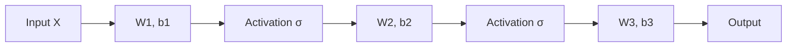

## Weight Matrices and Layer Representations

### Overview

Neural network layers are fundamentally linear algebra operations composed with nonlinear functions. Understanding how weight matrices structure data transformations, and how their dimensions and properties relate to layer representations, is foundational to reasoning about model architecture, capacity, and computational cost.

### The Linear Layer as Matrix Transformation

**Key Points**
- A fully connected (dense) layer computes an affine transformation of its input: $y = Wx + b$, where $W$ is the weight matrix, $x$ is the input vector, $b$ is the bias vector, and $y$ is the output vector.
- If the input has dimension $n$ and the output has dimension $m$, then $W \in \mathbb{R}^{m \times n}$, $x \in \mathbb{R}^n$, $b \in \mathbb{R}^m$, and $y \in \mathbb{R}^m$.
- Each row of $W$ defines a linear functional applied to the input, and each output entry $y_i$ is a weighted sum of all input entries plus a bias term.

**Example**

For a layer mapping a 4-dimensional input to a 3-dimensional output:

$$W \in \mathbb{R}^{3 \times 4}, \quad x \in \mathbb{R}^4, \quad y = Wx + b \in \mathbb{R}^3$$

$$\begin{pmatrix} y_1 \\ y_2 \\ y_3 \end{pmatrix} = \begin{pmatrix} w_{11} & w_{12} & w_{13} & w_{14} \\ w_{21} & w_{22} & w_{23} & w_{24} \\ w_{31} & w_{32} & w_{33} & w_{34} \end{pmatrix} \begin{pmatrix} x_1 \\ x_2 \\ x_3 \\ x_4 \end{pmatrix} + \begin{pmatrix} b_1 \\ b_2 \\ b_3 \end{pmatrix}$$

### Batched Representations

**Key Points**
- In practice, layers process batches of inputs simultaneously rather than single vectors, represented as a matrix $X \in \mathbb{R}^{N \times n}$ where $N$ is the batch size.
- The layer computation becomes $Y = XW^T + b$ (with broadcasting of $b$ across rows), producing $Y \in \mathbb{R}^{N \times m}$.
- [Inference] The exact convention for whether $W$ or $W^T$ is used, and whether inputs are row vectors or column vectors, differs by framework and implementation; this is not a universal standard.

### Weight Matrix Dimensions and Parameter Count

**Key Points**
- The number of trainable parameters in a dense layer's weight matrix is $m \times n$ (plus $m$ bias terms).
- Parameter count scales linearly with both input and output dimension, meaning very wide layers can contribute substantially to total model size.

**Example**

A layer transforming a 1000-dimensional input to a 500-dimensional output has:

$$1000 \times 500 = 500{,}000 \text{ weight parameters} + 500 \text{ bias parameters} = 500{,}500 \text{ total parameters}$$

### Weight Matrices as Learned Basis Transformations

**Key Points**
- [Inference] A weight matrix can be interpreted as projecting the input into a new representational space, where each output dimension corresponds to a learned direction or feature detector in the input space. This is a common conceptual framing but is not a formally proven universal description of what every trained network learns.
- The rows of $W$ can be viewed as the coordinates of learned "detector" vectors in input space; the output value $y_i$ measures the alignment (via dot product) between the input and the $i$-th row.
- [Speculation] Some researchers interpret individual rows or columns of trained weight matrices as corresponding to interpretable semantic features, but this interpretation does not hold reliably across all layers, architectures, or training regimes.

### Rank of Weight Matrices

**Key Points**
- The rank of $W$ determines the dimensionality of the output space that can actually be reached by the linear transformation, independent of the stated output dimension $m$.
- If $\text{rank}(W) < \min(m, n)$, the layer is rank-deficient, meaning it maps inputs into a lower-dimensional subspace of the nominal output space.
- [Inference] Rank deficiency in trained weight matrices has been observed empirically in some studies of neural networks, and is a motivating factor behind low-rank fine-tuning methods, but the prevalence and cause of rank deficiency varies across architectures and training conditions and is not universal.

### Layer Composition and Representational Depth

**Key Points**
- Stacking multiple linear layers without nonlinearity between them is mathematically equivalent to a single linear layer, since the composition of linear maps is itself linear: $W_2(W_1 x) = (W_2 W_1)x$.
- Nonlinear activation functions (ReLU, sigmoid, tanh, etc.) applied between layers are what allow deep networks to represent nonlinear functions; without them, depth adds no representational capacity beyond a single matrix.
- [Unverified] The specific expressive power gained from any particular nonlinearity or depth configuration depends on the function class being approximated and is an active area of theoretical research; no single characterization applies to all cases.

### Layer Representation Diagram

<svg xmlns="http://www.w3.org/2000/svg" viewBox="0 0 700 380">
  <text x="350" y="30" text-anchor="middle" font-size="18" font-weight="bold" fill="#1a1a1a">Linear Layer as Matrix Transformation (svg_diagram)</text>

  <rect x="40" y="150" width="90" height="120" fill="#dbe9f7" stroke="#4a90d9" stroke-width="2" />
  <text x="85" y="215" text-anchor="middle" font-size="14" fill="#1a1a1a">x</text>
  <text x="85" y="235" text-anchor="middle" font-size="11" fill="#555">(n × 1)</text>
  <text x="85" y="140" text-anchor="middle" font-size="12" fill="#333">Input Vector</text>

  <line x1="130" y1="210" x2="220" y2="210" stroke="#333" stroke-width="2" marker-end="url(#arrow1)" />

  <rect x="230" y="120" width="140" height="180" fill="#fbe3d4" stroke="#d98c4a" stroke-width="2" />
  <text x="300" y="215" text-anchor="middle" font-size="14" fill="#1a1a1a">W</text>
  <text x="300" y="235" text-anchor="middle" font-size="11" fill="#555">(m × n)</text>
  <text x="300" y="110" text-anchor="middle" font-size="12" fill="#333">Weight Matrix</text>

  <line x1="370" y1="210" x2="420" y2="210" stroke="#333" stroke-width="2" marker-end="url(#arrow1)" />
  <text x="395" y="195" text-anchor="middle" font-size="16" fill="#333">+b</text>

  <rect x="430" y="150" width="90" height="120" fill="#d9f0d4" stroke="#4ad97a" stroke-width="2" />
  <text x="475" y="215" text-anchor="middle" font-size="14" fill="#1a1a1a">y</text>
  <text x="475" y="235" text-anchor="middle" font-size="11" fill="#555">(m × 1)</text>
  <text x="475" y="140" text-anchor="middle" font-size="12" fill="#333">Output Vector</text>

  <line x1="520" y1="210" x2="580" y2="210" stroke="#333" stroke-width="2" marker-end="url(#arrow1)" />
  <text x="600" y="215" text-anchor="middle" font-size="13" fill="#555">σ(·)</text>

  <text x="350" y="330" text-anchor="middle" font-size="13" fill="#444">y = Wx + b, followed by nonlinear activation</text>

  </svg>

### Multi-Layer Representation Flow

### Weight Initialization and Representation Quality

**Key Points**
- Initial values of weight matrices affect training dynamics, including gradient flow through the network during backpropagation.
- Common initialization schemes (e.g., Xavier/Glorot initialization, He initialization) set initial weight variance based on layer dimensions to help maintain stable signal magnitude across layers.
- [Inference] Poor initialization is commonly associated with training difficulties such as vanishing or exploding gradients, particularly in deep networks, though the relationship between initialization and training outcomes also depends on architecture, activation function, and optimization method. This is not a guaranteed causal relationship in every case.

### Convolutional Layers as Structured Weight Matrices

**Key Points**
- Convolutional layers can be represented as a special case of matrix multiplication using a weight matrix with a specific sparse, structured pattern (e.g., a Toeplitz or block-Toeplitz structure), where many entries are shared (tied weights) and most entries are zero.
- This structure enforces translation invariance and local connectivity, in contrast to the fully dense weight matrices of standard linear layers.
- [Unverified] The exact im2col or similar matrix-construction techniques used to implement convolution as matrix multiplication vary by framework and hardware backend, and specific implementation details are not universal.

### Attention Layers and Weight Matrix Roles

**Key Points**
- Transformer attention mechanisms use several distinct weight matrices — commonly referred to as query ($W_Q$), key ($W_K$), and value ($W_V$) projection matrices — to transform input embeddings into different representational subspaces.
- These matrices project the same input into different spaces used for computing attention scores and weighted value aggregation, as originally described in the "Attention Is All You Need" architecture.
- [Inference] The specific dimensional choices for $W_Q$, $W_K$, and $W_V$ (often smaller than the model's full embedding dimension, particularly in multi-head attention) are architectural design choices rather than mathematical necessities, and vary across model implementations.

### Interpreting Layer Representations

**Key Points**
- The output of a layer, sometimes called a "hidden representation" or "activation," can be analyzed using linear algebra tools such as rank, norm, and principal component analysis to study what information is preserved or discarded.
- [Speculation] Techniques such as probing classifiers or representation similarity analysis (e.g., CKA — Centered Kernel Alignment) are used by some researchers to study what layers represent, but findings from such studies are specific to the models, tasks, and datasets examined and do not generalize as universal claims about all neural networks.
- I cannot verify claims about what any specific production model's internal weight matrices represent without direct access to that model's documented interpretability research.

### Weight Matrix Norms and Regularization

**Key Points**
- The Frobenius norm of a weight matrix, $\|W\|_F = \sqrt{\sum_{i,j} W_{ij}^2}$, is commonly used in regularization terms (e.g., L2/weight decay) to constrain the magnitude of weights during training.
- The spectral norm (largest singular value) of $W$ relates to the maximum factor by which the layer can amplify the norm of an input vector, which is relevant to analyses of network stability and robustness.
- [Inference] Regularization techniques based on weight norms are associated with reduced overfitting in some empirical studies, but this relationship depends on dataset, architecture, and regularization strength, and is not a guaranteed outcome in all training scenarios.

### Common Pitfalls

**Key Points**
- Assuming that increasing weight matrix dimensions always improves representational capacity in a way that improves task performance; larger matrices increase parameter count and computational cost, and [Inference] the relationship to generalization performance is task- and data-dependent, not automatic.
- Treating individual weight matrix entries or rows as directly interpretable "features" without empirical validation; this is a common but [Speculation]-level interpretation not universally supported.
- Confusing the nominal output dimension of a layer with its effective (rank-limited) representational capacity.
- Stacking linear layers without intervening nonlinearities under the mistaken assumption that this increases model expressiveness.

### Related Topics

- Singular Value Decomposition (SVD) applied to weight matrix analysis
- Low-rank adaptation (LoRA) and parameter-efficient fine-tuning
- Eigenvalues, spectral norms, and network stability analysis
- Backpropagation and gradient computation through matrix operations
- Weight initialization schemes (Xavier, He, orthogonal initialization)
- Convolution as matrix multiplication (im2col technique)
- Attention mechanisms and multi-head projection matrices
- Regularization techniques involving matrix norms

**Note:** This response contains multiple [Inference] and [Speculation]-labeled statements regarding interpretive and empirical claims about neural network behavior. These are not confirmed universal facts. Behavior of specific models or implementations is not guaranteed and may vary.
The previous response on **weight matrices and layer representations** was already complete — it ended with the Related Topics section and a closing note. There is no missing continuation.