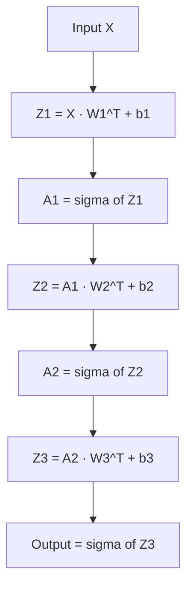

## Forward Propagation as Matrix Multiplication

### Overview

Forward propagation is the process by which input data passes through a neural network's layers to produce an output. Expressing this process in matrix form clarifies the computational structure of neural networks and connects directly to how these computations are implemented and optimized in practice.

### Single Layer Forward Pass

**Key Points**
- For a single layer, forward propagation computes $z = Wx + b$, followed by an elementwise nonlinear activation $a = \sigma(z)$.
- $W \in \mathbb{R}^{m \times n}$ is the weight matrix, $x \in \mathbb{R}^n$ is the input, $b \in \mathbb{R}^m$ is the bias, $z$ is the pre-activation (or "logit"), and $a$ is the post-activation output.
- The activation function $\sigma$ is applied elementwise to each entry of $z$.

**Example**

$$z = Wx + b, \quad a = \sigma(z)$$

For a layer with $W \in \mathbb{R}^{3\times4}$, $x \in \mathbb{R}^4$:

$$z = \begin{pmatrix} w_{11} & w_{12} & w_{13} & w_{14} \\ w_{21} & w_{22} & w_{23} & w_{24} \\ w_{31} & w_{32} & w_{33} & w_{34} \end{pmatrix}\begin{pmatrix}x_1\\x_2\\x_3\\x_4\end{pmatrix} + \begin{pmatrix}b_1\\b_2\\b_3\end{pmatrix}$$

### Multi-Layer Forward Propagation

**Key Points**
- Forward propagation through a network with $L$ layers applies this transformation repeatedly, with the output of one layer serving as the input to the next.
- For layer $\ell$: $z^{(\ell)} = W^{(\ell)} a^{(\ell-1)} + b^{(\ell)}$, and $a^{(\ell)} = \sigma^{(\ell)}(z^{(\ell)})$, with $a^{(0)} = x$ (the network input).
- The final layer's activation $a^{(L)}$ is the network's output, which may use a different activation function (e.g., softmax for classification) than intermediate layers.

$$a^{(0)} = x$$
$$z^{(1)} = W^{(1)}a^{(0)} + b^{(1)}, \quad a^{(1)} = \sigma(z^{(1)})$$
$$z^{(2)} = W^{(2)}a^{(1)} + b^{(2)}, \quad a^{(2)} = \sigma(z^{(2)})$$
$$\vdots$$
$$z^{(L)} = W^{(L)}a^{(L-1)} + b^{(L)}, \quad a^{(L)} = \sigma^{(L)}(z^{(L)})$$

### Batched Forward Propagation

**Key Points**
- In practice, forward propagation processes a batch of $N$ input examples simultaneously, represented as a matrix $X \in \mathbb{R}^{N \times n}$ rather than a single vector.
- The layer computation becomes $Z = XW^T + \mathbf{1}b^T$ (bias broadcast across all $N$ rows), producing $Z \in \mathbb{R}^{N \times m}$.
- [Unverified] The exact matrix orientation convention (row-major batch vs. column-major batch, and whether $W$ or $W^T$ is used) differs across frameworks such as PyTorch, TensorFlow, and NumPy-based implementations, and no single convention is universal.

### Computational Cost of Forward Propagation

**Key Points**
- For a single layer with $W \in \mathbb{R}^{m \times n}$ applied to a batch of size $N$, the matrix multiplication $XW^T$ requires $O(Nmn)$ scalar multiply-add operations.
- Total forward propagation cost across $L$ layers is the sum of costs across all layers, dominated by the largest weight matrices in the network.
- [Inference] In many common architectures, the majority of forward propagation compute is concentrated in a small number of large matrix multiplication operations, though the exact distribution of cost depends on the specific architecture (e.g., convolutional vs. fully connected vs. attention-based).

### Forward Propagation Flow Diagram

### Matrix Dimension Tracking Across Layers

**Key Points**
- Correct forward propagation requires that matrix dimensions align at every layer boundary: the number of columns in $W^{(\ell)}$ must match the dimension of $a^{(\ell-1)}$.
- Dimension mismatches are among the most common implementation errors when building neural networks manually, since each layer's output dimension determines constraints on the next layer's weight matrix shape.

**Example**

| Layer | Input dim | Weight shape $W$ | Output dim |
|---|---|---|---|
| 1 | 784 | 784 × 256 (or 256×784 depending on convention) | 256 |
| 2 | 256 | 256 × 128 | 128 |
| 3 | 128 | 128 × 10 | 10 |

[Inference] This example reflects a common convention for illustrative purposes; actual shape ordering depends on the specific framework used.

### Layer Composition Diagram

<svg xmlns="http://www.w3.org/2000/svg" viewBox="0 0 700 300">
  <text x="350" y="30" text-anchor="middle" font-size="18" font-weight="bold" fill="#1a1a1a">Forward Propagation Pipeline (svg_diagram)</text>

  <rect x="30" y="120" width="80" height="60" fill="#dbe9f7" stroke="#4a90d9" stroke-width="2" />
  <text x="70" y="155" text-anchor="middle" font-size="13" fill="#1a1a1a">X</text>

  <line x1="110" y1="150" x2="160" y2="150" stroke="#333" stroke-width="2" marker-end="url(#arrowfp)" />

  <rect x="170" y="100" width="110" height="100" fill="#fbe3d4" stroke="#d98c4a" stroke-width="2" />
  <text x="225" y="145" text-anchor="middle" font-size="13" fill="#1a1a1a">W1, b1</text>
  <text x="225" y="165" text-anchor="middle" font-size="11" fill="#555">+ σ</text>

  <line x1="280" y1="150" x2="330" y2="150" stroke="#333" stroke-width="2" marker-end="url(#arrowfp)" />

  <rect x="340" y="100" width="110" height="100" fill="#fbe3d4" stroke="#d98c4a" stroke-width="2" />
  <text x="395" y="145" text-anchor="middle" font-size="13" fill="#1a1a1a">W2, b2</text>
  <text x="395" y="165" text-anchor="middle" font-size="11" fill="#555">+ σ</text>

  <line x1="450" y1="150" x2="500" y2="150" stroke="#333" stroke-width="2" marker-end="url(#arrowfp)" />

  <rect x="510" y="100" width="110" height="100" fill="#fbe3d4" stroke="#d98c4a" stroke-width="2" />
  <text x="565" y="145" text-anchor="middle" font-size="13" fill="#1a1a1a">W3, b3</text>
  <text x="565" y="165" text-anchor="middle" font-size="11" fill="#555">+ σ</text>

  <line x1="620" y1="150" x2="660" y2="150" stroke="#333" stroke-width="2" marker-end="url(#arrowfp)" />
  <text x="660" y="145" text-anchor="middle" font-size="12" fill="#333">ŷ</text>

  </svg>

### Vectorization and Efficiency

**Key Points**
- Expressing forward propagation as matrix multiplication (rather than looping over individual neurons or examples) allows implementations to leverage optimized linear algebra libraries (BLAS, cuBLAS) and hardware parallelism.
- [Inference] Vectorized matrix-based implementations are commonly reported to be substantially faster than naive elementwise loop implementations on the same hardware, though the exact speedup factor depends on hardware, matrix size, and implementation details, and no universal multiplier applies.
- I do not have access to specific, verified benchmark numbers comparing vectorized versus loop-based forward propagation for arbitrary hardware/software combinations, so no specific performance figures are stated here.

### Activation Functions and Nonlinearity Placement

**Key Points**
- The nonlinear activation function is applied after the matrix multiplication and bias addition at each layer, elementwise to $z^{(\ell)}$.
- Common activation functions include ReLU ($\sigma(z) = \max(0, z)$), sigmoid ($\sigma(z) = 1/(1+e^{-z})$), and tanh.
- Without nonlinear activations between layers, the composition of multiple linear layers collapses mathematically into a single linear transformation, since $W_2(W_1x) = (W_2W_1)x$.

### Output Layer Considerations

**Key Points**
- The final layer's activation function is typically chosen based on the task: softmax for multi-class classification, sigmoid for binary classification, or no activation (identity) for regression tasks.
- The softmax function converts the final layer's raw output vector into a probability distribution: $\text{softmax}(z)_i = \dfrac{e^{z_i}}{\sum_j e^{z_j}}$.
- [Unverified] Specific output layer conventions vary across tasks, frameworks, and loss function implementations (e.g., some frameworks combine softmax and cross-entropy loss internally rather than applying softmax as a separate explicit layer), and this is not a universal implementation detail.

### Relationship to Backpropagation

**Key Points**
- Forward propagation computes and stores intermediate values ($z^{(\ell)}$ and $a^{(\ell)}$ at each layer), which are subsequently required during backpropagation to compute gradients via the chain rule.
- [Inference] Memory usage during training is commonly associated with the need to retain these intermediate activations for the backward pass, which is a motivating factor behind techniques such as gradient checkpointing, though the specific memory-versus-compute tradeoffs depend on implementation and are not elaborated further here.

### Common Pitfalls

**Key Points**
- Mismatched matrix dimensions between consecutive layers, causing implementation errors.
- Omitting or misplacing the nonlinear activation function, which can cause a deep network to behave equivalently to a single linear layer.
- Confusing pre-activation values ($z$) with post-activation values ($a$) when implementing or debugging forward propagation manually.
- Assuming a specific matrix orientation convention (row-vector vs. column-vector inputs) without verifying the convention used by the specific framework or codebase in use.

### Related Topics

- Backpropagation and gradient computation via the chain rule
- Activation functions and their derivatives
- Weight matrices and layer representations
- Computational graphs and automatic differentiation
- Batch processing and vectorized computation
- Efficient matrix multiplication algorithms
- Gradient checkpointing and memory-efficient training

**Note:** This response contains [Inference] and [Unverified] labeled statements regarding implementation conventions, performance characteristics, and framework-specific behavior. These are not confirmed universal facts, and behavior of specific systems or libraries is not guaranteed and may vary by version, hardware, and configuration.