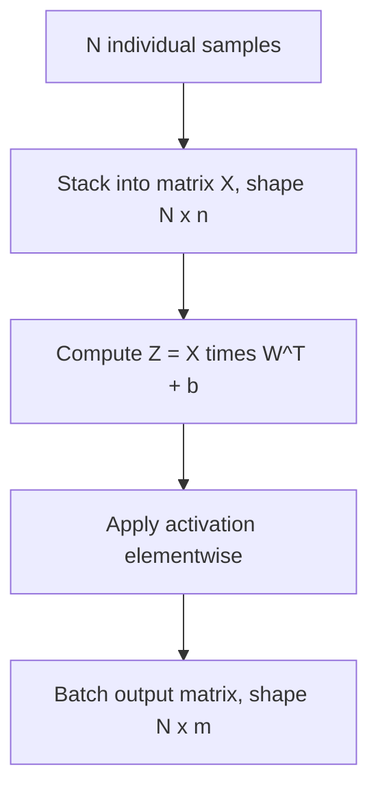

## Batch Processing with Matrices

### Overview

Batch processing refers to applying a computation simultaneously to multiple data samples by organizing them into a matrix rather than processing each sample individually through separate vector operations. This is a core practice in machine learning for both computational efficiency and training stability.

### From Single Sample to Batch Representation

**Key Points**
- A single input sample is typically represented as a vector $x \in \mathbb{R}^n$.
- A batch of $N$ samples is represented as a matrix $X \in \mathbb{R}^{N \times n}$, where each row corresponds to one sample.
- This reorganization allows a single matrix multiplication to compute the layer output for all samples in the batch at once.

**Example**

$$X = \begin{pmatrix} x_1^{(1)} & x_2^{(1)} & \cdots & x_n^{(1)} \\ x_1^{(2)} & x_2^{(2)} & \cdots & x_n^{(2)} \\ \vdots & \vdots & \ddots & \vdots \\ x_1^{(N)} & x_2^{(N)} & \cdots & x_n^{(N)} \end{pmatrix}$$

Each row $i$ represents sample $i$'s feature vector.

### Batched Linear Layer Computation

**Key Points**
- For a layer with weight matrix $W \in \mathbb{R}^{m \times n}$ and bias $b \in \mathbb{R}^m$, the batched forward computation is $Z = XW^T + \mathbf{1}b^T$, where $\mathbf{1}$ is an $N \times 1$ column of ones used to broadcast $b$ across all rows.
- The result $Z \in \mathbb{R}^{N \times m}$ contains the pre-activation output for every sample in the batch simultaneously.
- [Unverified] The precise matrix orientation convention ($XW^T$ versus $WX^T$ versus other layouts) differs across frameworks and is not standardized universally; this description reflects one common convention only.

### Why Batching Improves Computational Efficiency

**Key Points**
- Processing $N$ samples as a single matrix multiplication allows optimized linear algebra libraries (BLAS, cuBLAS) to exploit vectorization, cache locality, and hardware parallelism more effectively than looping over $N$ separate vector-matrix multiplications.
- [Inference] Batched matrix multiplication is commonly reported to achieve higher hardware utilization than sequential per-sample processing on the same hardware, though the magnitude of this effect depends on hardware, batch size, and matrix dimensions, and no universal speedup factor applies.
- I cannot verify specific benchmark figures for batching speedups without a cited, verifiable source, so no numeric claims are made here.

### Batch Size and Memory Tradeoffs

**Key Points**
- Larger batch sizes increase memory requirements, since intermediate activations for every sample in the batch must be stored, particularly for use in backpropagation.
- [Inference] Selection of batch size in practice often involves balancing available hardware memory against desired computational throughput, though optimal batch size also depends on factors such as model architecture and optimization dynamics; this is a general association, not a fixed rule.
- [Speculation] Some practitioners associate certain batch size ranges with different generalization outcomes, but this relationship is not settled and depends heavily on the specific model, dataset, and optimizer used. This should not be treated as an established fact.

### Batch Processing Flow Diagram

### Broadcasting the Bias Term

**Key Points**
- The bias vector $b \in \mathbb{R}^m$ must be added to every row of the $N \times m$ matrix $Z$, which requires broadcasting rather than standard matrix addition (since dimensions $N \times m$ and $m \times 1$ do not match directly under standard matrix addition rules).
- Broadcasting conceptually replicates $b$ across all $N$ rows before elementwise addition, though [Unverified] the specific memory-level implementation (explicit replication versus implicit broadcasting) varies by numerical library and is not elaborated further here.

**Example**

$$Z + \mathbf{1}b^T = \begin{pmatrix} z_{11} & z_{12} & z_{13} \\ z_{21} & z_{22} & z_{23} \end{pmatrix} + \begin{pmatrix} b_1 & b_2 & b_3 \\ b_1 & b_2 & b_3 \end{pmatrix}$$

### Batch Matrix Multiplication (3D Tensors)

**Key Points**
- Some operations, such as those in attention mechanisms or recurrent architectures, require multiplying corresponding matrix pairs across a batch dimension, rather than multiplying a batch matrix by a single shared weight matrix.
- This is often implemented using batch matrix multiplication operations (e.g., `torch.bmm` or `tf.linalg.matmul` with batch dimensions), which operate on 3D tensors of shape $(N, p, q)$ and $(N, q, r)$ to produce $(N, p, r)$.
- [Unverified] The exact internal implementation of batch matrix multiplication (e.g., whether it is executed as a loop over 2D multiplications or a specialized batched kernel) is hardware- and library-specific and is not detailed here.

### Batch Matrix Multiplication Diagram

<svg xmlns="http://www.w3.org/2000/svg" viewBox="0 0 700 320">
  <text x="350" y="30" text-anchor="middle" font-size="18" font-weight="bold" fill="#1a1a1a">Batch Matrix Multiplication (svg_diagram)</text>

  <rect x="40" y="80" width="150" height="70" fill="#dbe9f7" stroke="#4a90d9" stroke-width="2" />
  <text x="115" y="120" text-anchor="middle" font-size="13" fill="#1a1a1a">Batch A: (N, p, q)</text>

  <rect x="40" y="170" width="150" height="70" fill="#dbe9f7" stroke="#4a90d9" stroke-width="2" opacity="0.6" />
  <text x="115" y="210" text-anchor="middle" font-size="11" fill="#1a1a1a">sample slices</text>

  <text x="230" y="150" text-anchor="middle" font-size="20" fill="#333">×</text>

  <rect x="270" y="80" width="150" height="70" fill="#fbe3d4" stroke="#d98c4a" stroke-width="2" />
  <text x="345" y="120" text-anchor="middle" font-size="13" fill="#1a1a1a">Batch B: (N, q, r)</text>

  <rect x="270" y="170" width="150" height="70" fill="#fbe3d4" stroke="#d98c4a" stroke-width="2" opacity="0.6" />
  <text x="345" y="210" text-anchor="middle" font-size="11" fill="#1a1a1a">sample slices</text>

  <text x="460" y="150" text-anchor="middle" font-size="20" fill="#333">=</text>

  <rect x="500" y="80" width="150" height="70" fill="#d9f0d4" stroke="#4ad97a" stroke-width="2" />
  <text x="575" y="120" text-anchor="middle" font-size="13" fill="#1a1a1a">Result: (N, p, r)</text>

  <rect x="500" y="170" width="150" height="70" fill="#d9f0d4" stroke="#4ad97a" stroke-width="2" opacity="0.6" />
  <text x="575" y="210" text-anchor="middle" font-size="11" fill="#1a1a1a">per-sample outputs</text>

  <text x="350" y="280" text-anchor="middle" font-size="12" fill="#555">Each of the N slices is multiplied independently, batched into one operation</text>
</svg>

### Batching in Gradient Computation

**Key Points**
- During backpropagation, gradients are also computed in batched matrix form, with per-sample gradients typically aggregated (e.g., averaged or summed) across the batch dimension to produce a single parameter update.
- [Inference] The choice between averaging and summing gradients across a batch affects the effective learning rate relative to batch size, though the specific practical impact depends on the optimizer and learning rate schedule used, and this is not elaborated further here.

### Batching Across Different Architectures

**Key Points**
- Fully connected layers batch naturally along a single sample dimension, as described above.
- Convolutional layers batch across a 4D tensor structure, typically $(N, C, H, W)$ or $(N, H, W, C)$ depending on framework convention, where $N$ is batch size, $C$ is channels, and $H, W$ are spatial dimensions.
- Sequence models (RNNs, transformers) batch across a 3D tensor structure, typically $(N, T, d)$, where $T$ is sequence length and $d$ is feature dimension.
- [Unverified] Exact tensor dimension ordering conventions differ across frameworks (e.g., PyTorch vs. TensorFlow defaults), and no single ordering is universal across all libraries and versions.

### Padding and Variable-Length Sequences in Batches

**Key Points**
- When batching sequences of different lengths (e.g., in natural language processing), shorter sequences are typically padded to match the length of the longest sequence in the batch so that a uniform matrix or tensor shape can be formed.
- Padding introduces the need for masking mechanisms during computation, so that padded positions do not improperly influence outputs such as attention scores or loss values.
- [Inference] Improper masking of padded values is associated with incorrect model behavior in some documented cases, though the specific failure modes depend on the architecture and task, and this is a general association rather than a guaranteed outcome in all implementations.

### Common Pitfalls

**Key Points**
- Mismatched batch dimensions between input data and weight matrices, leading to broadcasting errors or silent incorrect computation.
- Forgetting to apply masking when batching variable-length sequences, which [Inference] is associated with degraded or incorrect model outputs in some reported cases, though this is not a guaranteed outcome in every implementation.
- Selecting a batch size without considering hardware memory constraints, which can cause out-of-memory errors during training.
- Confusing per-sample gradient aggregation conventions (sum vs. mean), which can unintentionally alter the effective learning rate.

### Related Topics

- Forward propagation as matrix multiplication
- Backpropagation and gradient computation
- Tensor operations and higher-dimensional array structures
- Attention mechanisms and batched matrix multiplication
- Memory management and hardware constraints in training
- Sequence padding and masking techniques
- Efficient matrix multiplication algorithms

**Note:** I cannot verify specific benchmark figures, framework-default conventions, or universal implementation details referenced in this content without a citable source. Statements labeled [Inference] or [Speculation] reflect reasoning or commonly discussed associations, not confirmed facts, and behavior of specific systems, libraries, or models is not guaranteed and may vary by version, hardware, and configuration.