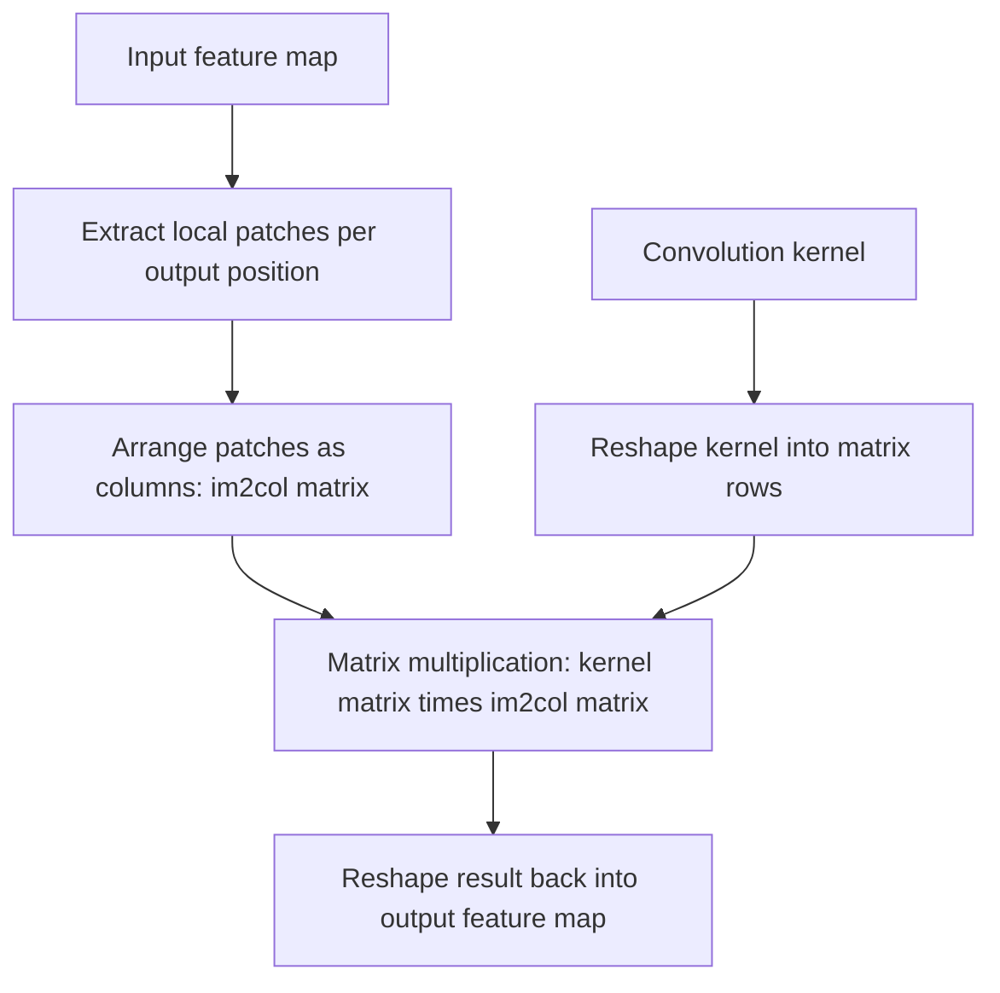

## Convolution as a Linear Operation

### Overview

Convolution, as used in convolutional neural networks, can be formally expressed as a linear transformation representable by matrix multiplication. This connection allows convolution to be analyzed using the same linear algebra tools applied to fully connected layers, while highlighting the structural constraints that distinguish convolutional weight matrices from dense ones.

### Convolution as a Structured Matrix Multiplication

**Key Points**
- Any discrete convolution operation can be rewritten as $y = Cx$, where $x$ is the flattened input, $y$ is the flattened output, and $C$ is a matrix constructed from the convolutional kernel.
- The matrix $C$ has a specific structured sparsity pattern: most entries are zero, and the nonzero entries repeat the same kernel values across different positions (tied weights).
- This structure is commonly referred to as a Toeplitz matrix (for 1D convolution) or a block-Toeplitz matrix (for 2D convolution).

**Example**

For a 1D input $x = (x_1, x_2, x_3, x_4)$ and a kernel $k = (k_1, k_2)$ applied with stride 1 (no padding), the convolution output $y = (y_1, y_2, y_3)$ can be written as:

$$\begin{pmatrix} y_1 \\ y_2 \\ y_3 \end{pmatrix} = \begin{pmatrix} k_1 & k_2 & 0 & 0 \\ 0 & k_1 & k_2 & 0 \\ 0 & 0 & k_1 & k_2 \end{pmatrix} \begin{pmatrix} x_1 \\ x_2 \\ x_3 \\ x_4 \end{pmatrix}$$

Each row of $C$ contains the same two kernel values $k_1, k_2$, shifted by one position from the row above.

### Weight Sharing and Sparsity

**Key Points**
- Two structural properties distinguish the convolution matrix $C$ from a general dense weight matrix: sparsity (most entries are zero) and weight sharing (the nonzero entries reuse the same small set of kernel parameters across all positions).
- These properties reduce the number of learnable parameters dramatically compared to a fully connected layer of equivalent input and output size.
- [Inference] This parameter reduction is commonly associated with convolutional networks' effectiveness on grid-structured data such as images, though the full explanation for this effectiveness also involves factors such as translation invariance and locality, and is an active area of study rather than a fully settled matter.

### Locality and Receptive Field

**Key Points**
- Each row of the convolution matrix $C$ has nonzero entries only in a limited range of columns, reflecting the fact that each output value depends only on a local neighborhood of the input (the kernel's receptive field), not the entire input.
- As layers are stacked, the effective receptive field of deeper layers with respect to the original input grows, since each layer's output depends on local regions of the previous layer's output.
- [Unverified] The precise mathematical formula for effective receptive field size depends on kernel size, stride, dilation, and padding at every preceding layer, and is not restated here as a general formula without specifying these parameters.

### Convolution Matrix Construction Diagram

<svg xmlns="http://www.w3.org/2000/svg" viewBox="0 0 700 380">
  <text x="350" y="30" text-anchor="middle" font-size="18" font-weight="bold" fill="#1a1a1a">Convolution as Toeplitz Matrix (svg_diagram)</text>

  <text x="150" y="70" text-anchor="middle" font-size="13" fill="#333">Kernel k = (k1, k2)</text>
  <rect x="90" y="80" width="50" height="30" fill="#fbe3d4" stroke="#d98c4a" stroke-width="2" />
  <text x="115" y="100" text-anchor="middle" font-size="12" fill="#1a1a1a">k1</text>
  <rect x="140" y="80" width="50" height="30" fill="#fbe3d4" stroke="#d98c4a" stroke-width="2" />
  <text x="165" y="100" text-anchor="middle" font-size="12" fill="#1a1a1a">k2</text>

  <text x="350" y="150" text-anchor="middle" font-size="13" fill="#333">Toeplitz Matrix C</text>
  <g transform="translate(200,160)">
    <rect x="0" y="0" width="300" height="120" fill="none" stroke="#333" stroke-width="1.5" />

    <rect x="0" y="0" width="75" height="40" fill="#dbe9f7" stroke="#4a90d9" />
    <text x="37" y="25" text-anchor="middle" font-size="12">k1</text>
    <rect x="75" y="0" width="75" height="40" fill="#dbe9f7" stroke="#4a90d9" />
    <text x="112" y="25" text-anchor="middle" font-size="12">k2</text>
    <rect x="150" y="0" width="75" height="40" fill="#f0f0f0" stroke="#999" />
    <text x="187" y="25" text-anchor="middle" font-size="12">0</text>
    <rect x="225" y="0" width="75" height="40" fill="#f0f0f0" stroke="#999" />
    <text x="262" y="25" text-anchor="middle" font-size="12">0</text>

    <rect x="0" y="40" width="75" height="40" fill="#f0f0f0" stroke="#999" />
    <text x="37" y="65" text-anchor="middle" font-size="12">0</text>
    <rect x="75" y="40" width="75" height="40" fill="#dbe9f7" stroke="#4a90d9" />
    <text x="112" y="65" text-anchor="middle" font-size="12">k1</text>
    <rect x="150" y="40" width="75" height="40" fill="#dbe9f7" stroke="#4a90d9" />
    <text x="187" y="65" text-anchor="middle" font-size="12">k2</text>
    <rect x="225" y="40" width="75" height="40" fill="#f0f0f0" stroke="#999" />
    <text x="262" y="65" text-anchor="middle" font-size="12">0</text>

    <rect x="0" y="80" width="75" height="40" fill="#f0f0f0" stroke="#999" />
    <text x="37" y="105" text-anchor="middle" font-size="12">0</text>
    <rect x="75" y="80" width="75" height="40" fill="#f0f0f0" stroke="#999" />
    <text x="112" y="105" text-anchor="middle" font-size="12">0</text>
    <rect x="150" y="80" width="75" height="40" fill="#dbe9f7" stroke="#4a90d9" />
    <text x="187" y="105" text-anchor="middle" font-size="12">k1</text>
    <rect x="225" y="80" width="75" height="40" fill="#dbe9f7" stroke="#4a90d9" />
    <text x="262" y="105" text-anchor="middle" font-size="12">k2</text>
  </g>

  <text x="350" y="330" text-anchor="middle" font-size="12" fill="#555">Diagonal stripes of repeated kernel values; zero elsewhere (Toeplitz structure)</text>
</svg>

### The im2col Technique

**Key Points**
- A widely used implementation strategy, known as im2col ("image to column"), rearranges local input patches into columns of a matrix, so that convolution can be computed as a single dense matrix multiplication between the rearranged input and a reshaped kernel matrix.
- This transforms the convolution operation into a form directly compatible with highly optimized general matrix multiplication (GEMM) routines from BLAS libraries.
- [Unverified] The specific im2col implementation details, memory overhead, and whether a given framework or hardware backend uses im2col versus an alternative algorithm (such as direct convolution or Winograd-based convolution) vary by library, version, and hardware target, and are not detailed further here.

### im2col Transformation Flow

### 2D Convolution and Multi-Channel Structure

**Key Points**
- For multi-channel inputs (such as RGB images), each output channel is computed as a sum of convolutions across all input channels, which can be expressed as a block-structured matrix multiplication where each block corresponds to a channel-to-channel kernel.
- The full convolutional layer weight tensor has shape $(C_{out}, C_{in}, k_h, k_w)$ in common conventions, where $C_{out}$ is output channels, $C_{in}$ is input channels, and $k_h, k_w$ are kernel spatial dimensions.
- [Unverified] The exact tensor dimension ordering (e.g., channels-first vs. channels-last) differs by framework default and hardware backend, and no single ordering is universal.

### Convolution Theorem and Frequency Domain Connection

**Key Points**
- Convolution in the spatial domain corresponds to elementwise multiplication in the frequency domain, a relationship formalized by the convolution theorem and connected to the Fourier transform.
- This relationship is the mathematical basis for FFT-based convolution algorithms, which can reduce computational complexity for certain kernel and input sizes compared to direct spatial convolution.
- [Unverified] Whether FFT-based convolution is faster than direct or im2col-based convolution in a specific practical setting depends on kernel size, input size, and hardware, and no general performance ranking is stated here without those specifics.

### Stride, Padding, and Dilation as Matrix Structure Modifiers

**Key Points**
- Stride affects which rows of the equivalent convolution matrix $C$ are retained, effectively subsampling the output.
- Padding affects the size of the input vector $x$ (via added zero entries) before the matrix multiplication is applied, changing the matrix's column dimension.
- Dilation affects the spacing between nonzero kernel entries within each row of $C$, spreading the receptive field without increasing the number of kernel parameters.
- [Inference] These parameters are commonly described as jointly determining output spatial dimensions via a standard formula, but the exact formula depends on the specific combination of parameters used and is not restated here in general form to avoid presenting an incomplete or context-free equation as universally applicable.

### Transposed Convolution as Matrix Transpose

**Key Points**
- Transposed convolution (sometimes called "deconvolution," though this term is technically imprecise) can be expressed using the transpose of the convolution matrix $C^T$, applied to map from a smaller spatial dimension back to a larger one.
- This operation is commonly used in architectures requiring upsampling, such as certain image segmentation or generative models.
- [Inference] The relationship $C^T$ is a mathematical description of the linear operation's structure; it does not imply that transposed convolution exactly reverses or inverts the original convolution operation in an information-preserving sense, since the original convolution matrix $C$ is generally not invertible.

### Common Pitfalls

**Key Points**
- Assuming convolution is a fundamentally different mathematical operation from matrix multiplication, rather than recognizing it as a structured, sparse, weight-shared special case of a linear transformation.
- Confusing transposed convolution with true mathematical inversion of the original convolution, which is generally not the case since most convolution matrices are non-square and non-invertible.
- Overlooking how stride, padding, and dilation alter the effective matrix structure, leading to incorrect assumptions about output dimensions.
- Assuming a single universal implementation strategy (im2col, direct convolution, FFT-based, or Winograd-based) is always used, when in practice the method varies by framework, hardware, and configuration. [Unverified]

### Related Topics

- Weight matrices and layer representations
- Efficient matrix multiplication algorithms
- Toeplitz and structured matrices in numerical linear algebra
- Fourier transform and frequency-domain signal processing
- Forward propagation as matrix multiplication
- Receptive field analysis in convolutional networks
- Transposed convolution and upsampling techniques

I cannot verify specific framework implementation choices, performance comparisons, or hardware-dependent behavior referenced in this content beyond what is stated above. Statements labeled [Inference] or [Speculation] reflect reasoning or commonly discussed associations, not confirmed facts. Behavior of specific systems, libraries, models, or frameworks is not guaranteed and may vary by version, hardware, and configuration.