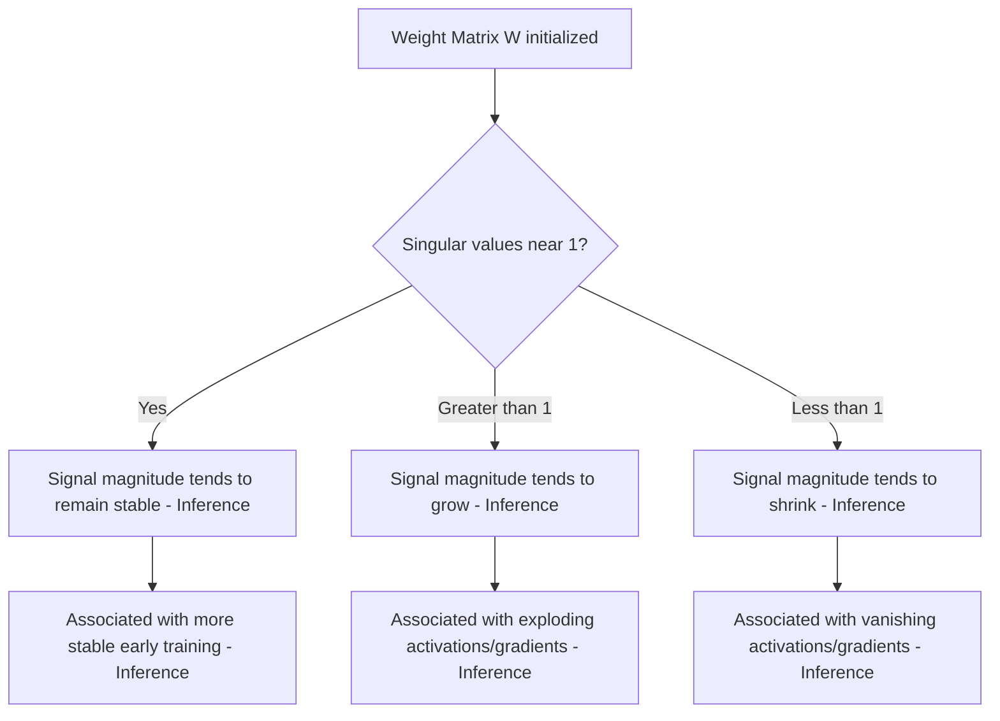

## Weight Initialization and Matrix Properties

### Overview

Weight initialization determines the starting values of a neural network's weight matrices before training begins. The statistical and structural properties of these initial matrices influence early training dynamics, including how signals and gradients propagate through the network. This topic connects directly to linear algebra concepts such as variance, eigenvalues, and matrix norms.

### Why Initialization Matters

**Key Points**
- Weight matrices cannot be initialized to all zeros in most architectures, because this would cause all neurons in a layer to receive identical gradients during backpropagation, preventing them from learning distinct features. This phenomenon is commonly referred to as a symmetry problem.
- [Inference] Poor initialization is associated with training difficulties such as vanishing or exploding signal magnitudes across layers, though the relationship between initialization and training outcomes also depends on network depth, activation function, and optimization method. This is not a guaranteed causal relationship in every case.
- I cannot verify claims about the exact quantitative impact of any specific initialization scheme on any particular production model's training outcome without a citable source.

### Random Initialization and Variance Control

**Key Points**
- Most initialization schemes draw weight values randomly from a probability distribution (commonly uniform or Gaussian), with the variance of that distribution chosen based on layer dimensions.
- Controlling variance is intended to keep the magnitude of activations and gradients roughly stable as signals pass through many layers, rather than growing or shrinking uncontrollably.
- [Unverified] The specific numeric variance target considered "stable" depends on the activation function, layer width, and network depth, and no single variance value applies universally across all architectures.

### Xavier (Glorot) Initialization

**Key Points**
- Xavier initialization, introduced by Glorot and Bengio, sets the variance of weights based on both the number of input units ($n_{in}$) and output units ($n_{out}$) of a layer.
- A common form of the variance formula is:

$$\text{Var}(W) = \frac{2}{n_{in} + n_{out}}$$

- [Unverified] The exact formula variant (uniform vs. normal distribution version, and whether $n_{in}$, $n_{out}$, or their sum/average is used) differs slightly across sources and framework implementations, and this response does not assert one specific version as the sole correct standard.
- This method is commonly associated with activation functions such as tanh or sigmoid. [Inference] This association is based on the original derivation assuming approximately linear activation behavior near zero, but actual suitability depends on the specific activation function and architecture used.

### He Initialization

**Key Points**
- He initialization, introduced by He et al., sets weight variance based primarily on the number of input units, and was developed with ReLU-family activation functions in mind.
- A common form of the variance formula is:

$$\text{Var}(W) = \frac{2}{n_{in}}$$

- [Unverified] As with Xavier initialization, exact formula variants exist across sources and frameworks, and this response does not assert a single universal version.
- [Inference] He initialization is commonly used in networks with ReLU or related activation functions, based on accounting for the fact that ReLU zeroes out roughly half of its inputs, though the precise benefit in any specific network depends on architecture and training configuration.

### Initialization Formula Comparison Table

| Scheme | Variance Formula | Commonly Associated Activation |
|---|---|---|
| Xavier/Glorot | $2/(n_{in}+n_{out})$ [Unverified exact variant] | tanh, sigmoid [Inference] |
| He | $2/n_{in}$ [Unverified exact variant] | ReLU family [Inference] |
| LeCun | $1/n_{in}$ [Unverified exact variant] | SELU, tanh [Inference] |

### Eigenvalues and Signal Propagation

**Key Points**
- The eigenvalues of a weight matrix (or more precisely, the singular values, since weight matrices are often non-square) relate to how the matrix scales vectors during forward and backward passes.
- If singular values are consistently much greater than 1, repeated matrix multiplication across layers can cause signal magnitudes to grow rapidly (associated with exploding activations or gradients).
- If singular values are consistently much less than 1, repeated matrix multiplication can cause signal magnitudes to shrink toward zero (associated with vanishing activations or gradients).
- [Inference] This eigenvalue/singular-value-based explanation is a commonly cited theoretical framework for understanding vanishing and exploding gradients, but actual training dynamics in specific networks depend on additional factors including activation functions, normalization layers, and optimizer behavior, so this framework does not fully explain every observed case.

### Signal Propagation Diagram

<svg xmlns="http://www.w3.org/2000/svg" viewBox="0 0 700 320">
  <text x="350" y="30" text-anchor="middle" font-size="18" font-weight="bold" fill="#1a1a1a">Singular Values and Signal Propagation (svg_diagram)</text>

  <text x="150" y="70" text-anchor="middle" font-size="13" fill="#333">Singular values &gt; 1</text>
  <line x1="60" y1="90" x2="240" y2="90" stroke="#333" stroke-width="1.5" />
  <line x1="60" y1="90" x2="60" y2="230" stroke="#333" stroke-width="1.5" />
  <path d="M 60 220 Q 120 190 180 130 Q 210 100 240 70" stroke="#d94a4a" stroke-width="3" fill="none" />
  <text x="150" y="250" text-anchor="middle" font-size="11" fill="#d94a4a">Signal magnitude grows (associated with exploding)</text>

  <text x="550" y="70" text-anchor="middle" font-size="13" fill="#333">Singular values &lt; 1</text>
  <line x1="460" y1="90" x2="640" y2="90" stroke="#333" stroke-width="1.5" />
  <line x1="460" y1="90" x2="460" y2="230" stroke="#333" stroke-width="1.5" />
  <path d="M 460 130 Q 520 180 580 210 Q 610 220 640 226" stroke="#4a90d9" stroke-width="3" fill="none" />
  <text x="550" y="250" text-anchor="middle" font-size="11" fill="#4a90d9">Signal magnitude shrinks (associated with vanishing)</text>

  <text x="350" y="290" text-anchor="middle" font-size="11" fill="#555">[Inference] Illustrative simplification; actual dynamics depend on additional network factors</text>
</svg>

### Orthogonal Initialization

**Key Points**
- Orthogonal initialization sets weight matrices such that $W^TW = I$ (for appropriately shaped matrices), meaning the matrix's singular values are all equal to 1.
- [Inference] This property is intended to preserve vector norms exactly under the linear transformation (before activation is applied), which some sources associate with more stable signal propagation in deep or recurrent networks, though the practical benefit depends on network architecture, depth, and the nonlinearities used, and is not guaranteed in all cases.
- [Unverified] The specific algorithms used to generate orthogonal matrices for initialization (e.g., QR decomposition of a random Gaussian matrix) vary by implementation and are not detailed further here.

### Fan-in and Fan-out

**Key Points**
- "Fan-in" refers to the number of input connections to a given layer or neuron ($n_{in}$), and "fan-out" refers to the number of output connections ($n_{out}$).
- These quantities directly determine the shape of the weight matrix and are the primary parameters used in variance-scaling initialization schemes such as Xavier and He initialization.
- [Inference] Some initialization schemes and framework default settings use only fan-in, only fan-out, or a combination of both, and the choice among these is architecture- and framework-dependent rather than governed by a single universal rule.

### Bias Initialization

**Key Points**
- Bias vectors are commonly initialized to zero, since the symmetry-breaking concern that applies to weight matrices does not apply in the same way to biases (as long as weights are already randomly initialized).
- [Unverified] Some specific architectures or layer types use non-zero bias initialization (for example, certain gating mechanisms in LSTM architectures have been described as using non-zero forget-gate bias initialization in some sources), but this response does not confirm specific values without a citable source.

### Initialization in Practice: Framework Defaults

**Key Points**
- Deep learning frameworks provide built-in initialization functions corresponding to schemes such as Xavier and He initialization.
- I cannot verify the exact current default initialization scheme used by any specific framework or layer type without direct access to that framework's up-to-date, version-specific documentation.
- [Unverified] Default initialization behavior can differ across framework versions and layer types, so any statement about a "default" should be verified against the specific framework version in use rather than assumed from general knowledge.

### Initialization and Residual/Normalization Architectures

**Key Points**
- Architectures that include normalization layers (such as batch normalization or layer normalization) or residual/skip connections are commonly discussed as being less sensitive to initialization choices than architectures without such components.
- [Inference] This reduced sensitivity is generally attributed to normalization layers actively rescaling activations during training and residual connections providing alternative gradient pathways, but the degree of reduced sensitivity varies by architecture and is not a guarantee that initialization becomes unimportant.
- [Speculation] Some practitioners suggest that with sufficiently deep normalized architectures, initialization scheme choice matters less than in shallow or unnormalized networks, but this is not a settled, universally quantified claim and should be treated as a discussed possibility rather than fact.

### Matrix Property Summary Diagram

### Common Pitfalls

**Key Points**
- Initializing all weights to zero or to identical values, which causes a symmetry problem preventing neurons from learning distinct functions.
- Using an initialization scheme mismatched to the activation function (for example, [Speculation] some practitioners suggest that using Xavier initialization with ReLU activations may be less effective than He initialization, though this depends on the specific network and is not a settled universal rule).
- Assuming initialization scheme alone determines training success, without accounting for the substantial role of normalization layers, optimizer choice, and learning rate.
- Treating framework default initialization settings as fixed or universal without verifying them against current, version-specific documentation.

### Related Topics

- Weight matrices and layer representations
- Singular Value Decomposition (SVD) and its role in analyzing weight matrices
- Vanishing and exploding gradient problems
- Batch normalization and layer normalization
- Backpropagation and gradient computation
- Orthogonal matrices and their properties
- Residual connections and gradient flow

I cannot verify specific framework default behaviors, exact formula variants, or quantitative training outcome claims referenced in this content without citable, version-specific sources. All [Inference] and [Speculation] labeled statements reflect reasoning or discussed associations, not confirmed facts. Behavior of specific systems, libraries, models, or frameworks is not guaranteed and may vary by version, hardware, and configuration.