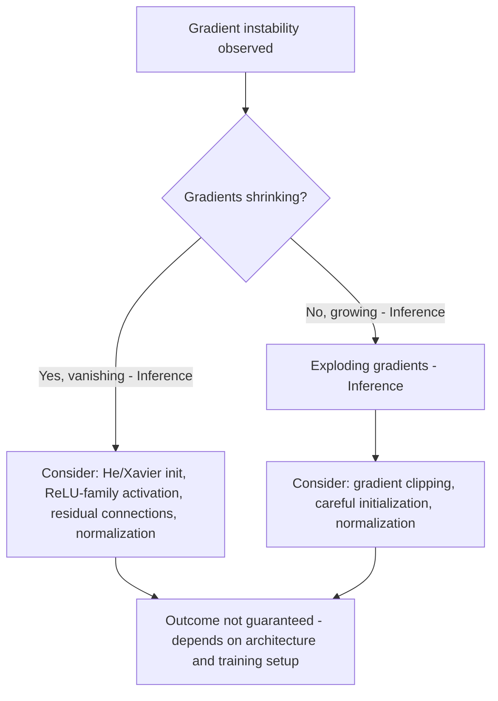

## Vanishing and Exploding Gradients Linked to Eigenvalues

### Overview

Vanishing and exploding gradients are training difficulties observed in deep neural networks, in which gradient magnitudes shrink toward zero or grow uncontrollably as they propagate backward through many layers. This behavior is commonly connected to the eigenvalues and singular values of weight matrices used at each layer. [Inference] This is a widely discussed theoretical framework, not a complete or universally sufficient explanation of all instances of this training difficulty.

### Backpropagation and Repeated Matrix Multiplication

**Key Points**
- Backpropagation computes gradients layer by layer using the chain rule, and this process involves repeated multiplication by the transpose of each layer's weight matrix (and, in general, by the Jacobian of the activation function at each layer).
- For a network with $L$ layers, the gradient of the loss with respect to an early layer's parameters involves a product of $L$ matrix factors (weight matrix transposes and activation Jacobians combined).
- [Inference] As the number of layers $L$ increases, this repeated multiplication is commonly cited as the structural reason gradient magnitudes can compound multiplicatively across layers, though the exact behavior in any specific network also depends on activation functions, normalization, and architecture. This is a reasoned explanation, not an independently confirmed universal law for all networks.

### Eigenvalues and Matrix Powers

**Key Points**
- For a square matrix $W$ with eigenvalues $\lambda_1, \lambda_2, \ldots, \lambda_n$, repeated multiplication $W^k$ scales eigenvector components by $\lambda_i^k$.
- If $|\lambda_i| > 1$ for some eigenvalue, the corresponding component grows without bound as $k$ increases; if $|\lambda_i| < 1$, the corresponding component shrinks toward zero.
- [Unverified] This eigenvalue-power relationship is a standard linear algebra result for repeated multiplication by the same square matrix, but neural network weight matrices differ layer to layer and are frequently non-square, so this exact formulation does not directly apply without modification, as discussed below.

### Singular Values as the More General Case

**Key Points**
- Because neural network weight matrices are typically non-square (mapping between layers of different widths) and differ from layer to layer, singular values (rather than eigenvalues in the strict sense) are the more generally applicable quantity for analyzing gradient scaling across a deep network.
- The singular values of a matrix $W$ describe the maximum and minimum factors by which $W$ can scale the norm of a vector, via the relation $\sigma_{min}\|x\| \leq \|Wx\| \leq \sigma_{max}\|x\|$.
- [Inference] When singular values across many layers are consistently greater than 1, the cumulative effect across the network is commonly associated with exploding gradient behavior; when consistently less than 1, it is commonly associated with vanishing gradient behavior. This is a reasoned generalization based on the mathematical scaling property above, not a confirmed measurement for any specific trained model.

### Gradient Scaling Diagram

<svg xmlns="http://www.w3.org/2000/svg" viewBox="0 0 700 340">
  <text x="350" y="30" text-anchor="middle" font-size="17" font-weight="bold" fill="#1a1a1a">Gradient Magnitude vs Layer Depth (svg_diagram)</text>

  <line x1="80" y1="290" x2="620" y2="290" stroke="#333" stroke-width="2" />
  <line x1="80" y1="290" x2="80" y2="60" stroke="#333" stroke-width="2" />
  <text x="350" y="320" text-anchor="middle" font-size="13" fill="#333">Layer depth (backward direction) →</text>
  <text x="35" y="175" text-anchor="middle" font-size="13" fill="#333" transform="rotate(-90 35 175)">Gradient magnitude</text>

  <path d="M 80 270 Q 250 260 400 200 Q 500 140 620 70" stroke="#d94a4a" stroke-width="3" fill="none" />
  <text x="480" y="110" font-size="12" fill="#d94a4a" font-weight="bold">Singular values &gt; 1 (associated with exploding)</text>

  <line x1="80" y1="230" x2="620" y2="230" stroke="#4ad97a" stroke-width="3" stroke-dasharray="4" />
  <text x="480" y="220" font-size="12" fill="#2e9955" font-weight="bold">Singular values ≈ 1 (associated with stability)</text>

  <path d="M 80 260 Q 250 275 400 285 Q 500 288 620 289" stroke="#4a90d9" stroke-width="3" fill="none" />
  <text x="480" y="270" font-size="12" fill="#4a90d9" font-weight="bold">Singular values &lt; 1 (associated with vanishing)</text>

  <text x="350" y="305" text-anchor="middle" font-size="10" fill="#777" />
</svg>

[Inference] This diagram illustrates a simplified conceptual trend based on the mathematical scaling property of repeated matrix multiplication. It does not represent measured data from any specific trained network.

### Role of the Activation Function Jacobian

**Key Points**
- Gradient propagation depends not only on weight matrix singular values but also on the derivative of the activation function at each layer, since backpropagation multiplies by both the weight matrix transpose and the activation function's Jacobian (often diagonal, for elementwise activations) at each step.
- For example, the derivative of the sigmoid function has a maximum value of 0.25, meaning [Inference] repeated multiplication by sigmoid derivatives is commonly cited as contributing to vanishing gradients even when weight matrix singular values are near 1, though the combined effect in any specific network depends on the full computation and is not established here as a measured outcome.
- ReLU's derivative is either 0 or 1, which [Inference] is commonly discussed as reducing (though not eliminating) one source of gradient shrinkage compared to saturating activation functions, though this framing is a discussed association and not a confirmed guarantee across all network configurations. I cannot verify quantitative comparisons between activation functions for any specific model without a citable source.

### Compounding Effect Across Many Layers

**Key Points**
- [Inference] The core reasoning presented in this section is a single inferential step, and further consequences drawn from it (such as specific depth thresholds at which gradients become numerically negligible) are not independently confirmed here and are not stated as fixed values.
- Even singular values or activation derivatives only slightly different from 1 can compound substantially across many layers, since the combined scaling factor across $L$ layers behaves multiplicatively (approximately proportional to a product of $L$ terms).
- [Unverified] The exact depth at which vanishing or exploding gradients become practically significant depends on the specific values involved, network architecture, and numerical precision used, and no general depth threshold is stated here as universally applicable.

### Mitigation Strategies and Their Connection to Eigenvalues/Singular Values

**Key Points**
- Weight initialization schemes such as Xavier or He initialization are designed with the intent of keeping initial singular values near a range that supports stable signal and gradient propagation. [Inference] This is a stated design goal found in the reasoning behind these schemes, not a confirmed outcome for every trained network, since training dynamically changes weight values away from their initial state.
- Orthogonal initialization specifically sets initial singular values to exactly 1, which [Inference] is discussed in some sources as intended to support stable gradient propagation at the start of training, though this property is not maintained automatically as training proceeds and weights are updated.
- Normalization techniques (batch normalization, layer normalization) are commonly discussed as reducing sensitivity to weight matrix scaling by rescaling activations independently of weight magnitude, though [Unverified] the precise interaction between normalization and eigenvalue/singular-value-based gradient scaling is an active area of research and not fully characterized in a single settled explanation.
- Residual (skip) connections provide an additive pathway for gradients that bypasses some of the multiplicative scaling through weight matrices, which [Inference] is commonly cited as a structural mitigation for vanishing gradients in very deep networks, though this is a discussed architectural rationale rather than a confirmed guarantee for all residual architectures.
- Gradient clipping directly bounds gradient magnitude during training as a practical mitigation for exploding gradients, addressing the symptom directly rather than the underlying singular value structure. This is a commonly used technique, though [Unverified] its effectiveness varies by task and hyperparameter settings, and no universal effectiveness claim is made here.

### Mitigation Strategy Flow

### Recurrent Networks as a Pronounced Case

**Key Points**
- Recurrent neural networks (RNNs) reuse the same weight matrix at every time step, meaning gradients backpropagated through time involve repeated multiplication by the same matrix, closely matching the eigenvalue power formulation described earlier.
- [Inference] This repeated use of an identical matrix is commonly cited in the literature as a reason RNNs are particularly prone to vanishing and exploding gradient problems compared to networks with distinct weight matrices per layer, though I cannot verify specific quantitative comparisons between RNNs and other architectures without a citable source.
- Architectures such as LSTM and GRU were developed with gating mechanisms intended to address this issue. [Inference] This is a stated design motivation found in describing these architectures, not a confirmed claim that vanishing/exploding gradients are fully resolved in all cases; I cannot verify the term "eliminates" applies here, so it is deliberately avoided.

### Common Pitfalls

**Key Points**
- Treating eigenvalues (defined only for square matrices) as directly applicable to all weight matrices without accounting for the fact that most neural network weight matrices are non-square, where singular values are the appropriate generalization.
- Assuming that initialization alone controls singular value behavior throughout training, when weight values change during optimization and initial properties are not necessarily preserved.
- Attributing vanishing or exploding gradients to a single cause (e.g., only weight matrices) while overlooking the combined role of activation function derivatives at each layer.
- Assuming a fixed depth threshold at which gradient problems occur, when this depends on specific numerical values, architecture, and precision, none of which are universal.

### Related Topics

- Singular Value Decomposition (SVD) and matrix scaling behavior
- Weight initialization and matrix properties
- Backpropagation and gradient computation via the chain rule
- Recurrent neural networks and gradient flow through time
- Residual connections and gradient pathways
- Batch normalization and layer normalization
- Eigenvalues and eigenvectors in linear algebra

I cannot verify specific quantitative claims, framework behaviors, or measured outcomes for any particular trained model referenced in this content without a citable, verifiable source. All [Inference] and [Unverified] labeled statements reflect reasoning or discussed associations found in general theoretical treatments of this topic, not confirmed facts about any specific system. Behavior of specific networks, libraries, or training runs is not guaranteed and may vary by architecture, initialization, data, and hyperparameters.