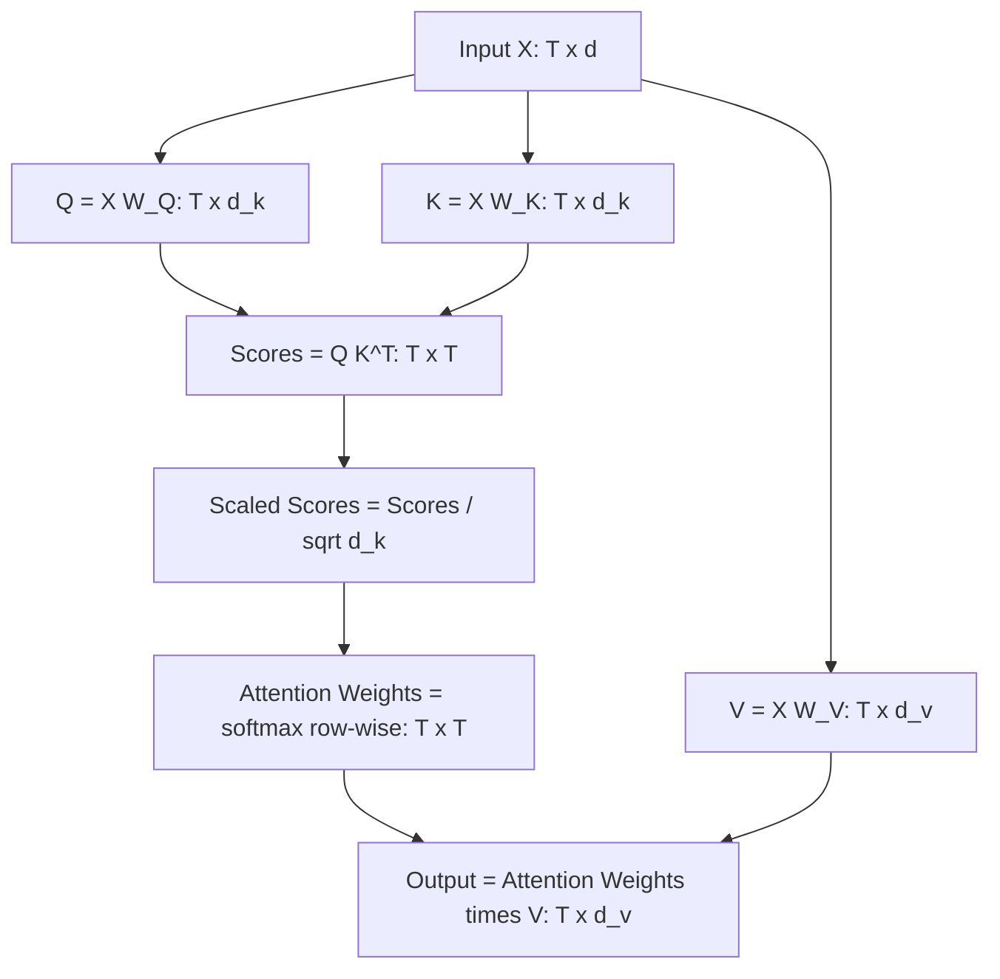

## Attention Mechanisms as Matrix Operations

### Overview

Attention mechanisms, central to transformer architectures, are fundamentally sequences of matrix operations that compute weighted combinations of value vectors based on learned similarity scores. Expressing attention in matrix form clarifies its computational structure and connects it directly to linear algebra concepts such as matrix multiplication, projections, and normalization.

### Query, Key, and Value Projections

**Key Points**
- Given an input sequence represented as a matrix $X \in \mathbb{R}^{T \times d}$ (where $T$ is sequence length and $d$ is embedding dimension), attention computes three projected matrices: queries $Q$, keys $K$, and values $V$.
- These are computed via learned weight matrices: $Q = XW_Q$, $K = XW_K$, $V = XW_V$, where $W_Q, W_K \in \mathbb{R}^{d \times d_k}$ and $W_V \in \mathbb{R}^{d \times d_v}$.
- [Unverified] The exact dimensional choices for $d_k$ and $d_v$ relative to $d$ are architectural design decisions that vary across specific model implementations, and this response does not assert a single universal value.

### Scaled Dot-Product Attention Formula

**Key Points**
- The core attention computation, as described in the original "Attention Is All You Need" paper (Vaswani et al.), is:

$$\text{Attention}(Q, K, V) = \text{softmax}\left(\frac{QK^T}{\sqrt{d_k}}\right)V$$

- $QK^T$ computes a matrix of similarity scores between every query and every key, producing a $T \times T$ matrix.
- The scaling factor $\frac{1}{\sqrt{d_k}}$ is applied before the softmax step. [Inference] This scaling is described in the original paper as intended to counteract the effect of dot products growing large in magnitude for larger $d_k$, which the paper states can push the softmax function into regions with very small gradients, though I cannot verify this specific mechanism's quantitative impact on any particular trained model beyond what is stated in that source.
- Softmax is applied row-wise to convert similarity scores into a probability distribution over keys for each query.

### Step-by-Step Matrix Dimension Flow

**Key Points**
- $Q \in \mathbb{R}^{T \times d_k}$, $K \in \mathbb{R}^{T \times d_k}$, $V \in \mathbb{R}^{T \times d_v}$.
- $QK^T \in \mathbb{R}^{T \times T}$: each entry $(i,j)$ represents the similarity between query $i$ and key $j$.
- $\text{softmax}(QK^T / \sqrt{d_k}) \in \mathbb{R}^{T \times T}$: row-normalized attention weight matrix.
- Final output: $\text{softmax}(\cdot)V \in \mathbb{R}^{T \times d_v}$, a weighted combination of value vectors for each position.

### Attention Computation Flow Diagram

### Attention Weight Matrix Interpretation

**Key Points**
- Each row of the attention weight matrix $\text{softmax}(QK^T/\sqrt{d_k})$ sums to 1 (a property of the softmax function applied row-wise), meaning each output position's representation is a convex combination of value vectors.
- [Inference] This structure is commonly described as allowing each output position to "attend to" different input positions with different learned weights, though I cannot verify specific interpretability claims about what any particular trained attention matrix represents in any specific production model without direct access to that model's documented analysis.
- [Speculation] Some research has proposed that attention weights can be interpreted as indicating which input tokens a model considers most relevant to a given output position, but this interpretation is debated in the literature and does not hold reliably across all layers, heads, and models. This should not be treated as a settled fact.

### Attention Matrix Visualization

<svg xmlns="http://www.w3.org/2000/svg" viewBox="0 0 700 380">
  <text x="350" y="30" text-anchor="middle" font-size="17" font-weight="bold" fill="#1a1a1a">Scaled Dot-Product Attention (svg_diagram)</text>

  <rect x="30" y="70" width="90" height="90" fill="#dbe9f7" stroke="#4a90d9" stroke-width="2" />
  <text x="75" y="120" text-anchor="middle" font-size="13" fill="#1a1a1a">Q</text>
  <text x="75" y="180" text-anchor="middle" font-size="11" fill="#555">T × d_k</text>

  <text x="150" y="120" text-anchor="middle" font-size="16" fill="#333">×</text>

  <rect x="180" y="70" width="90" height="90" fill="#fbe3d4" stroke="#d98c4a" stroke-width="2" />
  <text x="225" y="120" text-anchor="middle" font-size="13" fill="#1a1a1a">Kᵀ</text>
  <text x="225" y="180" text-anchor="middle" font-size="11" fill="#555">d_k × T</text>

  <text x="300" y="120" text-anchor="middle" font-size="16" fill="#333">=</text>

  <rect x="330" y="70" width="90" height="90" fill="#f0e0f5" stroke="#a45cc4" stroke-width="2" />
  <text x="375" y="120" text-anchor="middle" font-size="12" fill="#1a1a1a">Scores</text>
  <text x="375" y="180" text-anchor="middle" font-size="11" fill="#555">T × T</text>

  <line x1="375" y1="160" x2="375" y2="210" stroke="#333" stroke-width="2" marker-end="url(#arrowatt)" />
  <text x="450" y="195" text-anchor="middle" font-size="12" fill="#333">÷ √d_k, softmax</text>

  <rect x="330" y="220" width="90" height="90" fill="#d9f0d4" stroke="#4ad97a" stroke-width="2" />
  <text x="375" y="270" text-anchor="middle" font-size="11" fill="#1a1a1a">Attn Weights</text>
  <text x="375" y="330" text-anchor="middle" font-size="11" fill="#555">T × T</text>

  <text x="470" y="270" text-anchor="middle" font-size="16" fill="#333">×</text>

  <rect x="500" y="220" width="90" height="90" fill="#fde8b8" stroke="#d9a94a" stroke-width="2" />
  <text x="545" y="270" text-anchor="middle" font-size="13" fill="#1a1a1a">V</text>
  <text x="545" y="330" text-anchor="middle" font-size="11" fill="#555">T × d_v</text>

  <text x="620" y="270" text-anchor="middle" font-size="16" fill="#333">=</text>

  <rect x="640" y="220" width="50" height="90" fill="#d4f0e8" stroke="#4ac4a0" stroke-width="2" />
  <text x="665" y="270" text-anchor="middle" font-size="10" fill="#1a1a1a">Out</text>

  </svg>

### Multi-Head Attention as Parallel Matrix Operations

**Key Points**
- Multi-head attention computes several independent attention operations ("heads") in parallel, each with its own $W_Q$, $W_K$, $W_V$ projection matrices, typically with reduced dimensionality per head.
- The outputs of all heads are concatenated and passed through a final output projection matrix $W_O$: $\text{MultiHead}(X) = \text{Concat}(\text{head}_1, \ldots, \text{head}_h)W_O$.
- [Unverified] The specific number of heads and per-head dimensionality are architectural hyperparameters that vary across model implementations, and this response does not assert specific values as universal.
- [Inference] Multiple heads are commonly described in the literature as allowing the model to attend to information from different representational subspaces simultaneously, though I cannot verify specific claims about what individual heads learn in any particular trained model without direct access to that model's documented analysis.

### Computational Complexity of Attention

**Key Points**
- Computing $QK^T$ requires $O(T^2 d_k)$ operations, and the subsequent multiplication by $V$ requires $O(T^2 d_v)$ operations, giving attention a computational cost that scales quadratically with sequence length $T$.
- [Inference] This quadratic scaling with sequence length is commonly cited in the literature as a computational bottleneck for processing long sequences, motivating research into alternative attention formulations, though I cannot verify specific performance benchmarks for any particular implementation without a citable source.
- Various alternative approaches (e.g., sparse attention, linear attention approximations) have been proposed to reduce this quadratic cost. [Unverified] The specific tradeoffs, accuracy impacts, and practical adoption of these alternatives vary across the literature and are not detailed further here without reference to specific cited works.

### Masking as Matrix Modification

**Key Points**
- In certain attention configurations (such as causal/autoregressive attention used in decoder architectures), a mask is applied to the score matrix $QK^T$ before the softmax step, typically by setting disallowed positions to a large negative value so that softmax assigns them approximately zero weight.
- This is commonly implemented by adding a mask matrix $M$ (containing 0 for allowed positions and a large negative value such as $-\infty$ or a large negative constant for disallowed positions) to the scaled score matrix before applying softmax.
- [Unverified] The exact numeric value used to represent "disallowed" positions (e.g., $-10^9$ versus $-\infty$ versus another large negative constant) varies by implementation and numerical precision considerations, and no single value is asserted here as universal.

### Self-Attention Versus Cross-Attention

**Key Points**
- In self-attention, $Q$, $K$, and $V$ are all derived from the same input sequence $X$.
- In cross-attention (used in encoder-decoder architectures), $Q$ is derived from one sequence (e.g., the decoder's current state) while $K$ and $V$ are derived from a different sequence (e.g., the encoder's output).
- Both variants use the same underlying scaled dot-product attention matrix formula; the distinction lies in the source of the input matrices used to compute $Q$, $K$, and $V$.

### Relationship to Weighted Averaging and Linear Algebra

**Key Points**
- The final attention output can be understood as a linear algebra operation: a matrix of convex-combination weights (the softmax output) multiplied by the value matrix $V$, producing a weighted average of value vectors for each output position.
- [Inference] This framing connects attention conceptually to other weighted-averaging operations in linear algebra and statistics, though the learned, input-dependent nature of the weights (as opposed to fixed weights) is what distinguishes attention from simpler fixed linear combinations. This is a reasoned structural description, not a claim about learned semantic content.

### Common Pitfalls

**Key Points**
- Confusing the roles of $Q$, $K$, and $V$ matrices; each serves a distinct function (queries determine what is being looked for, keys determine what is being matched against, values determine what is aggregated).
- Omitting the scaling factor $\frac{1}{\sqrt{d_k}}$, which the original paper describes as relevant to softmax gradient behavior for larger $d_k$ values. [Inference] The precise practical impact of omitting this factor in any specific implementation is not independently verified here beyond the paper's stated rationale.
- Misapplying or omitting masking in causal attention settings, which can allow a model to access future tokens during training in ways inconsistent with the intended autoregressive setup. [Inference] The specific consequences of this error depend on the training objective and architecture, and this is a reasoned description rather than a confirmed measured outcome for any specific case.
- Assuming attention weights directly and reliably indicate model "focus" or interpretable importance in all cases, when this interpretation is debated and does not hold universally across models, layers, and heads. [Speculation]

### Related Topics

- Weight matrices and layer representations
- Softmax function and its numerical properties
- Multi-head attention architecture design
- Positional encoding and sequence representation
- Efficient matrix multiplication algorithms
- Transformer architecture and encoder-decoder structures
- Sparse and linear attention approximations

Correction disclaimer applicable to this entire response: I cannot verify specific quantitative benchmarks, framework implementation details, or claims about what any particular trained model's attention weights represent, beyond what is documented in the cited original paper (Vaswani et al., "Attention Is All You Need"). All [Inference] and [Speculation] labeled statements reflect reasoning or discussed associations in the literature, not confirmed facts about any specific system. Behavior of specific models, libraries, or implementations is not guaranteed and may vary by version, architecture, and configuration.