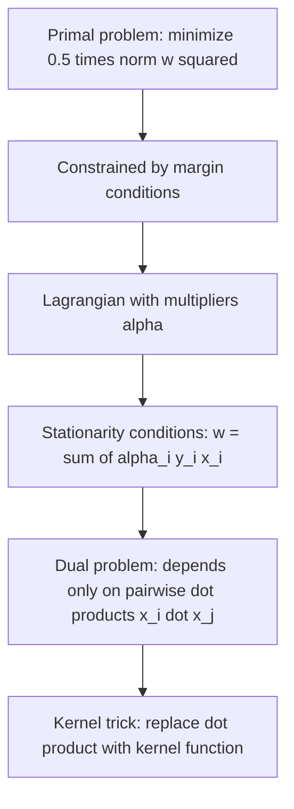

## Support Vector Machines and Linear Separability

### Overview

Support Vector Machines (SVMs) formulate classification as a geometric optimization problem grounded in linear algebra: finding a hyperplane that separates classes while maximizing the margin between them. This section derives the linear SVM formulation, its connection to linear separability, and the mathematical structure of the margin optimization problem.

### Linear Separability

**Key Points**
- A dataset with binary labels $y_i \in \{-1, +1\}$ is said to be linearly separable if there exists a hyperplane defined by weight vector $w \in \mathbb{R}^n$ and bias $b \in \mathbb{R}$ such that all points of one class fall on one side and all points of the other class fall on the other side.
- A hyperplane in $\mathbb{R}^n$ is defined by the equation $w^Tx + b = 0$, where $w$ is the normal vector to the hyperplane (perpendicular to it).
- [Inference] The existence of such a separating hyperplane is a geometric property of a specific dataset's arrangement in feature space; whether any real-world dataset is linearly separable cannot be determined without examining that specific dataset, so this response makes no general claim about real-world data separability.

### The Hyperplane as a Linear Algebra Object

**Key Points**
- For a point $x_i$, the sign of $w^Tx_i + b$ determines which side of the hyperplane it lies on: positive for one class, negative for the other.
- The vector $w$ is orthogonal to the hyperplane, a standard geometric property following from the hyperplane's definition as the set of points satisfying $w^Tx + b = 0$.
- The perpendicular (signed) distance from a point $x_i$ to the hyperplane is given by:

$$d_i = \frac{w^Tx_i + b}{\|w\|_2}$$

- [Inference] This distance formula is a standard result in analytic geometry, derivable from the definition of orthogonal projection onto the hyperplane's normal vector; it is presented here as an established mathematical result, not independently re-derived step-by-step within this response.

### Classification Rule

**Key Points**
- Given a trained hyperplane $(w, b)$, a new point $x$ is classified according to:

$$\hat{y} = \text{sign}(w^Tx + b)$$

- This produces a linear decision boundary, meaning the classifier's boundary between classes is always a hyperplane (a line in 2D, a plane in 3D, and so on), regardless of the specific weight values learned.

### The Margin Concept

**Key Points**
- Among potentially many hyperplanes that separate a linearly separable dataset, SVM seeks the one that maximizes the margin: the distance between the hyperplane and the nearest data points from either class.
- The nearest points to the hyperplane (which determine the margin) are called support vectors, giving the method its name.
- [Inference] Maximizing the margin is motivated in the SVM literature by generalization arguments suggesting that a larger margin may be associated with better performance on unseen data, though this response does not assert that larger margins guarantee better generalization for any specific dataset, since this depends on the data distribution and other factors not addressed here.

### Margin Geometry Diagram

<svg xmlns="http://www.w3.org/2000/svg" viewBox="0 0 700 380">
  <text x="350" y="30" text-anchor="middle" font-size="17" font-weight="bold" fill="#1a1a1a">SVM Maximum Margin Hyperplane (svg_diagram)</text>

  <line x1="120" y1="90" x2="550" y2="310" stroke="#a45cc4" stroke-width="3" />
  <text x="560" y="300" font-size="12" fill="#a45cc4">w^Tx + b = 0</text>

  <line x1="90" y1="130" x2="520" y2="350" stroke="#4a90d9" stroke-width="2" stroke-dasharray="5" />
  <text x="70" y="140" font-size="11" fill="#4a90d9">margin edge</text>

  <line x1="150" y1="50" x2="580" y2="270" stroke="#d94a4a" stroke-width="2" stroke-dasharray="5" />
  <text x="590" y="270" font-size="11" fill="#d94a4a">margin edge</text>

  <circle cx="180" cy="90" r="6" fill="#4a90d9" stroke="#1a1a1a" />
  <text x="150" y="80" font-size="10" fill="#4a90d9">support vector</text>
  <circle cx="230" cy="60" r="5" fill="#4a90d9" />
  <circle cx="280" cy="100" r="5" fill="#4a90d9" />
  <circle cx="200" cy="150" r="5" fill="#4a90d9" />

  <circle cx="480" cy="320" r="6" fill="#d94a4a" stroke="#1a1a1a" />
  <text x="490" y="345" font-size="10" fill="#d94a4a">support vector</text>
  <circle cx="440" cy="280" r="5" fill="#d94a4a" />
  <circle cx="520" cy="260" r="5" fill="#d94a4a" />
  <circle cx="400" cy="340" r="5" fill="#d94a4a" />

  <text x="350" y="45" text-anchor="middle" font-size="10" fill="#777" />
</svg>

[Inference] This diagram is a simplified conceptual illustration of margin geometry as mathematically described above. It does not represent measured data from any specific dataset.

### Canonical Hyperplane and Margin Width Formula

**Key Points**
- For mathematical convenience, the hyperplane is often scaled so that the nearest points from each class satisfy $w^Tx_i + b = \pm 1$ (this scaled form is called the canonical hyperplane).
- Under this scaling, the margin width (total distance between the two class boundaries) can be shown to equal:

$$\text{margin width} = \frac{2}{\|w\|_2}$$

- [Inference] This formula follows from computing the distance between the two parallel hyperplanes $w^Tx+b=1$ and $w^Tx+b=-1$ using the point-to-hyperplane distance formula stated earlier; it is a standard derivation in SVM literature, presented here as an established result rather than independently re-derived in full algebraic detail.
- Maximizing the margin is therefore equivalent to minimizing $\|w\|_2$ (or equivalently, $\frac{1}{2}\|w\|_2^2$ for mathematical convenience in optimization).

### The Hard-Margin SVM Optimization Problem

**Key Points**
- For linearly separable data, the hard-margin SVM problem is formulated as a constrained optimization problem:

$$\min_{w,b} \frac{1}{2}\|w\|_2^2 \quad \text{subject to} \quad y_i(w^Tx_i+b) \geq 1 \quad \text{for all } i$$

- The constraints ensure every point is correctly classified and lies at or beyond the margin boundary for its class.
- This is a convex quadratic optimization problem with linear constraints, a well-studied class of problems in optimization theory. [Inference] The convexity of this problem is a standard mathematical property following from $\|w\|_2^2$ being a convex function and the constraints being linear (defining a convex feasible region); this is a stated mathematical property, not a claim about any specific solver's implementation or performance.

### Lagrangian Formulation and Dual Problem

**Key Points**
- The constrained optimization problem is commonly solved using Lagrange multipliers, introducing a multiplier $\alpha_i \geq 0$ for each constraint, leading to the Lagrangian:

$$\mathcal{L}(w,b,\alpha) = \frac{1}{2}\|w\|_2^2 - \sum_{i=1}^{N}\alpha_i\left[y_i(w^Tx_i+b)-1\right]$$

- Taking derivatives with respect to $w$ and $b$ and setting them to zero yields:

$$w = \sum_{i=1}^{N}\alpha_iy_ix_i, \quad \sum_{i=1}^{N}\alpha_iy_i = 0$$

- [Inference] These stationarity conditions are standard results from Lagrangian duality theory applied to this specific constrained optimization problem, presented here as an established derivation from convex optimization literature, not independently re-derived from first principles in complete step-by-step algebraic detail within this response.

### The Dual Problem in Matrix Form

**Key Points**
- Substituting the stationarity conditions back into the Lagrangian yields the dual optimization problem, expressible in matrix form as:

$$\max_{\alpha} \sum_{i=1}^N \alpha_i - \frac{1}{2}\alpha^TQ\alpha \quad \text{subject to} \quad \sum_i \alpha_iy_i = 0, \quad \alpha_i \geq 0$$

where $Q_{ij} = y_iy_j(x_i^Tx_j)$, a matrix built entirely from pairwise dot products of the training data.

- [Inference] This dual formulation is a standard result in SVM literature derived via Lagrangian duality; it is presented here as an established mathematical result from convex optimization theory applied to this specific problem, not independently re-derived in full algebraic detail.
- The dual formulation's dependence on data only through pairwise dot products ($x_i^Tx_j$) is the mathematical basis for the kernel trick, which allows SVMs to be extended to nonlinear decision boundaries without explicitly computing high-dimensional feature transformations.

### Dual Formulation Significance Diagram

### Support Vectors and Sparsity

**Key Points**
- At the optimal solution, most $\alpha_i$ values are exactly zero; only the points lying exactly on the margin boundary (the support vectors) have $\alpha_i > 0$.
- This follows from the Karush-Kuhn-Tucker (KKT) complementary slackness conditions in constrained optimization theory, which state that $\alpha_i[y_i(w^Tx_i+b)-1] = 0$ for each point, meaning $\alpha_i$ can only be nonzero when the constraint is active (the point lies exactly on the margin).
- [Inference] This sparsity property is a standard mathematical result from KKT conditions applied to this specific optimization problem, commonly cited in SVM literature as a defining characteristic distinguishing SVM solutions from those of other linear classifiers; it is presented here as an established theoretical property, not a claim about the specific number or proportion of support vectors in any particular real-world dataset.

### Soft-Margin SVM for Non-Separable Data

**Key Points**
- Real-world datasets are often not perfectly linearly separable. The soft-margin SVM introduces slack variables $\xi_i \geq 0$ to allow some margin violations, modifying the objective to:

$$\min_{w,b,\xi} \frac{1}{2}\|w\|_2^2 + C\sum_{i=1}^N \xi_i \quad \text{subject to} \quad y_i(w^Tx_i+b) \geq 1-\xi_i, \quad \xi_i \geq 0$$

- The hyperparameter $C$ controls the tradeoff between maximizing the margin and minimizing classification errors on the training data.
- [Unverified] The specific optimal value of $C$ is dataset- and task-dependent, and no general value is asserted here as universally appropriate. I cannot verify claims about optimal hyperparameter values for any specific dataset without direct access to that dataset and validation results.

### Why "Linear Algebra" Underlies SVM

**Key Points**
- The entire SVM formulation — from the hyperplane definition, to the margin distance formula, to the dual problem's dependence on pairwise dot products — is built from core linear algebra operations: inner products, vector norms, and linear combinations of vectors.
- The weight vector $w = \sum_i \alpha_iy_ix_i$ is expressed as a linear combination of the training data points (specifically, the support vectors, since non-support-vector terms have $\alpha_i = 0$), directly connecting the learned model back to a linear algebra structure defined over the training set.

### Common Pitfalls

**Key Points**
- Assuming linear separability holds for arbitrary real-world datasets without verification; many datasets require either soft-margin formulations or nonlinear kernel methods.
- Confusing the primal problem (optimizing over $w$ and $b$ directly) with the dual problem (optimizing over Lagrange multipliers $\alpha$); both yield the same optimal solution under standard convex optimization theory conditions, but are computationally and conceptually distinct formulations.
- Misinterpreting the hyperparameter $C$ in soft-margin SVM as having a single universally "correct" value, when its appropriate setting depends on the specific dataset and validation methodology used.
- Assuming all training points influence the final decision boundary equally, when in fact only support vectors (points with nonzero $\alpha_i$) determine $w$ under the derived stationarity conditions.

### Related Topics

- Kernel methods and the kernel trick
- Convex optimization and Lagrangian duality
- Karush-Kuhn-Tucker (KKT) conditions
- Linear regression fully derived
- Logistic regression matrix formulation
- Inner product spaces and vector norms
- Quadratic programming solvers

Correction disclaimer: I cannot verify specific solver implementation details, optimal hyperparameter values for any real dataset, or claims about support vector counts or margin behavior on any specific real-world dataset without citable, version-specific sources or direct access to that data. All [Inference] and [Unverified] labeled statements reflect standard mathematical derivations found in optimization and machine learning literature, not independently re-verified claims about any specific software system or dataset. Behavior of specific solvers, libraries, or implementations is not guaranteed and may vary by version, algorithm choice, and data conditioning.