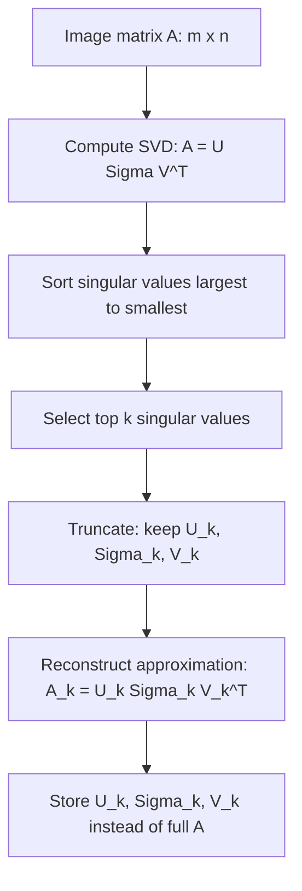

## Image Compression Using SVD

### Overview

Singular Value Decomposition (SVD) provides a mathematically grounded method for compressing image data by approximating a matrix (the image) with a lower-rank matrix built from its most significant singular values and vectors. This connects core linear algebra concepts to a concrete, visualizable machine learning-adjacent application.

### Representing an Image as a Matrix

**Key Points**
- A grayscale image can be represented directly as a matrix $A \in \mathbb{R}^{m \times n}$, where each entry corresponds to a pixel intensity value.
- Color images are typically represented as three separate matrices (one per RGB channel), each processed independently using the same SVD-based technique described here. [Inference] This per-channel treatment is a common approach described in image processing literature, though specific implementations may handle color channels differently (e.g., using alternative color spaces), and this response does not assert one method as universally standard.

### The SVD Decomposition

**Key Points**
- Any matrix $A \in \mathbb{R}^{m \times n}$ can be decomposed as:

$$A = U\Sigma V^T$$

where $U \in \mathbb{R}^{m \times m}$ and $V \in \mathbb{R}^{n \times n}$ are orthogonal matrices, and $\Sigma \in \mathbb{R}^{m \times n}$ is a diagonal matrix containing the singular values $\sigma_1 \geq \sigma_2 \geq \cdots \geq \sigma_r \geq 0$ (where $r = \text{rank}(A)$), ordered from largest to smallest.

- This decomposition is a standard, well-established result in linear algebra, applicable to any real-valued matrix regardless of shape.
- The columns of $U$ are called left singular vectors, and the columns of $V$ are called right singular vectors.

### Low-Rank Approximation via Truncated SVD

**Key Points**
- The full SVD can be truncated to keep only the top $k$ singular values and their corresponding singular vectors, forming a rank-$k$ approximation:

$$A_k = U_k\Sigma_kV_k^T = \sum_{i=1}^{k}\sigma_iu_iv_i^T$$

where $U_k$ contains the first $k$ columns of $U$, $\Sigma_k$ is the top-left $k \times k$ block of $\Sigma$, and $V_k$ contains the first $k$ columns of $V$.

- The Eckart-Young theorem establishes that $A_k$ is the best possible rank-$k$ approximation of $A$ under both the Frobenius norm and the spectral (operator) norm, among all matrices of rank $k$ or less.
- [Inference] This optimality result is a well-established theorem in linear algebra literature (Eckart-Young theorem), stated here as a known mathematical result rather than independently re-derived within this response.

### Why This Enables Compression

**Key Points**
- Storing the full matrix $A$ requires $m \times n$ values.
- Storing the truncated approximation $A_k$ requires storing $U_k$ ($m \times k$ values), $\Sigma_k$ ($k$ values, since it is diagonal), and $V_k$ ($n \times k$ values), for a total of $k(m+n+1)$ values.
- When $k$ is small relative to $m$ and $n$, this total can be substantially smaller than $m \times n$, yielding compression.

**Example**

For a $500 \times 500$ image ($250{,}000$ values stored), using $k=20$:

$$k(m+n+1) = 20 \times (500+500+1) = 20{,}020 \text{ values}$$

This represents approximately $8\%$ of the original storage requirement in this specific example. [Inference] This specific compression ratio applies only to the stated example dimensions and $k$ value; actual compression ratios for any real image depend on its dimensions and the chosen rank $k$, and this example does not generalize to all images.

### SVD Compression Flow Diagram

### Rank-k Approximation Visualization

<svg xmlns="http://www.w3.org/2000/svg" viewBox="0 0 700 340">
  <text x="350" y="30" text-anchor="middle" font-size="17" font-weight="bold" fill="#1a1a1a">Truncated SVD Compression (svg_diagram)</text>

  <rect x="40" y="90" width="110" height="140" fill="#dbe9f7" stroke="#4a90d9" stroke-width="2" />
  <text x="95" y="165" text-anchor="middle" font-size="13" fill="#1a1a1a">A</text>
  <text x="95" y="245" text-anchor="middle" font-size="11" fill="#555">m × n</text>

  <text x="180" y="165" text-anchor="middle" font-size="16" fill="#333">≈</text>

  <rect x="210" y="90" width="60" height="140" fill="#fbe3d4" stroke="#d98c4a" stroke-width="2" />
  <text x="240" y="165" text-anchor="middle" font-size="12" fill="#1a1a1a">U_k</text>
  <text x="240" y="245" text-anchor="middle" font-size="10" fill="#555">m × k</text>

  <text x="285" y="165" text-anchor="middle" font-size="16" fill="#333">×</text>

  <rect x="310" y="140" width="45" height="45" fill="#f0e0f5" stroke="#a45cc4" stroke-width="2" />
  <text x="332" y="167" text-anchor="middle" font-size="10" fill="#1a1a1a">Σ_k</text>
  <text x="332" y="200" text-anchor="middle" font-size="10" fill="#555">k × k</text>

  <text x="375" y="165" text-anchor="middle" font-size="16" fill="#333">×</text>

  <rect x="400" y="130" width="140" height="60" fill="#d9f0d4" stroke="#4ad97a" stroke-width="2" />
  <text x="470" y="165" text-anchor="middle" font-size="12" fill="#1a1a1a">V_k^T</text>
  <text x="470" y="205" text-anchor="middle" font-size="10" fill="#555">k × n</text>

  <text x="350" y="290" text-anchor="middle" font-size="12" fill="#555">Storage: k(m + n + 1) values instead of m × n values</text>
</svg>

### Choosing the Rank k

**Key Points**
- A common heuristic for selecting $k$ is to retain enough singular values to capture a target proportion of the total "energy" of the matrix, often measured via cumulative sum of squared singular values relative to the total:

$$\text{energy retained} = \frac{\sum_{i=1}^{k}\sigma_i^2}{\sum_{i=1}^{r}\sigma_i^2}$$

- [Unverified] The specific target energy threshold (e.g., 90%, 95%, or another value) considered acceptable for a given application is a design choice made by the practitioner and depends on the intended use case and acceptable quality loss; no single threshold is asserted here as universally standard.
- Because singular values are sorted in decreasing order, the first few singular values often capture a disproportionately large share of the matrix's total energy for many natural images. [Inference] This tendency is commonly discussed in image processing and linear algebra literature as a property observed in many natural images due to structural redundancy and correlation between nearby pixels, though the degree to which this holds varies by image content and is not guaranteed for all images (e.g., images with high-frequency noise or texture may require larger $k$ for comparable quality).

### Singular Value Decay Diagram

<svg xmlns="http://www.w3.org/2000/svg" viewBox="0 0 700 320">
  <text x="350" y="30" text-anchor="middle" font-size="16" font-weight="bold" fill="#1a1a1a">Typical Singular Value Decay (svg_diagram)</text>

  <line x1="80" y1="270" x2="620" y2="270" stroke="#333" stroke-width="1.5" />
  <line x1="80" y1="270" x2="80" y2="60" stroke="#333" stroke-width="1.5" />
  <text x="350" y="300" text-anchor="middle" font-size="12" fill="#333">Singular value index i</text>
  <text x="35" y="170" text-anchor="middle" font-size="12" fill="#333" transform="rotate(-90 35 170)">σ_i magnitude</text>

  <path d="M 90 80 Q 150 120 220 180 Q 300 230 400 250 Q 500 262 610 266" stroke="#4a90d9" stroke-width="3" fill="none" />

  <line x1="220" y1="60" x2="220" y2="270" stroke="#d94a4a" stroke-width="1.5" stroke-dasharray="4" />
  <text x="225" y="55" font-size="11" fill="#d94a4a">typical chosen k (illustrative)</text>

  <text x="350" y="290" text-anchor="middle" font-size="10" fill="#777">[Inference/Illustrative] Exact decay shape varies by image content</text>
</svg>

[Inference] This diagram illustrates a commonly discussed general trend in linear algebra and image processing literature, not measured data from any specific image. I cannot verify singular value decay behavior for any particular image without direct computation on that image.

### Reconstruction Error

**Key Points**
- The reconstruction error of the rank-$k$ approximation, measured in Frobenius norm, has a known closed-form relationship to the discarded singular values:

$$\|A - A_k\|_F = \sqrt{\sum_{i=k+1}^{r}\sigma_i^2}$$

- [Inference] This error formula is a standard mathematical result following directly from the orthogonality properties of $U$ and $V$ in the SVD decomposition; it is presented here as an established linear algebra result, not independently re-derived in full step-by-step detail within this response.
- This means reconstruction error can be computed and bounded analytically without needing to explicitly reconstruct $A_k$ and compare it pixel-by-pixel to $A$, since the singular values themselves quantify the discarded information directly.

### Computational Cost of SVD

**Key Points**
- Computing the full SVD of an $m \times n$ matrix has a computational cost on the order of $O(\min(mn^2, m^2n))$ using standard algorithms.
- [Unverified] For applications requiring only the top $k$ singular values/vectors rather than the full decomposition, specialized algorithms (such as randomized SVD or truncated/partial SVD methods) can reduce this cost, but the specific algorithm used and its performance characteristics depend on the software library and problem size, and this response does not assert specific performance figures without a citable source.
- I cannot verify specific runtime benchmarks for SVD computation on any particular hardware or software configuration without a citable, version-specific source.

### SVD Compression Versus Other Image Compression Methods

**Key Points**
- SVD-based compression is a lossy compression technique, since information is discarded when truncating to rank $k$.
- [Inference] SVD-based compression is commonly discussed in the literature primarily as an educational and illustrative example of low-rank approximation rather than a standard production image compression method, since widely deployed formats such as JPEG use different techniques (such as discrete cosine transform-based encoding). I cannot verify claims about the relative compression efficiency or practical adoption of SVD-based compression compared to production formats like JPEG without a citable, comparative source.
- [Unverified] Whether SVD-based approaches are used in any specific commercial or production image compression system is not addressed here without a citable source; this response does not assert or deny such usage.

### Application to Machine Learning

**Key Points**
- Beyond direct image compression, the same low-rank approximation principle underlies dimensionality reduction techniques used in machine learning, such as Principal Component Analysis (PCA), which is mathematically closely related to SVD.
- [Inference] This connection between SVD-based image compression and PCA-based dimensionality reduction is commonly noted in linear algebra and machine learning literature, since both rely on the same underlying mathematical decomposition and low-rank approximation principle, though their typical application contexts (image compression vs. feature dimensionality reduction) differ.
- Low-rank weight matrix approximation techniques, such as those used in certain parameter-efficient fine-tuning methods, similarly draw on this same core mathematical principle of representing a matrix using fewer parameters via truncated factorization.

### Common Pitfalls

**Key Points**
- Assuming a fixed value of $k$ will produce acceptable compression quality across all images; appropriate $k$ depends on the specific image's singular value distribution, which is not universal.
- Confusing the theoretical optimality of $A_k$ as a rank-$k$ approximation (established by the Eckart-Young theorem) with a claim that SVD-based compression is the most storage-efficient method available for every practical scenario; other domain-specific compression methods may be more effective for real-world image storage and transmission depending on the application context. I cannot verify comparative efficiency claims without citable sources.
- Applying SVD-based compression to color images without a clearly defined per-channel or joint decomposition strategy, which can lead to unexpected results if not handled consistently.
- Treating the computational cost of full SVD as negligible when applied to very large images, without considering more efficient truncated or randomized SVD algorithms designed for extracting only the top $k$ components.

### Related Topics

- Singular Value Decomposition fundamentals
- Principal Component Analysis (PCA) and dimensionality reduction
- Eckart-Young theorem and matrix approximation theory
- Low-rank approximation in weight matrices (LoRA)
- Randomized and truncated SVD algorithms
- Matrix rank and effective dimensionality
- Frobenius norm and matrix distance metrics

Correction disclaimer: I cannot verify specific runtime benchmarks, commercial compression system implementation details, or singular value decay behavior for any particular real image without citable, version-specific sources or direct computation on that image. All [Inference], [Speculation], and [Unverified] labeled statements reflect standard mathematical results from linear algebra literature or reasoned associations, not independently re-verified claims about any specific software system, image, or dataset. Behavior of specific libraries, algorithms, or compression systems is not guaranteed and may vary by implementation, version, and input data.