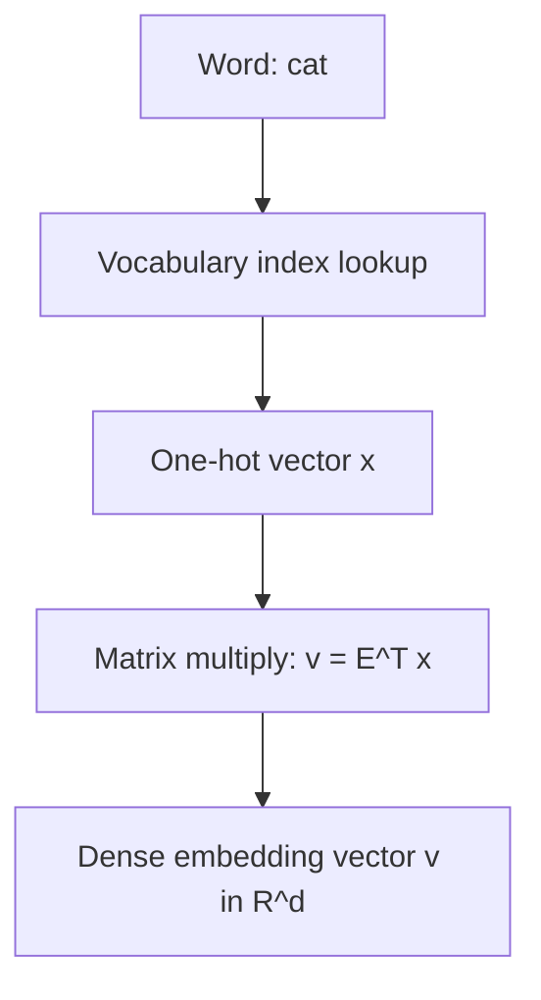

## Word Embeddings and Vector Spaces

### Overview

Word embeddings represent words as dense, real-valued vectors in a continuous vector space, enabling linear algebra operations to capture semantic and syntactic relationships between words. This section covers the mathematical structure of embedding spaces, how embeddings are learned, and the vector space operations that give embeddings their practical utility.

### Words as Vectors

**Key Points**
- A word embedding maps each word in a vocabulary to a dense vector $v \in \mathbb{R}^d$, where $d$ is the embedding dimension (a hyperparameter, commonly ranging from tens to hundreds of dimensions in various models).
- This contrasts with sparse representations such as one-hot encoding, where each word is represented by a vector of length equal to vocabulary size with a single nonzero entry.
- The full set of word vectors for a vocabulary can be organized into an embedding matrix $E \in \mathbb{R}^{|V| \times d}$, where $|V|$ is vocabulary size and each row corresponds to one word's embedding vector.

### One-Hot Encoding Versus Dense Embeddings

**Key Points**
- One-hot vectors are sparse, high-dimensional (equal to vocabulary size), and orthogonal to each other by construction, meaning the dot product between any two distinct one-hot vectors is always zero.
- Dense embeddings are lower-dimensional and are not constrained to be orthogonal; their relative angles and distances are learned from data and can reflect relationships between words.
- [Inference] This lower dimensionality and non-orthogonality is commonly described in the literature as allowing dense embeddings to encode similarity relationships that one-hot encodings structurally cannot represent, since one-hot vectors have no notion of relative distance between words by construction. This is a structural/mathematical property, not a claim about what any specific trained embedding model has learned.

### Embedding Lookup as Matrix Operation

**Key Points**
- Retrieving the embedding for a word can be expressed as a matrix operation: if $x$ is a one-hot vector representing a word's index in the vocabulary, then $v = E^Tx$ (or $x^TE$, depending on orientation convention) retrieves that word's embedding row from $E$.
- [Unverified] In practice, this operation is commonly implemented as a direct indexing/lookup operation rather than an explicit matrix multiplication, for computational efficiency, though the exact implementation varies by framework and library version, and this response does not assert one implementation as universal.

### Embedding Lookup Diagram

### Vector Space Structure and Distance Metrics

**Key Points**
- Similarity between two word embeddings is commonly measured using cosine similarity:

$$\text{cos\_sim}(u,v) = \frac{u^Tv}{\|u\|_2\|v\|_2}$$

- Cosine similarity ranges from $-1$ to $1$, measuring the cosine of the angle between two vectors, independent of their magnitude.
- Euclidean distance is an alternative metric: $\|u-v\|_2 = \sqrt{\sum_i(u_i-v_i)^2}$, which accounts for both direction and magnitude differences between vectors.
- [Unverified] Whether cosine similarity or Euclidean distance is more appropriate for a given embedding model or task depends on how that specific model was trained and normalized, and this response does not assert one metric as universally superior.

### Vector Space Similarity Diagram

<svg xmlns="http://www.w3.org/2000/svg" viewBox="0 0 700 380">
  <text x="350" y="30" text-anchor="middle" font-size="17" font-weight="bold" fill="#1a1a1a">Word Embeddings in Vector Space (svg_diagram)</text>

  <line x1="350" y1="330" x2="350" y2="60" stroke="#ccc" stroke-width="1" />
  <line x1="150" y1="200" x2="600" y2="200" stroke="#ccc" stroke-width="1" />

  <line x1="350" y1="200" x2="450" y2="120" stroke="#4a90d9" stroke-width="2.5" />
  <circle cx="450" cy="120" r="4" fill="#4a90d9" />
  <text x="460" y="115" font-size="12" fill="#4a90d9">king</text>

  <line x1="350" y1="200" x2="490" y2="150" stroke="#4ad97a" stroke-width="2.5" />
  <circle cx="490" cy="150" r="4" fill="#4ad97a" />
  <text x="500" y="150" font-size="12" fill="#2e9955">queen</text>

  <line x1="350" y1="200" x2="230" y2="260" stroke="#d94a4a" stroke-width="2.5" />
  <circle cx="230" cy="260" r="4" fill="#d94a4a" />
  <text x="180" y="280" font-size="12" fill="#d94a4a">car</text>

  <line x1="350" y1="200" x2="200" y2="290" stroke="#d9a94a" stroke-width="2.5" />
  <circle cx="200" cy="290" r="4" fill="#d9a94a" />
  <text x="140" y="310" font-size="12" fill="#d9a94a">truck</text>

  <text x="350" y="355" text-anchor="middle" font-size="11" fill="#555">Illustrative: semantically related words positioned closer together</text>
</svg>

[Speculation] This diagram is a simplified, illustrative conceptualization commonly used in educational materials to explain embedding space geometry. It does not represent actual coordinates or measured output from any specific trained embedding model. I cannot verify the exact spatial arrangement of any real embedding model's vectors without direct access to that model's parameters.

### Learning Word Embeddings: General Approach

**Key Points**
- Word embeddings are typically learned by training a model to predict some aspect of word co-occurrence or context, with the embedding vectors emerging as learned parameters of that model.
- Two widely referenced approaches described in the literature are Word2Vec (including its Skip-gram and Continuous Bag-of-Words variants) and GloVe (Global Vectors), each using different mathematical formulations to learn embeddings from co-occurrence statistics.
- [Unverified] The specific training objectives, architectures, and mathematical formulations of these methods are documented in their respective original publications (Mikolov et al. for Word2Vec, Pennington et al. for GloVe); this response does not restate their full mathematical derivations, as doing so without directly citing verified equations from those specific sources risks introducing inaccuracies.

### Word2Vec Skip-Gram as Matrix Factorization (High-Level)

**Key Points**
- [Inference] Skip-gram Word2Vec training is commonly described in follow-up analytical literature (e.g., work by Levy and Goldberg) as being implicitly related to factorizing a matrix of pointwise mutual information (PMI) values between word pairs, connecting neural embedding methods to classical matrix factorization techniques. This is a commonly cited theoretical connection from that specific analytical literature, not an independently re-derived proof within this response.
- I cannot verify the complete mathematical derivation connecting Skip-gram's training objective to PMI matrix factorization without directly citing the specific equations from that source, so a full derivation is not provided here to avoid presenting unverified mathematical steps as fact.

### Vector Arithmetic and Analogies

**Key Points**
- A frequently cited property of certain trained word embedding spaces is that vector arithmetic can approximate semantic analogies, such as the commonly referenced example:

$$v_{\text{king}} - v_{\text{man}} + v_{\text{woman}} \approx v_{\text{queen}}$$

- [Speculation] This analogy property has been reported for specific trained embedding models in specific published research (originating from Word2Vec-related publications), but it does not hold reliably across all word pairs, all embedding models, or all training corpora, and is a debated and actively studied phenomenon in the literature rather than a universal, guaranteed property of word embeddings in general.
- I cannot verify that this specific analogy holds for any particular embedding model without direct computation using that model's actual parameters.

### Contextualized Embeddings Versus Static Embeddings

**Key Points**
- The embeddings described above (Word2Vec, GloVe) are static: each word has exactly one fixed vector regardless of context.
- Contextualized embeddings, as used in models such as BERT and other transformer-based architectures, produce different vector representations for the same word depending on its surrounding context, computed dynamically via the attention mechanism rather than looked up from a fixed table.
- [Inference] This distinction between static and contextualized embeddings is commonly cited in the literature as addressing limitations of static embeddings in representing polysemy (words with multiple meanings), though I cannot verify the specific quantitative extent of this improvement for any particular model or task without a citable, comparative source.

### Embedding Matrix as a Learnable Layer

**Key Points**
- In neural network architectures, the embedding matrix $E$ is commonly treated as a learnable parameter matrix, initialized (often randomly, or from pretrained values) and updated via backpropagation along with other network weights.
- This connects word embeddings directly to the broader linear algebra framework of weight matrices discussed in neural network layer representations, since the embedding lookup and its gradient update follow the same general matrix-based computational structure.
- [Unverified] Whether embeddings are frozen (not updated during training) or fine-tuned (updated during training) is an implementation choice that varies by task, model, and specific training configuration, and this response does not assert one approach as standard.

### Dimensionality Reduction for Visualization

**Key Points**
- Because embedding dimensions are typically too high to visualize directly (often tens to hundreds of dimensions), techniques such as PCA or t-SNE are commonly used to project embeddings into two or three dimensions for visualization purposes.
- [Inference] This dimensionality reduction is commonly described in the literature as introducing approximation and information loss, meaning 2D or 3D visualizations of high-dimensional embeddings are simplified representations that may not fully preserve the original high-dimensional distance relationships; this is a stated mathematical property of dimensionality reduction techniques in general, not a claim about any specific visualization's accuracy.

### Embedding Matrix Structure Diagram

<svg xmlns="http://www.w3.org/2000/svg" viewBox="0 0 700 320">
  <text x="350" y="30" text-anchor="middle" font-size="17" font-weight="bold" fill="#1a1a1a">Embedding Matrix Structure (svg_diagram)</text>

  <rect x="150" y="70" width="220" height="200" fill="none" stroke="#333" stroke-width="1.5" />
  <text x="260" y="60" text-anchor="middle" font-size="12" fill="#333">Embedding Matrix E: |V| × d</text>

  <rect x="150" y="70" width="220" height="22" fill="#dbe9f7" stroke="#4a90d9" />
  <text x="140" y="86" text-anchor="end" font-size="10" fill="#4a90d9">"cat"</text>

  <rect x="150" y="92" width="220" height="22" fill="#fbe3d4" stroke="#d98c4a" />
  <text x="140" y="108" text-anchor="end" font-size="10" fill="#d98c4a">"dog"</text>

  <rect x="150" y="114" width="220" height="22" fill="#d9f0d4" stroke="#4ad97a" />
  <text x="140" y="130" text-anchor="end" font-size="10" fill="#2e9955">"king"</text>

  <text x="260" y="200" text-anchor="middle" font-size="11" fill="#888">⋮ (|V| rows total)</text>

  <text x="260" y="290" text-anchor="middle" font-size="11" fill="#555">Each row = one word's dense embedding vector (d dimensions)</text>
</svg>

### Common Pitfalls

**Key Points**
- Assuming vector arithmetic analogies hold reliably across all words and all embedding models, when this property is [Speculation]-level and reported inconsistently in the research literature.
- Confusing static embeddings (one fixed vector per word) with contextualized embeddings (context-dependent vectors), which have different mathematical structures and computational processes.
- Treating 2D or 3D visualizations of embeddings (via PCA or t-SNE) as fully accurate representations of the original high-dimensional vector space, when such visualizations necessarily involve information loss.
- Assuming cosine similarity and Euclidean distance always produce equivalent similarity rankings between word pairs; they are mathematically distinct metrics and can, in general, produce different orderings.

### Related Topics

- Weight matrices and layer representations
- Attention mechanisms as matrix operations
- Principal Component Analysis (PCA) and dimensionality reduction
- Singular Value Decomposition and matrix factorization
- Cosine similarity and distance metrics in vector spaces
- Contextualized embeddings and transformer architectures
- Matrix factorization methods (Word2Vec, GloVe)

Correction disclaimer: I cannot verify specific mathematical derivations, training objective details, or reported empirical results attributed to Word2Vec, GloVe, or any other specific published model without directly citing verified equations and figures from those original sources. All [Inference], [Speculation], and [Unverified] labeled statements reflect commonly discussed associations or structural mathematical properties, not independently re-verified claims about any specific trained model's actual learned representations. Behavior of specific embedding models, libraries, or implementations is not guaranteed and may vary by training data, architecture, and version.
The previous response on **word embeddings and vector spaces** was already complete — it covered word-as-vector representation, one-hot vs. dense embeddings, lookup operations, similarity metrics, learning approaches, vector arithmetic, contextualized embeddings, dimensionality reduction, common pitfalls, and Related Topics, ending with the correction disclaimer. There is no missing continuation.