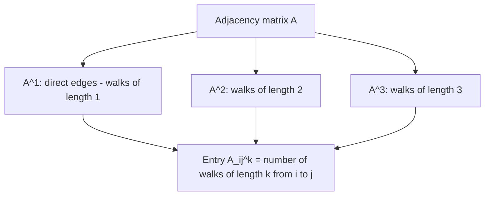

## Graph Representations Using Adjacency Matrices

### Overview

Graphs are used throughout machine learning to represent relational data such as social networks, molecular structures, and knowledge graphs. The adjacency matrix is the primary linear algebra structure used to encode a graph's connectivity, enabling graph properties and operations to be studied and computed using standard matrix operations.

### The Adjacency Matrix Definition

**Key Points**
- For a graph $G$ with $n$ nodes (vertices), the adjacency matrix $A \in \mathbb{R}^{n \times n}$ is defined such that $A_{ij} = 1$ if there is an edge connecting node $i$ and node $j$, and $A_{ij} = 0$ otherwise.
- For an undirected graph, $A$ is symmetric, meaning $A_{ij} = A_{ji}$ for all $i, j$, since an edge between two nodes has no inherent direction.
- For a directed graph, $A$ is generally not symmetric, since $A_{ij} = 1$ (an edge from node $i$ to node $j$) does not imply $A_{ji} = 1$.

**Example**

For an undirected graph with 4 nodes and edges (1,2), (2,3), (3,4), (1,4):

$$A = \begin{pmatrix} 0 & 1 & 0 & 1 \\ 1 & 0 & 1 & 0 \\ 0 & 1 & 0 & 1 \\ 1 & 0 & 1 & 0 \end{pmatrix}$$

### Graph Visualization and Corresponding Matrix

<svg xmlns="http://www.w3.org/2000/svg" viewBox="0 0 700 380">
  <text x="350" y="30" text-anchor="middle" font-size="17" font-weight="bold" fill="#1a1a1a">Graph and Adjacency Matrix (svg_diagram)</text>

  <line x1="150" y1="100" x2="280" y2="100" stroke="#333" stroke-width="2" />
  <line x1="280" y1="100" x2="280" y2="230" stroke="#333" stroke-width="2" />
  <line x1="280" y1="230" x2="150" y2="230" stroke="#333" stroke-width="2" />
  <line x1="150" y1="230" x2="150" y2="100" stroke="#333" stroke-width="2" />

  <circle cx="150" cy="100" r="18" fill="#dbe9f7" stroke="#4a90d9" stroke-width="2" />
  <text x="150" y="105" text-anchor="middle" font-size="13">1</text>

  <circle cx="280" cy="100" r="18" fill="#dbe9f7" stroke="#4a90d9" stroke-width="2" />
  <text x="280" y="105" text-anchor="middle" font-size="13">2</text>

  <circle cx="280" cy="230" r="18" fill="#dbe9f7" stroke="#4a90d9" stroke-width="2" />
  <text x="280" y="235" text-anchor="middle" font-size="13">3</text>

  <circle cx="150" cy="230" r="18" fill="#dbe9f7" stroke="#4a90d9" stroke-width="2" />
  <text x="150" y="235" text-anchor="middle" font-size="13">4</text>

  <g transform="translate(400,90)">
    <text x="90" y="-10" text-anchor="middle" font-size="12" fill="#333">Adjacency Matrix A</text>
    <rect x="0" y="0" width="180" height="180" fill="none" stroke="#333" stroke-width="1" />
    <line x1="45" y1="0" x2="45" y2="180" stroke="#ccc" />
    <line x1="90" y1="0" x2="90" y2="180" stroke="#ccc" />
    <line x1="135" y1="0" x2="135" y2="180" stroke="#ccc" />
    <line x1="0" y1="45" x2="180" y2="45" stroke="#ccc" />
    <line x1="0" y1="90" x2="180" y2="90" stroke="#ccc" />
    <line x1="0" y1="135" x2="180" y2="135" stroke="#ccc" />

    <text x="22" y="28" text-anchor="middle" font-size="13">0</text>
    <text x="67" y="28" text-anchor="middle" font-size="13">1</text>
    <text x="112" y="28" text-anchor="middle" font-size="13">0</text>
    <text x="157" y="28" text-anchor="middle" font-size="13">1</text>

    <text x="22" y="73" text-anchor="middle" font-size="13">1</text>
    <text x="67" y="73" text-anchor="middle" font-size="13">0</text>
    <text x="112" y="73" text-anchor="middle" font-size="13">1</text>
    <text x="157" y="73" text-anchor="middle" font-size="13">0</text>

    <text x="22" y="118" text-anchor="middle" font-size="13">0</text>
    <text x="67" y="118" text-anchor="middle" font-size="13">1</text>
    <text x="112" y="118" text-anchor="middle" font-size="13">0</text>
    <text x="157" y="118" text-anchor="middle" font-size="13">1</text>

    <text x="22" y="163" text-anchor="middle" font-size="13">1</text>
    <text x="67" y="163" text-anchor="middle" font-size="13">0</text>
    <text x="112" y="163" text-anchor="middle" font-size="13">1</text>
    <text x="157" y="163" text-anchor="middle" font-size="13">0</text>
  </g>
</svg>

### Weighted Graphs

**Key Points**
- For weighted graphs, the adjacency matrix generalizes so that $A_{ij}$ holds the weight of the edge between nodes $i$ and $j$ (instead of a binary 0/1 value), with $A_{ij} = 0$ typically indicating no edge exists.
- [Inference] This generalization is a standard extension described in graph theory literature; care is sometimes required to distinguish a true zero-weight edge from the absence of an edge, and how this distinction is handled depends on the specific implementation or convention used, which this response does not assert as universal.

### Sparsity of Adjacency Matrices

**Key Points**
- For graphs with many nodes but relatively few edges (sparse graphs), the adjacency matrix contains mostly zero entries.
- [Inference] Storing a sparse adjacency matrix in a dense $n \times n$ array format is commonly described in the literature as computationally wasteful for large sparse graphs, motivating the use of sparse matrix formats (such as CSR or COO, as discussed in numerical linear algebra contexts) or alternative representations such as adjacency lists. This is a general computational efficiency argument, not a claim about any specific software system's implementation.
- [Unverified] The specific threshold of sparsity at which sparse formats become more efficient than dense storage depends on hardware, implementation, and the specific operations performed on the graph, and no general threshold is asserted here as universal.

### Degree Matrix and Its Relationship to Adjacency Matrix

**Key Points**
- The degree of a node is the number of edges connected to it (for unweighted graphs) or the sum of edge weights connected to it (for weighted graphs).
- The degree matrix $D$ is a diagonal matrix where $D_{ii}$ equals the degree of node $i$, and can be computed directly from the adjacency matrix as $D_{ii} = \sum_j A_{ij}$.
- The degree matrix and adjacency matrix together form the basis for constructing the graph Laplacian, discussed below.

### The Graph Laplacian

**Key Points**
- The (unnormalized) graph Laplacian is defined as $L = D - A$, combining the degree matrix and adjacency matrix into a single matrix widely used in spectral graph theory.
- The Laplacian matrix has several standard mathematical properties established in graph theory literature, including being symmetric positive semi-definite for undirected graphs, and having an eigenvalue of 0 with multiplicity equal to the number of connected components in the graph.
- [Inference] These properties are standard, well-established results in spectral graph theory literature; they are presented here as known mathematical results, not independently re-derived or re-proven within this response.

### Adjacency Matrix Powers and Path Counting

**Key Points**
- A well-established result in graph theory states that the entry $(A^k)_{ij}$ of the $k$-th matrix power of the adjacency matrix equals the number of walks of length exactly $k$ from node $i$ to node $j$.
- This connects matrix multiplication directly to graph traversal concepts, since computing $A^2$, $A^3$, and so on reveals connectivity patterns at increasing path lengths without explicitly performing graph traversal algorithms.
- [Inference] This is a standard, well-established result in graph theory and linear algebra literature, presented here as a known mathematical property rather than independently re-derived via formal proof within this response.

### Path Counting Illustration

### Adjacency Matrices in Graph Neural Networks

**Key Points**
- Graph Neural Networks (GNNs) commonly use the adjacency matrix (often combined with node feature matrices) to define how information is propagated and aggregated between connected nodes during each network layer.
- A frequently referenced general form for a GNN layer's node feature update involves an operation structurally similar to: $H^{(l+1)} = \sigma(\hat{A}H^{(l)}W^{(l)})$, where $H^{(l)}$ is the node feature matrix at layer $l$, $W^{(l)}$ is a learnable weight matrix, $\hat{A}$ is some normalized or modified form of the adjacency matrix, and $\sigma$ is a nonlinear activation function.
- [Unverified] This is a general structural pattern commonly discussed across multiple GNN architectures in the literature (such as Graph Convolutional Networks); the exact normalization of $\hat{A}$, specific architectural details, and mathematical formulation vary meaningfully across different published GNN models, and this response does not assert this as the exact formula used by any single specific model without directly citing that model's original publication.
- I cannot verify the precise mathematical formulation used by any specific named GNN architecture (e.g., GCN, GraphSAGE, GAT) without directly citing equations from that architecture's original publication.

### Normalized Adjacency Matrices

**Key Points**
- Raw adjacency matrices are sometimes normalized before use in graph algorithms or GNN layers, commonly using the degree matrix, such as forms resembling $D^{-1}A$ (row normalization) or $D^{-1/2}AD^{-1/2}$ (symmetric normalization).
- [Inference] These normalization schemes are commonly discussed in spectral graph theory and GNN literature as intended to address issues such as nodes with very high degree disproportionately dominating aggregation computations, though the specific effects and appropriateness of any particular normalization scheme depend on the graph structure and task, and this response does not assert a specific scheme as universally best.
- [Unverified] The exact normalization formula and its variants differ across specific published GNN architectures, and this response does not attribute a specific normalization formula to any single named model without direct citation of that model's original source.

### Eigenvalues of the Adjacency Matrix (Spectral Graph Theory)

**Key Points**
- The eigenvalues of the adjacency matrix (or graph Laplacian) form the basis of spectral graph theory, a field studying graph properties through the lens of linear algebra.
- [Inference] Certain structural graph properties, such as bipartiteness or connectivity, are associated in spectral graph theory literature with specific patterns in the eigenvalues of the adjacency matrix or Laplacian; these are established mathematical results in that field, presented here as known results rather than independently re-derived within this response.
- Spectral clustering, a technique used in some machine learning applications, uses the eigenvectors of the graph Laplacian to partition graph nodes into clusters. [Unverified] The specific algorithmic steps and effectiveness of spectral clustering for any particular dataset are not detailed further here without a citable, comparative source.

### Adjacency List as an Alternative Representation

**Key Points**
- An adjacency list represents a graph by storing, for each node, a list of its neighboring nodes, rather than a full $n \times n$ matrix.
- [Inference] Adjacency lists are commonly described in computer science literature as more memory-efficient than dense adjacency matrices for sparse graphs, since they avoid explicitly storing zero entries, though [Unverified] the specific memory and computational tradeoffs between adjacency lists and sparse matrix formats depend on the specific graph structure and operations required, and this response does not assert one representation as universally superior.
- Adjacency lists do not directly support the same matrix-based linear algebra operations (such as matrix powers for path counting, or eigenvalue computations) without conversion to a matrix form.

### Common Pitfalls

**Key Points**
- Assuming an adjacency matrix is always symmetric; this only holds for undirected graphs, not directed graphs.
- Using dense adjacency matrix storage for very large, sparse real-world graphs without considering sparse matrix formats or adjacency lists, which [Inference] is commonly discussed in the literature as potentially inefficient for large-scale sparse graphs, though the specific practical impact depends on graph size and available hardware.
- Confusing zero-weight edges with the absence of an edge in weighted graph representations, which can lead to incorrect graph algorithm behavior if not handled with a clear, consistent convention.
- Attributing a single specific GNN formula or normalization scheme to "graph neural networks" in general, when specific architectures (GCN, GraphSAGE, GAT, and others) differ in their exact mathematical formulations, as documented in their respective original publications.

### Related Topics

- Graph Neural Networks and message passing architectures
- Spectral graph theory and the graph Laplacian
- Eigenvalues and eigenvectors in linear algebra
- Sparse matrix representations and formats
- Graph theory fundamentals (paths, connectivity, degree)
- Spectral clustering algorithms
- Matrix powers and their combinatorial interpretations

Correction disclaimer: I cannot verify the exact mathematical formulation, normalization scheme, or architectural details of any specific named Graph Neural Network model (such as GCN, GraphSAGE, or GAT) without directly citing equations from that model's original publication. All [Inference] and [Unverified] labeled statements reflect standard, well-established results from graph theory and linear algebra literature, or reasoned generalizations, not independently re-verified claims about any specific software system, model, or real-world graph dataset. Behavior of specific graph algorithms, libraries, or GNN implementations is not guaranteed and may vary by architecture, implementation, and version.