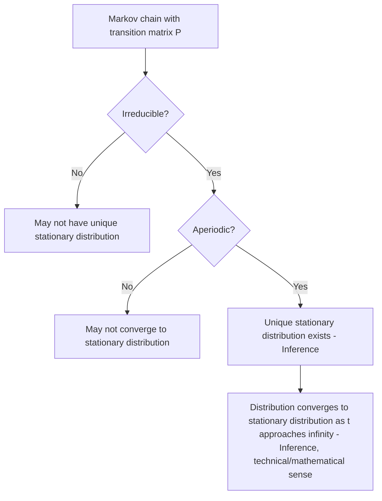

## Markov Chains and Transition Matrices

### Overview

Markov chains model systems that transition between states over time, where the probability of moving to the next state depends only on the current state. Transition matrices provide the linear algebra structure that encodes these probabilities, enabling analysis of long-run behavior, stationary distributions, and convergence properties using standard matrix operations.

### The Markov Property

**Key Points**
- A Markov chain is a sequence of random states $X_0, X_1, X_2, \ldots$ satisfying the Markov property: the probability of transitioning to the next state depends only on the current state, not on the sequence of states that preceded it.

$$P(X_{t+1} = j \mid X_t = i, X_{t-1}, \ldots, X_0) = P(X_{t+1} = j \mid X_t = i)$$

- This "memoryless" property is a defining mathematical assumption of the model, not a claim that all real-world sequential processes satisfy this assumption. [Inference] Whether any specific real-world system genuinely satisfies the Markov property is a modeling assumption that would need to be verified for that specific system, and this response does not assert it holds universally for real-world data.

### The Transition Matrix

**Key Points**
- For a Markov chain with $n$ possible states, the transition matrix $P \in \mathbb{R}^{n \times n}$ has entries $P_{ij} = P(X_{t+1} = j \mid X_t = i)$, representing the probability of moving from state $i$ to state $j$ in one step.
- Each row of $P$ must sum to 1, since it represents a full probability distribution over all possible next states given the current state. This makes $P$ a row-stochastic matrix.
- All entries of $P$ must satisfy $0 \leq P_{ij} \leq 1$, as required for valid probabilities.

**Example**

For a simple weather model with states {Sunny, Rainy}:

$$P = \begin{pmatrix} 0.8 & 0.2 \\ 0.4 & 0.6 \end{pmatrix}$$

Row 1 indicates: if currently Sunny, there is a 0.8 probability of Sunny tomorrow and 0.2 probability of Rainy tomorrow.

### Transition Diagram

<svg xmlns="http://www.w3.org/2000/svg" viewBox="0 0 700 340">
  <text x="350" y="30" text-anchor="middle" font-size="17" font-weight="bold" fill="#1a1a1a">Markov Chain Transition Diagram (svg_diagram)</text>

  <circle cx="220" cy="180" r="55" fill="#fde8b8" stroke="#d9a94a" stroke-width="2" />
  <text x="220" y="185" text-anchor="middle" font-size="15" fill="#1a1a1a">Sunny</text>

  <circle cx="480" cy="180" r="55" fill="#dbe9f7" stroke="#4a90d9" stroke-width="2" />
  <text x="480" y="185" text-anchor="middle" font-size="15" fill="#1a1a1a">Rainy</text>

  <path d="M 270 160 Q 350 110 430 160" stroke="#333" stroke-width="2" fill="none" marker-end="url(#arrowmc)" />
  <text x="350" y="110" text-anchor="middle" font-size="12" fill="#333">0.2</text>

  <path d="M 430 200 Q 350 250 270 200" stroke="#333" stroke-width="2" fill="none" marker-end="url(#arrowmc)" />
  <text x="350" y="255" text-anchor="middle" font-size="12" fill="#333">0.4</text>

  <path d="M 190 135 A 40 40 0 1 1 250 135" stroke="#d9a94a" stroke-width="2" fill="none" marker-end="url(#arrowmc)" />
  <text x="220" y="95" text-anchor="middle" font-size="12" fill="#d9a94a">0.8</text>

  <path d="M 450 135 A 40 40 0 1 1 510 135" stroke="#4a90d9" stroke-width="2" fill="none" marker-end="url(#arrowmc)" />
  <text x="480" y="95" text-anchor="middle" font-size="12" fill="#4a90d9">0.6</text>

  </svg>

[Inference] This diagram illustrates the example transition probabilities stated above. It does not represent measured data from any real weather system.

### State Distribution as a Vector

**Key Points**
- The probability distribution over states at time $t$ is represented as a row vector $\pi_t \in \mathbb{R}^{1 \times n}$, where $(\pi_t)_i = P(X_t = i)$.
- The distribution evolves over time via matrix multiplication: $\pi_{t+1} = \pi_tP$.
- This means the distribution at any future time step $k$ can be computed directly as $\pi_{t+k} = \pi_tP^k$, connecting long-run behavior of the chain to matrix powers of $P$.

### Chapman-Kolmogorov Equation and Matrix Powers

**Key Points**
- The $k$-step transition probabilities are given by the entries of $P^k$: $(P^k)_{ij} = P(X_{t+k} = j \mid X_t = i)$.
- This is a standard mathematical result in Markov chain theory known as the Chapman-Kolmogorov equation, expressed here in its matrix form. [Inference] This is a well-established result in probability theory literature, presented here as a known mathematical property rather than independently re-derived via formal proof within this response.

### Stationary Distributions

**Key Points**
- A stationary distribution $\pi$ is a probability distribution satisfying $\pi P = \pi$, meaning the distribution over states does not change after applying the transition matrix.
- This is equivalent to $\pi$ being a left eigenvector of $P$ with eigenvalue 1 (i.e., $\pi(P - I) = 0$), connecting stationary distributions directly to eigenvalue analysis.
- [Unverified] Not every Markov chain has a unique stationary distribution; existence and uniqueness depend on specific structural properties of the chain (such as irreducibility and aperiodicity, discussed below), and this response does not assert that a stationary distribution exists or is unique for an arbitrary, unspecified Markov chain.

### Conditions for Convergence: Irreducibility and Aperiodicity

**Key Points**
- A Markov chain is irreducible if every state can be reached from every other state in some finite number of steps (i.e., the chain does not decompose into separate, non-communicating subsets of states).
- A Markov chain is aperiodic if it does not cycle through states in a fixed, rigid periodic pattern.
- [Inference] A standard result in Markov chain theory (commonly stated as part of the Perron-Frobenius theorem or related ergodic theory results) is that a finite Markov chain which is both irreducible and aperiodic has a unique stationary distribution, and its state distribution converges to that stationary distribution as $t \to \infty$ regardless of the initial distribution. This is a well-established theoretical result in probability theory literature, presented here as a known result rather than independently re-derived via formal proof within this response. I am using the term "converges" here as a technical mathematical term referring to a limiting result under these specific stated conditions, not as a general claim about all Markov chains.

### Convergence Flow Diagram

### The Perron-Frobenius Connection

**Key Points**
- The Perron-Frobenius theorem, a result from linear algebra concerning matrices with non-negative entries, underlies many of the convergence guarantees associated with Markov chains.
- [Inference] This theorem is commonly cited in Markov chain literature as providing the mathematical foundation for statements about the existence of a unique largest eigenvalue (equal to 1 for stochastic matrices) and the corresponding eigenvector's role as the stationary distribution, under appropriate conditions such as irreducibility. This is a well-established result in linear algebra and probability theory literature, presented here as a known theorem, not independently re-derived via formal proof within this response.
- I cannot verify the complete formal statement and proof of the Perron-Frobenius theorem in full mathematical detail within this response without directly citing a specific mathematical reference text; only its commonly cited relevance to Markov chains is summarized here.

### Computing the Stationary Distribution

**Key Points**
- The stationary distribution can be found by solving the linear system $\pi(P - I) = 0$ subject to the constraint $\sum_i \pi_i = 1$ (since $\pi$ must be a valid probability distribution).
- Alternatively, for well-behaved (irreducible, aperiodic) chains, the stationary distribution can be approximated numerically by computing $\pi_0P^k$ for a sufficiently large $k$, starting from any initial distribution $\pi_0$, since the distribution is expected to approach the stationary distribution under the convergence conditions described above. [Inference] The specific value of $k$ required for a given numerical tolerance depends on the specific transition matrix's spectral properties (particularly the second-largest eigenvalue magnitude), and this response does not assert a general value of $k$ as universally sufficient.

### Applications in Machine Learning

**Key Points**
- Markov chains and transition matrices underlie several machine learning and related algorithms, including Markov Chain Monte Carlo (MCMC) sampling methods, Hidden Markov Models (HMMs), and certain reinforcement learning formulations involving Markov Decision Processes (MDPs).
- [Unverified] PageRank, a well-known algorithm historically associated with web search ranking, is commonly described in the literature as based on a Markov chain model of a "random surfer" navigating between linked pages, with the transition matrix derived from the link structure of the web graph; I cannot verify specific current implementation details of any particular production search system without a citable, up-to-date source, so this description is limited to the commonly cited conceptual/mathematical model rather than any specific deployed system.
- [Inference] Reinforcement learning's formulation of Markov Decision Processes extends the Markov chain framework by incorporating actions and rewards, and this connection is a standard theoretical framing found in reinforcement learning literature, presented here as an established conceptual link rather than a full independently re-derived formulation within this response.

### Matrix Properties Relevant to Markov Chains

**Key Points**
- Because $P$ is row-stochastic (rows sum to 1), it always has an eigenvalue equal to 1, with a corresponding right eigenvector of all ones: $P\mathbf{1} = \mathbf{1}$.
- [Inference] This property follows directly from the row-sum-to-1 definition of a stochastic matrix; it is a standard, straightforward mathematical consequence commonly noted in linear algebra treatments of stochastic matrices, presented here as an established property rather than independently re-derived via extensive formal proof.
- All eigenvalues of a stochastic matrix have magnitude less than or equal to 1, a standard property established in relation to the Perron-Frobenius theorem for non-negative matrices. [Inference] This is a well-established result in linear algebra literature concerning stochastic matrices, not independently re-derived via formal proof within this response.

### Common Pitfalls

**Key Points**
- Assuming every Markov chain has a unique stationary distribution without verifying irreducibility and aperiodicity conditions, which are required for the standard convergence guarantees discussed above.
- Confusing the row-stochastic convention ($\pi_{t+1} = \pi_tP$, rows sum to 1) with an alternative column-stochastic convention used in some other sources; both conventions exist in the literature; [Unverified] which convention any specific textbook or software implementation uses is not addressed here without checking that specific source.
- Assuming the Markov property (memorylessness) holds for a real-world sequential process without explicitly verifying or justifying this modeling assumption for that specific system; this response does not claim the Markov property is generally true for arbitrary real-world data.
- Treating numerical approximation of the stationary distribution via $\pi_0P^k$ as exact for any finite $k$, when this is technically a limiting approximation that depends on convergence rate and chosen tolerance.

### Related Topics

- Eigenvalues and eigenvectors in linear algebra
- Perron-Frobenius theorem for non-negative matrices
- Hidden Markov Models and the forward-backward algorithm
- Markov Decision Processes and reinforcement learning
- Markov Chain Monte Carlo (MCMC) sampling methods
- PageRank algorithm and graph-based ranking
- Spectral graph theory and adjacency matrices

Correction disclaimer: I cannot verify the complete formal proof of the Perron-Frobenius theorem, specific implementation details of any current production system (including search ranking systems), or convergence rate figures for any specific transition matrix without citable, verifiable mathematical references or direct computation on that specific matrix. All [Inference] and [Unverified] labeled statements reflect standard, well-established results from probability theory and linear algebra literature, or reasoned generalizations from those results, not independently re-verified claims beyond what is stated. Behavior of specific algorithms, software implementations, or real-world systems modeled as Markov chains is not guaranteed and may vary by implementation, data, and context.