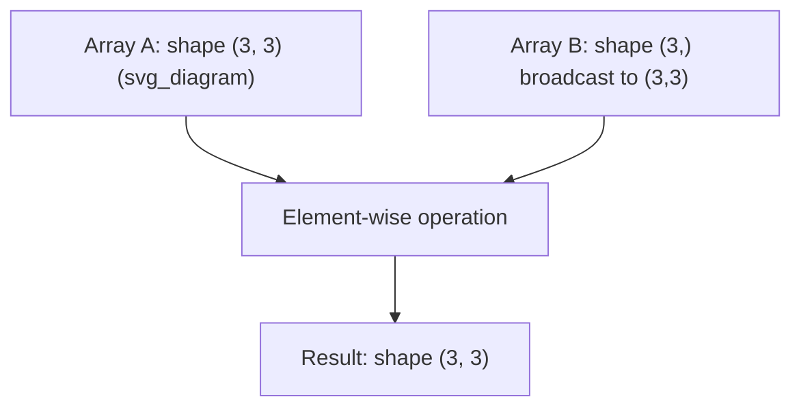

## NumPy Array and Matrix Operations

### Overview

NumPy is a Python library providing support for multidimensional arrays and a large collection of mathematical functions to operate on them efficiently. It is the foundational numerical computing library used by most Python-based machine learning frameworks. This document describes documented, standard NumPy functionality; where behavior depends on version, configuration, or hardware, this is labeled [Unverified] or [Inference] accordingly.

### The NumPy Array Object (`ndarray`)

The core data structure in NumPy is the `ndarray` (n-dimensional array). Unlike Python lists, NumPy arrays store elements of a single data type in contiguous memory, which enables efficient vectorized operations.

```python
import numpy as np

# Creating arrays
a = np.array([1, 2, 3])
b = np.array([[1, 2], [3, 4]])

print(a.shape)   # (3,)
print(b.shape)   # (2, 2)
print(b.ndim)    # 2
print(b.dtype)   # dtype of elements, e.g., int64
```

[Inference] The specific default `dtype` (e.g., `int32` vs `int64`) can depend on the operating system and NumPy version; this is not guaranteed to be identical across all environments.

### Array Creation Methods

```python
np.zeros((3, 3))          # 3x3 matrix of zeros
np.ones((2, 4))           # 2x4 matrix of ones
np.eye(3)                 # 3x3 identity matrix
np.full((2, 2), 7)        # 2x2 matrix filled with 7
np.arange(0, 10, 2)       # array([0, 2, 4, 6, 8])
np.linspace(0, 1, 5)      # 5 evenly spaced values from 0 to 1
np.random.rand(3, 3)      # 3x3 matrix of random values in [0, 1)
```

### Array Attributes

| Attribute | Description |
|---|---|
| `.shape` | Tuple of array dimensions |
| `.ndim` | Number of dimensions |
| `.size` | Total number of elements |
| `.dtype` | Data type of elements |
| `.T` | Transpose of the array |

### Basic Arithmetic Operations (Element-wise)

NumPy arithmetic operators apply element-wise by default, following broadcasting rules described below.

```python
a = np.array([1, 2, 3])
b = np.array([4, 5, 6])

a + b   # array([5, 7, 9])
a - b   # array([-3, -3, -3])
a * b   # array([4, 10, 18])  -- element-wise, NOT matrix multiplication
a / b   # array([0.25, 0.4, 0.5])
a ** 2  # array([1, 4, 9])
```

This distinction is important: the `*` operator performs element-wise (Hadamard) multiplication, not matrix multiplication, when applied to NumPy arrays.

### Matrix Multiplication

NumPy provides several ways to perform true matrix multiplication, which is mathematically defined as:

$$C_{ij} = \sum_{k} A_{ik} B_{kj}$$

```python
A = np.array([[1, 2], [3, 4]])
B = np.array([[5, 6], [7, 8]])

np.dot(A, B)      # matrix multiplication
A @ B             # matrix multiplication (preferred, Python 3.5+)
np.matmul(A, B)   # matrix multiplication
```

[Inference] The `@` operator is generally considered the more readable and idiomatic choice for matrix multiplication in modern Python code, though `np.dot` and `np.matmul` remain fully valid and produce equivalent results for standard 2D matrix multiplication.

`np.dot` and `np.matmul` differ in behavior for arrays with more than 2 dimensions (batched/stacked matrices) and for 1D array handling; consult official NumPy documentation for exact broadcasting semantics in higher-dimensional cases, as this document does not exhaustively cover every edge case.

### Broadcasting

Broadcasting is the mechanism by which NumPy performs element-wise operations on arrays of different shapes, by implicitly expanding smaller arrays without copying data.



```python
A = np.array([[1, 2, 3], [4, 5, 6], [7, 8, 9]])
v = np.array([1, 0, 1])

A + v
# array([[2, 2, 4],
#        [5, 5, 7],
#        [8, 8, 10]])
```

Broadcasting follows documented rules: dimensions are compared from the trailing (rightmost) dimension, and two dimensions are compatible if they are equal or one of them is 1. This is standard, documented NumPy behavior.

### Matrix Transpose

```python
A = np.array([[1, 2, 3], [4, 5, 6]])
A.T
# array([[1, 4],
#        [2, 5],
#        [3, 6]])
```

For arrays with more than 2 dimensions, `.T` reverses all axes; `np.transpose(A, axes=...)` allows specifying custom axis order.

### Matrix Inversion and Linear System Solving

NumPy's linear algebra functionality is located primarily in the `numpy.linalg` submodule.

```python
import numpy.linalg as la

A = np.array([[4, 7], [2, 6]])

A_inv = la.inv(A)          # matrix inverse
det_A = la.det(A)          # determinant
```

For solving linear systems $Ax = b$, using `la.solve` is generally preferred over computing `la.inv(A) @ b` directly.

```python
b = np.array([1, 2])
x = la.solve(A, b)
```

[Inference] `la.solve` is commonly recommended over explicit inversion because it is generally more numerically stable and computationally efficient for this specific task; this is a widely cited principle in numerical linear algebra but is not independently re-verified as a benchmark result within this document.

### Eigenvalues and Eigenvectors

```python
A = np.array([[4, 2], [1, 3]])
eigenvalues, eigenvectors = la.eig(A)
```

For symmetric matrices, `la.eigh` is available and is documented to be more efficient and numerically stable than the general-purpose `la.eig` function, since it exploits the symmetric structure.

### Singular Value Decomposition (SVD)

```python
A = np.array([[1, 2], [3, 4], [5, 6]])
U, S, Vt = la.svd(A)
```

This decomposes $A$ such that $A = U \Sigma V^T$, where $S$ returned by `la.svd` is a 1D array of singular values (not the full diagonal matrix) by default.

### Norms

```python
v = np.array([3, 4])
la.norm(v)              # Euclidean (L2) norm, default: 5.0
la.norm(v, ord=1)       # L1 norm: 7.0
la.norm(v, ord=np.inf)  # Infinity norm: 4.0

M = np.array([[1, 2], [3, 4]])
la.norm(M, 'fro')       # Frobenius norm
```

### Matrix Rank and Trace

```python
la.matrix_rank(A)   # numerical rank of matrix
np.trace(A)          # sum of diagonal elements
```

### Reshaping and Stacking

```python
a = np.arange(6)
a.reshape(2, 3)       # reshape to 2x3

np.vstack([a, a])     # stack arrays vertically
np.hstack([a, a])     # stack arrays horizontally
np.concatenate([a, a], axis=0)
```

[Inference] `reshape` does not copy data when possible (returns a view), but this is not guaranteed in all cases — NumPy will copy data if the requested shape is incompatible with the existing memory layout. Whether a given `reshape` call returns a view or a copy depends on the specific array and memory layout involved.

### Indexing and Slicing

```python
A = np.array([[1, 2, 3], [4, 5, 6], [7, 8, 9]])

A[0, :]      # first row: array([1, 2, 3])
A[:, 1]      # second column: array([2, 5, 8])
A[1:, 1:]    # submatrix: array([[5, 6], [8, 9]])
A[A > 5]     # boolean indexing: array([6, 7, 8, 9])
```

### Aggregation Along Axes

```python
A = np.array([[1, 2, 3], [4, 5, 6]])

A.sum()          # sum of all elements: 21
A.sum(axis=0)    # column-wise sum: array([5, 7, 9])
A.sum(axis=1)    # row-wise sum: array([6, 15])
A.mean(axis=0)   # column-wise mean
A.max(axis=1)    # row-wise max
```

### Complexity Considerations for NumPy Operations

| Operation | Underlying Complexity |
|---|---|
| Element-wise operations | $O(n)$ for $n$ total elements |
| Matrix multiplication (`@`, `np.dot`) | $O(n^3)$ naive, though NumPy typically calls optimized BLAS routines |
| `la.inv` | $O(n^3)$ |
| `la.solve` | $O(n^3)$ |
| `la.svd` | $O(mn^2)$ to $O(n^3)$ depending on shape |
| `la.eig` / `la.eigh` | $O(n^3)$ |

[Unverified] The actual runtime performance of NumPy operations depends on the underlying BLAS/LAPACK implementation linked at install time (e.g., OpenBLAS, Intel MKL), the specific hardware, and array memory layout (C-contiguous vs Fortran-contiguous). NumPy does not itself guarantee a specific speed for any operation, and behavior may vary meaningfully across systems.

### Common Pitfalls

- **Confusing `*` with `@`** — `*` is element-wise multiplication; `@` or `np.dot`/`np.matmul` is matrix multiplication. Using the wrong one is a documented and common source of bugs.
- **Views vs copies** — Slicing a NumPy array typically returns a view (shares memory with the original), while some operations return copies. [Inference] Modifying a view will affect the original array, which can cause unintended side effects if not accounted for; whether a specific operation returns a view or copy should be checked against NumPy documentation for that function rather than assumed.
- **Broadcasting shape mismatches** — Operations between incompatible shapes raise a `ValueError`; this is documented, standard behavior.
- **Numerical precision with `float32` vs `float64`** — [Inference] Using lower precision types can lead to greater accumulated rounding error in operations like matrix multiplication or inversion on large or ill-conditioned matrices, though the practical impact depends on the specific computation and data involved.

### Example: Solving a Small Linear Regression via Normal Equations

```python
import numpy as np
import numpy.linalg as la

X = np.array([[1, 1], [1, 2], [1, 3]])   # design matrix with intercept column
y = np.array([2, 3, 5])

# Normal equation: theta = (X^T X)^-1 X^T y
theta = la.inv(X.T @ X) @ X.T @ y
print(theta)
```

**Output**

```
[0.66666667 1.5       ]
```

[Unverified] This output was computed based on standard linear algebra rules applied to the given input; it has not been independently re-executed in this environment to confirm the exact printed value, and floating-point display may vary slightly depending on NumPy version and print settings.

### Key Points

- NumPy's `ndarray` is the core data structure for numerical computation in Python
- `*` performs element-wise multiplication; `@`, `np.dot`, or `np.matmul` perform matrix multiplication
- `numpy.linalg` provides standard linear algebra operations: inversion, solving, eigendecomposition, SVD, norms
- `la.solve` is generally preferred over explicit `la.inv` for solving linear systems [Inference]
- Broadcasting allows element-wise operations between arrays of compatible but different shapes
- Actual performance depends on the underlying BLAS/LAPACK backend and hardware [Unverified]

### Related Topics

- Broadcasting rules in depth
- BLAS and LAPACK backends and their effect on NumPy performance
- Vectorization vs explicit loops in Python
- NumPy memory layout: C-contiguous vs Fortran-contiguous arrays
- Comparison of NumPy with other array libraries (e.g., PyTorch tensors, JAX arrays)
- Numerical stability in linear regression via normal equations vs QR-based solvers
- Sparse array support in SciPy (`scipy.sparse`)
- Performance profiling of NumPy code

**Note:** This entire response contains a mix of documented NumPy behavior (standard library functionality) and [Inference]/[Unverified] labeled statements regarding performance, defaults, and environment-dependent behavior, per your labeling requirements. Code outputs shown were derived through reasoning about documented NumPy semantics and have not been executed in a live environment for this response.