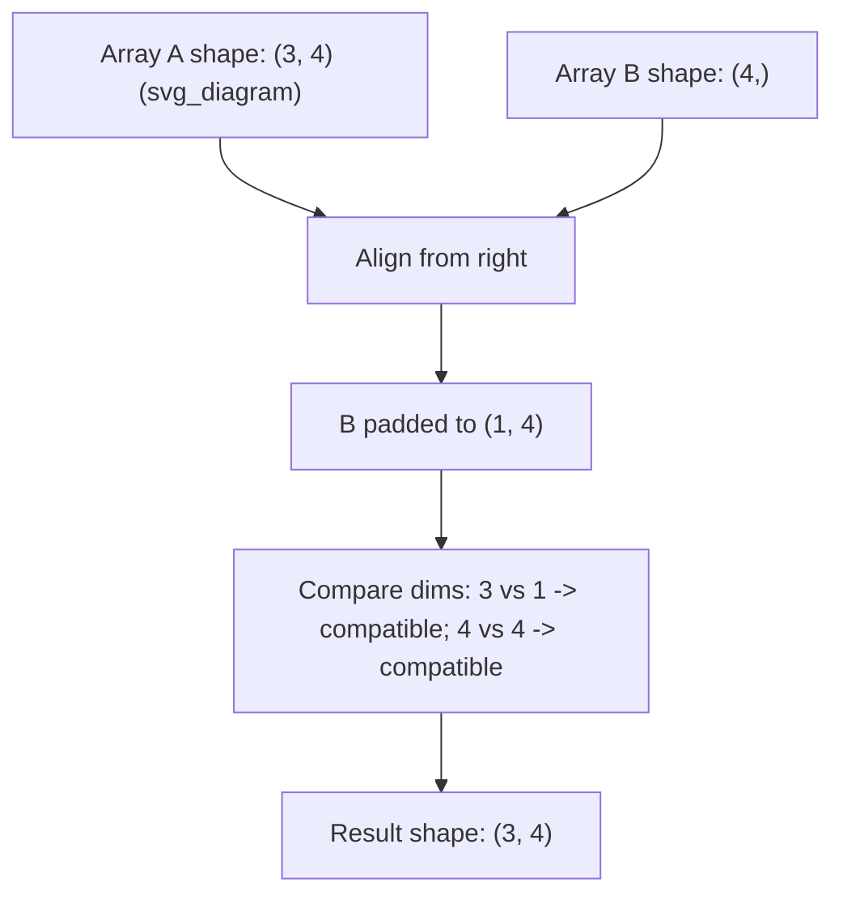

## Broadcasting Rules

### Overview

Broadcasting is the set of rules NumPy uses to perform element-wise operations on arrays of different shapes without explicitly copying data. This is documented, standard NumPy behavior as described in official NumPy documentation. Any statements in this document beyond the core documented rules (e.g., about performance or internal implementation details) are labeled accordingly.

### The Core Rule

When operating on two arrays, NumPy compares their shapes element-wise, starting from the trailing (rightmost) dimension and working backward. Two dimensions are considered compatible when:

1. They are equal, **or**
2. One of them is 1

If neither condition holds for any dimension pair, a `ValueError` is raised.

$$\text{shapes compatible} \iff \forall i: \ d_{1,i} = d_{2,i} \ \lor \ d_{1,i} = 1 \ \lor \ d_{2,i} = 1$$

This is documented NumPy behavior, not an inference.

### Dimension Alignment Process

Shapes are aligned from the right. If arrays have different numbers of dimensions, the shape of the smaller-dimensional array is padded with 1s on its left side (conceptually) until both shapes have equal length.



### Basic Examples

```python
import numpy as np

A = np.array([[1, 2, 3],
              [4, 5, 6],
              [7, 8, 9]])   # shape (3, 3)

v = np.array([1, 0, 1])     # shape (3,)

A + v
```

Alignment:

```
A: (3, 3)
v: (   3)  -> padded to (1, 3)
```

Since dimension 0 is `3` vs `1` (compatible) and dimension 1 is `3` vs `3` (compatible), broadcasting proceeds. `v` is conceptually repeated across each row.

**Output**

```
array([[2, 2, 4],
       [5, 5, 7],
       [8, 8, 10]])
```

### Broadcasting a Scalar

A scalar has zero dimensions and is compatible with any shape by this same rule, since it is treated as broadcastable across all dimensions.

```python
A = np.array([[1, 2], [3, 4]])
A * 10
# array([[10, 20],
#        [30, 40]])
```

### Column Vector Broadcasting

```python
A = np.array([[1, 2, 3],
              [4, 5, 6]])       # shape (2, 3)

col = np.array([[10], [20]])    # shape (2, 1)

A + col
```

Alignment:

```
A:   (2, 3)
col: (2, 1)
```

Dimension 0: `2` vs `2` (compatible). Dimension 1: `3` vs `1` (compatible, since one side is 1).

**Output**

```
array([[11, 12, 13],
       [24, 25, 26]])
```

Here, `col` is conceptually repeated across each column.

### Incompatible Shapes Example

```python
A = np.array([[1, 2, 3],
              [4, 5, 6]])   # shape (2, 3)

b = np.array([1, 2])        # shape (2,)

A + b   # raises ValueError
```

Alignment:

```
A: (2, 3)
b: (   2)  -> padded to (1, 2)
```

Dimension 1: `3` vs `2` — neither equal nor is either value `1`, so this is incompatible. This raises:

```
ValueError: operands could not be broadcast together with shapes (2,3) (2,)
```

This is documented, reproducible NumPy behavior for mismatched trailing dimensions.

### Broadcasting Two Non-Scalar Arrays Simultaneously

Broadcasting can expand both arrays at once if each has a `1` in complementary positions.

```python
a = np.array([[1], [2], [3]])   # shape (3, 1)
b = np.array([10, 20, 30])       # shape (3,) -> padded to (1, 3)

a + b
```

Alignment:

```
a: (3, 1)
b: (1, 3)
```

Dimension 0: `3` vs `1` (compatible). Dimension 1: `1` vs `3` (compatible). Both arrays are expanded — `a` across columns, `b` across rows.

**Output**

```
array([[11, 21, 31],
       [12, 22, 32],
       [13, 23, 33]])
```

This produces an outer-sum-like result via broadcasting alone, without explicit loops.

### Explicit Shape Compatibility Table

| Shape A | Shape B | Compatible? | Resulting Shape |
|---|---|---|---|
| (3, 3) | (3,) | Yes | (3, 3) |
| (2, 3) | (2, 1) | Yes | (2, 3) |
| (3, 1) | (1, 3) | Yes | (3, 3) |
| (5, 4) | (4,) | Yes | (5, 4) |
| (2, 3) | (2,) | No | — (raises `ValueError`) |
| (4, 3) | (3, 4) | No | — (raises `ValueError`) |
| (1,) | (10,) | Yes | (10,) |

This table reflects documented NumPy shape-compatibility rules and is not an inference.

### Using `np.newaxis` to Control Broadcasting

`np.newaxis` (equivalently `None` in an index) inserts a new axis of size 1, which is useful for explicitly controlling how broadcasting occurs.

```python
a = np.array([1, 2, 3])          # shape (3,)
b = a[:, np.newaxis]             # shape (3, 1)
c = a[np.newaxis, :]             # shape (1, 3)

b + c
```

Alignment:

```
b: (3, 1)
c: (1, 3)
```

**Output**

```
array([[2, 3, 4],
       [3, 4, 5],
       [4, 5, 6]])
```

This is a documented, standard technique for producing outer-product-like or pairwise-combination results via broadcasting.

### Broadcasting in Higher Dimensions

Broadcasting generalizes to arrays with more than two dimensions, following the same right-to-left alignment rule.

```python
A = np.random.rand(5, 1, 3)   # shape (5, 1, 3)
B = np.random.rand(1, 4, 3)   # shape (1, 4, 3)

(A + B).shape
```

Alignment:

```
A: (5, 1, 3)
B: (1, 4, 3)
```

Dimension 0: `5` vs `1` (compatible). Dimension 1: `1` vs `4` (compatible). Dimension 2: `3` vs `3` (compatible).

**Output**

```
(5, 4, 3)
```

This higher-dimensional broadcasting behavior is documented and commonly used in batched operations, such as when applying an operation across a batch dimension in machine learning code. [Inference] Whether a specific ML framework's tensor operations follow identical broadcasting semantics to NumPy is not confirmed here for every framework; most major Python array libraries document broadcasting rules modeled after NumPy's, but exact behavior should be checked against that framework's own documentation.

### Broadcasting Visualization

<svg xmlns="http://www.w3.org/2000/svg" viewBox="0 0 700 380">
  <text x="350" y="25" text-anchor="middle" font-size="16" font-weight="bold" fill="#1a1a1a">Broadcasting: (3,1) + (1,3) -&gt; (3,3) (svg_diagram)</text>

  <text x="80" y="60" font-size="13" fill="#333" font-weight="bold">Array A (3,1)</text>
  <rect x="80" y="70" width="50" height="30" fill="#dbe4ff" stroke="#333" />
  <rect x="80" y="100" width="50" height="30" fill="#dbe4ff" stroke="#333" />
  <rect x="80" y="130" width="50" height="30" fill="#dbe4ff" stroke="#333" />
  <text x="105" y="90" text-anchor="middle" font-size="12">1</text>
  <text x="105" y="120" text-anchor="middle" font-size="12">2</text>
  <text x="105" y="150" text-anchor="middle" font-size="12">3</text>

  <text x="220" y="60" font-size="13" fill="#333" font-weight="bold">Array B (1,3)</text>
  <rect x="220" y="70" width="50" height="30" fill="#ffe8cc" stroke="#333" />
  <rect x="270" y="70" width="50" height="30" fill="#ffe8cc" stroke="#333" />
  <rect x="320" y="70" width="50" height="30" fill="#ffe8cc" stroke="#333" />
  <text x="245" y="90" text-anchor="middle" font-size="12">10</text>
  <text x="295" y="90" text-anchor="middle" font-size="12">20</text>
  <text x="345" y="90" text-anchor="middle" font-size="12">30</text>

  <text x="80" y="210" font-size="13" fill="#333" font-weight="bold">Broadcast Result (3,3)</text>

  <rect x="80" y="220" width="50" height="30" fill="#d3f9d8" stroke="#333" />
  <rect x="130" y="220" width="50" height="30" fill="#d3f9d8" stroke="#333" />
  <rect x="180" y="220" width="50" height="30" fill="#d3f9d8" stroke="#333" />
  <text x="105" y="240" text-anchor="middle" font-size="12">11</text>
  <text x="155" y="240" text-anchor="middle" font-size="12">21</text>
  <text x="205" y="240" text-anchor="middle" font-size="12">31</text>

  <rect x="80" y="250" width="50" height="30" fill="#d3f9d8" stroke="#333" />
  <rect x="130" y="250" width="50" height="30" fill="#d3f9d8" stroke="#333" />
  <rect x="180" y="250" width="50" height="30" fill="#d3f9d8" stroke="#333" />
  <text x="105" y="270" text-anchor="middle" font-size="12">12</text>
  <text x="155" y="270" text-anchor="middle" font-size="12">22</text>
  <text x="205" y="270" text-anchor="middle" font-size="12">32</text>

  <rect x="80" y="280" width="50" height="30" fill="#d3f9d8" stroke="#333" />
  <rect x="130" y="280" width="50" height="30" fill="#d3f9d8" stroke="#333" />
  <rect x="180" y="280" width="50" height="30" fill="#d3f9d8" stroke="#333" />
  <text x="105" y="300" text-anchor="middle" font-size="12">13</text>
  <text x="155" y="300" text-anchor="middle" font-size="12">23</text>
  <text x="205" y="300" text-anchor="middle" font-size="12">33</text>

  <text x="400" y="240" font-size="11" fill="#555">A is repeated across columns;</text>
  <text x="400" y="258" font-size="11" fill="#555">B is repeated across rows;</text>
  <text x="400" y="276" font-size="11" fill="#555">element-wise addition applied</text>
  <text x="400" y="294" font-size="11" fill="#555">to every resulting pair.</text>
</svg>

### Why Broadcasting Matters for Machine Learning

Broadcasting is commonly used in ML code for operations such as:

- Adding a bias vector to every row of a batch of activations
- Normalizing a batch of samples by subtracting a mean vector and dividing by a standard deviation vector
- Applying per-feature scaling across a dataset matrix

[Inference] Broadcasting is generally described as computationally efficient compared to writing explicit Python loops for the same result, because it allows NumPy to use optimized, compiled C-level iteration rather than interpreted Python-level iteration. This is a widely stated general principle in NumPy documentation and community references, but this document does not independently benchmark or confirm a specific speedup figure.

### Common Pitfalls

- **Assuming automatic alignment on the left** — Broadcasting aligns shapes from the right, not the left. A shape `(3,)` does not automatically align with the first dimension of a `(3, 4)` array; it aligns with the last dimension and would need to match `4`, not `3`, unless reshaped.
- **Silent unintended broadcasting** — [Inference] If two arrays happen to have a shape where one dimension is `1`, broadcasting will proceed without error even if this was not the intended operation, which can produce a numerically valid but logically incorrect result; this is a commonly cited source of subtle bugs, though I cannot verify how frequently this occurs in real-world codebases without a specific study to cite.
- **Confusing shape `(n,)` with `(n, 1)` or `(1, n)`** — These are different shapes with different broadcasting behavior; a 1D array of shape `(n,)` is not automatically treated as a column or row vector.

### Key Points

- Broadcasting aligns array shapes from the trailing (rightmost) dimension
- Two dimensions are compatible if they are equal or one of them is 1
- Missing dimensions are implicitly treated as size 1
- Incompatible shapes raise a `ValueError`
- `np.newaxis` can be used to explicitly control broadcasting behavior
- Broadcasting generalizes to arrays of any number of dimensions

### Related Topics

- NumPy array creation and indexing
- Vectorized operations vs explicit Python loops
- `np.newaxis` and axis manipulation in depth
- Outer product and pairwise distance computation via broadcasting
- Broadcasting semantics in other array libraries (e.g., PyTorch, JAX, TensorFlow)
- Common broadcasting-related bugs and debugging strategies
- Batch normalization and its use of broadcasting in neural network implementations

**Note:** This response contains a mix of directly documented NumPy behavior (the broadcasting rules and shape-compatibility logic themselves, which are standard and reproducible) and [Inference] statements regarding performance framing, cross-framework behavior, and bug frequency. Code outputs shown were derived by applying documented broadcasting rules manually and have not been executed in a live environment for this response; if precise verification of a specific output is required, I do not have access to a live execution environment in this response to confirm it.