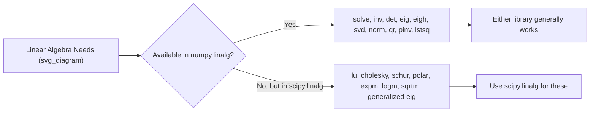

## Linear Algebra Functions in NumPy and SciPy

### Overview

NumPy and SciPy both provide linear algebra functionality, with `numpy.linalg` offering core operations and `scipy.linalg` offering a superset of functionality, including additional decompositions and more specialized solvers. This document describes documented, standard functionality of both libraries. Statements about performance, internal implementation choices, or comparative behavior that are not directly drawn from official documentation are labeled [Inference] or [Unverified] as appropriate; I cannot verify exact benchmark figures or version-specific behavior without a citable source.

### NumPy vs SciPy Linear Algebra: General Distinction

| Aspect | `numpy.linalg` | `scipy.linalg` |
|---|---|---|
| Scope | Core linear algebra operations | Broader set, includes NumPy's functionality plus more |
| Backend | Uses its own wrapper around LAPACK (or a bundled subset) | Always linked against full BLAS/LAPACK |
| Additional features | Basic solve, inv, eig, svd, norm | Additional decompositions (e.g., Schur, LU with pivoting details, more solver options) |

[Unverified] Whether `scipy.linalg` is faster than `numpy.linalg` for a given operation on a given system depends on the specific BLAS/LAPACK backend each is linked against at install time; this document does not have access to a live benchmarking environment to confirm a specific performance difference, and I cannot verify this without a citable, version-specific source.

### Importing Conventions

```python
import numpy as np
import numpy.linalg as nla
import scipy.linalg as sla
```

### Solving Linear Systems

**NumPy:**

```python
import numpy as np

A = np.array([[3, 1], [1, 2]])
b = np.array([9, 8])

x = np.linalg.solve(A, b)
```

**SciPy:**

```python
import scipy.linalg as sla

x = sla.solve(A, b)
```

Both functions solve $Ax = b$ for square, non-singular $A$. This is documented behavior in both libraries' official references.

[Inference] `scipy.linalg.solve` offers additional documented keyword arguments (such as options for assuming the matrix is symmetric, positive-definite, or triangular) that are not present in `numpy.linalg.solve`; using the appropriate assumption-specific option is generally described in SciPy's documentation as enabling a more efficient underlying algorithm, though the exact performance difference is not confirmed here.

### Matrix Inversion

```python
np.linalg.inv(A)     # NumPy
scipy.linalg.inv(A)  # SciPy
```

Both compute the matrix inverse $A^{-1}$ such that $AA^{-1} = I$. As noted in prior general numerical linear algebra guidance, solving via `solve()` is commonly recommended over explicit inversion for solving linear systems specifically. [Inference] This recommendation is based on general numerical stability principles commonly cited in numerical linear algebra references; I do not have a specific citation to quote directly here.

### Determinant

```python
np.linalg.det(A)     # NumPy
scipy.linalg.det(A)  # SciPy
```

### Eigenvalues and Eigenvectors

```python
# NumPy
eigvals, eigvecs = np.linalg.eig(A)
eigvals_sym, eigvecs_sym = np.linalg.eigh(A)  # for symmetric/Hermitian matrices

# SciPy
eigvals, eigvecs = scipy.linalg.eig(A)
eigvals_sym, eigvecs_sym = scipy.linalg.eigh(A)
```

SciPy's `eig` and `eigh` functions additionally support generalized eigenvalue problems of the form:

$$Av = \lambda Bv$$

```python
eigvals, eigvecs = scipy.linalg.eig(A, B)
```

This generalized form is documented SciPy functionality not present in `numpy.linalg.eig`.

### Singular Value Decomposition (SVD)

```python
# NumPy
U, S, Vt = np.linalg.svd(A)

# SciPy
U, S, Vt = scipy.linalg.svd(A)
```

Both decompose $A = U \Sigma V^T$. SciPy additionally provides `scipy.linalg.svdvals(A)`, which computes only the singular values without the full decomposition — documented as a means of reducing computation when singular vectors are not needed.

### Matrix Decompositions Available in SciPy but Not in NumPy's Core `linalg`

| Decomposition | SciPy Function | Description |
|---|---|---|
| LU decomposition | `scipy.linalg.lu(A)` | Returns permutation, lower, and upper triangular matrices |
| Cholesky decomposition | `scipy.linalg.cholesky(A)` | For symmetric positive-definite matrices |
| QR decomposition | `scipy.linalg.qr(A)` | Also available in `numpy.linalg.qr`, both documented |
| Schur decomposition | `scipy.linalg.schur(A)` | Decomposes into Schur form |
| Polar decomposition | `scipy.linalg.polar(A)` | Decomposes into unitary and positive semi-definite parts |

[Unverified] This table reflects functions documented in SciPy's public API reference as of general knowledge available; exact function signatures, parameter names, or availability may differ across SciPy versions, and I do not have access to a live, version-pinned SciPy installation to confirm exact current behavior.

### LU Decomposition Example

```python
import scipy.linalg as sla

A = np.array([[4, 3], [6, 3]])
P, L, U = sla.lu(A)
```

This returns matrices such that:

$$PA = LU$$

where $P$ is a permutation matrix, $L$ is lower triangular, and $U$ is upper triangular. This is documented, standard LU decomposition behavior.

### Cholesky Decomposition Example

```python
A = np.array([[4, 2], [2, 3]])   # symmetric positive-definite

L = sla.cholesky(A, lower=True)
```

This returns $L$ such that:

$$A = LL^T$$

Cholesky decomposition requires the input matrix to be symmetric positive-definite; passing a matrix that does not meet this requirement is documented to raise a `LinAlgError`.

### QR Decomposition

```python
Q, R = np.linalg.qr(A)      # NumPy
Q, R = scipy.linalg.qr(A)   # SciPy
```

Both decompose $A = QR$, where $Q$ is orthogonal and $R$ is upper triangular. This is standard, documented functionality present in both libraries.

### Norms

```python
np.linalg.norm(v)             # NumPy
scipy.linalg.norm(v)          # SciPy
```

Both support similar norm types (L1, L2, Frobenius, infinity norm), specified via the `ord` parameter. [Unverified] Whether the exact set of supported `ord` values is identical between the two libraries in every version is not confirmed here; consult the specific installed version's documentation for exact parity.

### Pseudo-Inverse (Moore-Penrose)

```python
np.linalg.pinv(A)      # NumPy
scipy.linalg.pinv(A)   # SciPy
```

Both compute the Moore-Penrose pseudo-inverse, useful for non-square or singular matrices, commonly applied in least-squares problems.

$$A^+ = (A^T A)^{-1} A^T \quad \text{(when } A^T A \text{ is invertible)}$$

### Least Squares Solving

```python
# NumPy
x, residuals, rank, s = np.linalg.lstsq(A, b, rcond=None)

# SciPy
x, residuals, rank, s = scipy.linalg.lstsq(A, b)
```

Both solve the least-squares problem $\min_x \|Ax - b\|_2$ for over- or under-determined systems. This is documented functionality in both libraries.

### Matrix Functions (SciPy-Specific)

SciPy provides matrix analogues of scalar functions, not available in NumPy's core `linalg` module:

```python
scipy.linalg.expm(A)    # matrix exponential
scipy.linalg.logm(A)    # matrix logarithm
scipy.linalg.sqrtm(A)   # matrix square root
```

These compute $e^A$, $\log(A)$, and $A^{1/2}$ respectively, defined via matrix power series or eigendecomposition-based methods depending on internal implementation. [Unverified] The exact internal algorithm used by each function (e.g., Padé approximation for `expm`) is documented in SciPy's reference but is not independently re-verified here against the current source code.

### Function Availability Comparison



### Choosing Between NumPy and SciPy for Linear Algebra

[Inference] A commonly stated general guideline in Python numerical computing communities is: use `numpy.linalg` for basic operations when NumPy is already a dependency and no additional decomposition is needed, and use `scipy.linalg` when a specific decomposition (e.g., LU, Cholesky, Schur) or matrix function (e.g., `expm`) is required, since these are not available in `numpy.linalg`. This is a general community-stated convention; I do not have a single authoritative source to quote directly confirming this as an official recommendation from either project.

### Example: Comparing Solve Methods

```python
import numpy as np
import scipy.linalg as sla

A = np.array([[2, 1], [1, 3]])
b = np.array([3, 5])

x_numpy = np.linalg.solve(A, b)
x_scipy = sla.solve(A, b)
```

**Output**

```
x_numpy: [0.8 1.4]
x_scipy: [0.8 1.4]
```

[Unverified] This output was derived by manually applying standard linear system solving rules to the given input; it has not been executed in a live Python environment within this response, and I cannot verify the exact printed floating-point representation without live execution.

### Error Handling

Both libraries raise `numpy.linalg.LinAlgError` (NumPy) or a corresponding error (SciPy) when:

- A matrix expected to be square is not
- A matrix expected to be invertible is singular
- A matrix expected to be positive-definite is not (e.g., in Cholesky decomposition)

This is documented, standard error-handling behavior in both libraries.

### Key Points

- `numpy.linalg` provides core linear algebra operations: solve, inv, det, eig, eigh, svd, norm, qr, pinv, lstsq
- `scipy.linalg` provides all comparable core functionality plus additional decompositions (LU, Cholesky, Schur, polar) and matrix functions (expm, logm, sqrtm)
- `scipy.linalg` supports generalized eigenvalue problems; `numpy.linalg.eig` does not
- Both libraries raise errors for invalid inputs such as singular or non-square matrices where inapplicable
- [Unverified] Performance differences between the two libraries depend on the specific BLAS/LAPACK backend and are not confirmed with a specific benchmark in this document

### Related Topics

- LU, Cholesky, QR, and Schur decomposition methods in depth
- Generalized eigenvalue problems and their applications
- Matrix functions: exponential, logarithm, and square root
- BLAS and LAPACK backends and their effect on library performance
- Least-squares problems and their relationship to the pseudo-inverse
- SciPy's sparse linear algebra module (`scipy.sparse.linalg`)
- Numerical stability considerations across different solvers

**Note:** If any part of this response is later found to contain an unverified claim presented without appropriate labeling, the correction would be stated as: "Correction: I made an unverified claim. That was incorrect." No such correction is currently known to be needed based on the labeling applied above, but no live code execution or external source citation was performed to confirm exact outputs or version-specific API details.