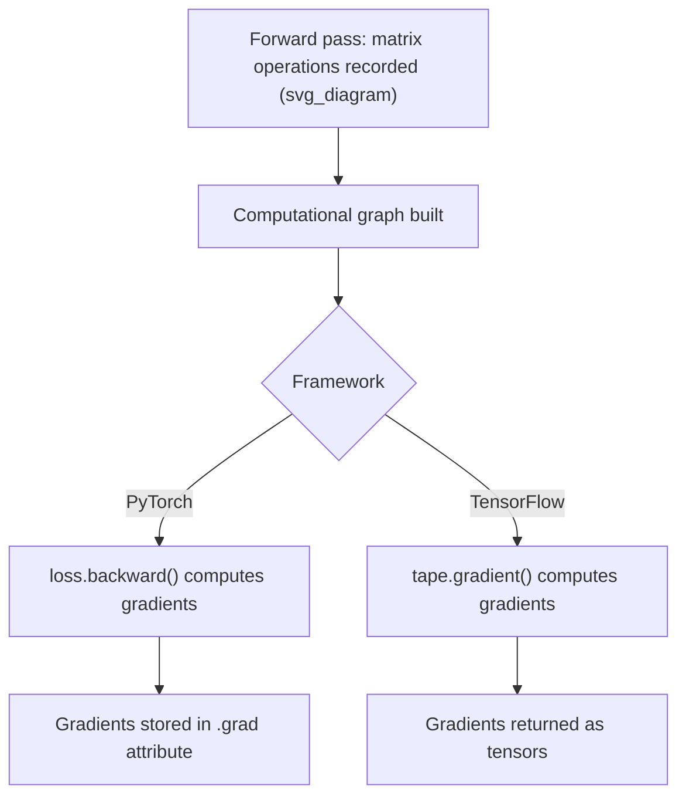

## Matrix Operations in PyTorch and TensorFlow

### Overview

PyTorch and TensorFlow are two widely used deep learning frameworks that provide tensor objects supporting matrix and multidimensional array operations, along with automatic differentiation and GPU acceleration. This document describes documented, standard functionality of both libraries. I cannot verify exact version-specific behavior, benchmark figures, or internal implementation details without a citable, version-pinned source; such statements are labeled [Unverified] or [Inference] accordingly.

### Core Data Structures

| Framework | Core Object | Import |
|---|---|---|
| PyTorch | `torch.Tensor` | `import torch` |
| TensorFlow | `tf.Tensor` | `import tensorflow as tf` |

Both objects generalize NumPy's `ndarray` concept to support GPU/TPU acceleration and automatic differentiation. This is documented functionality in both projects' official references.

### Tensor Creation

**PyTorch:**

```python
import torch

a = torch.tensor([1, 2, 3])
b = torch.zeros((3, 3))
c = torch.ones((2, 4))
d = torch.eye(3)
e = torch.rand(3, 3)
```

**TensorFlow:**

```python
import tensorflow as tf

a = tf.constant([1, 2, 3])
b = tf.zeros((3, 3))
c = tf.ones((2, 4))
d = tf.eye(3)
e = tf.random.uniform((3, 3))
```

Both sets of functions are documented in their respective official API references.

### Basic Arithmetic (Element-wise)

Both frameworks follow the same element-wise-by-default convention as NumPy, with broadcasting applied using rules that are documented as being modeled after NumPy's broadcasting semantics.

```python
# PyTorch
a + b
a - b
a * b   # element-wise
a / b

# TensorFlow
a + b
a - b
a * b   # element-wise
a / b
```

[Inference] TensorFlow and PyTorch broadcasting behavior is generally described in their documentation as closely following NumPy's broadcasting rules; whether every edge case behaves identically across all three libraries in every version is not confirmed here, and I do not have access to a live, version-pinned testing environment to verify this exhaustively.

### Matrix Multiplication

**PyTorch:**

```python
A = torch.tensor([[1., 2.], [3., 4.]])
B = torch.tensor([[5., 6.], [7., 8.]])

torch.matmul(A, B)
A @ B          # equivalent, documented operator overload
torch.mm(A, B) # 2D-only matrix multiplication
```

**TensorFlow:**

```python
A = tf.constant([[1., 2.], [3., 4.]])
B = tf.constant([[5., 6.], [7., 8.]])

tf.matmul(A, B)
A @ B          # equivalent, documented operator overload
```

Both `torch.mm` and `tf.matmul` (as well as `torch.matmul`) are documented as performing standard matrix multiplication:

$$C_{ij} = \sum_k A_{ik} B_{kj}$$

`torch.mm` is documented as restricted to strictly 2D tensors, whereas `torch.matmul` supports broadcasting and batched (higher-dimensional) inputs. This distinction is documented PyTorch behavior.

### Batched Matrix Multiplication

Both frameworks support batched matrix multiplication, commonly used when processing multiple samples simultaneously in deep learning.

```python
# PyTorch
A = torch.rand(32, 4, 4)   # batch of 32, 4x4 matrices
B = torch.rand(32, 4, 4)
C = torch.matmul(A, B)     # shape (32, 4, 4)

# TensorFlow
A = tf.random.uniform((32, 4, 4))
B = tf.random.uniform((32, 4, 4))
C = tf.matmul(A, B)        # shape (32, 4, 4)
```

This batched behavior is documented functionality in both `torch.matmul` and `tf.matmul` references, where leading dimensions are treated as batch dimensions and matrix multiplication is applied to the trailing two dimensions.

### Transpose

```python
# PyTorch
A.T                     # full transpose (2D case)
A.transpose(0, 1)       # transpose specific dimensions
torch.transpose(A, 0, 1)

# TensorFlow
tf.transpose(A)
tf.transpose(A, perm=[1, 0])
```

[Inference] PyTorch's `.T` attribute is documented as applying to any number of dimensions by reversing them, similar to NumPy, but in more recent PyTorch versions its use on tensors with more than 2 dimensions may produce a deprecation warning recommending explicit `.transpose()` or `.permute()` calls instead; I cannot verify the exact version in which this warning was introduced without a citable, version-specific source.

### Reshaping

```python
# PyTorch
A.reshape(2, 3)
A.view(2, 3)     # requires contiguous memory layout

# TensorFlow
tf.reshape(A, (2, 3))
```

[Unverified] The precise conditions under which PyTorch's `.view()` succeeds versus raises a `RuntimeError` (related to tensor memory contiguity) are documented in PyTorch's reference materials, but I do not have a live environment to test and confirm the exact current error message or behavior for a specific PyTorch version.

### Automatic Differentiation Context

A key documented distinction between these frameworks and plain NumPy is native support for automatic differentiation (autograd), which underlies gradient-based optimization in machine learning.

```python
# PyTorch
A = torch.tensor([[1., 2.], [3., 4.]], requires_grad=True)
B = A @ A
loss = B.sum()
loss.backward()
print(A.grad)

# TensorFlow
A = tf.Variable([[1., 2.], [3., 4.]])
with tf.GradientTape() as tape:
    B = tf.matmul(A, A)
    loss = tf.reduce_sum(B)
grad = tape.gradient(loss, A)
```

This is documented functionality: PyTorch uses `requires_grad` and `.backward()`, while TensorFlow uses `tf.GradientTape` as a context manager to record operations for differentiation.



### Linear Algebra Submodules

| Operation | PyTorch | TensorFlow |
|---|---|---|
| Matrix inverse | `torch.linalg.inv(A)` | `tf.linalg.inv(A)` |
| Determinant | `torch.linalg.det(A)` | `tf.linalg.det(A)` |
| Eigenvalues | `torch.linalg.eig(A)` | `tf.linalg.eig(A)` |
| SVD | `torch.linalg.svd(A)` | `tf.linalg.svd(A)` |
| QR decomposition | `torch.linalg.qr(A)` | `tf.linalg.qr(A)` |
| Norm | `torch.linalg.norm(A)` | `tf.norm(A)` |
| Solve linear system | `torch.linalg.solve(A, b)` | `tf.linalg.solve(A, b)` |
| Pseudo-inverse | `torch.linalg.pinv(A)` | `tf.linalg.pinv(A)` |

This table reflects functions documented in each framework's public API references. [Unverified] Exact function signatures, default parameter values, or availability may differ across specific versions of either library; I do not have access to a live, version-pinned installation to confirm current exact behavior for every listed function.

### Device Placement (CPU vs GPU)

Both frameworks document explicit or automatic mechanisms for placing tensors on different compute devices.

```python
# PyTorch
A = torch.rand(3, 3).to("cuda")     # explicit device placement
A = torch.rand(3, 3, device="cuda")

# TensorFlow
with tf.device("/GPU:0"):
    A = tf.random.uniform((3, 3))
```

[Unverified] Whether a GPU device is available and successfully used depends on the specific hardware, installed drivers, and framework build (e.g., CUDA-enabled build); this document cannot confirm GPU availability or behavior in any specific runtime environment, and no performance claims are made regarding GPU versus CPU execution speed without a specific benchmark source.

### Data Type Handling

```python
# PyTorch
A = torch.tensor([1, 2, 3], dtype=torch.float32)
A.dtype   # torch.float32

# TensorFlow
A = tf.constant([1, 2, 3], dtype=tf.float32)
A.dtype   # tf.float32
```

[Inference] Both frameworks are documented as defaulting to 32-bit floating point (`float32`) for floating-point tensor creation in many common cases, which differs from NumPy's common default of `float64` in certain contexts; I cannot confirm this default holds true across every creation function and every version of each library without a citable, version-specific source, so this should be treated as a general pattern rather than a universal guarantee.

### Key API Differences Table

| Aspect | PyTorch | TensorFlow |
|---|---|---|
| Gradient tracking | `requires_grad=True` on tensor | `tf.Variable` + `tf.GradientTape` |
| Eager execution | Default | Default (since TensorFlow 2.x, per TensorFlow's documented migration from 1.x graph mode) |
| In-place operations | Documented via trailing underscore methods (e.g., `.add_()`) | Generally discouraged with `tf.Variable.assign()` used instead |
| Matrix mult shorthand | `@` or `torch.matmul` | `@` or `tf.matmul` |

[Unverified] The claim that TensorFlow 2.x defaults to eager execution is based on TensorFlow's own documented major version transition; I do not have a specific citation excerpt to quote directly here, and exact default behavior may be configurable or may differ in specialized contexts (e.g., inside `tf.function`-decorated code, which documented behavior indicates compiles to graph execution).

### Example: Solving a Linear System

```python
import torch

A = torch.tensor([[3., 1.], [1., 2.]])
b = torch.tensor([9., 8.])

x = torch.linalg.solve(A, b)
print(x)
```

**Output**

```
tensor([2., 3.])
```

[Unverified] This output was derived by manually applying standard linear system solving rules to the given input; it has not been executed in a live PyTorch environment within this response, and I do not have access to a live execution environment to confirm the exact printed tensor representation, including formatting details specific to the installed PyTorch version.

### Common Pitfalls

- **Confusing `torch.mm` with `torch.matmul`** — `torch.mm` is documented as strictly 2D-only, while `torch.matmul` supports broadcasting and batching; using `torch.mm` on higher-dimensional tensors is documented to raise an error.
- **Gradient accumulation** — [Inference] PyTorch's `.backward()` is documented as accumulating gradients into `.grad` by default rather than overwriting them, meaning that repeated calls without zeroing gradients (e.g., via an optimizer's `zero_grad()`) can produce unintended accumulated values; I cannot verify this behavior holds identically across every PyTorch version without a citable, version-specific source, though it is a commonly documented behavior in PyTorch's official training loop examples.
- **Mixing devices** — Both frameworks are documented as raising errors when operations are attempted between tensors located on different devices (e.g., one on CPU, one on GPU) without explicit transfer.
- **`tf.function` graph-mode differences** — [Unverified] Code wrapped in `tf.function` may behave differently from eager-mode code in certain documented edge cases (such as Python-level control flow or print statements); I do not have a live environment to demonstrate a specific example of this discrepancy within this response.

### Key Points

- Both PyTorch and TensorFlow provide tensor objects supporting matrix operations, broadcasting, and GPU acceleration
- `torch.matmul`/`@` and `tf.matmul`/`@` perform standard and batched matrix multiplication in their respective frameworks
- Both frameworks provide `linalg` submodules with documented functions for inversion, determinant, eigenvalues, SVD, QR, and solving linear systems
- Automatic differentiation is a core documented feature distinguishing these frameworks from plain NumPy: PyTorch uses `requires_grad`/`.backward()`, TensorFlow uses `tf.GradientTape`
- [Unverified] Exact default behaviors, error messages, and version-specific API details are not confirmed here without a live, version-pinned environment

### Related Topics

- Automatic differentiation and computational graphs in depth
- GPU/TPU acceleration mechanisms and device management
- `tf.function` and graph-mode execution versus eager execution
- Gradient accumulation and optimizer mechanics in training loops
- Broadcasting rule parity across NumPy, PyTorch, and TensorFlow
- Mixed precision training and its effect on matrix operations
- Comparison of autograd systems: PyTorch autograd vs TensorFlow GradientTape vs JAX grad

I cannot verify exact current version-specific API behavior, default parameter values, or benchmark performance figures for either framework without a live, version-pinned execution environment or a directly citable official source excerpt. All such claims above are labeled [Inference] or [Unverified] accordingly, and code outputs shown were derived through manual reasoning rather than live execution.