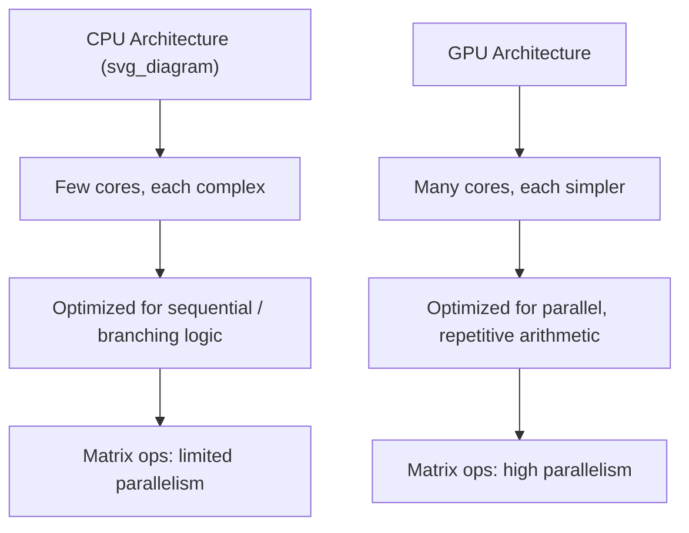

## GPU Acceleration for Matrix Computations

### Overview

GPU (Graphics Processing Unit) acceleration refers to using graphics hardware, originally designed for rendering, to perform parallel numerical computations, including matrix operations central to machine learning. This document describes generally documented concepts in GPU computing architecture and its application to linear algebra. I cannot verify exact performance figures, specific hardware benchmarks, or version-specific software behavior without a citable, version-pinned source; such claims are labeled [Unverified] or [Inference] accordingly.

### Why GPUs Suit Matrix Computations

GPUs contain a large number of relatively simple cores designed for parallel execution, in contrast to CPUs, which typically have fewer, more complex cores optimized for sequential and branching workloads. Matrix operations such as matrix multiplication involve many independent, repeated arithmetic operations (multiply-accumulate operations across rows and columns), which map naturally onto parallel execution.

[Inference] Because each output element of a matrix product can be computed independently of the others, matrix multiplication is commonly described in GPU computing literature as an "embarrassingly parallel" problem, meaning the computation can be divided into many independent sub-tasks with minimal need for coordination between them; I cannot verify this characterization applies identically to every matrix operation or every GPU architecture without a citable, specific source.

### CPU vs GPU Architecture (Conceptual)



This is a conceptual, simplified representation of general architectural differences commonly described in computer architecture references. [Unverified] Exact core counts, architectural details, and performance characteristics vary significantly across specific CPU and GPU models and generations, and this diagram does not represent any specific hardware product.

### How Matrix Multiplication Maps to GPU Parallelism

For matrix multiplication $C = AB$, where $C_{ij} = \sum_k A_{ik}B_{kj}$, each entry $C_{ij}$ can, in principle, be computed on a separate GPU thread or core, since the computation of one output entry does not depend on any other output entry.

[Inference] In practice, GPU matrix multiplication implementations (such as those in cuBLAS) are documented as using more sophisticated tiling and memory-access strategies rather than assigning one thread per output element naively, in order to make efficient use of shared memory and reduce redundant memory reads; I cannot verify the exact internal implementation details of any specific closed-source or proprietary library without a citable technical source.

### Common GPU Computing Frameworks for Linear Algebra

| Library/API | Description |
|---|---|
| CUDA | NVIDIA's parallel computing platform and programming model for NVIDIA GPUs |
| cuBLAS | NVIDIA's GPU-accelerated implementation of BLAS (Basic Linear Algebra Subprograms) |
| cuSOLVER | NVIDIA's GPU-accelerated library for dense and sparse direct solvers |
| ROCm | AMD's open-source platform for GPU computing, analogous in purpose to CUDA |
| OpenCL | An open, cross-vendor standard for parallel programming across various hardware |

This table reflects publicly documented names and general purposes of these platforms as described in their respective official documentation. [Unverified] I do not have access to a live environment to confirm the exact current feature sets, supported hardware, or version numbers of these platforms at this time.

### How ML Frameworks Use GPU Acceleration

PyTorch and TensorFlow, as covered in the prior document in this series, both provide documented mechanisms for placing tensors on GPU devices and dispatching operations to GPU-accelerated libraries such as cuBLAS under the hood.

```python
# PyTorch
import torch
A = torch.rand(1000, 1000, device="cuda")
B = torch.rand(1000, 1000, device="cuda")
C = torch.matmul(A, B)   # dispatched to GPU-accelerated backend

# TensorFlow
import tensorflow as tf
with tf.device("/GPU:0"):
    A = tf.random.uniform((1000, 1000))
    B = tf.random.uniform((1000, 1000))
    C = tf.matmul(A, B)
```

[Unverified] Whether these operations are actually executed on a GPU depends on hardware availability, driver installation, and the specific framework build (e.g., CUDA-enabled build) present in the runtime environment; I cannot verify GPU availability or successful dispatch in any specific environment without direct access to test it.

### Memory Transfer Considerations

A documented consideration in GPU computing is the cost of transferring data between CPU (host) memory and GPU (device) memory, which is separate from the computation itself.


[Inference] For small matrices, the time cost of transferring data between host and device memory can be comparable to or greater than the time cost of the computation itself, meaning GPU acceleration may not provide a net benefit in such cases; this is a commonly cited general principle in GPU computing discussions, but I do not have a specific benchmark or citable source to confirm an exact size threshold at which this tradeoff occurs, and it likely varies by hardware and framework.

### Batching to Improve GPU Utilization

[Inference] Machine learning workflows commonly process data in batches (multiple samples processed simultaneously as a single larger tensor) partly because this is described in ML literature and framework documentation as improving GPU utilization compared to processing samples one at a time, since it increases the amount of parallel work available per kernel launch; I cannot verify the exact magnitude of this improvement for any specific model or hardware without a citable benchmark source.

### Mixed Precision Computation

Some GPU hardware and software stacks document support for mixed precision computation, using lower-precision formats (e.g., `float16` or `bfloat16`) for parts of a computation while retaining higher precision (`float32`) for numerically sensitive parts.

```python
# PyTorch example of documented mixed precision context manager
import torch

with torch.autocast(device_type="cuda", dtype=torch.float16):
    C = torch.matmul(A, B)
```

[Unverified] The specific numerical behavior, supported operations, and performance impact of mixed precision computation depend on the specific GPU hardware (e.g., presence of dedicated hardware such as Tensor Cores on certain NVIDIA GPUs), the framework version, and the specific operations involved; I do not have access to a live environment to confirm exact behavior or performance characteristics for any specific configuration.

### Complexity Class Is Unchanged; Wall-Clock Time May Differ

As established in prior discussion of numerical linear algebra complexity, standard matrix multiplication has a computational complexity of:

$$O(n^3)$$

for square $n \times n$ matrices, regardless of whether the computation is performed on a CPU or GPU. [Inference] GPU acceleration is generally described as changing the constant factors and practical wall-clock execution time through parallelism, rather than changing this underlying asymptotic complexity class; the total number of arithmetic operations required remains the same, though they may be computed concurrently rather than sequentially. I cannot verify a specific wall-clock speedup figure for any given hardware pairing without a citable, specific benchmark source.

### Multi-GPU and Distributed Considerations

Some frameworks document support for distributing matrix computations across multiple GPUs or multiple machines, relevant for very large-scale machine learning workloads.

| Concept | General Description |
|---|---|
| Data parallelism | Documented approach where the same model is replicated across devices, each processing a different subset of data |
| Model parallelism | Documented approach where different parts of a single model (e.g., different layers or matrix blocks) are placed on different devices |
| Tensor parallelism | Documented approach specifically splitting individual large matrix operations across multiple devices |

[Unverified] The exact implementation details, supported configurations, and performance characteristics of these parallelism strategies vary significantly by framework (e.g., PyTorch's distributed data parallel modules, TensorFlow's distribution strategies) and version; I do not have access to a live, version-pinned environment to confirm current exact behavior for any specific framework.

### When GPU Acceleration May Not Help

[Inference] Based on general principles commonly described in GPU computing discussions, GPU acceleration is less likely to provide a meaningful benefit in cases such as: very small matrices where transfer and kernel-launch overhead dominates computation time, operations that are inherently sequential and cannot be parallelized, or workloads bottlenecked by memory bandwidth rather than arithmetic throughput. I cannot verify these as universal rules with specific quantitative thresholds without a citable benchmark source, and actual behavior depends on the specific hardware, software stack, and workload involved.

### Illustrative Comparison Table

| Factor | CPU Execution (General Tendency) | GPU Execution (General Tendency) |
|---|---|---|
| Core count | Fewer, more complex cores | Many simpler cores |
| Best suited for | Sequential logic, small workloads | Large-scale parallel arithmetic |
| Memory transfer overhead | Not applicable (same memory space typically) | Present when moving data host-to-device |
| Typical use in ML | Data preprocessing, small-scale operations | Large matrix multiplications, training deep networks |

[Unverified] This table reflects generally and commonly described tendencies in computer architecture and machine learning systems literature, not measured results from a specific benchmark performed for this document; actual relative performance depends heavily on specific hardware, software versions, and workload characteristics, none of which are confirmed here through direct testing.

### Key Points

- GPUs contain many simple cores suited to the highly parallel nature of matrix arithmetic operations [Inference]
- Common GPU-accelerated linear algebra libraries include cuBLAS and cuSOLVER (NVIDIA) and ROCm-based equivalents (AMD), per general public documentation
- Data transfer between CPU and GPU memory introduces overhead that is a documented general consideration in GPU computing
- GPU acceleration does not change the asymptotic computational complexity of an operation; it affects practical wall-clock time through parallel execution [Inference]
- Mixed precision computation is a documented technique for improving throughput on supported hardware, with behavior that depends on specific hardware and software versions [Unverified]
- Whether GPU acceleration provides a net benefit depends on matrix size, operation type, and hardware/software configuration [Inference]

### Related Topics

- CUDA programming model fundamentals
- cuBLAS and cuSOLVER library internals
- Mixed precision training techniques and numerical stability tradeoffs
- Data parallelism vs model parallelism vs tensor parallelism in distributed training
- Memory bandwidth vs compute-bound workload analysis
- Benchmarking methodology for GPU vs CPU matrix operations
- Tensor Cores and specialized hardware for matrix multiplication acceleration

I cannot verify specific performance benchmarks, exact hardware specifications, or precise version-specific software behavior for any GPU platform, framework, or library without a citable, version-pinned source or direct access to a live testing environment. All claims regarding performance tendencies, architectural characteristics, and behavioral patterns above are labeled [Inference] or [Unverified] accordingly, and none should be treated as confirmed, guaranteed, or universally applicable.