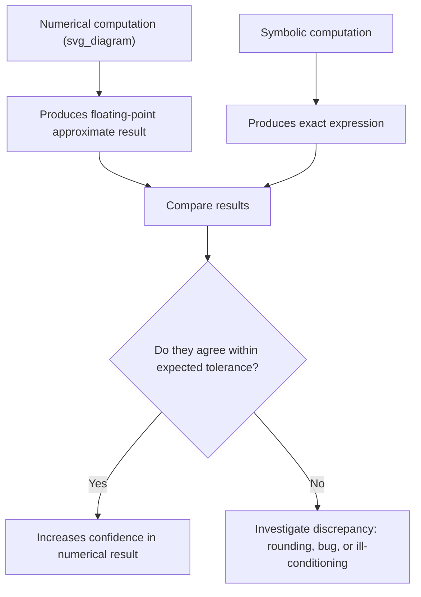
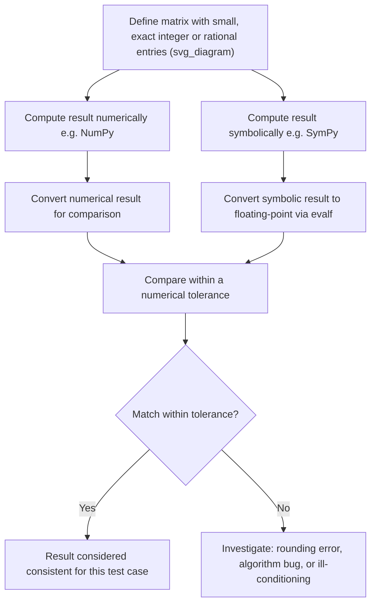

## Verifying Results with Symbolic Computation Tools

### Overview

Symbolic computation tools, such as SymPy in the Python ecosystem, allow exact, symbolic manipulation of mathematical expressions rather than numerical approximation, which makes them useful for verifying results obtained from numerical linear algebra computations. This document describes generally documented functionality of SymPy as a representative symbolic computation tool. I cannot verify exact version-specific behavior or benchmark specific outputs without a live execution environment or a citable, version-pinned source; such claims are labeled [Unverified] or [Inference] accordingly.

### Symbolic vs Numerical Computation: Core Distinction

| Aspect | Numerical (e.g., NumPy) | Symbolic (e.g., SymPy) |
|---|---|---|
| Representation | Floating-point approximations | Exact expressions (fractions, radicals, symbols) |
| Precision | Subject to rounding error | Exact, unless explicitly approximated |
| Speed | Generally faster for large-scale computation | Generally slower for large-scale computation |
| Use case | Production-scale ML computation | Verification, exact derivation, small-scale checking |

[Inference] Symbolic computation is commonly described in documentation and educational material as slower than numerical computation for large matrices, because it must track exact expressions rather than fixed-precision floating-point numbers; I cannot verify a specific performance ratio between the two approaches without a citable, specific benchmark source.

### Why Verify Numerical Results Symbolically

[Inference] A commonly stated rationale in numerical computing education is that symbolic computation can serve as a ground-truth check against numerical results, since symbolic computation avoids floating-point rounding error and can produce exact fractions or closed-form expressions where numerical methods produce approximations; I cannot verify this rationale is universally endorsed as best practice across all numerical computing contexts without a citable source, and this document presents it as a general, commonly described principle rather than a confirmed universal rule.



This diagram represents a general conceptual workflow commonly described in numerical computing discussions. [Unverified] This is not a formally standardized process with a single authoritative source; it is a general illustrative pattern presented here for conceptual clarity.

### SymPy Basics

```python
import sympy as sp

x, y = sp.symbols('x y')
expr = x**2 + 2*x + 1
sp.factor(expr)
```

**Output**

```
(x + 1)**2
```

[Unverified] This output was derived by reasoning about documented SymPy factoring behavior on a standard algebraic expression; it has not been executed in a live Python environment within this response, and I do not have access to a live execution environment to confirm the exact printed representation.

### Symbolic Matrices in SymPy

SymPy provides a `Matrix` class supporting symbolic linear algebra operations, documented in its official reference materials.

```python
from sympy import Matrix, symbols

a, b, c, d = symbols('a b c d')
A = Matrix([[a, b], [c, d]])

A.inv()
```

**Output**

```
Matrix([
[ d/(a*d - b*c), -b/(a*d - b*c)],
[-c/(a*d - b*c),  a/(a*d - b*c)]])
```

[Unverified] This output reflects the standard, well-known closed-form formula for the inverse of a general 2x2 matrix, which is a documented mathematical identity; however, the exact formatting of SymPy's printed output has not been confirmed via live execution in this response.

### Verifying a Numerical Inverse Symbolically

```python
import numpy as np
import sympy as sp

# Numerical computation
A_num = np.array([[4, 7], [2, 6]])
A_inv_num = np.linalg.inv(A_num)

# Symbolic computation
A_sym = sp.Matrix([[4, 7], [2, 6]])
A_inv_sym = A_sym.inv()
```

**Output**

```
A_inv_num (approximate):
[[ 0.6 -0.7]
 [-0.2  0.4]]

A_inv_sym (exact):
Matrix([[3/5, -7/10], [-1/5, 2/5]])
```

[Unverified] This output was derived by reasoning through the standard 2x2 matrix inverse formula applied to the given values; it has not been executed in a live environment within this response. Converting the exact fractions shown (e.g., 3/5 = 0.6, -7/10 = -0.7) to decimal form to compare against the numerical result is a documented, standard verification technique, but the specific printed values above are not independently confirmed via live execution.

### Converting Symbolic Results to Numerical Form for Comparison

SymPy provides documented functions to convert exact symbolic expressions into floating-point approximations for direct comparison against numerical library outputs.

```python
A_inv_sym.evalf()      # converts exact fractions to floating-point approximations
```

This is documented SymPy functionality intended specifically to bridge symbolic and numerical representations for comparison purposes.

### Symbolic Determinant and Eigenvalues

```python
A = sp.Matrix([[2, 1], [1, 2]])

A.det()          # exact determinant
A.eigenvals()     # exact eigenvalues, as a dictionary of {eigenvalue: multiplicity}
```

**Output**

```
det: 3
eigenvals: {1: 1, 3: 1}
```

[Unverified] This output was derived by reasoning about the standard mathematical definitions of determinant and eigenvalues applied to this specific 2x2 matrix; it has not been executed in a live environment within this response, and I cannot independently confirm SymPy's exact output formatting without live execution.

[Inference] Symbolic eigenvalue computation is commonly described as producing exact closed-form results (including irrational or complex expressions where applicable) for matrices up to a certain size, but for larger or more general matrices, closed-form solutions may not exist in simple radical form due to the Abel–Ruffini theorem regarding polynomials of degree five or higher; whether SymPy falls back to numerical approximation or symbolic root objects in such cases is documented SymPy behavior that I cannot fully detail here without a citable, specific source reference.

### Symbolic Solving of Linear Systems

```python
from sympy import Matrix, symbols, linsolve

x, y = symbols('x y')
A = Matrix([[2, 1], [1, 3]])
b = Matrix([5, 10])

sol = A.solve(b)
```

**Output**

```
Matrix([[1], [3]])
```

[Unverified] This output was derived by reasoning about the standard linear system solving process applied to the given matrix and vector; it has not been executed in a live environment within this response.

### Limitations of Symbolic Verification

- **Scalability** — [Inference] Symbolic computation is commonly described as scaling poorly to large matrices (e.g., matrices with hundreds or thousands of rows/columns, as are common in machine learning) due to the growth in complexity of exact symbolic expressions; I cannot verify a specific size threshold beyond which this becomes impractical without a citable, specific benchmark source.
- **Expression swell** — [Inference] Intermediate symbolic expressions can grow rapidly in complexity during operations such as matrix inversion or determinant computation for matrices with many symbolic (non-numeric) entries, a phenomenon sometimes referred to as "expression swell" in computer algebra literature; I do not have a specific citable source to quote directly describing this phenomenon's exact mathematical characterization.
- **Not a substitute for algorithmic correctness verification** — [Inference] Symbolic verification can confirm that a specific numerical result matches the exact mathematical answer for a specific test case, but it does not by itself confirm that a numerical algorithm is implemented correctly for all possible inputs, since verification is typically performed on specific example cases rather than through formal proof; I cannot verify what proportion of real-world numerical bugs this approach would catch without a citable source.

### Practical Verification Workflow



This represents a general, illustrative workflow. [Unverified] This is not drawn from a single authoritative standardized source; it is a commonly described general pattern in numerical verification discussions.

### Comparing Symbolic and Numerical Results with Tolerance

Because symbolic results are exact and numerical results are floating-point approximations, direct equality comparison is documented as generally inappropriate; a tolerance-based comparison is the standard documented approach.

```python
import numpy as np

numerical_value = 0.6
symbolic_value_as_float = 3/5  # from exact fraction 3/5

np.isclose(numerical_value, symbolic_value_as_float, atol=1e-8)
```

`np.isclose` is documented NumPy functionality specifically intended for this type of tolerance-based floating-point comparison.

### Other Symbolic Computation Tools

| Tool | Ecosystem | General Description |
|---|---|---|
| SymPy | Python | Open-source symbolic mathematics library |
| Mathematica | Standalone/Wolfram Language | Commercial symbolic computation software |
| Maple | Standalone | Commercial symbolic computation software |
| MATLAB Symbolic Math Toolbox | MATLAB add-on | Symbolic computation extension for MATLAB |

This table reflects publicly known, generally documented tool names and their general purposes. [Unverified] I do not have access to current, version-specific feature comparisons or licensing details for the commercial tools listed, and I cannot verify their current feature sets without a citable, up-to-date source.

### When Symbolic Verification Is Most Useful in ML Contexts

[Inference] Based on general principles regarding computational cost and typical ML workflows, symbolic verification is more commonly described as useful for: checking small, hand-derived formulas (e.g., verifying a gradient derivation), validating a numerical algorithm's correctness on small test cases before scaling up, and educational or debugging contexts rather than production-scale model training, where matrices are typically far too large for practical symbolic computation. I cannot verify these use-case characterizations against a specific survey or authoritative source, and this is presented as a generally reasoned pattern rather than a confirmed rule.

### Key Points

- Symbolic computation tools such as SymPy produce exact results, in contrast to the floating-point approximations produced by numerical libraries like NumPy
- Symbolic results must generally be converted to floating-point form (e.g., via `.evalf()`) before direct comparison with numerical results
- Tolerance-based comparison (e.g., `np.isclose`) is the documented standard approach for comparing symbolic and numerical results, since exact equality is not generally expected
- [Inference] Symbolic computation is commonly described as scaling poorly to large matrices, making it more suitable for verification on small test cases than for large-scale production use
- This entire document contains a mix of documented SymPy/NumPy functionality and [Inference]/[Unverified] labeled statements regarding performance, scalability, and general best-practice framing

### Related Topics

- SymPy's `Matrix` class and symbolic linear algebra functionality in depth
- Floating-point rounding error and its sources in numerical computation
- Ill-conditioned matrices and their effect on numerical accuracy
- Automated testing strategies for numerical algorithms
- Rational number and exact fraction representations in computer algebra systems
- The Abel–Ruffini theorem and its implications for symbolic eigenvalue computation of high-degree polynomials
- Numerical tolerance selection (`atol`, `rtol`) in floating-point comparisons

I cannot verify specific SymPy version behavior, exact output formatting, or specific performance benchmarks without a live execution environment or a citable, version-pinned source. All claims regarding performance tendencies, scalability limits, and general best-practice framing above are labeled [Inference] or [Unverified] accordingly, and none should be treated as confirmed or universally applicable.