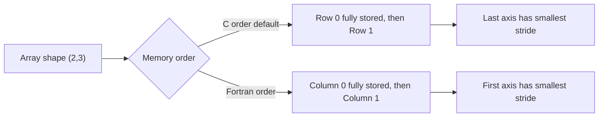

## NumPy Foundations and Array Mechanics

### Conceptual Overview

A NumPy `ndarray` is a fixed-size, homogeneously-typed, multi-dimensional container for data. Unlike Python lists, which store references to arbitrary objects scattered across memory, an ndarray stores its elements in a single contiguous (or regular strided) block of memory. This design is what allows NumPy to perform vectorized operations efficiently. [Inference] The performance characteristics described throughout this document depend on hardware, NumPy version, and build configuration (e.g., BLAS/LAPACK backend), so specific numbers will vary across systems.

### The ndarray Object Model

An `ndarray` is not just raw data — it is a Python object composed of several metadata fields plus a pointer to a data buffer:

- **data pointer** — memory address of the first byte of the array's data buffer
- **dtype** — describes the type, size, and byte order of each element
- **shape** — a tuple indicating the number of elements along each dimension
- **strides** — a tuple indicating how many bytes to step in memory to move one index along each dimension
- **flags** — metadata such as whether the array owns its memory, is contiguous, or is writeable

This structure means slicing or reshaping an array often does not copy data — it creates a new `ndarray` object with different shape/stride metadata pointing at the *same* underlying buffer.

<svg xmlns="http://www.w3.org/2000/svg" viewBox="0 0 760 300">
\<style\>
.lbl{font-family:monospace;font-size:13px;fill:#222;}
.hdr{font-family:sans-serif;font-size:14px;fill:#111;font-weight:600;}
.box{fill:#eef3fb;stroke:#3b5a8a;stroke-width:1.5;}
.data{fill:#fdf3e0;stroke:#a67c1e;stroke-width:1.5;}
.arrow{stroke:#555;stroke-width:1.5;marker-end:url(#arrowhead);}
\</style\>
<text x="10" y="20" class="hdr">ndarray object structure (svg_diagram)</text>

<rect x="20" y="40" width="220" height="180" class="box" rx="6" />
<text x="35" y="65" class="hdr">ndarray metadata</text>
<text x="35" y="90" class="lbl">dtype: float64</text>
<text x="35" y="115" class="lbl">shape: (3, 4)</text>
<text x="35" y="140" class="lbl">strides: (32, 8)</text>
<text x="35" y="165" class="lbl">flags: C_CONTIGUOUS</text>
<text x="35" y="190" class="lbl">data*: -----------&gt;</text>

<rect x="330" y="60" width="410" height="60" class="data" rx="4" />
<text x="345" y="45" class="hdr">Contiguous data buffer</text>
<text x="345" y="95" class="lbl">[ 8 bytes | 8 bytes | 8 bytes | 8 bytes | ... ]</text>

<line x1="240" y1="190" x2="330" y2="90" class="arrow" />
</svg>

### Memory Layout: C-order vs Fortran-order

NumPy arrays can lay elements out in memory in two conventional orders:

- **Row-major (C order)** — the default. The last axis varies fastest in memory. This mirrors C's array layout convention.
- **Column-major (Fortran order)** — the first axis varies fastest in memory. This mirrors Fortran's convention and is used by some linear-algebra libraries.

The layout choice affects cache locality and, therefore, the speed of certain operations (e.g., iterating over rows vs. columns), though [Inference] the magnitude of any performance difference depends on array size, CPU cache size, and access pattern, and cannot be stated as a fixed number without benchmarking.



### Strides in Detail

A **stride** is the number of bytes to skip in memory to move to the next element along a given axis. For a C-contiguous array of shape $(d_0, d_1, \dots, d_{n-1})$ with item size $s$ (in bytes), the stride for axis $k$ is:

$$
\text{stride}_k = s \cdot \prod_{j=k+1}^{n-1} d_j
$$

**Example**

```python
import numpy as np

arr = np.arange(12, dtype=np.int64).reshape(3, 4)
print(arr.strides)   # (32, 8)
print(arr.itemsize)  # 8
```

Here, `itemsize` is 8 bytes (int64). Moving one step along axis 1 (columns) requires 8 bytes; moving one step along axis 0 (rows) requires 32 bytes (4 columns × 8 bytes), matching the formula above.

Strides are also what make **views** possible without copying:

```python
transposed = arr.T
print(transposed.strides)  # (8, 32) — same buffer, swapped strides
```

Transposition here does not move any data — it only swaps the stride tuple. [Unverified] Whether a specific NumPy operation returns a view or a copy in all cases depends on the operation and NumPy version; consult the official NumPy documentation for the specific function in question rather than assuming based on this general pattern.

### Non-Contiguous Arrays and Negative Strides

Slicing with a step, or reversing an array, produces a view with modified strides — including negative strides:

```python
arr = np.arange(10)
reversed_view = arr[::-1]
print(reversed_view.strides)  # (-8,)
```

A negative stride means NumPy walks backward through the same buffer rather than copying elements into a new one. Some operations (particularly those calling into external C/Fortran libraries) require contiguous memory and will trigger an implicit copy if given a non-contiguous or negative-stride array. [Inference] This copy has a performance cost proportional to array size, though the exact overhead is not something that can be generalized without profiling the specific case.

### dtypes: The Type System of ndarray

Every ndarray has a single `dtype` object describing:

- The type category (integer, floating point, complex, boolean, string/bytes, object, datetime, etc.)
- The item size in bytes
- The byte order (endianness)
- For structured dtypes, a set of named fields with their own dtypes and offsets

**Common built-in dtypes**

| dtype | Description | Typical size |
|---|---|---|
| `bool_` | Boolean | 1 byte |
| `int8`/`int16`/`int32`/`int64` | Signed integers | 1/2/4/8 bytes |
| `uint8`...`uint64` | Unsigned integers | 1/2/4/8 bytes |
| `float16`/`float32`/`float64` | Floating point | 2/4/8 bytes |
| `complex64`/`complex128` | Complex numbers | 8/16 bytes |
| `object_` | Pointer to arbitrary Python object | platform pointer size |
| `str_` / `bytes_` | Fixed-width unicode/byte strings | variable |

**Key Points**
- `dtype` determines both the interpretation of raw bytes and the itemsize used in stride calculations.
- Mixing dtypes in an operation generally triggers NumPy's type-promotion rules to find a common dtype. [Unverified] The exact promotion result for a given pair of dtypes should be checked against the NumPy version in use, since promotion rules have changed across NumPy releases (notably around NumPy 2.0's new promotion behavior — verify against current documentation rather than assuming legacy behavior).
- Using `dtype=object` sacrifices most vectorization benefits, since NumPy must fall back to Python-level operations on each element. [Inference] This generally reduces performance relative to native dtypes, though the degree varies by operation.

### Structured (Record) dtypes

NumPy supports compound dtypes that describe heterogeneous fields per element, similar to a C struct:

```python
dt = np.dtype([('x', np.float64), ('y', np.float64), ('label', 'U10')])
points = np.array([(1.0, 2.0, 'a'), (3.5, 4.2, 'b')], dtype=dt)
print(points['x'])       # array([1. , 3.5])
print(points.itemsize)   # sum of field sizes (plus possible padding)
```

Field offsets may include padding for memory alignment purposes, depending on platform and whether `align=True` is passed to `np.dtype`. [Unverified] Exact byte-level padding behavior should be verified with `dt.itemsize` and `dt.fields` on the target platform rather than assumed.

### Byte Order and Endianness

A dtype can specify byte order using a character prefix:

- `<` — little-endian
- `>` — big-endian
- `=` — native byte order
- `|` — not applicable (single-byte types)

```python
dt_big = np.dtype('>i4')   # big-endian 32-bit int
dt_little = np.dtype('<i4') # little-endian 32-bit int
```

This matters when reading binary data produced on a different architecture or by another program, where mismatched endianness will silently produce incorrect values rather than raising an error. [Inference] This is a plausible failure mode based on how dtype interpretation works, though actual behavior should be validated with a concrete file-reading test.

### Views vs Copies: The `base` Attribute

You can check whether an array owns its memory or is a view into another array's buffer:

```python
a = np.arange(10)
b = a[2:5]
print(b.base is a)     # True — b is a view
print(b.flags['OWNDATA'])  # False
```

Modifying `b` will modify the corresponding elements of `a`, since they share the same underlying buffer. This is a common source of subtle bugs when a view is mistaken for an independent copy.

```mermaid
flowchart TD
    A["Original array a"] -->|slice a[2:5]| B["View b"]
    B -->|shares buffer with| A
    B -->|.copy| C["Independent array c"]
    C -->|OWNDATA = True| C
    B -->|OWNDATA = False| B
```

### Why This Matters for Machine Learning Workflows

- **Feature matrices** are typically stored as 2D ndarrays; understanding contiguity affects whether operations like `np.dot`, scikit-learn estimators, or GPU-transfer libraries need to make an internal copy before processing.
- **dtype choice** directly affects memory footprint of large training datasets — e.g., storing pixel data as `uint8` instead of `float64` reduces memory use roughly fourfold to eightfold for the same shape, though [Inference] actual savings depend on the specific dtype pair being compared.
- **Views from slicing** are commonly used in batching/mini-batch iteration; unintentionally holding a reference to a view can prevent garbage collection of a much larger parent array, since the buffer stays alive as long as any view references it.

**Related Topics**
- NumPy broadcasting rules and shape compatibility
- Vectorization vs explicit loops: performance implications
- Advanced indexing (fancy indexing) vs basic indexing and their copy semantics
- `np.ascontiguousarray` and forcing memory layout
- Universal functions (ufuncs) and their internal dispatch mechanism
- Memory-mapped arrays (`np.memmap`) for out-of-core data handling
- Structured arrays vs Pandas DataFrames for heterogeneous tabular data