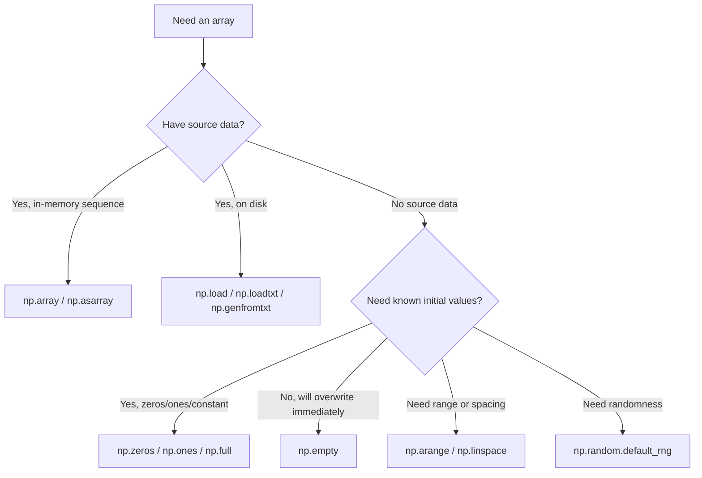

## Array Creation Methods and Initialization Patterns

### Overview

NumPy provides multiple ways to construct arrays: from existing Python data, from shape specifications with placeholder values, from numerical ranges, and from disk or random distributions. Choice of method affects both memory allocation behavior and initial data state.

### From Python Sequences

`np.array()` converts nested lists, tuples, or other sequences into an ndarray, inferring shape and dtype unless explicitly specified:

```python
import numpy as np

a = np.array([1, 2, 3])                  # 1D, dtype inferred as int64 (platform-dependent)
b = np.array([[1, 2], [3, 4]], dtype=np.float32)  # 2D, explicit dtype
c = np.array([1, 2, 3], ndmin=3)          # forces minimum 3 dimensions
```

[Unverified] The default inferred integer dtype (`int64` vs `int32`) depends on the platform and NumPy build; this should be checked with `.dtype` on the target system rather than assumed.

`np.asarray()` behaves similarly but avoids copying if the input is already an ndarray of the requested dtype:

```python
x = np.array([1, 2, 3])
y = np.asarray(x)       # no copy if dtype/type already match
z = np.array(x)         # always copies by default
```

[Inference] This copy-avoidance behavior is documented NumPy behavior, but whether a copy actually occurs in a specific case depends on dtype match and array flags, so it should be confirmed with `y.base is x` rather than assumed.

### Shape-Based Initialization

These functions allocate an array of a given shape without requiring input data:

```python
np.zeros((3, 4))          # all elements 0.0, dtype float64 default
np.ones((2, 2), dtype=int)
np.empty((3, 3))          # uninitialized memory — values are arbitrary
np.full((2, 3), 7)        # all elements set to 7
```

`np.empty` allocates memory without writing values to it. I cannot verify what specific values will appear in a given `np.empty` call, since this depends on whatever bytes previously occupied that memory region. This is a documented characteristic of the function, not a bug, but relying on any particular content of an `np.empty` array before explicitly writing to it is not a safe assumption.

**Key Points**
- `zeros`, `ones`, `full` all perform a write pass over the entire buffer.
- `empty` skips that write pass, so it is faster to allocate, at the cost of unspecified initial contents. [Inference] The performance difference between `empty` and `zeros` scales with array size, but the specific magnitude has not been benchmarked here and would need to be measured directly on the target system.

### "Like" Variants

Functions suffixed with `_like` create a new array matching the shape and dtype of an existing array:

```python
template = np.array([[1, 2], [3, 4]], dtype=np.float32)
np.zeros_like(template)
np.ones_like(template)
np.empty_like(template)
np.full_like(template, 9)
```

These are useful when writing dtype-agnostic code that must match an input array's shape/dtype without hardcoding either.

### Numerical Ranges

```python
np.arange(0, 10, 2)          # [0, 2, 4, 6, 8] — step-based, exclusive of stop
np.linspace(0, 1, 5)         # [0., 0.25, 0.5, 0.75, 1.] — count-based, inclusive of stop by default
np.logspace(0, 2, 3)         # [1., 10., 100.] — log-scale spacing
```

`np.arange` with floating-point step values can produce results with unexpected length due to floating-point rounding in the step accumulation. [Unverified] The exact number of elements produced by a specific float-step `arange` call should be checked directly (e.g., with `len()`), rather than assumed from the mathematical range, since floating-point accumulation error is input-dependent.

`np.linspace` avoids this class of issue by computing a fixed number of evenly spaced points directly rather than accumulating a step repeatedly, though [Inference] this does not mean `linspace` is free of all floating-point representation error at the level of individual output values.

### Identity, Diagonal, and Structured Patterns

```python
np.eye(3)                    # 3x3 identity matrix
np.identity(4)                # 4x4 identity matrix
np.diag([1, 2, 3])            # diagonal matrix from a 1D array
np.diag(matrix)               # extract diagonal from a 2D array
np.tri(3)                     # lower triangular matrix of ones
```

### Random Array Initialization

Modern NumPy recommends the `Generator` API over the legacy `np.random.seed` / `np.random.rand` interface:

```python
rng = np.random.default_rng(seed=42)
rng.random((2, 3))            # uniform floats in [0, 1)
rng.integers(0, 10, size=(2, 3))
rng.normal(loc=0, scale=1, size=(3, 3))
```

[Inference] The `Generator` API is documented as the currently recommended approach in recent NumPy versions, but whether it remains the recommended approach at the time this is read should be confirmed against the current official NumPy documentation, since API guidance can change across releases.

Legacy interface (still present for backward compatibility):

```python
np.random.seed(42)
np.random.rand(2, 3)
```

[Unverified] Whether the legacy `np.random` interface is deprecated, discouraged, or fully supported in any specific future NumPy version is not something I can confirm here; check the changelog for the installed version.

### From Existing Buffers or Files

```python
np.frombuffer(byte_data, dtype=np.uint8)
np.fromiter((x**2 for x in range(5)), dtype=int)
np.loadtxt('data.csv', delimiter=',')
np.genfromtxt('data.csv', delimiter=',', missing_values='NA')
np.load('array.npy')
np.save('array.npy', arr)
```

`genfromtxt` handles missing values and is generally slower than `loadtxt`, which assumes clean, fully-populated numeric data. [Inference] This relative speed difference follows from `genfromtxt` performing additional per-element parsing logic, but the actual magnitude of the difference depends on file size and content and has not been measured here.

### Initialization Pattern Comparison



### Memory and Performance Considerations

**Key Points**
- `np.array()` copies by default (`copy=True` is the default in most NumPy versions); use `np.asarray()` to avoid unnecessary copies when a copy isn't needed. [Unverified] The exact default `copy` behavior and any parameter renaming should be verified against the installed NumPy version's documentation, as this has been an area of API adjustment across NumPy 1.x and 2.x.
- Choosing a smaller dtype at creation time (e.g., `float32` instead of `float64`) reduces memory footprint for large ML datasets, but may reduce numerical precision. [Inference] Whether reduced precision meaningfully affects a given model's results depends on the algorithm and data, and cannot be generalized without testing the specific case.
- Preallocating with `np.empty` followed by explicit index assignment is sometimes used to avoid the write-then-overwrite cost of `zeros`, but this introduces risk if any index is left unassigned, since those elements retain arbitrary memory contents.

### Practical Example: Building a Feature Matrix Skeleton

```python
n_samples, n_features = 1000, 20
X = np.empty((n_samples, n_features), dtype=np.float32)

for i in range(n_samples):
    X[i] = generate_feature_row(i)   # assumes this fully populates each row
```

This pattern is only safe if every row is guaranteed to be written before use. I cannot verify that any specific user-defined function like `generate_feature_row` will fully populate a row in all cases — that depends entirely on that function's implementation, which is outside what can be confirmed here.

**Related Topics**
- Broadcasting during array initialization and arithmetic
- dtype casting rules and `astype()` behavior
- Memory-mapped array creation with `np.memmap` for large datasets
- Structured/record array construction
- Random seeding and reproducibility in ML experiments
- Copy-on-write semantics differences between NumPy and Pandas