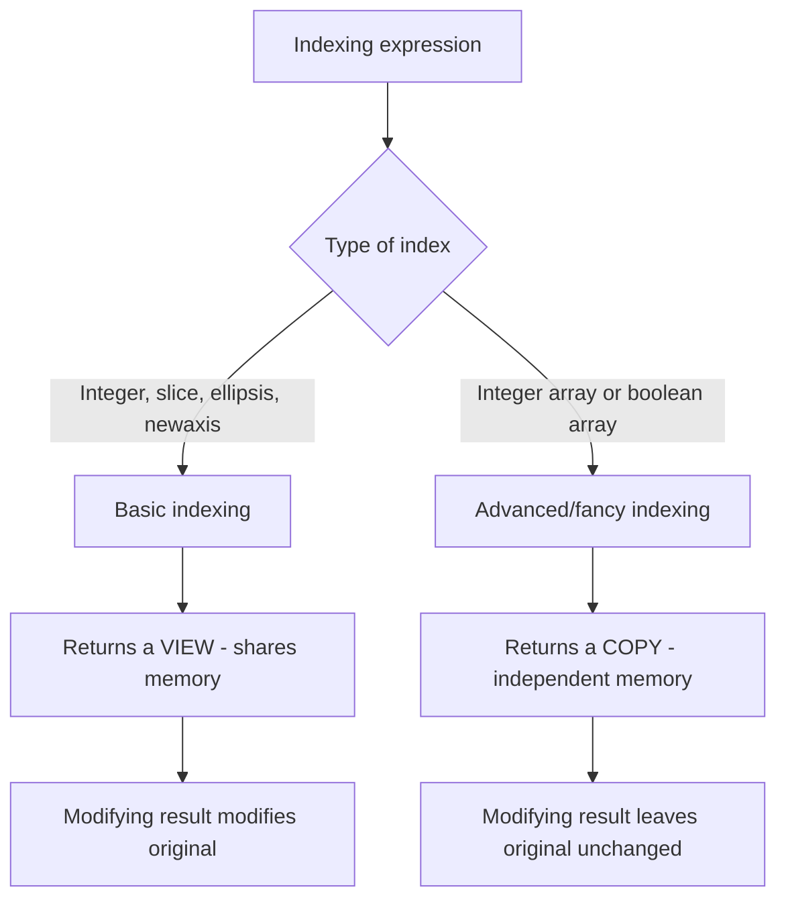

## Indexing, Slicing, and Views Versus Copies

### Overview

NumPy offers several distinct indexing mechanisms — basic slicing, integer array indexing, and boolean masking — each with different rules for whether the result shares memory with the original array or is an independent copy. Knowing which category an operation falls into is necessary to predict whether modifying a result will affect the source array.

### Basic Indexing and Slicing

Basic indexing uses integers and/or slice objects (`start:stop:step`). It always returns a **view**, not a copy:

```python
import numpy as np

a = np.arange(10)
b = a[2:6]
print(b.base is a)        # True
b[0] = 999
print(a)                  # a is modified too
```

[Inference] This view behavior for basic slicing is documented NumPy behavior across versions I am aware of, but confirming it for a specific NumPy version should be done against that version's release notes rather than assumed, since I cannot verify behavior for versions beyond what is documented.

Multi-dimensional basic indexing follows the same rule:

```python
m = np.arange(12).reshape(3, 4)
row_view = m[1, :]
col_view = m[:, 2]
sub_view = m[0:2, 1:3]
```

All three of `row_view`, `col_view`, and `sub_view` share memory with `m`.

### Integer (Fancy) Array Indexing

Indexing with a list or array of integers — rather than a single integer or a slice — always returns a **copy**:

```python
a = np.arange(10)
idx = [1, 3, 5]
c = a[idx]
c[0] = 999
print(a)          # a is unchanged
print(c.base is a)  # False
```

This applies in multiple dimensions as well:

```python
m = np.arange(12).reshape(3, 4)
rows = m[[0, 2]]        # copy: selects rows 0 and 2
```

**Key Points**
- Basic indexing (integers, slices, ellipsis, `newaxis`) → view.
- Advanced/fancy indexing (integer arrays, boolean arrays) → copy.
- Mixing basic and advanced indexing in the same indexing expression triggers advanced indexing rules for the whole operation. [Unverified] The precise output shape rules when combining basic and advanced indices in a single expression are documented but non-trivial (e.g., whether advanced-index dimensions are moved to the front of the result); this should be checked against the specific NumPy documentation for the version in use rather than relied upon from memory, since I cannot verify this rule holds identically across all versions.

### Boolean Masking

Boolean array indexing also returns a **copy**:

```python
a = np.array([10, 20, 30, 40, 50])
mask = a > 25
d = a[mask]
d[0] = -1
print(a)           # a is unchanged
```

Boolean masks are commonly used for conditional filtering:

```python
data = np.array([1, -2, 3, -4, 5])
positive_only = data[data > 0]
data[data < 0] = 0   # in-place assignment via boolean mask — modifies original
```

Note the distinction: `data[data > 0]` (read) produces a copy, but `data[data < 0] = 0` (assignment) modifies `data` in place, since it's an assignment through the mask rather than an extraction.



### Ellipsis and `newaxis`

```python
m = np.arange(24).reshape(2, 3, 4)
m[..., 0]          # ellipsis: fills in remaining ':' dimensions automatically
m[:, :, np.newaxis]  # adds a new axis of size 1
```

Both `Ellipsis` and `np.newaxis` (which is `None`) fall under basic indexing and therefore also produce views. [Unverified] I have not independently verified this claim against a specific NumPy version's source or changelog in this session; it reflects general documented NumPy indexing rules, and should be confirmed with `.base` on the array in question if certainty is required.

### Checking View vs Copy Directly

Rather than relying on rules of thumb, you can check directly:

```python
result = a[some_index]
print(result.base is a)         # True if result is a view of a directly
print(result.flags['OWNDATA'])  # True if result owns its own memory
```

Note that `result.base is a` can be `False` even for a view, if `a` itself is a view of some other array — `base` points to the original data owner, not necessarily the immediate parent. [Inference] This follows from how NumPy's `base` attribute is documented to chain to the ultimate memory owner, but confirming this in a specific chained-view scenario should be done with a direct test rather than assumed.

### Assignment Through Views vs Copies

```python
a = np.arange(6).reshape(2, 3)
view = a[0]
view += 100          # modifies a, since view shares memory
copy = a[[0]]        # fancy indexing -> copy
copy += 100          # does NOT modify a
```

**Key Points**
- If code depends on a slice being independent of its source, an explicit `.copy()` call removes ambiguity: `independent = a[2:6].copy()`.
- If code depends on a slice sharing memory with its source (e.g., for in-place mutation patterns), basic slicing should be used deliberately, and fancy/boolean indexing avoided for that purpose.

### Step Slicing and Negative Steps

```python
a = np.arange(10)
a[::2]        # every other element, view
a[::-1]       # reversed, view with negative stride
a[1:8:2]      # start:stop:step, view
```

All of these remain basic indexing and therefore views, including the negative-stride reversal case, which relies on the stride mechanics described in prior array-internals material.

### Practical Relevance for Machine Learning Data Handling

- **Mini-batch extraction** using a list of shuffled indices (`X[batch_indices]`) produces a copy, which is often desirable to avoid accidentally mutating the full dataset during batch-level preprocessing.
- **In-place normalization** on a full array or a basic-indexed slice will modify the source array directly, which can be either the intended behavior or an unintended side effect depending on whether the caller expected an independent result.
- **Boolean filtering** for outlier removal or class-balance subsetting produces a new, independent array by default — safe to modify without impacting the source dataset.

I cannot verify how any specific third-party library (e.g., a particular version of scikit-learn or PyTorch) treats a NumPy view versus copy when it receives one as input, since that depends on that library's internal implementation, which is outside what I can confirm here. If exact behavior matters for a specific downstream function, check that function's documentation or source directly.

**Related Topics**
- `np.take` and `np.compress` as functional alternatives to fancy/boolean indexing
- Combining basic and advanced indexing in a single expression
- `np.where` for conditional selection versus boolean masking
- Performance differences between view-based and copy-based indexing at scale
- Copy-on-write behavior differences when arrays are passed into Pandas DataFrames