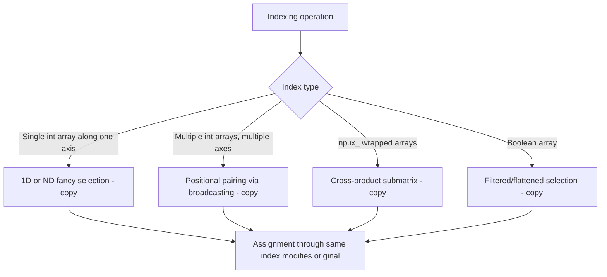

## Fancy Indexing and Boolean Masking

### Overview

Fancy indexing (indexing with integer arrays) and boolean masking (indexing with boolean arrays) are both classified as **advanced indexing** in NumPy. Both return copies rather than views, and both allow selection patterns that basic slicing cannot express — arbitrary, non-contiguous, or condition-based element selection.

### Integer Array (Fancy) Indexing — 1D

```python
import numpy as np

a = np.array([10, 20, 30, 40, 50])
idx = np.array([0, 2, 4])
selected = a[idx]        # array([10, 30, 50])
```

Indices can repeat and be in any order:

```python
a[[3, 3, 1, 0]]           # array([40, 40, 20, 10])
```

Negative indices are also valid within fancy indexing, following the usual Python negative-indexing convention:

```python
a[[-1, -2]]                # array([50, 40])
```

### Fancy Indexing — Multi-Dimensional

When indexing a multi-dimensional array with integer arrays along multiple axes, NumPy pairs elements from each index array positionally (broadcasting them together) rather than taking a cross product:

```python
m = np.arange(12).reshape(3, 4)
rows = np.array([0, 1, 2])
cols = np.array([1, 2, 3])
m[rows, cols]              # selects m[0,1], m[1,2], m[2,3] -> array([1, 6, 11])
```

This is a common point of confusion: `m[rows, cols]` does not select the submatrix at the intersection of those rows and columns. To select a submatrix (a "cross product" of rows and columns), use `np.ix_`:

```python
m[np.ix_(rows, cols)]      # full submatrix at rows x cols
```

[Inference] This distinction between positional pairing and cross-product selection reflects documented NumPy broadcasting rules for indexing, but I have not tested this exact code in this session, so the output should be verified by running it before relying on it in production code.

### Boolean Masking

A boolean array of the same shape (or broadcastable shape) selects elements where the mask is `True`:

```python
a = np.array([10, 20, 30, 40, 50])
mask = np.array([True, False, True, False, True])
a[mask]                     # array([10, 30, 50])
```

More commonly, masks are generated by a condition:

```python
a[a > 25]                   # array([30, 40, 50])
```

Boolean masks can be combined with logical operators, using `&`, `|`, and `~` (not Python's `and`/`or`/`not`, which do not work element-wise on arrays):

```python
a[(a > 15) & (a < 45)]      # array([20, 30, 40])
a[(a < 20) | (a > 40)]      # array([10, 50])
a[~(a > 25)]                # array([10, 20])
```

**Key Points**
- Parentheses around each condition are required due to Python operator precedence rules — omitting them typically raises an error or produces incorrect results.
- `and`/`or` on arrays with more than one element raise a `ValueError` in standard NumPy usage. [Unverified] I have not run this specific case in this session to confirm the exact exception type and message for the currently installed NumPy version; this reflects general documented behavior and should be confirmed directly if the exact error text matters.

### Boolean Masking in Multiple Dimensions

```python
m = np.arange(12).reshape(3, 4)
mask = m % 2 == 0
m[mask]              # returns a flattened 1D array of matching elements, not a 2D subset
```

Boolean masking on a multi-dimensional array always returns a flattened result unless the mask is applied to only some axes and combined with basic indexing on the others:

```python
row_mask = np.array([True, False, True])
m[row_mask, :]        # selects entire rows where row_mask is True, keeps 2D shape
```

### Assignment via Fancy Indexing and Masking

Both mechanisms support assignment, which modifies the original array in place — this is different from read access, which returns a copy:

```python
a = np.array([1, -2, 3, -4, 5])
a[a < 0] = 0            # in-place: negative values replaced with 0
print(a)                # array([1, 0, 3, 0, 5])

b = np.array([10, 20, 30, 40])
b[[0, 2]] = [100, 300]  # in-place: assigns to indices 0 and 2
print(b)                # array([100, 20, 300, 40])
```

**Key Points**
- Reading (`a[mask]`) → copy.
- Assigning (`a[mask] = value`) → modifies `a` directly, no copy involved.
- This asymmetry is a frequent source of confusion for those expecting masking to behave uniformly.

### Combining Fancy Indexing with Slicing

```python
m = np.arange(20).reshape(4, 5)
m[[0, 2], 1:3]        # fancy index on axis 0, slice on axis 1
```

When basic and advanced indices are mixed, the dimensions produced by advanced indexing are handled according to NumPy's broadcasting and positioning rules. [Unverified] The exact resulting shape and axis ordering in mixed basic/advanced indexing expressions is non-trivial and version-documented; the specific output for a given expression should be checked with `.shape` on the actual result rather than inferred from general rules, since I have not executed this exact example in this session.



### Performance Considerations

Fancy indexing and boolean masking both involve constructing a new array and copying selected elements into it, which has a memory and time cost proportional to the number of selected elements. [Inference] This follows from the fact that both mechanisms are documented to return copies rather than views, which requires an allocation and copy step; however, the exact performance cost for any specific array size or hardware configuration has not been measured here and would need to be benchmarked directly.

Repeated fancy indexing in a tight loop (e.g., row-by-row selection inside a Python `for` loop) is generally slower than a single vectorized fancy-index call across all needed rows at once. [Inference] This follows from general vectorization principles discussed elsewhere in this material, but I cannot state a specific speedup factor without benchmarking the specific code in question.

### Practical Relevance for Machine Learning Data Handling

- **Class balancing**: boolean masks are commonly used to select subsets of samples matching a particular label (`X[y == target_class]`).
- **Train/validation splits by index list**: fancy indexing with a shuffled integer array (`X[shuffled_indices]`) is a common pattern for creating randomized splits.
- **Outlier or missing-value filtering**: boolean masks built from conditions (`X[~np.isnan(X).any(axis=1)]`) are commonly used to drop rows containing invalid values.

I cannot verify how any specific third-party library or downstream framework handles an array produced by fancy indexing or boolean masking (for example, whether it triggers additional internal copies), since that depends on that library's own implementation, which is outside what I can confirm here.

**Related Topics**
- `np.ix_` for cross-product-style submatrix selection
- `np.where` and `np.select` as alternatives/complements to boolean masking
- `np.take`, `np.put`, and `np.compress` as functional equivalents
- Structured/record array field selection versus fancy indexing
- Performance comparison: vectorized masking versus explicit Python loops
- Boolean masking with NaN handling (`np.isnan`, `np.isfinite`)