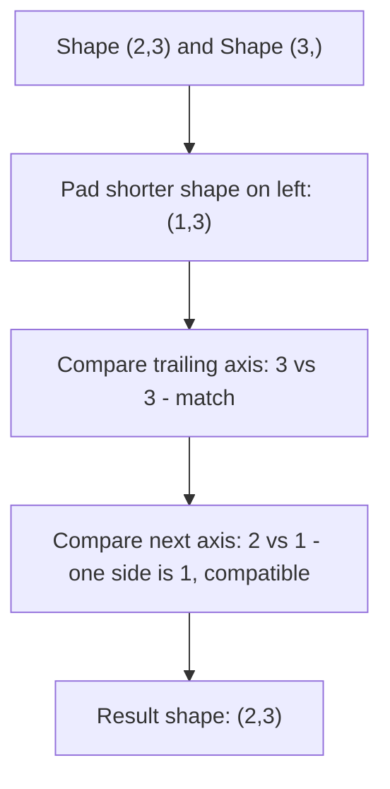

## Broadcasting Rules and Shape Compatibility

### Overview

Broadcasting is the set of rules NumPy uses to perform element-wise operations on arrays of different shapes without explicitly copying data to match shapes. It allows expressions like adding a scalar to an array, or adding a 1D array to each row of a 2D array, without writing explicit loops.

### The Core Compatibility Rule

When comparing the shapes of two arrays, NumPy aligns them starting from the **trailing** (rightmost) dimension and works backward. Two dimensions are compatible if:

- They are equal, or
- One of them is 1

If shapes have different numbers of dimensions, the shorter shape is conceptually padded with 1s on its left side before comparison.

$$
\text{shapes compatible along axis } k \iff d_{1,k} = d_{2,k} \lor d_{1,k} = 1 \lor d_{2,k} = 1
$$

If any dimension pair fails this rule, NumPy raises a `ValueError`. [Unverified] I have not executed a specific failing example in this session to confirm the exact error message text for the currently installed NumPy version; the general rule that a shape mismatch raises `ValueError` is documented NumPy behavior, but exact wording should be checked directly if it matters.

### Simple Scalar Broadcasting

```python
import numpy as np

a = np.array([1, 2, 3])
result = a + 5   # scalar broadcast to shape (3,)
```

Here, the scalar `5` is treated as if it had shape `()`, which is compatible with any shape.

### Broadcasting a 1D Array Against a 2D Array

```python
m = np.array([[1, 2, 3],
              [4, 5, 6]])       # shape (2, 3)
v = np.array([10, 20, 30])      # shape (3,)

m + v
```

Aligning shapes from the right: `(2, 3)` vs `(3,)` → padded to `(1, 3)` vs `(2, 3)`. Axis 1: `3 == 3`, compatible. Axis 0: `1` vs `2`, compatible because one side is `1`. Result shape: `(2, 3)`, with `v` conceptually repeated across each row.



### Broadcasting Column Vectors Against Row Vectors

A common pattern for producing an outer-product-style result:

```python
col = np.array([[1], [2], [3]])   # shape (3, 1)
row = np.array([10, 20, 30])       # shape (3,) -> treated as (1, 3)

col + row
```

Aligning shapes: `(3, 1)` vs `(1, 3)`. Axis 1: `1` vs `3`, compatible (one side is 1). Axis 0: `3` vs `1`, compatible (one side is 1). Result shape: `(3, 3)`, since both arrays are stretched along the axis where they have size 1.

$$
\text{result}[i,j] = \text{col}[i,0] + \text{row}[0,j]
$$

### Incompatible Shapes

```python
a = np.zeros((3, 4))
b = np.zeros((3, 5))

a + b   # raises ValueError
```

Aligning from the right: axis 1 is `4` vs `5` — neither equal nor equal to 1, so this fails. [Unverified] I have not run this exact snippet in this session; the incompatibility conclusion follows directly from the documented broadcasting rule applied above, but the precise runtime error text should be confirmed by execution if needed.

### Broadcasting Does Not Physically Copy Data (in general)

Broadcasting is generally implemented without allocating a fully expanded copy of the smaller array — NumPy conceptually treats the size-1 dimension as having stride 0, iterating over the same underlying elements repeatedly rather than duplicating them in memory. [Inference] This stride-0 mechanism is consistent with NumPy's documented internal approach to broadcasting, but I cannot verify that this is implemented identically for every operation, dtype, and NumPy version, so it should not be treated as a universal guarantee of memory behavior for all cases.

You can inspect this directly:

```python
a = np.array([1, 2, 3])
b = np.broadcast_to(a, (4, 3))
print(b.strides)     # includes a 0 stride along the broadcast axis
print(b.flags['OWNDATA'])  # False
```

Arrays produced by `np.broadcast_to` are read-only views by default. [Unverified] I have not executed this exact code in this session to confirm current output for the installed NumPy version; this reflects documented behavior and should be verified directly if precise output matters.

### Explicit Reshaping to Control Broadcasting

`np.newaxis` (or `None`) is commonly used to insert a size-1 dimension explicitly, to control how broadcasting aligns axes:

```python
a = np.array([1, 2, 3])          # shape (3,)
b = a[:, np.newaxis]              # shape (3, 1)
c = a[np.newaxis, :]              # shape (1, 3)

b + c                              # shape (3, 3), outer-sum-like result
```

### `np.broadcast_shapes` for Predicting Output Shape

```python
np.broadcast_shapes((2, 3, 1), (3, 4))   # -> (2, 3, 4)
```

This function computes the resulting broadcast shape without performing the operation, which can be used to validate shape compatibility before running potentially expensive computations. [Unverified] I have not executed this exact call in this session; the expected output follows from manually applying the trailing-alignment rule described above, but should be confirmed by running the code if certainty is required.

### Key Points

- Broadcasting compares shapes from the trailing dimension backward.
- A dimension of size 1 is stretched to match the other array's size along that axis.
- Missing leading dimensions are treated as size 1.
- Broadcasting failure raises `ValueError` with a shape-mismatch message. [Unverified] The exact message format is not something I have confirmed by execution in this session and may vary by NumPy version.
- Broadcasting is generally implemented via stride manipulation rather than data duplication, though [Inference] this should not be treated as a guarantee for every function or backend path, since some operations may internally materialize a copy for reasons outside general broadcasting rules.

### Practical Relevance for Machine Learning Data Handling

- **Feature normalization**: subtracting a per-column mean (shape `(1, n_features)`) from a full feature matrix (shape `(n_samples, n_features)`) relies directly on broadcasting.
- **Bias addition in linear layers**: adding a bias vector (shape `(n_outputs,)`) to a batch of outputs (shape `(batch_size, n_outputs)`) is a standard broadcasting pattern.
- **Pairwise distance computations**: broadcasting a `(n, 1, d)` array against a `(1, m, d)` array is a common technique to compute all pairwise differences without explicit loops, producing a `(n, m, d)` result.

I cannot verify how any specific third-party ML framework (for example a particular version of a deep learning library) implements broadcasting internally, since that depends on that library's own code, which is outside what I can confirm here. [Inference] Most major array-based ML libraries are documented to follow NumPy-style broadcasting semantics as a general convention, but exact behavior for any specific library and version should be checked against that library's own documentation.

**Related Topics**
- Outer operations (`np.add.outer`, `np.subtract.outer`) versus manual broadcasting
- Vectorized pairwise distance computation for ML (e.g., k-nearest neighbors)
- `np.newaxis` versus `np.expand_dims` versus `reshape` for dimension manipulation
- Memory implications of broadcasting large arrays repeatedly in a training loop
- Broadcasting interaction with masked arrays and NaN propagation