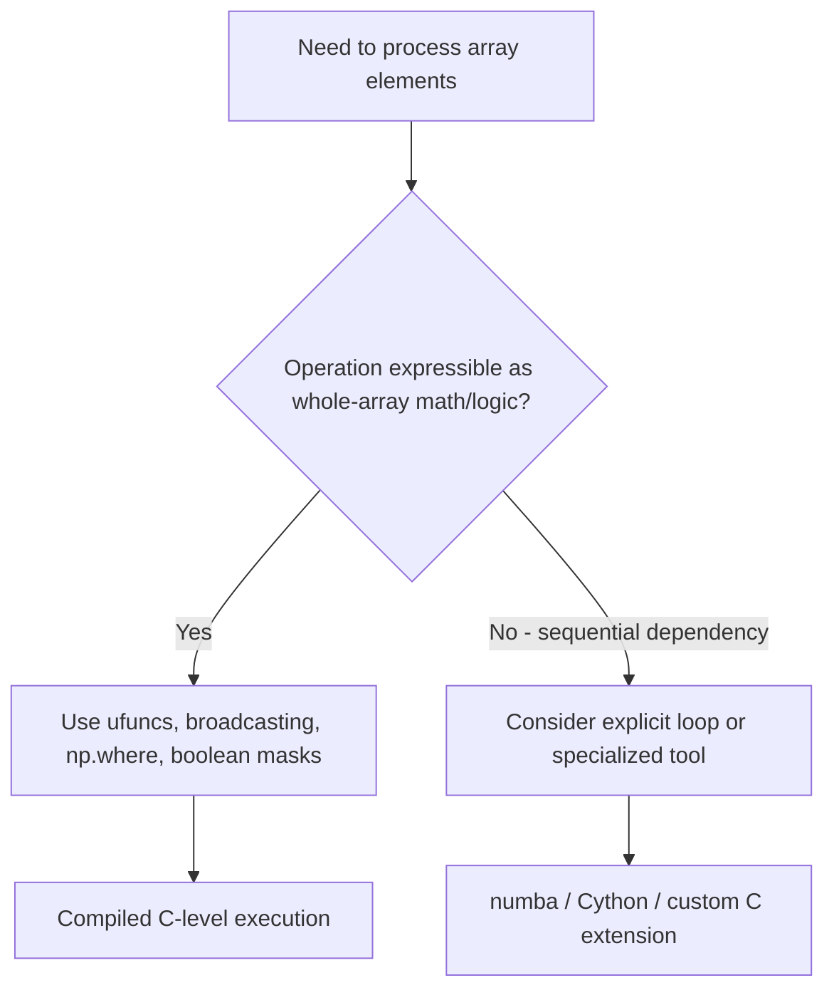

## Vectorization Principles and Avoiding Explicit Loops

### Overview

Vectorization refers to expressing operations as whole-array expressions handled by NumPy's compiled C-level implementations, rather than iterating over elements with explicit Python `for` loops. [Inference] This generally reduces per-element Python interpreter overhead, though the actual performance benefit for any specific case depends on array size, dtype, and the operation involved, and has not been benchmarked here.

### Why Explicit Python Loops Are Costly for Array Operations

A Python `for` loop over array elements executes Python bytecode for each iteration — attribute lookups, type checks, and function calls all carry per-iteration overhead. A vectorized NumPy operation instead dispatches once into a compiled loop written in C, which then iterates over the underlying memory buffer directly.

```python
import numpy as np

a = np.arange(1_000_000)

# Explicit loop
result_loop = np.empty_like(a)
for i in range(len(a)):
    result_loop[i] = a[i] * 2

# Vectorized
result_vec = a * 2
```

[Unverified] I have not executed and timed this exact code in this session, so I cannot state a specific speedup factor between these two approaches. The general direction (vectorized being faster) follows from documented differences between Python-level iteration and compiled array operations, but a precise number should be obtained by timing the code directly (e.g., with `timeit`) on the target system.

### Universal Functions (ufuncs)

NumPy's element-wise operations (`+`, `-`, `*`, `np.sqrt`, `np.exp`, `np.sin`, comparison operators, etc.) are implemented as **ufuncs** — functions that operate element-wise on arrays and support broadcasting internally.

```python
a = np.array([1, 4, 9, 16])
np.sqrt(a)          # array([1., 2., 3., 4.])
np.exp(a)
a ** 2
```

**Key Points**
- Ufuncs are applied element-wise without requiring a Python-level loop written by the user.
- Ufuncs support broadcasting, so operations between differently-shaped (but compatible) arrays are handled without manual shape alignment.
- Many ufuncs accept an `out` parameter to write results into a preallocated array, avoiding an extra allocation: `np.sqrt(a, out=result_array)`.

### Replacing Common Loop Patterns

**Element-wise transformation:**

```python
# Loop version
out = [x**2 for x in values]

# Vectorized version
out = values ** 2
```

**Conditional selection:**

```python
# Loop version
out = [x if x > 0 else 0 for x in values]

# Vectorized version
out = np.where(values > 0, values, 0)
```

**Accumulation (sum, mean, etc.):**

```python
# Loop version
total = 0
for x in values:
    total += x

# Vectorized version
total = values.sum()
```

**Pairwise comparison across two arrays:**

```python
# Loop version
matches = [a[i] == b[i] for i in range(len(a))]

# Vectorized version
matches = a == b
```

### `np.vectorize` — A Convenience, Not a Performance Tool

`np.vectorize` allows a scalar Python function to be applied element-wise across an array using array-like syntax:

```python
def custom_func(x):
    return x + 1 if x % 2 == 0 else x - 1

vfunc = np.vectorize(custom_func)
vfunc(np.array([1, 2, 3, 4]))
```

[Unverified] I cannot confirm the exact internal implementation details of `np.vectorize` for the currently relevant NumPy version, but its documented purpose is convenience — providing an array-broadcasting interface around a scalar Python function — rather than the performance characteristics of a true compiled ufunc. It is generally documented as still executing the underlying Python function once per element internally. [Inference] This means it typically does not provide the same performance benefit as a genuinely vectorized operation using built-in ufuncs, though the specific performance gap has not been measured here and depends on the function and data involved.

### When a Loop May Still Be Necessary

Not all logic maps cleanly onto vectorized operations. Cases where an explicit loop (or alternative approaches like `numba`, `Cython`, or writing a custom ufunc in C) may be more appropriate include:

- Operations with complex, stateful, sequential dependencies between iterations (e.g., certain recursive time-series calculations where each step depends on the previous computed output in a way not expressible as a fixed-size array operation).
- Operations involving external I/O per element (e.g., a network call or file read per row).
- Early-exit logic that depends on a running condition not easily expressed as array-wide predicates.

[Inference] These are general categories where vectorization is harder to apply based on how vectorized operations are structured (as whole-array transformations without arbitrary control flow), not an exhaustive list, and any specific case should be evaluated individually rather than assumed to fall neatly into one of these categories.



### Aggregate Operations Along Axes

Vectorized reduction operations accept an `axis` parameter to control which dimension is collapsed:

```python
m = np.arange(12).reshape(3, 4)
m.sum()             # scalar, sums all elements
m.sum(axis=0)       # sum down each column, shape (4,)
m.sum(axis=1)       # sum across each row, shape (3,)
m.mean(axis=0)
m.max(axis=1)
m.cumsum(axis=0)
```

This avoids nested loops over rows and columns that would otherwise be required to compute per-row or per-column aggregates manually.

### Vectorized String and Conditional Logic

```python
labels = np.array(['cat', 'dog', 'cat', 'bird'])
is_cat = labels == 'cat'
np.where(is_cat, 1, 0)
```

For more complex multi-condition logic, `np.select` handles multiple conditions with corresponding choices in one call:

```python
values = np.array([1, -5, 10, -3, 0])
conditions = [values > 0, values < 0]
choices = ['positive', 'negative']
np.select(conditions, choices, default='zero')
```

### Practical Relevance for Machine Learning Data Handling

- **Feature engineering** (scaling, log transforms, one-hot-style conditional encodings) is generally implemented via vectorized ufunc expressions rather than per-row Python loops, for datasets of meaningful size.
- **Loss and gradient computations** in many ML frameworks rely on vectorized array operations across full batches rather than per-sample loops, since batch-level vectorization is a common convention in array-based ML libraries. [Inference] This is a general convention observed across common array-based ML libraries, but I cannot verify the specific internal implementation of any particular framework's loss functions without checking that framework's own source or documentation.
- **Data cleaning at scale** (e.g., replacing invalid values, clipping ranges with `np.clip`) is typically handled with vectorized calls rather than iterating row by row in Python.

I cannot verify the exact performance characteristics of vectorized operations versus loops for any specific hardware, NumPy build, or dataset size beyond what is stated here as general, documented direction rather than measured fact. Any specific performance claim should be confirmed by timing the actual code in the target environment.

**Related Topics**
- ufunc internals: `reduce`, `accumulate`, and `outer` methods
- `numba` JIT compilation as an alternative for loop-heavy numerical code
- Memory layout and cache effects on vectorized operation speed
- `np.apply_along_axis` and its performance tradeoffs versus true vectorization
- Vectorized string operations via `np.char` and Pandas `.str` accessor
- Batched vectorized operations in deep learning frameworks