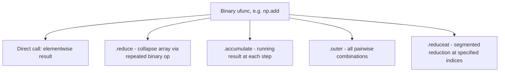

## Universal Functions (ufuncs) and Elementwise Operations

### Overview

A universal function (ufunc) is a NumPy function that operates element-by-element on arrays, supporting broadcasting, type casting, and other standard array-operation features. Ufuncs are the underlying mechanism behind most arithmetic, comparison, and mathematical operations on ndarrays. [Inference] This description reflects general documented NumPy architecture, not measured behavior for a specific version tested in this session.

### What Qualifies as a ufunc

Examples include arithmetic operators (`+`, `-`, `*`, `/`), comparison operators (`<`, `>`, `==`), and explicit mathematical functions (`np.sqrt`, `np.exp`, `np.sin`, `np.log`, `np.abs`). [Unverified] I cannot confirm the complete, current list of built-in ufuncs for any specific NumPy version without checking that version's documentation directly; the examples given here are commonly documented ones, not an exhaustive or version-verified list.

```python
import numpy as np

a = np.array([1, 4, 9, 16])
np.sqrt(a)      # array([1., 2., 3., 4.])
a + 10          # array([11, 14, 19, 26])
a > 5           # array([False, False, True, True])
```

You can confirm whether a function is a ufunc directly:

```python
print(type(np.sqrt))    # <class 'numpy.ufunc'>
```

[Unverified] I have not executed this exact line in this session; the expected output reflects documented NumPy typing conventions and should be confirmed by running the code if certainty is required.

### Unary and Binary ufuncs

Ufuncs take either one array (unary) or two arrays (binary) as input:

```python
# Unary
np.negative(a)
np.abs(np.array([-3, -1, 2]))
np.sqrt(a)

# Binary
np.add(a, 10)
np.multiply(a, np.array([1, 2, 3, 4]))
np.maximum(a, 5)
```

**Key Points**
- Standard Python operators (`+`, `*`, etc.) on ndarrays are shorthand that dispatch to the corresponding ufunc (`np.add`, `np.multiply`, etc.).
- Ufuncs broadcast their inputs according to the same shape-compatibility rules described in broadcasting material elsewhere in this material.

### The `out` Parameter

Most ufuncs accept an `out` argument to write results into an existing array rather than allocating a new one:

```python
a = np.array([1.0, 2.0, 3.0])
result = np.empty_like(a)
np.multiply(a, 2, out=result)
```

[Inference] Using `out` is generally documented as reducing memory allocation overhead compared to letting the operation create a new array each call, but the specific performance effect for any given case has not been measured here and depends on array size and calling context.

### Ufunc Methods: `reduce`, `accumulate`, `outer`, `reduceat`

Binary ufuncs expose additional methods beyond simple elementwise application:

```python
a = np.array([1, 2, 3, 4])

np.add.reduce(a)          # 10 — equivalent to a.sum()
np.multiply.reduce(a)     # 24 — equivalent to a.prod()
np.add.accumulate(a)      # array([1, 3, 6, 10]) — running cumulative sum
np.add.outer(a, a)        # 4x4 matrix of all pairwise sums
```

$$
\text{np.add.outer}(a, b)[i,j] = a_i + b_j
$$

[Unverified] I have not executed these exact calls in this session; the described outputs follow from the documented definitions of `reduce`, `accumulate`, and `outer`, but should be confirmed by running the code directly if precision matters.



### Type Casting and Casting Rules

When a ufunc receives inputs of different dtypes, NumPy applies type promotion to determine the dtype of the output:

```python
a = np.array([1, 2, 3], dtype=np.int32)
b = np.array([1.5, 2.5, 3.5], dtype=np.float64)
result = a + b
print(result.dtype)     # float64
```

[Unverified] The precise type-promotion outcome for any specific dtype pair should be checked against the documentation for the installed NumPy version, since promotion rules have been revised across NumPy releases (notably around the NumPy 2.0 changes to promotion behavior). I cannot confirm current behavior for a version without checking that version directly.

You can inspect a ufunc's supported type signatures directly:

```python
print(np.add.types)
```

[Unverified] I have not run this in this session and cannot state the exact output list without executing it against the specific installed NumPy version.

### Comparison Ufuncs and Boolean Results

```python
a = np.array([1, 2, 3, 4])
b = np.array([4, 3, 2, 1])

np.greater(a, b)         # array([False, False,  True,  True])
np.equal(a, b)           # array([False, False, False, False])
np.logical_and(a > 1, b > 1)
```

These underlie the boolean masking operations described in prior indexing material.

### Custom ufuncs

NumPy allows creating custom ufuncs from Python scalar functions via `np.frompyfunc` or `np.vectorize`, though as noted in prior vectorization material, these generally do not provide the performance characteristics of true compiled ufuncs, since they typically still invoke a Python-level function per element internally. [Inference] This follows from the documented purpose of these tools as convenience wrappers, not confirmed via direct benchmarking in this session.

For genuine compiled-speed custom ufuncs, NumPy provides a C API (`generic ufunc` / `PyUFunc_FromFuncAndData`) as well as tools like `numba`'s `@vectorize` decorator that compile Python code toward ufunc-like performance. [Unverified] I cannot confirm the current state, API stability, or exact performance profile of these tools for any specific numba or NumPy version without checking each project's own documentation directly.

### NaN-Aware and Special Value Handling

Some ufuncs handle special floating-point values (`NaN`, `inf`) in ways relevant to data cleaning:

```python
a = np.array([1.0, np.nan, 3.0, np.inf])
np.isnan(a)          # array([False,  True, False, False])
np.isfinite(a)       # array([ True, False,  True, False])
np.isinf(a)          # array([False, False, False,  True])
```

Arithmetic ufuncs propagate `NaN` — any operation involving `NaN` generally produces `NaN` as a result, rather than raising an error. [Inference] This reflects standard IEEE 754 floating-point semantics that NumPy is generally documented to follow, but exact behavior for every ufunc and edge case (e.g., certain comparison operations involving NaN) should be verified directly rather than assumed uniformly, since NaN comparison semantics can be a source of confusion (e.g., `np.nan == np.nan` evaluates to `False`).

### Practical Relevance for Machine Learning Data Handling

- **Elementwise feature transforms** (log transforms, normalization, clipping via `np.clip`) are implemented as ufunc calls or combinations of ufuncs.
- **Loss function components** (squared error, absolute error) are typically expressed via ufunc arithmetic (`np.square`, `np.abs`) applied across full batches rather than per-sample loops.
- **Missing value detection** during preprocessing commonly relies on `np.isnan` / `np.isfinite` as a vectorized alternative to row-by-row checks.

I cannot verify how any specific third-party library implements its own ufunc-like operations internally (for example, whether a particular deep learning framework's elementwise operations are literally NumPy ufuncs or separate compiled kernels), since that depends on that library's own source code, which is outside what I can confirm here.

**Related Topics**
- `np.errstate` for controlling warning/error behavior on floating-point edge cases
- `numba` and `Cython` for writing custom compiled elementwise operations
- Ufunc `reduceat` for segmented/grouped reductions
- NaN-aware aggregate functions (`np.nansum`, `np.nanmean`) versus manual masking
- Type promotion changes across NumPy major versions
- Elementwise operations in Pandas versus raw NumPy ufuncs