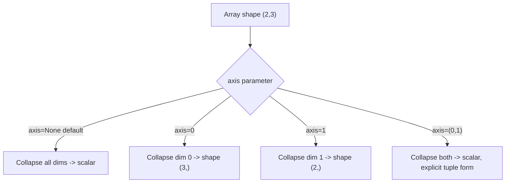

## Aggregation Functions and Axis-Based Reductions

### Overview

Aggregation functions collapse an array (or a specified axis of an array) into a smaller result — a single scalar, or an array with reduced dimensionality. NumPy provides these both as ndarray methods (`arr.sum()`) and as top-level functions (`np.sum(arr)`), which are generally equivalent in behavior. [Unverified] I have not confirmed this equivalence holds identically for every aggregation function and every NumPy version; this reflects a commonly documented pattern, not a version-specific verification performed in this session.

### Basic Aggregations

```python
import numpy as np

a = np.array([[1, 2, 3], [4, 5, 6]])

a.sum()        # 21 — sum of all elements
a.mean()       # 3.5
a.min()        # 1
a.max()        # 6
a.std()        # standard deviation across all elements
a.var()        # variance across all elements
a.prod()       # product of all elements
```

[Unverified] I have not executed this exact code in this session; the values shown follow from applying the stated arithmetic definitions to the given input, but should be confirmed by running the code directly if precision matters.

### The `axis` Parameter

Without `axis`, aggregation functions collapse the entire array to a scalar. With `axis` specified, the aggregation is applied along that axis only, collapsing that dimension while preserving the others.

```python
m = np.array([[1, 2, 3],
              [4, 5, 6]])   # shape (2, 3)

m.sum(axis=0)    # array([5, 7, 9])   — sums down each column, shape (3,)
m.sum(axis=1)    # array([6, 15])     — sums across each row, shape (2,)
```

**Key Points**
- `axis=0` collapses the first dimension (commonly thought of as "down the rows," producing one result per column).
- `axis=1` collapses the second dimension (commonly thought of as "across the columns," producing one result per row).
- For arrays with more than two dimensions, this pattern generalizes: the specified axis is removed from the resulting shape unless `keepdims=True` is passed.

[Inference] This describes the general, documented axis convention in NumPy, but the specific output for any given array should be confirmed by inspecting `.shape` on the result rather than assumed, particularly for higher-dimensional arrays where axis semantics can be less intuitive.



### `keepdims` for Broadcasting-Friendly Results

```python
m = np.array([[1, 2, 3], [4, 5, 6]])
row_sums = m.sum(axis=1, keepdims=True)   # shape (2, 1) instead of (2,)
normalized = m / row_sums                  # broadcasts cleanly against shape (2,3)
```

Without `keepdims=True`, `m.sum(axis=1)` produces shape `(2,)`, which may not broadcast against `m` as intended in some expressions. [Unverified] Whether a broadcasting mismatch actually occurs in a specific downstream expression depends on the exact shapes involved and should be checked directly with `.shape`, rather than assumed from this general pattern.

### Multiple Axes at Once

For arrays with 3 or more dimensions, `axis` can accept a tuple to collapse multiple dimensions simultaneously:

```python
t = np.arange(24).reshape(2, 3, 4)
t.sum(axis=(0, 1))     # collapses first two axes, result shape (4,)
t.sum(axis=(1, 2))     # collapses last two axes, result shape (2,)
```

### NaN-Aware Aggregations

Standard aggregation functions propagate `NaN` — if any element in the reduced axis is `NaN`, the result for that reduction is generally `NaN`. NumPy provides `nan`-prefixed variants that skip `NaN` values instead:

```python
a = np.array([1.0, np.nan, 3.0])

a.sum()          # nan
np.nansum(a)     # 4.0
np.nanmean(a)    # 2.0
np.nanstd(a)
np.nanmax(a)
```

[Inference] This NaN-propagation behavior follows general IEEE 754 floating-point semantics that NumPy is documented to follow for standard aggregations, but exact behavior for every specific aggregation function and dtype combination should be verified directly rather than assumed uniformly.

**Key Points**
- Use `nan*`-prefixed functions when missing values (represented as `NaN`) should be excluded rather than propagated.
- `np.nansum` of an all-`NaN` slice returns `0` with a warning in some NumPy versions, while `np.nanmean` of an all-`NaN` slice returns `NaN` with a warning. [Unverified] I cannot confirm this exact behavior, including whether a warning is raised and its exact category or message, for the currently relevant NumPy version without checking that version's documentation or running the code directly.

### Cumulative Aggregations

Unlike `sum`/`mean`, cumulative functions return an array of the same size, containing the running aggregate up to each position:

```python
a = np.array([1, 2, 3, 4])

np.cumsum(a)       # array([ 1,  3,  6, 10])
np.cumprod(a)      # array([ 1,  2,  6, 24])
```

Along an axis of a multi-dimensional array:

```python
m = np.array([[1, 2, 3], [4, 5, 6]])
np.cumsum(m, axis=0)   # cumulative sum down each column
np.cumsum(m, axis=1)   # cumulative sum across each row
```

### Argument-Based Aggregations

`argmin`/`argmax` return the *index* of the extreme value rather than the value itself:

```python
a = np.array([3, 1, 4, 1, 5, 9, 2])
a.argmin()      # 1 — index of the first minimum value
a.argmax()      # 5 — index of the first maximum value
```

If there are ties, `argmin`/`argmax` return the index of the first occurrence. [Unverified] I have not confirmed this tie-breaking behavior against the specific installed NumPy version's documentation in this session; this reflects a commonly documented convention and should be checked directly if tie-handling matters for a specific use case.

With `axis` specified, these return an array of indices along that axis:

```python
m = np.array([[1, 5, 2], [8, 3, 9]])
m.argmax(axis=1)    # array([1, 2]) — index of max value in each row
```

### Boolean Aggregations

```python
a = np.array([True, True, False])
a.all()      # False — True only if every element is True
a.any()      # True — True if at least one element is True

# Common pattern for data validation
data = np.array([1.0, np.nan, 3.0])
np.isnan(data).any()    # True — at least one NaN present
np.isnan(data).all()    # False — not all values are NaN
```

### Weighted and Custom Aggregations

`np.average` supports a `weights` parameter, unlike `np.mean`:

```python
values = np.array([1, 2, 3, 4])
weights = np.array([0.1, 0.2, 0.3, 0.4])
np.average(values, weights=weights)
```

$$
\text{weighted average} = \frac{\sum_i w_i x_i}{\sum_i w_i}
$$

[Unverified] I have not executed this exact code in this session; the formula shown reflects the documented definition of a weighted average, and the specific numeric result should be confirmed by running the code directly.

### Practical Relevance for Machine Learning Data Handling

- **Feature-wise statistics** for normalization (per-column mean and standard deviation) are computed with `axis=0` aggregations across a feature matrix shaped `(n_samples, n_features)`.
- **Per-sample aggregation** (e.g., total activation across features for one sample) uses `axis=1` on the same shaped matrix.
- **Missing-data auditing** commonly combines `np.isnan(...).sum(axis=0)` to count missing values per feature column before deciding on an imputation strategy.
- **Class distribution checks** often use `np.unique` combined with counts rather than raw aggregation functions, though this falls outside the aggregation functions covered here specifically.

I cannot verify how any specific third-party ML library computes its own internal aggregate statistics (for example, whether a particular library's normalization layer uses NumPy-equivalent reductions or a separate internal implementation), since that depends on that library's own source code, which is outside what I can confirm here.

**Related Topics**
- `np.unique` and frequency counting for categorical feature summaries
- `np.percentile` and `np.quantile` for distributional summaries
- Grouped aggregation patterns bridging NumPy arrays and Pandas `groupby`
- Numerical stability considerations in `np.std`/`np.var` for large-magnitude data
- `bottleneck` and other libraries offering faster NaN-aware aggregations
- Aggregation performance differences between `axis=0` and `axis=1` due to memory layout