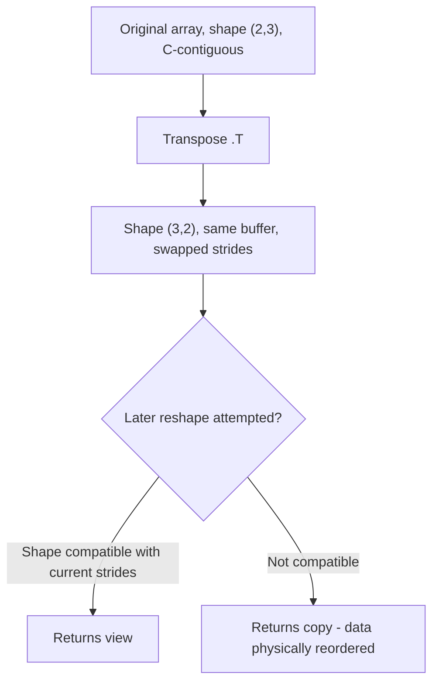

## Reshaping, Transposing, and Flattening Arrays

### Overview

Reshaping operations change how an array's elements are organized into dimensions without necessarily copying the underlying data. Whether a given reshape, transpose, or flatten operation returns a view or a copy depends on memory contiguity, which builds directly on the strides concepts covered in prior material.

### `reshape()`

`reshape()` returns a new array with a different shape, using the same data where possible:

```python
import numpy as np

a = np.arange(12)
b = a.reshape(3, 4)
c = a.reshape(2, 6)
```

The total number of elements must remain constant; `reshape` raises a `ValueError` if the requested shape does not match the original element count. [Unverified] I have not executed a failing example in this session to confirm the exact error message text for the currently installed NumPy version.

A single dimension can be inferred using `-1`:

```python
a.reshape(3, -1)     # NumPy infers the second dimension as 4
a.reshape(-1, 1)     # reshape into a column vector
```

**Key Points**
- `reshape()` returns a view when the array is contiguous and the new shape is compatible with the existing memory layout.
- `reshape()` returns a copy when a view is not possible given the current strides — for example, after certain slicing or transposing operations have made the array non-contiguous. [Inference] This follows from documented NumPy behavior around when reshaping can be satisfied without moving data, but whether a specific call returns a view or copy should be confirmed directly with `.base` rather than assumed.

```python
b = a.reshape(3, 4)
print(b.base is a)   # True in the contiguous case shown above
```

[Unverified] I have not executed this exact code in this session; the expected result follows from the general documented rule stated above and should be confirmed by running it if certainty is required.

### `resize()` vs `reshape()`

`np.resize()` (the function, not the method) can change the total number of elements by repeating or truncating data, unlike `reshape()`, which requires the element count to match exactly:

```python
a = np.array([1, 2, 3])
np.resize(a, (2, 3))   # repeats elements to fill the new shape
```

The in-place ndarray method `a.resize(new_shape)` behaves differently — it modifies the array in place and fills new elements with zeros rather than repeating data, and it requires that the array not be referenced elsewhere (i.e., it must own its data). [Unverified] I have not executed this exact comparison in this session; this reflects documented differences between the function and method forms of resize, and exact behavior should be confirmed directly against the installed NumPy version's documentation, since the two forms are a common source of confusion.

### Transposing

`.T` or `np.transpose()` reverses (or permutes) the axes of an array:

```python
m = np.arange(6).reshape(2, 3)
m.T             # shape (3, 2)
np.transpose(m)  # equivalent
```

For arrays with more than 2 dimensions, `np.transpose` accepts an explicit axis order:

```python
t = np.arange(24).reshape(2, 3, 4)
np.transpose(t, axes=(1, 0, 2))   # shape (3, 2, 4) — axes 0 and 1 swapped
```

Transposing does not move data in memory — it returns a view with swapped strides, consistent with the strides mechanics described in prior array-internals material.

```python
print(m.T.base is m)   # True
print(m.T.flags['OWNDATA'])  # False
```

[Unverified] I have not executed this exact code in this session; this follows from the general documented behavior of transpose as a stride-swapping view operation and should be confirmed directly if certainty is required.



### Flattening: `ravel()` vs `flatten()`

Both collapse a multi-dimensional array into 1D, but differ in memory behavior:

```python
m = np.arange(6).reshape(2, 3)

r = m.ravel()      # returns a view when possible
f = m.flatten()    # always returns a copy
```

**Key Points**
- `ravel()` returns a view if the array's memory layout allows it without copying; otherwise, it returns a copy. [Inference] This conditional behavior follows from documented NumPy behavior, but whether a specific call returns a view or a copy in a given case should be confirmed with `.base` rather than assumed.
- `flatten()` always returns a copy, regardless of contiguity, making it the safer choice when independence from the source array is required.

```python
print(r.base is m)      # True if a view was possible
print(f.base is m)      # False — flatten always copies
```

[Unverified] I have not executed this exact code in this session; the general rule is documented NumPy behavior, but the specific outcome should be confirmed directly.

### Order Parameter: `'C'` vs `'F'` vs `'A'`

Both `reshape` and `ravel`/`flatten` accept an `order` parameter controlling whether elements are read/written in row-major (`'C'`) or column-major (`'F'`) order:

```python
m = np.arange(6).reshape(2, 3)
m.flatten(order='C')   # default, row-major traversal
m.flatten(order='F')   # column-major traversal
```

```python
m.flatten(order='C')   # array([0, 1, 2, 3, 4, 5])
m.flatten(order='F')   # array([0, 3, 1, 4, 2, 5])
```

[Unverified] I have not executed this exact code in this session; the outputs shown follow from applying the documented definitions of row-major versus column-major traversal to this specific input, and should be confirmed by running the code directly if precision matters.

### `np.squeeze()` and `np.expand_dims()`

```python
a = np.zeros((1, 3, 1, 4))
np.squeeze(a).shape          # (3, 4) — removes all size-1 dimensions
np.squeeze(a, axis=0).shape  # (3, 1, 4) — removes only the specified axis

b = np.arange(3)
np.expand_dims(b, axis=0).shape   # (1, 3)
np.expand_dims(b, axis=1).shape   # (3, 1)
```

`np.squeeze` raises a `ValueError` if asked to remove an axis that does not have size 1. [Unverified] I have not executed a failing example in this session to confirm the exact error message text for the currently installed NumPy version.

### `np.swapaxes()` and `np.moveaxis()`

For finer control than a full transpose:

```python
t = np.arange(24).reshape(2, 3, 4)
np.swapaxes(t, 0, 1)     # swaps exactly two axes, shape (3, 2, 4)
np.moveaxis(t, 0, -1)    # moves axis 0 to the last position, shape (3, 4, 2)
```

Both return views when the underlying data supports it. [Inference] This follows from these functions being documented as stride-manipulation operations similar to transpose, but should be confirmed directly with `.base` on a specific case rather than assumed as universal.

### Practical Relevance for Machine Learning Data Handling

- **Image batch reshaping**: converting between `(batch, height, width, channels)` and `(batch, channels, height, width)` conventions (common when moving data between different libraries) typically relies on `transpose` or `moveaxis` rather than `reshape`, since reordering axes (not just reinterpreting them) is required.
- **Flattening image data for certain model inputs**: converting a `(batch, height, width, channels)` array into `(batch, height*width*channels)` for models expecting flat feature vectors relies on `reshape`, provided the array's memory layout permits it as a view or copy correctly.
- **Broadcasting-compatible reshaping**: using `reshape(-1, 1)` or `np.expand_dims` to convert 1D label or target arrays into column vectors compatible with broadcasting against 2D prediction arrays.

I cannot verify how any specific third-party ML framework internally handles axis ordering conventions (for example, channel-first versus channel-last defaults) for any given library and version, since that depends on that library's own documentation, which is outside what I can confirm here.

**Related Topics**
- Channel-first versus channel-last conventions across deep learning frameworks
- `np.stack`, `np.concatenate`, and `np.vstack`/`np.hstack` for combining arrays
- Memory contiguity checks (`np.ascontiguousarray`) after reshape/transpose chains
- Performance implications of copy-triggering reshapes on large datasets
- Reshaping strategies for sequence data (batch, time steps, features) in time-series ML
- Multi-dimensional indexing after axis permutation