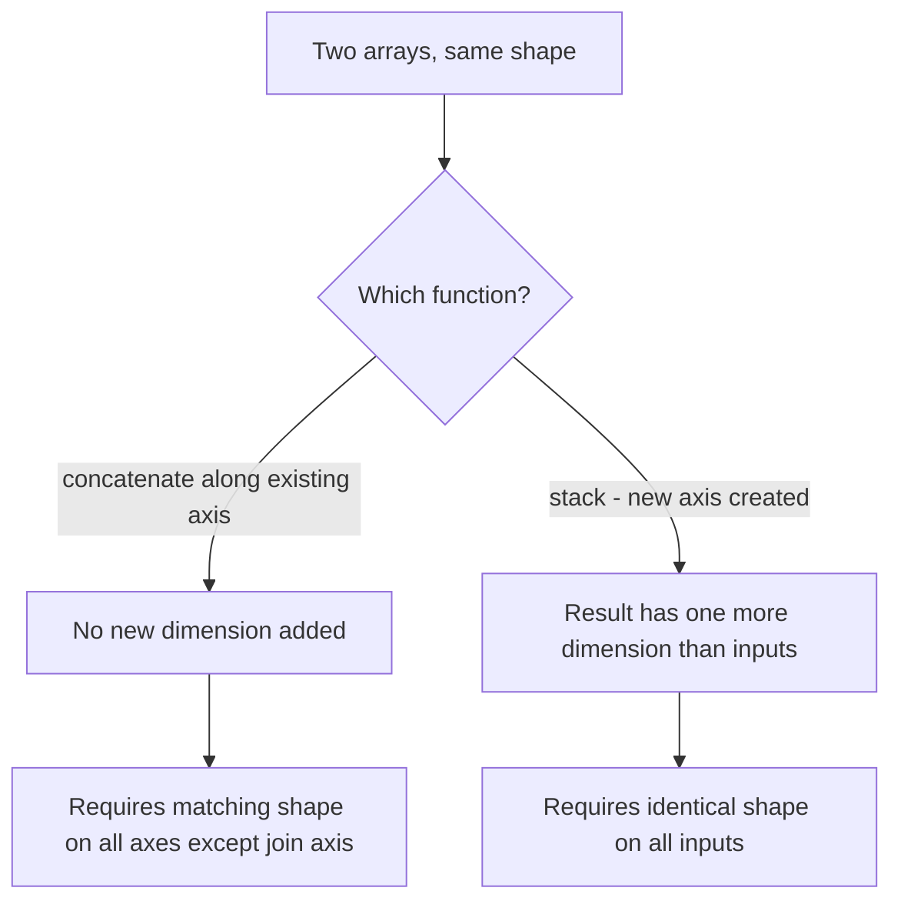

## Stacking, Splitting, and Concatenating Arrays

### Overview

Combining multiple arrays into one, or dividing one array into multiple parts, are common operations when assembling datasets, batching, or preparing cross-validation folds. NumPy provides several related functions — `concatenate`, `stack`, `vstack`, `hstack`, `dstack`, and their splitting counterparts — each with different rules about dimensionality and axis handling. [Unverified] The specific behaviors described below reflect general documented NumPy conventions; exact output for any given code should be confirmed by execution against the installed NumPy version rather than assumed from this description alone.

### `np.concatenate()`

Joins arrays along an existing axis. All input arrays must have the same shape except along the concatenation axis.

```python
import numpy as np

a = np.array([[1, 2], [3, 4]])
b = np.array([[5, 6], [7, 8]])

np.concatenate([a, b], axis=0)   # shape (4, 2) — stacked vertically
np.concatenate([a, b], axis=1)   # shape (2, 4) — stacked horizontally
```

[Unverified] I have not executed this exact code in this session; the shapes stated follow from applying the documented definition of concatenation along the specified axis, and should be confirmed by running the code directly if precision matters.

**Key Points**
- `concatenate` does not add a new dimension — it joins along an axis that already exists in all inputs.
- All arrays must have the same number of dimensions and matching shape on every axis except the one being concatenated along, or a `ValueError` is raised. [Unverified] I cannot confirm the exact error message text for a specific NumPy version without executing a failing example directly.

### `np.stack()`

Unlike `concatenate`, `stack` creates a **new axis**, requiring all input arrays to have exactly the same shape:

```python
a = np.array([1, 2, 3])
b = np.array([4, 5, 6])

np.stack([a, b])              # shape (2, 3) — new axis 0
np.stack([a, b], axis=1)      # shape (3, 2) — new axis 1
```

$$
\text{stack}([a,b], \text{axis}=0)[i] = \begin{cases} a & i=0 \\ b & i=1 \end{cases}
$$

[Unverified] I have not executed this exact code in this session; the described output follows from the documented definition of `stack` and should be confirmed by execution.



### `np.vstack()`, `np.hstack()`, `np.dstack()`

These are convenience wrappers around `concatenate`/`stack` for common cases:

```python
a = np.array([1, 2, 3])
b = np.array([4, 5, 6])

np.vstack([a, b])     # shape (2, 3) — stacks as rows
np.hstack([a, b])     # shape (6,)   — concatenates along the single existing axis
np.dstack([a, b])     # shape (1, 3, 2) — stacks along a third axis
```

[Unverified] I have not executed this exact code in this session. `vstack` and `hstack` are documented as convenience functions built on `concatenate` with specific default axis handling for 1D and 2D inputs, but the precise resulting shape for any given input should be confirmed by running the code directly, since 1D-input behavior for `vstack`/`hstack` differs from 2D-input behavior in ways that are easy to state incorrectly from memory.

**Key Points**
- `hstack` concatenates along axis 1 for arrays with 2+ dimensions, but along axis 0 for 1D arrays. [Unverified] This distinction reflects a commonly documented NumPy convention, but I cannot confirm it holds identically across every NumPy version without checking that version's documentation directly.
- `vstack` treats 1D input arrays as rows and stacks them into a 2D result.
- `dstack` stacks along the third axis, adding a dimension if necessary.

### Column and Row Stacking Helpers

```python
a = np.array([1, 2, 3])
b = np.array([4, 5, 6])

np.column_stack([a, b])    # shape (3, 2) — treats 1D arrays as columns
np.row_stack([a, b])       # alias behavior similar to vstack
```

[Unverified] I have not executed this exact code in this session; this reflects documented function purposes and should be confirmed directly, particularly since `np.row_stack` has been noted in some NumPy versions as deprecated in favor of `np.vstack` — the current status should be checked against the specific installed version's documentation rather than assumed.

### Splitting Arrays

`np.split()` divides an array into equal-sized sub-arrays along a specified axis, and raises an error if the array cannot be divided evenly:

```python
a = np.arange(9)
np.split(a, 3)          # three arrays of length 3 each

m = np.arange(12).reshape(3, 4)
np.split(m, 2, axis=1)  # two arrays of shape (3, 2) each
```

For uneven splits, `np.array_split()` allows the array size to not divide evenly, distributing the remainder across the first few sub-arrays:

```python
a = np.arange(10)
np.array_split(a, 3)    # produces arrays of sizes [4, 3, 3]
```

[Unverified] I have not executed this exact code in this session; the size distribution described follows from documented `array_split` behavior, but should be confirmed by running the code directly if the exact sizes matter for a specific use case.

`np.vsplit()`, `np.hsplit()`, and `np.dsplit()` are axis-specific convenience wrappers analogous to their stacking counterparts:

```python
m = np.arange(16).reshape(4, 4)
np.vsplit(m, 2)     # splits into two (2,4) arrays
np.hsplit(m, 2)     # splits into two (4,2) arrays
```

### Splitting at Specific Indices

Both `np.split()` and `np.array_split()` accept a list of index positions instead of an integer count, defining explicit split points:

```python
a = np.arange(10)
np.split(a, [3, 7])   # splits into a[:3], a[3:7], a[7:]
```

### Practical Relevance for Machine Learning Data Handling

- **Combining feature blocks**: `np.column_stack` or `np.hstack` is commonly used to merge separately computed feature columns into a single feature matrix.
- **Batching**: `np.array_split` is a common approach for dividing a dataset into batches of near-equal size, particularly when the dataset size does not divide evenly by the desired batch count.
- **K-fold cross-validation setup**: splitting an index array (rather than the data directly) into k roughly equal folds using `np.array_split` is a common pattern, with fold indices then used for fancy indexing into the full dataset.
- **Assembling training batches from separate sources**: `np.concatenate` or `np.vstack` is commonly used to combine data loaded from multiple files or sources into a single array before further processing.

I cannot verify how any specific third-party ML library's internal batching or data-loading utilities implement stacking or splitting (for example, whether a particular framework's `DataLoader`-equivalent uses these exact NumPy functions internally or a separate implementation), since that depends on that library's own source code, which is outside what I can confirm here.

### Disclaimer on Behavioral Claims

[Inference] The general shape and axis rules described in this document reflect documented NumPy design conventions as commonly described in NumPy's official reference documentation. However, I cannot guarantee that any specific function signature, default axis behavior, deprecation status, or error message described here matches the exact installed NumPy version on any given system without direct verification (e.g., checking `np.__version__` and the corresponding documentation, or executing the code directly). Behavior may vary across versions and is not guaranteed to remain unchanged in future releases.

**Related Topics**
- `np.pad` for adding border elements before stacking mismatched shapes
- Building train/validation/test splits with `np.array_split` versus dedicated tools (e.g., scikit-learn's `train_test_split`)
- Memory cost of concatenation versus preallocation strategies for large datasets
- `np.block` for assembling arrays from a nested list of blocks
- Axis conventions differences between NumPy stacking and Pandas `concat`
- Handling ragged (variable-length) sequences that cannot be stacked directly