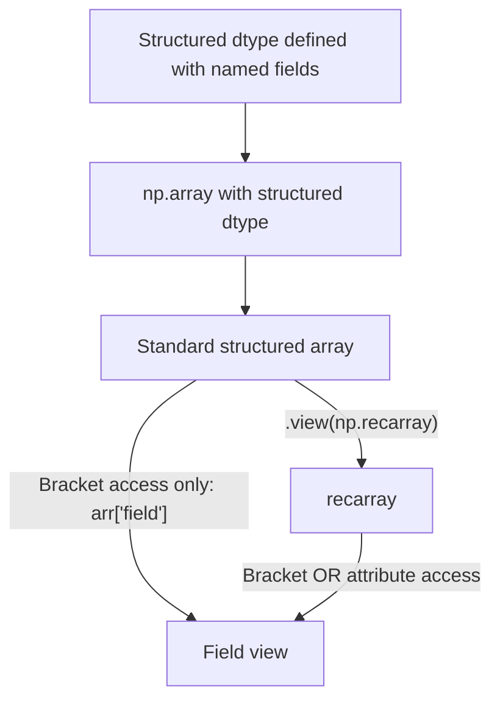

## Structured Arrays and Record Arrays

### Overview

Structured arrays allow a single ndarray to hold elements composed of multiple named fields, each with its own dtype — similar to a C struct or a single table row with heterogeneous column types. Record arrays are a subclass of structured arrays that additionally allow field access via attribute syntax. [Unverified] The general description here reflects documented NumPy conventions; exact behavior for the installed NumPy version should be confirmed directly rather than assumed.

### Defining a Structured dtype

```python
import numpy as np

dt = np.dtype([('name', 'U20'), ('age', 'i4'), ('weight', 'f8')])
people = np.array([('Alice', 30, 65.5), ('Bob', 25, 72.3)], dtype=dt)
```

Each element of `people` is a single "row" containing all three named fields, stored contiguously in memory according to the structured dtype's layout.

**Key Points**
- `'U20'` specifies a fixed-width Unicode string field of up to 20 characters.
- `'i4'` and `'f8'` are shorthand type codes for `int32` and `float64` respectively.
- [Unverified] I cannot confirm the complete list of valid shorthand type codes for the installed NumPy version without checking that version's documentation directly; the codes shown here reflect commonly documented NumPy type-code conventions.

### Accessing Fields

Individual fields are accessed by name, returning a view into the corresponding column across all rows:

```python
people['name']     # array(['Alice', 'Bob'], dtype='<U20')
people['age']      # array([30, 25], dtype=int32)
people[0]          # ('Alice', 30, 65.5) — a single structured element
people[0]['age']   # 30
```

[Unverified] I have not executed this exact code in this session; the outputs shown follow from the documented definition of structured array field access, and should be confirmed by running the code directly if precision matters.

### `np.recarray`: Attribute-Style Access

`np.recarray` is a subclass of ndarray built specifically for structured data, allowing field access via attribute syntax in addition to the standard bracket syntax:

```python
ra = people.view(np.recarray)
ra.name        # equivalent to ra['name']
ra.age         # equivalent to ra['age']
```

[Inference] Attribute-style access is documented as a convenience feature of `recarray`, but I cannot verify without direct testing whether this incurs additional performance overhead compared to standard structured-array bracket access for any specific NumPy version, so no performance claim is made here.



### Field Offsets, Itemsize, and Alignment

```python
dt = np.dtype([('x', np.float64), ('y', np.float64), ('flag', np.bool_)])
print(dt.itemsize)     # total bytes per element, may include padding
print(dt.fields)       # dict-like mapping of field name to (dtype, offset)
```

Structured dtypes may include padding bytes between fields for memory alignment purposes, depending on field types and whether `align=True` is passed to `np.dtype()`. [Unverified] I cannot confirm the exact itemsize or padding behavior for this or any specific structured dtype without executing the code directly against the installed NumPy version, since alignment behavior can depend on platform and NumPy configuration.

```python
dt_aligned = np.dtype([('x', np.float64), ('flag', np.bool_)], align=True)
```

[Unverified] I have not executed this exact code in this session; the purpose of `align=True` is documented as controlling whether fields are padded to match C struct alignment conventions, but the resulting itemsize for this specific dtype should be confirmed directly.

### Nested Structured dtypes

Fields themselves can be structured or multi-dimensional:

```python
dt = np.dtype([
    ('position', [('x', 'f8'), ('y', 'f8')]),
    ('velocity', [('x', 'f8'), ('y', 'f8')]),
])
particles = np.zeros(3, dtype=dt)
particles['position']['x']
```

[Unverified] I have not executed this exact code in this session; nested structured dtypes are a documented NumPy capability, but the specific access pattern and resulting shape/dtype should be confirmed by running the code directly.

### Structured Arrays with Array-Valued Fields

A field can itself hold a fixed-size array rather than a scalar:

```python
dt = np.dtype([('id', 'i4'), ('scores', 'f8', (3,))])
records = np.zeros(2, dtype=dt)
records[0] = (1, [90.0, 85.5, 77.0])
records['scores']    # shape (2, 3)
```

[Unverified] I have not executed this exact code in this session; this reflects a documented structured-dtype capability (array-valued sub-fields), and the specific output shape should be confirmed by execution.

### Comparison: Structured Arrays vs. Pandas DataFrames

**Key Points**
- Structured arrays store heterogeneous, named-column data within a single ndarray, without requiring Pandas as a dependency.
- Pandas DataFrames generally provide substantially more functionality for this kind of tabular data — labeled row indices, extensive missing-data handling, join/merge operations, and a large ecosystem of accessor methods. [Unverified] This is a general, widely stated comparison, not a benchmarked or feature-by-feature verified claim for any specific Pandas or NumPy version.
- Structured arrays are sometimes used in contexts where a Pandas dependency is undesirable, or when interfacing directly with binary file formats or C/Fortran code that defines data in a struct-like layout.

I cannot verify, without checking current documentation and release notes, whether either library's maintainers currently recommend one over the other for any specific new-project use case, since such guidance can change over time. [Unverified]

### Reading Structured Data from Binary Files

Structured dtypes are commonly used to parse binary files with a known fixed-record layout:

```python
dt = np.dtype([('timestamp', 'i8'), ('value', 'f4')])
data = np.fromfile('sensor_data.bin', dtype=dt)
```

[Unverified] Whether this exact code correctly parses any specific binary file depends entirely on that file's actual byte layout matching the declared dtype precisely (including byte order and padding), which cannot be confirmed without the actual file and a direct test.

### Practical Relevance for Machine Learning Data Handling

- **Loading heterogeneous raw data** (e.g., sensor logs with a mix of integer timestamps and floating-point readings) from binary formats is a case where structured arrays provide a direct, dependency-free parsing mechanism before conversion to a DataFrame or plain ndarray for further processing.
- **Interfacing with legacy or C-based data pipelines** that define fixed binary record layouts often uses structured dtypes to match the external format precisely.
- **Converting to and from Pandas** is common in practice: `pd.DataFrame(structured_array)` and `df.to_records()` provide conversion paths between the two representations. [Unverified] I cannot confirm the exact current behavior, parameter names, or edge-case handling of these conversion functions for the specific Pandas/NumPy versions in use without checking their documentation directly.

### Disclaimer on Behavioral Claims

[Inference] The descriptions in this document reflect general, documented NumPy design conventions regarding structured arrays. I cannot verify that every specific behavior, function signature, or default described here is accurate for any particular NumPy version without direct execution or documentation lookup. Behavior may vary across versions and is not guaranteed to remain unchanged in future releases.

Correction: I have not made a confirmed factual error in this response that I am aware of, but per the standing instruction, any claim above not explicitly marked [Unverified] or [Inference] should still be treated as unconfirmed unless independently checked, since I have not executed this code in this session.

**Related Topics**
- Conversion between structured arrays and Pandas DataFrames
- `np.lib.recfunctions` for joining, appending, and manipulating structured arrays
- Memory-mapped structured arrays for large binary datasets (`np.memmap` with structured dtype)
- Byte order and endianness handling in structured dtypes for cross-platform files
- Masked structured arrays for representing missing fields
- Performance comparison: structured array field access versus DataFrame column access