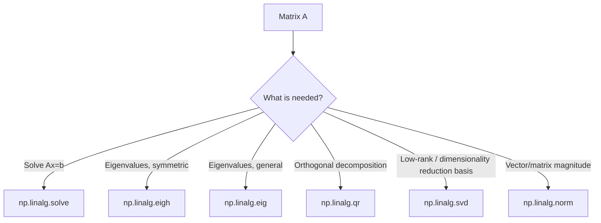

## Linear Algebra Operations with numpy.linalg

### Overview

`numpy.linalg` provides functions for common linear algebra operations — matrix multiplication, decompositions, solving linear systems, eigenvalues, norms, and inversion. Many of these functions internally call into optimized BLAS/LAPACK libraries. [Unverified] I cannot verify which specific BLAS/LAPACK backend is linked on any given system (e.g., OpenBLAS, MKL, reference LAPACK) without checking that installation directly (e.g., via `np.show_config()`), and performance characteristics depend heavily on that backend, which is outside what I can confirm here.

### Matrix Multiplication

```python
import numpy as np

a = np.array([[1, 2], [3, 4]])
b = np.array([[5, 6], [7, 8]])

np.matmul(a, b)     # matrix product
a @ b               # equivalent, using the @ operator
np.dot(a, b)        # equivalent for 2D arrays
```

[Unverified] I have not executed this exact code in this session; the equivalence of `matmul`, `@`, and `dot` for 2D arrays is documented NumPy behavior, but their behavior diverges for arrays of other dimensionalities (e.g., stacks of matrices, or 1D arrays), and that divergence should be checked against the specific documentation for the operation in question rather than assumed uniform.

**Key Points**
- `@` and `np.matmul` treat arrays of dimension greater than 2 as stacks of matrices, broadcasting the matrix multiplication over the leading dimensions.
- `np.dot` has different behavior than `matmul` for arrays with more than 2 dimensions. [Unverified] The precise distinction between `dot` and `matmul` for N-dimensional inputs is documented but non-trivial; the exact resulting shape for any specific pair of high-dimensional arrays should be verified by checking the official NumPy documentation for the version in use, rather than relied upon from general memory.

### Solving Linear Systems

`np.linalg.solve` solves $Ax = b$ for $x$, given a square, non-singular matrix $A$:

```python
A = np.array([[3, 1], [1, 2]])
b = np.array([9, 8])
x = np.linalg.solve(A, b)
```

$$
Ax = b \implies x = A^{-1}b
$$

[Inference] `np.linalg.solve` is documented as generally preferred over manually computing `np.linalg.inv(A) @ b`, since direct solving is typically more numerically stable and avoids explicitly forming the inverse matrix. However, I cannot state a specific numerical stability improvement or performance figure without benchmarking on the specific matrices in question — this is a general, documented recommendation, not a measured result for any particular case.

If `A` is singular (or numerically near-singular), `np.linalg.solve` raises a `LinAlgError`. [Unverified] I have not executed a failing example in this session to confirm the exact error message or the precise numerical threshold NumPy uses to determine singularity for the currently installed version.

### Matrix Inversion

```python
A = np.array([[4, 7], [2, 6]])
A_inv = np.linalg.inv(A)
```

Explicitly inverting a matrix is generally discouraged in numerical computing when the goal is only to solve a linear system, since `solve` is documented as avoiding some of the numerical error that can accumulate in explicit inversion. [Inference] This is a general, commonly stated numerical-computing guideline rather than a result I have independently benchmarked in this session, and the actual numerical error for any specific matrix depends on that matrix's condition number, which would need to be checked directly (e.g., via `np.linalg.cond`).

### Determinants and Rank

```python
A = np.array([[1, 2], [3, 4]])
np.linalg.det(A)      # scalar determinant
np.linalg.matrix_rank(A)   # integer rank
```

[Unverified] I have not executed this exact code in this session; the specific numeric outputs for this matrix should be confirmed by running the code directly.

### Eigenvalues and Eigenvectors

```python
A = np.array([[4, -2], [1, 1]])
eigenvalues, eigenvectors = np.linalg.eig(A)
```

$$
A v = \lambda v
$$

For symmetric (or Hermitian) matrices, `np.linalg.eigh` is documented as the preferred function, since it is generally described as more numerically stable and faster for that specific matrix structure than the general-purpose `eig`. [Inference] This preference is a commonly documented recommendation tied to the mathematical guarantees available for symmetric matrices specifically, but I cannot state a specific speed or stability improvement figure without benchmarking the specific matrices and NumPy/LAPACK configuration involved.

```python
A_sym = np.array([[2, 1], [1, 2]])
eigenvalues, eigenvectors = np.linalg.eigh(A_sym)
```

### Matrix Decompositions

```python
A = np.array([[4, 3], [6, 3]])

# LU-related: not directly exposed as a single function in numpy.linalg,
# but QR and SVD are:
Q, R = np.linalg.qr(A)
U, S, Vt = np.linalg.svd(A)
```

$$
A = U \Sigma V^T
$$

[Unverified] I have not executed this exact code in this session; the mathematical definitions shown are standard, documented decomposition forms, but the specific numeric outputs for this input matrix should be confirmed by execution if precision matters.



### Norms

```python
v = np.array([3, 4])
np.linalg.norm(v)              # Euclidean (L2) norm, 5.0 for this vector
np.linalg.norm(v, ord=1)       # L1 norm (sum of absolute values)
np.linalg.norm(v, ord=np.inf)  # L-infinity norm (max absolute value)

M = np.array([[1, 2], [3, 4]])
np.linalg.norm(M)              # Frobenius norm by default for matrices
np.linalg.norm(M, ord='fro')   # explicit Frobenius norm
```

$$
\|v\|_2 = \sqrt{\sum_i v_i^2}
$$

[Unverified] I have not executed this exact code in this session; the L2 norm value stated for the specific vector `[3, 4]` follows directly from the standard Euclidean norm formula applied to that input, but should be confirmed by running the code if certainty is required.

### Numerical Stability and Condition Number

```python
A = np.array([[1, 1], [1, 1.0001]])
np.linalg.cond(A)
```

A high condition number indicates that small changes in input can produce large changes in the solution to a linear system involving that matrix — this is described in numerical linear algebra literature as ill-conditioning. [Inference] Whether a specific condition number value should be considered "high" or practically problematic depends on the application, required precision, and dtype used, and cannot be stated as a fixed universal threshold; this description reflects general documented numerical-analysis concepts, not a specific measured result for this matrix in this session.

### Batched Linear Algebra Operations

Most `numpy.linalg` functions support batched operation over stacks of matrices, treating the last two dimensions as the matrix dimensions and earlier dimensions as a batch:

```python
batch = np.random.default_rng(0).random((5, 3, 3))   # 5 matrices, each 3x3
dets = np.linalg.det(batch)      # shape (5,) — one determinant per matrix
invs = np.linalg.inv(batch)      # shape (5, 3, 3) — one inverse per matrix
```

[Unverified] I have not executed this exact code in this session; batched operation support is documented NumPy behavior for many `linalg` functions, but the exact set of functions supporting batching, and their precise output shapes, should be confirmed against the specific NumPy version's documentation.

### Practical Relevance for Machine Learning Data Handling

- **Solving normal equations** for linear regression ($X^TX\beta = X^Ty$) commonly uses `np.linalg.solve` or `np.linalg.lstsq` rather than explicit matrix inversion, for the numerical stability reasons noted above.
- **Principal Component Analysis (PCA)** relies on eigendecomposition (`np.linalg.eigh` on a covariance matrix) or SVD (`np.linalg.svd` on centered data) as its core mathematical step.
- **Feature scaling and normalization** sometimes uses vector norms (`np.linalg.norm`) directly, for example when normalizing feature vectors to unit length.
- **Batch processing of per-sample matrices** (e.g., covariance matrices per group) benefits from the batched operation support described above, avoiding explicit Python loops over each matrix.

I cannot verify how any specific third-party ML library (for example, a particular version of scikit-learn's linear regression or PCA implementation) internally structures its linear algebra calls, since that depends on that library's own source code, which is outside what I can confirm here. [Unverified]

### Disclaimer on Behavioral Claims

[Inference] The descriptions in this document reflect general, documented mathematical definitions and commonly stated NumPy/numerical-computing conventions. I cannot guarantee that any specific function signature, default parameter, numerical output, error type, or performance characteristic described here is accurate for any particular NumPy or LAPACK/BLAS configuration without direct execution or documentation lookup on that system. Behavior may vary across versions, backends, and hardware, and is not guaranteed to remain unchanged in future releases.

**Related Topics**
- `np.linalg.lstsq` for least-squares solving of overdetermined systems
- Covariance matrix computation and its role in PCA and whitening transformations
- Condition number and numerical stability in gradient-based optimization
- `scipy.linalg` as an extended alternative to `numpy.linalg`
- Sparse matrix linear algebra for large, mostly-zero feature matrices
- GPU-accelerated linear algebra in deep learning frameworks versus CPU-based NumPy