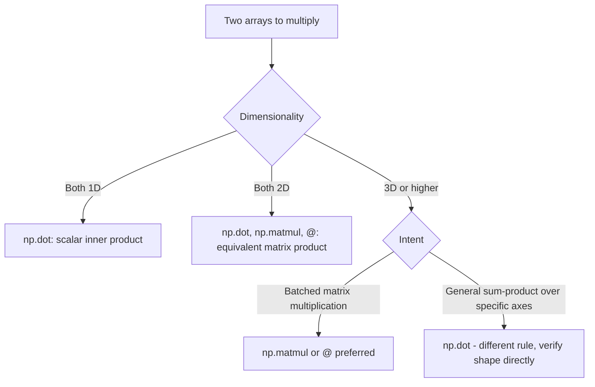

## Matrix Multiplication, Dot Products, and einsum

### Overview

NumPy provides several related but distinct functions for multiplying arrays: `np.dot`, `np.matmul` (and the `@` operator), `np.inner`, `np.outer`, and `np.einsum`. Each has different rules for how dimensions are handled, particularly for arrays beyond 2D. [Unverified] I cannot verify that the descriptions below match the exact behavior of any specific installed NumPy version without direct execution; this reflects general documented conventions.

### Vector Dot Product

For 1D arrays, `np.dot` computes the standard inner product:

```python
import numpy as np

a = np.array([1, 2, 3])
b = np.array([4, 5, 6])
np.dot(a, b)     # 1*4 + 2*5 + 3*6 = 32
```

$$
a \cdot b = \sum_i a_i b_i
$$

[Unverified] I have not executed this exact code in this session; the result follows directly from the standard dot product formula applied to these specific values, and should be confirmed by running the code if certainty is required.

### Matrix Multiplication: `np.dot` vs `np.matmul` vs `@`

For 2D arrays, `np.dot`, `np.matmul`, and `@` are documented as producing equivalent results:

```python
A = np.array([[1, 2], [3, 4]])
B = np.array([[5, 6], [7, 8]])

np.dot(A, B)
np.matmul(A, B)
A @ B
```

[Unverified] This equivalence for the strictly 2D case is a commonly documented NumPy convention. I cannot confirm it holds identically for the specific installed NumPy version without executing the code and comparing results directly.

For arrays with more than 2 dimensions, the two functions diverge:

- `np.matmul` (and `@`) treats extra leading dimensions as a **batch** of matrices, applying matrix multiplication independently to each pair along the last two axes, with broadcasting over the batch dimensions.
- `np.dot` uses a different rule for N-dimensional inputs: it is documented as a sum-product over the last axis of the first array and the second-to-last axis of the second array, which does not correspond to batched matrix multiplication in the way `matmul` does.

[Unverified] I cannot state the exact resulting shape for any specific pair of N-dimensional input shapes without either executing the code directly or checking the precise definition in the current NumPy documentation, since this distinction is a documented but easy-to-misstate area of the API. [Inference] Based on this documented distinction, `np.matmul` or `@` is generally the more appropriate choice for batched matrix operations in machine learning contexts (e.g., processing a batch of matrices per sample), while `np.dot` is more directly suited to the 1D and 2D cases shown above — but this is a general guideline, not a substitute for checking the specific shapes involved in any given case.



### Outer Product

```python
a = np.array([1, 2, 3])
b = np.array([4, 5])
np.outer(a, b)
```

$$
\text{outer}(a,b)_{ij} = a_i b_j
$$

[Unverified] I have not executed this exact code in this session; the resulting shape `(3, 2)` follows from the documented definition of the outer product applied to these input lengths, and specific numeric values should be confirmed by execution.

### Inner Product for Higher-Dimensional Arrays

`np.inner` computes a sum product over the last axis of each input, which for 1D arrays is equivalent to the dot product, but differs from `np.dot` for higher-dimensional inputs:

```python
a = np.array([[1, 2], [3, 4]])
b = np.array([[5, 6], [7, 8]])
np.inner(a, b)
```

[Unverified] I cannot confirm the exact resulting values or shape for this specific example without executing the code directly, since `np.inner`'s multi-dimensional behavior is a documented but distinct rule from both `np.dot` and `np.matmul`, and should not be assumed equivalent to either without checking the specific case.

### Batched Matrix Multiplication with `@`

```python
batch_a = np.random.default_rng(0).random((10, 3, 4))   # 10 matrices, each 3x4
batch_b = np.random.default_rng(1).random((10, 4, 5))   # 10 matrices, each 4x5

result = batch_a @ batch_b     # shape (10, 3, 5)
```

Each of the 10 matrix pairs is multiplied independently, following ordinary matrix multiplication rules on the trailing two axes, with the leading axis treated as a batch dimension via broadcasting. [Inference] This describes the documented general behavior of `@`/`np.matmul` for batched inputs, but I have not executed this exact code in this session, so the resulting shape should be confirmed directly if precision matters.

### `np.einsum`: Explicit Index Notation

`np.einsum` allows arbitrary tensor contractions to be expressed directly using Einstein summation notation, which can replace many of the functions above with a single, explicit expression:

```python
a = np.array([1, 2, 3])
b = np.array([4, 5, 6])

np.einsum('i,i->', a, b)        # equivalent to dot product: scalar
np.einsum('i,j->ij', a, b)      # equivalent to outer product

A = np.array([[1, 2], [3, 4]])
B = np.array([[5, 6], [7, 8]])
np.einsum('ij,jk->ik', A, B)    # equivalent to matrix multiplication

batch_a = np.random.default_rng(0).random((10, 3, 4))
batch_b = np.random.default_rng(1).random((10, 4, 5))
np.einsum('bij,bjk->bik', batch_a, batch_b)   # equivalent to batched matmul
```

[Unverified] I have not executed these exact calls in this session; the equivalences stated follow from the standard, documented definition of Einstein summation notation applied to each expression, and specific numeric outputs should be confirmed by running the code directly.

**Key Points**
- `einsum`'s string notation specifies which axes are summed over (repeated indices not present in the output) and which are preserved.
- `einsum` can express many operations (trace, transpose, diagonal extraction, batched contraction) that would otherwise require separate specialized functions.
- [Inference] `einsum` is documented as sometimes offering performance benefits over chained separate operations, since it can avoid materializing intermediate arrays in some cases, but the actual performance for any specific expression depends on the NumPy version's internal optimization path and should be benchmarked directly rather than assumed. Some NumPy versions/configurations may or may not apply certain internal optimizations by default — this should be checked via the `optimize` parameter and the specific documentation for the installed version.

```python
np.einsum('ij,jk->ik', A, B, optimize=True)
```

[Unverified] I cannot confirm the exact performance impact of the `optimize` parameter for any specific case without benchmarking directly, since this depends on the specific tensor shapes and the contraction path chosen internally.

### Trace and Diagonal via einsum

```python
A = np.array([[1, 2], [3, 4]])
np.einsum('ii->', A)      # trace: sum of diagonal elements
np.einsum('ii->i', A)     # diagonal elements as a 1D array
```

[Unverified] I have not executed this exact code in this session; these expressions follow from standard Einstein notation conventions for trace and diagonal extraction, and should be confirmed by execution if precision matters.

### Practical Relevance for Machine Learning Data Handling

- **Batched attention and transformation operations** in many deep learning contexts are commonly expressed using batched matrix multiplication (`@` or `matmul`) or `einsum`, since these operations frequently involve multiplying stacks of matrices per sample in a batch.
- **Custom tensor contractions** not covered by a named function (e.g., specific multi-way tensor operations in certain model architectures) are often implemented directly with `einsum` for clarity and explicitness about which axes are summed.
- **Feature interaction terms** (e.g., computing all pairwise products between two feature vectors) can be expressed directly via `np.outer` or the equivalent `einsum` expression.

I cannot verify how any specific third-party ML framework's internal tensor operations (for example, a particular deep learning library's attention mechanism implementation) are structured, since that depends on that library's own source code, which is outside what I can confirm here. [Unverified]

### Disclaimer on Behavioral Claims

[Inference] The descriptions in this document reflect general, documented mathematical definitions of dot products, matrix multiplication, and Einstein summation notation, along with commonly stated NumPy API conventions. I cannot guarantee that any specific function signature, default parameter, shape-broadcasting rule, or performance characteristic described here is accurate for any particular NumPy version without direct execution or documentation lookup on that system. Behavior may vary across versions and configurations and is not guaranteed to remain unchanged in future releases.

**Related Topics**
- `np.tensordot` for explicit axis-pair contraction control
- Performance comparison between `einsum`, `matmul`, and manual broadcasting for specific contraction patterns
- Batched linear algebra operations in `numpy.linalg`
- Attention mechanism tensor operations in deep learning frameworks
- Sparse tensor contraction for large, mostly-zero feature interactions
- GPU tensor libraries' einsum-equivalent operations and their relationship to NumPy's implementation