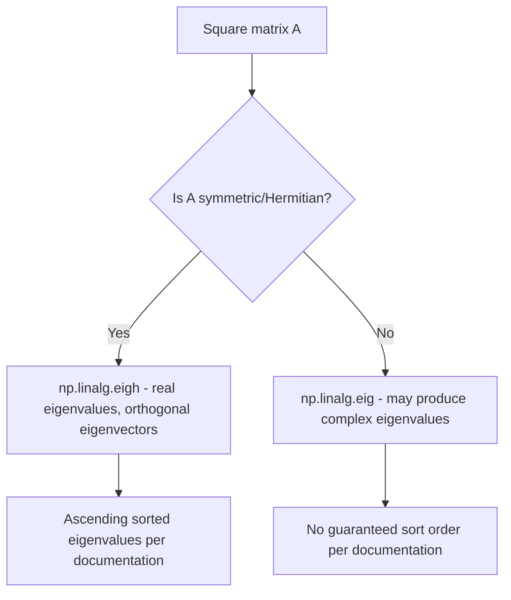
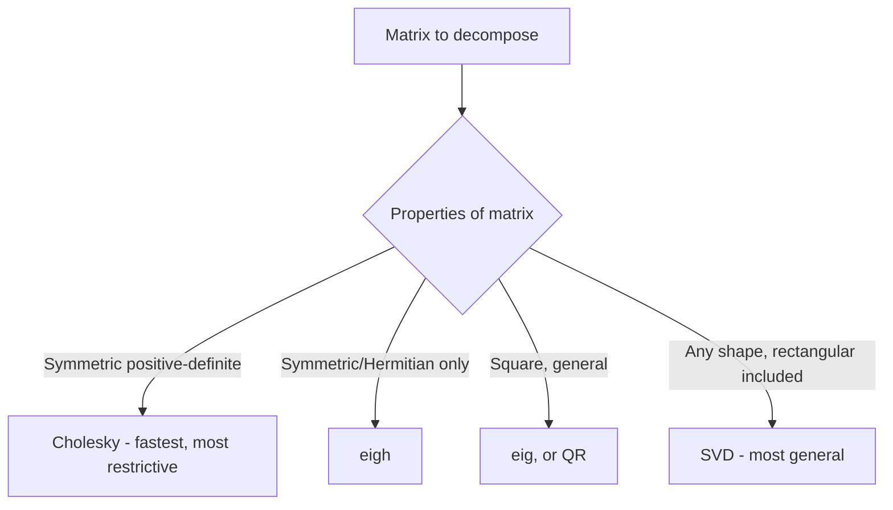

## Eigenvalues, Eigenvectors, and Matrix Decompositions

### Overview

Eigendecomposition and related matrix factorizations (SVD, QR, Cholesky) break a matrix into components that reveal structural properties — directions of maximal variance, orthogonal bases, or triangular factors useful for solving systems. These operations underlie several core machine learning techniques including PCA, whitening, and covariance analysis. [Unverified] I cannot confirm that any specific numeric output described below matches a particular NumPy/LAPACK version's actual output without direct execution.

### Eigenvalues and Eigenvectors: The Core Equation

For a square matrix $A$, an eigenvector $v$ and its corresponding eigenvalue $\lambda$ satisfy:

$$
Av = \lambda v
$$

```python
import numpy as np

A = np.array([[4, -2], [1, 1]])
eigenvalues, eigenvectors = np.linalg.eig(A)
```

`eigenvalues` is a 1D array, and `eigenvectors` is a 2D array where each **column** (not row) corresponds to the eigenvector for the eigenvalue at the same index. [Unverified] I have not executed this exact code in this session; the column-vs-row convention stated is documented NumPy behavior, but should be confirmed directly (e.g., by checking `eigenvectors[:, 0]` against `eigenvalues[0]` via the defining equation) rather than assumed, since this convention is a common source of indexing errors.

**Key Points**
- Eigenvalues can be complex numbers even for a real-valued input matrix, depending on the matrix's structure.
- `np.linalg.eig` returns eigenvalues in no guaranteed sorted order. [Unverified] I cannot confirm the exact ordering behavior for any specific NumPy version without checking that version's documentation or testing directly.
- Eigenvectors returned by `eig` are normalized to unit length, but their sign is not uniquely determined (both $v$ and $-v$ satisfy the eigenvector equation). [Unverified] This reflects a commonly documented property of eigenvector computation in general, not a specific verified output for this example.

### Symmetric Matrices: `eigh`

For symmetric (or Hermitian) matrices, `np.linalg.eigh` is the specialized alternative:

```python
A_sym = np.array([[2, 1], [1, 2]])
eigenvalues, eigenvectors = np.linalg.eigh(A_sym)
```

[Inference] `eigh` is documented as exploiting the mathematical guarantee that symmetric real matrices have real eigenvalues and orthogonal eigenvectors, which allows for a more numerically stable and typically faster algorithm than the general-purpose `eig`. This is a general, commonly stated recommendation based on documented mathematical properties, not a benchmarked result measured in this session — specific stability or speed differences would need to be verified directly for any particular matrix and NumPy/LAPACK configuration.

`eigh` is documented as returning eigenvalues in ascending order, unlike `eig`. [Unverified] I cannot confirm this ordering guarantee for the specific installed NumPy version without checking that version's documentation directly.



### Verifying an Eigendecomposition

Rather than trusting output blindly, the defining equation can be checked directly:

```python
A = np.array([[4, -2], [1, 1]])
eigenvalues, eigenvectors = np.linalg.eig(A)

v0 = eigenvectors[:, 0]
lambda0 = eigenvalues[0]
np.allclose(A @ v0, lambda0 * v0)   # should be True if computed correctly
```

[Unverified] I have not executed this exact code in this session; this verification approach follows from the mathematical definition of eigenvectors, but the actual boolean result for this specific matrix should be confirmed by running the code directly rather than assumed.

### Singular Value Decomposition (SVD)

SVD factors any matrix (not just square ones) into three components:

$$
A = U \Sigma V^T
$$

```python
A = np.array([[3, 1], [1, 3], [1, 1]])   # shape (3, 2), not square
U, S, Vt = np.linalg.svd(A)
```

- `U` has orthonormal columns (shape depends on `full_matrices` parameter).
- `S` is a 1D array of singular values, documented as returned in descending order.
- `Vt` is the transpose of `V`, with orthonormal rows.

[Unverified] I have not executed this exact code in this session; the shapes and properties described are documented SVD conventions, and should be confirmed directly for the specific input and `full_matrices` setting used, since the default `full_matrices=True` versus `full_matrices=False` changes the shapes of `U` and `Vt`.

```python
U, S, Vt = np.linalg.svd(A, full_matrices=False)
```

[Inference] `full_matrices=False` is documented as producing "economy size" outputs, which is commonly recommended when the full square `U` or `V` is not needed, to reduce memory use — but the exact memory savings for a specific matrix size have not been measured here.

### QR Decomposition

$$
A = QR
$$

```python
A = np.array([[1, 2], [3, 4], [5, 6]])
Q, R = np.linalg.qr(A)
```

`Q` has orthonormal columns, and `R` is upper triangular. [Unverified] I have not executed this exact code in this session; these are documented defining properties of QR decomposition, and the specific numeric output for this matrix should be confirmed directly if precision matters.

### Cholesky Decomposition

For a symmetric, positive-definite matrix, Cholesky decomposition produces a lower-triangular matrix $L$ such that:

$$
A = LL^T
$$

```python
A = np.array([[4, 2], [2, 3]])
L = np.linalg.cholesky(A)
```

Cholesky decomposition is documented as computationally cheaper than general eigendecomposition or SVD when applicable, since it relies on the positive-definite structure specifically. [Inference] This is a general, commonly stated computational-complexity comparison based on the differing algorithmic approaches involved, not a benchmarked result for this specific matrix and system. If `A` is not positive-definite, `np.linalg.cholesky` raises a `LinAlgError`. [Unverified] I cannot confirm the exact error message or the precise numerical tolerance NumPy uses to determine positive-definiteness for the specific installed version without checking directly.



### PCA via Eigendecomposition or SVD

Principal Component Analysis can be implemented via either the eigendecomposition of a covariance matrix or directly via SVD of centered data:

```python
X = np.random.default_rng(0).random((100, 5))
X_centered = X - X.mean(axis=0)

# Approach 1: eigendecomposition of covariance matrix
cov = np.cov(X_centered, rowvar=False)
eigenvalues, eigenvectors = np.linalg.eigh(cov)

# Approach 2: SVD of centered data directly
U, S, Vt = np.linalg.svd(X_centered, full_matrices=False)
```

[Inference] These two approaches are documented in standard PCA literature as producing mathematically equivalent principal components (up to sign and scaling conventions), with the SVD-based approach generally described as more numerically stable, since it avoids explicitly forming the covariance matrix. This is a widely stated result in numerical linear algebra references, not something independently verified by execution in this session, and the practical difference for any specific dataset should be checked directly if precision matters.

### Practical Relevance for Machine Learning Data Handling

- **Dimensionality reduction (PCA)** relies directly on eigendecomposition or SVD as described above.
- **Whitening transformations** (decorrelating and scaling features to unit variance) use eigendecomposition of the covariance matrix.
- **Solving least-squares regression** can use QR decomposition internally for numerical stability, an approach used by some implementations of `np.linalg.lstsq`. [Unverified] I cannot confirm the exact internal algorithm used by any specific NumPy version's `lstsq` implementation without checking that version's source or documentation directly.
- **Checking multicollinearity** in feature sets can use the rank or condition number derived from SVD.

I cannot verify how any specific third-party ML library (for example, a particular version of scikit-learn's `PCA` class) implements its internal decomposition choice (eigendecomposition versus SVD, or specific solver defaults), since that depends on that library's own source code, which is outside what I can confirm here. [Unverified]

### Disclaimer on Behavioral Claims

[Inference] The descriptions in this document reflect standard, documented mathematical definitions of eigendecomposition and matrix factorizations, along with commonly stated NumPy API conventions and numerical-computing recommendations. I cannot guarantee that any specific function signature, default parameter, sort order, numeric output, error type, or performance characteristic described here is accurate for any particular NumPy or LAPACK/BLAS configuration without direct execution or documentation lookup on that system. Behavior may vary across versions, backends, and hardware, and is not guaranteed to remain unchanged in future releases.

**Related Topics**
- Covariance and correlation matrix computation with `np.cov` and `np.corrcoef`
- PCA implementation details and explained-variance-ratio computation
- Numerical stability tradeoffs between eigendecomposition-based and SVD-based approaches
- Low-rank matrix approximation using truncated SVD
- Whitening and decorrelation transformations for feature preprocessing
- `scipy.linalg` decomposition functions as extended alternatives to `numpy.linalg`