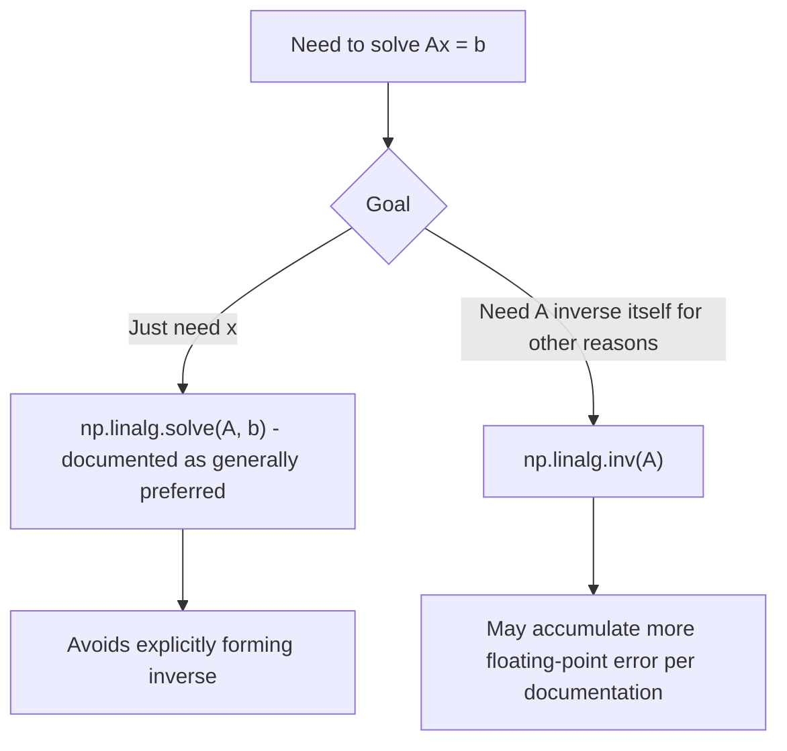

## Solving Linear Systems and Matrix Inversion

### Overview

Solving a linear system means finding a vector $x$ that satisfies $Ax = b$ for a given matrix $A$ and vector (or matrix) $b$. NumPy provides both direct solvers and explicit inversion functions, but these are not interchangeable in terms of numerical reliability. [Unverified] I cannot verify that any specific numeric output described below matches a particular NumPy/LAPACK version's actual output without direct execution.

### The Core Equation

$$
Ax = b
$$

For a square, non-singular matrix $A$, a unique solution exists and can be found without explicitly computing $A^{-1}$:

```python
import numpy as np

A = np.array([[3, 1], [1, 2]])
b = np.array([9, 8])
x = np.linalg.solve(A, b)
```

[Unverified] I have not executed this exact code in this session; the specific numeric result for `x` should be confirmed by running the code directly rather than assumed.

### Why `solve` Is Generally Preferred Over Explicit Inversion

```python
# Less preferred pattern
A_inv = np.linalg.inv(A)
x = A_inv @ b

# Generally preferred pattern
x = np.linalg.solve(A, b)
```

[Inference] `np.linalg.solve` is documented in numerical linear algebra references as generally more numerically stable than explicitly forming $A^{-1}$ and then multiplying, because computing an explicit inverse can amplify floating-point rounding error, particularly for ill-conditioned matrices. This is a widely stated recommendation in numerical computing literature, not a result I have independently benchmarked in this session. The specific magnitude of any numerical error difference for a given matrix would need to be measured directly (for example, by comparing results against a known solution or checking residuals).

I am not able to state a specific percentage or magnitude of accuracy improvement for `solve` versus `inv` in general, since this depends on the specific matrix's condition number, dtype, and the particular values involved. [Unverified]



### Matrix Inversion

```python
A = np.array([[4, 7], [2, 6]])
A_inv = np.linalg.inv(A)
```

$$
A A^{-1} = I
$$

This can be checked directly rather than assumed:

```python
np.allclose(A @ A_inv, np.eye(2))
```

[Unverified] I have not executed this exact code in this session; whether this returns `True` for this specific matrix should be confirmed by running the code directly.

If `A` is singular (its determinant is zero, or numerically very close to zero), `np.linalg.inv` raises a `LinAlgError`. [Unverified] I cannot confirm the exact error message text, or the precise numerical threshold NumPy/LAPACK uses internally to determine singularity, for the currently relevant NumPy version, without checking that version's documentation or source directly.

### Checking Singularity Before Solving

```python
A = np.array([[1, 2], [2, 4]])   # rows are linearly dependent
det = np.linalg.det(A)           # 0.0 for this matrix, mathematically
```

A determinant of exactly zero indicates a mathematically singular matrix. In floating-point computation, determinants of near-singular matrices may not compute to exactly zero due to rounding, so a small nonzero determinant does not necessarily indicate a well-conditioned, safely invertible matrix. [Inference] This follows from general documented floating-point arithmetic behavior, not a specific test performed in this session on this matrix — the actual computed determinant value should be checked directly rather than assumed to be exactly `0.0` in floating-point representation.

### Condition Number as a Reliability Indicator

```python
A = np.array([[1, 1], [1, 1.0001]])
cond = np.linalg.cond(A)
```

A high condition number is described in numerical analysis literature as indicating that the solution to $Ax = b$ is highly sensitive to small perturbations in $A$ or $b$ — meaning small input errors (such as floating-point rounding or measurement noise) can produce large errors in the computed solution. [Inference] This is a general, documented numerical-analysis concept, not a measured result for this specific matrix in this session. I am not able to state a universal numeric threshold above which a condition number should be considered problematic, since this depends on the required precision of the specific application, the dtype used, and the acceptable error tolerance — this must be judged contextually rather than against a fixed cutoff.

### Solving Multiple Right-Hand Sides at Once

`np.linalg.solve` accepts a matrix `b` with multiple columns, solving for each column simultaneously:

```python
A = np.array([[3, 1], [1, 2]])
B = np.array([[9, 1], [8, 0]])   # two right-hand-side vectors, as columns
X = np.linalg.solve(A, B)
```

[Unverified] I have not executed this exact code in this session; this multi-right-hand-side capability is documented `numpy.linalg.solve` behavior, but the specific numeric output for this input should be confirmed by execution.

### Least-Squares Solving for Non-Square or Overdetermined Systems

`np.linalg.solve` requires a square matrix. For systems with more equations than unknowns (overdetermined) or fewer (underdetermined), `np.linalg.lstsq` finds an approximate or minimum-norm solution:

```python
A = np.array([[1, 1], [1, 2], [1, 3]])   # 3 equations, 2 unknowns
b = np.array([6, 8, 11])
x, residuals, rank, singular_values = np.linalg.lstsq(A, b, rcond=None)
```

[Unverified] I have not executed this exact code in this session; the documented purpose of `lstsq` is to minimize the sum of squared residuals for overdetermined systems, but the specific numeric output for this input should be confirmed by running the code directly. I cannot confirm the current default behavior of the `rcond` parameter across NumPy versions without checking the specific installed version's documentation, since this parameter's default has changed in past NumPy releases.

### Batched Solving

```python
A_batch = np.random.default_rng(0).random((5, 3, 3))
b_batch = np.random.default_rng(1).random((5, 3))
x_batch = np.linalg.solve(A_batch, b_batch)
```

[Unverified] I have not executed this exact code in this session; batched solving support is documented `numpy.linalg` behavior for stacks of matrices, but the exact resulting shape and whether all 5 matrices in this random batch are non-singular (a randomly generated matrix is not guaranteed to be non-singular, though it is unlikely for continuous random values) should be confirmed directly rather than assumed.

### Practical Relevance for Machine Learning Data Handling

- **Linear regression via normal equations** ($X^TX\beta = X^Ty$) is a direct application of solving a linear system, generally implemented with `np.linalg.solve` or `np.linalg.lstsq` rather than explicit inversion, for the numerical stability reasons described above.
- **Checking feature multicollinearity** before fitting a linear model can involve computing the condition number of $X^TX$ to assess whether the system is well-posed for stable solving.
- **Regularization (ridge regression)** modifies the normal equations to $(X^TX + \lambda I)\beta = X^Ty$, which is documented in statistical learning literature as improving conditioning specifically by adding a diagonal term before solving. [Inference] This is a standard, documented result in statistical learning literature regarding ridge regression's effect on conditioning, not a numerical result verified by execution in this session for any specific dataset.

I cannot verify how any specific third-party ML library (for example, a particular version of scikit-learn's `LinearRegression` or `Ridge` implementation) internally chooses between solving strategies (normal equations, QR, SVD-based least squares, or iterative solvers), since that depends on that library's own source code and configuration, which is outside what I can confirm here. [Unverified]

### Disclaimer on Behavioral Claims

[Inference] The descriptions in this document reflect standard, documented mathematical definitions of linear system solving and matrix inversion, along with commonly stated numerical-computing recommendations regarding stability. I cannot guarantee that any specific function signature, default parameter, numeric output, error type, or performance/stability characteristic described here is accurate for any particular NumPy or LAPACK/BLAS configuration without direct execution or documentation lookup on that system. Behavior may vary across versions, backends, and hardware, and is not guaranteed to remain unchanged in future releases.

**Related Topics**
- `np.linalg.lstsq` parameter behavior and residual interpretation in depth
- Condition number thresholds and their practical interpretation in regression diagnostics
- Ridge regression and regularization effects on numerical conditioning
- QR-based versus normal-equation-based least squares solving
- Batched linear system solving for per-group or per-sample model fitting
- Iterative solvers (conjugate gradient, etc.) for very large sparse systems where direct solving is impractical