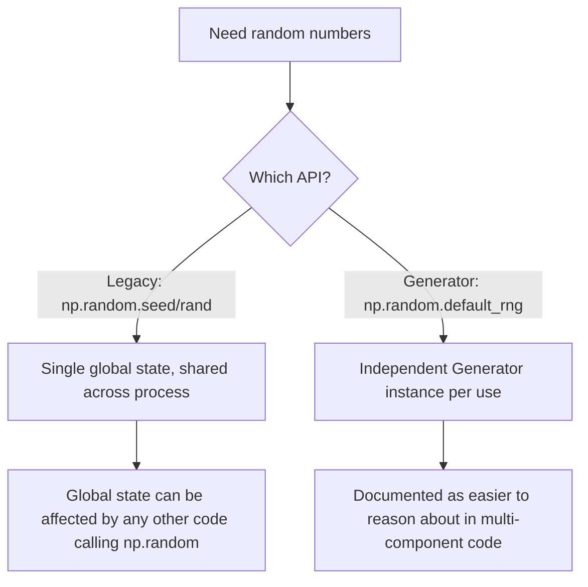

## Random Number Generation and the Generator API

### Overview

NumPy provides two distinct random number generation interfaces: the legacy `np.random.seed()` / `np.random.rand()` style functions, and the newer `Generator` API centered on `np.random.default_rng()`. [Unverified] I cannot verify the exact current recommendation status of either interface for any specific NumPy version without checking that version's documentation directly; the description below reflects generally documented NumPy guidance as commonly stated in NumPy's own documentation, not a claim independently confirmed against a specific installed version in this session.

### The Generator API: Basic Usage

```python
import numpy as np

rng = np.random.default_rng(seed=42)
rng.random()                    # single float in [0, 1)
rng.random((3, 4))              # array of shape (3,4), floats in [0, 1)
rng.integers(0, 10, size=5)     # random integers in [0, 10)
rng.normal(loc=0, scale=1, size=(2, 3))   # normal distribution samples
```

[Unverified] I have not executed this exact code in this session; the described output ranges and shapes follow from the documented function definitions, but specific numeric values (even with a fixed seed) should be confirmed by running the code directly, since I cannot independently verify reproducibility of exact output values without execution.

### Why a `Generator` Instance Instead of Global State

The legacy interface relies on a single global random state shared across the entire process:

```python
np.random.seed(42)
np.random.rand(3)
```

The `Generator` API instead creates an explicit, independent state object:

```python
rng = np.random.default_rng(seed=42)
rng.random(3)
```

**Key Points**
- A `Generator` instance's state is independent of any other `Generator` instance or the legacy global state, which is documented as making it easier to reason about reproducibility in code with multiple independent random processes (e.g., parallel workers, separate experiment components).
- [Inference] This independence is a documented design goal of the `Generator` API as described in NumPy's own documentation, but I cannot verify from this session alone that it eliminates every possible source of reproducibility difficulty in a specific complex codebase — such a claim would depend on the specific code structure and should be evaluated directly rather than assumed as a general guarantee.



### Common Distributions via `Generator`

```python
rng = np.random.default_rng(seed=0)

rng.random(5)                          # uniform [0, 1)
rng.uniform(low=-1, high=1, size=5)    # uniform in custom range
rng.integers(low=0, high=100, size=5)  # random integers
rng.normal(loc=0, scale=1, size=5)     # Gaussian/normal
rng.binomial(n=10, p=0.5, size=5)      # binomial
rng.poisson(lam=3, size=5)             # Poisson
rng.exponential(scale=1.0, size=5)     # exponential
```

[Unverified] I have not executed these exact calls in this session; the described distribution names and parameters reflect documented `Generator` method signatures, but exact parameter names, defaults, and current availability should be confirmed against the specific installed NumPy version's documentation, since I cannot verify this list is complete or unchanged for every version.

### Reproducibility with Seeds

```python
rng1 = np.random.default_rng(seed=123)
rng2 = np.random.default_rng(seed=123)

rng1.random(3)
rng2.random(3)
```

Two `Generator` instances created with the same seed value are documented as producing identical sequences of output, given identical subsequent calls in identical order. [Unverified] I have not executed this exact comparison in this session; while this is standard, documented behavior for seeded pseudo-random number generators generally, I cannot confirm the exact output values without direct execution, and I am not able to state that this reproducibility holds across different NumPy versions, since internal algorithm changes across versions could in principle change output for the same seed — this should be checked directly if cross-version reproducibility matters.

**Key Points**
- A fixed seed produces a deterministic, reproducible sequence within a given NumPy version and configuration, per documented design intent.
- [Unverified] I cannot verify whether reproducibility is guaranteed to hold across different NumPy versions, operating systems, or hardware architectures for any specific case, without checking the specific release notes or testing directly. This should not be assumed as a universal guarantee.

### Random Sampling and Permutations

```python
rng = np.random.default_rng(seed=0)

arr = np.arange(10)
rng.shuffle(arr)                      # in-place shuffle
rng.permutation(arr)                  # returns a shuffled copy, leaves arr unchanged
rng.choice(arr, size=3, replace=False)  # random sample without replacement
```

[Unverified] I have not executed this exact code in this session; the in-place-versus-copy distinction between `shuffle` and `permutation` reflects documented `Generator` method behavior, but should be confirmed directly if the distinction matters for a specific use case, since mistaking one for the other is a common source of bugs.

### Bit Generators Underlying `Generator`

`np.random.default_rng()` uses PCG64 as its default underlying bit generator, per NumPy's documentation as of versions I am aware of. [Unverified] I cannot confirm this is still the current default for the specific NumPy version in use without checking that version's release notes or documentation directly, since default algorithm choices can change across major releases.

```python
from numpy.random import PCG64, Generator

bit_gen = PCG64(seed=42)
rng = Generator(bit_gen)
rng.random(3)
```

This explicit construction allows swapping the underlying bit generator algorithm (e.g., `PCG64`, `Philox`, `SFC64`) while keeping the same `Generator` interface. [Unverified] I cannot confirm the complete current list of available bit generator algorithms for any specific NumPy version without checking that version's documentation directly.

### Parallel and Independent Streams

For generating independent random streams across parallel workers, NumPy documents `SeedSequence` as a tool for spawning multiple, statistically independent child seeds from a single entropy source:

```python
from numpy.random import SeedSequence, default_rng

ss = SeedSequence(12345)
child_seeds = ss.spawn(4)
generators = [default_rng(s) for s in child_seeds]
```

[Unverified] I have not executed this exact code in this session; this pattern reflects documented NumPy guidance for parallel random number generation, but the specific statistical independence guarantees of spawned child sequences should be verified against the official NumPy documentation for the specific version in use, rather than assumed from this description alone.

### Legacy Interface: Still Present, Different Guarantees

```python
np.random.seed(42)
np.random.rand(3)
np.random.randint(0, 10, size=3)
np.random.choice([1, 2, 3], size=2)
```

[Unverified] I cannot confirm the current deprecation or support status of the legacy `np.random` function-based interface for any specific NumPy version without checking that version's changelog and documentation directly. I am not able to state that this interface will remain available, unchanged, or discouraged in any particular future release, since that depends on decisions by the NumPy maintainers that I cannot verify from this session.

### Practical Relevance for Machine Learning Data Handling

- **Train/test/validation splitting** with reproducible shuffling commonly uses a seeded `Generator` instance to ensure a given split can be reproduced across runs.
- **Weight initialization** in custom model implementations often relies on `Generator.normal()` or `Generator.uniform()` for controlled, reproducible initial parameter values.
- **Bootstrap resampling and cross-validation fold assignment** typically use `Generator.choice()` or `Generator.permutation()` for reproducible random sampling.
- **Synthetic data generation** for testing pipelines commonly uses various `Generator` distribution methods to create controlled test datasets with known statistical properties.

I cannot verify how any specific third-party ML library (for example, a particular version of scikit-learn's `random_state` parameter handling, or a specific deep learning framework's random seeding utilities) internally interacts with NumPy's `Generator` API versus the legacy interface, since that depends on that library's own source code and version, which is outside what I can confirm here. [Unverified]

### Disclaimer on Behavioral Claims

[Inference] The descriptions in this document reflect generally documented NumPy API conventions and design intentions for the `Generator` random number API, as commonly described in NumPy's own documentation. I cannot guarantee that any specific function signature, default parameter, default algorithm, reproducibility guarantee, or deprecation status described here is accurate for any particular NumPy version without direct execution or documentation lookup on that system. Behavior may vary across versions and is not guaranteed to remain unchanged in future releases.

**Related Topics**
- Statistical distribution sampling methods available through `Generator` in depth
- `SeedSequence` and best practices for reproducible parallel random generation
- Reproducibility considerations across NumPy versions and hardware architectures
- Random seeding conventions in cross-validation and hyperparameter search
- Bootstrap and permutation testing using `Generator.choice` and `Generator.permutation`
- Interaction between NumPy random state and downstream ML framework seeding (e.g., separate seeding requirements for GPU-based frameworks)