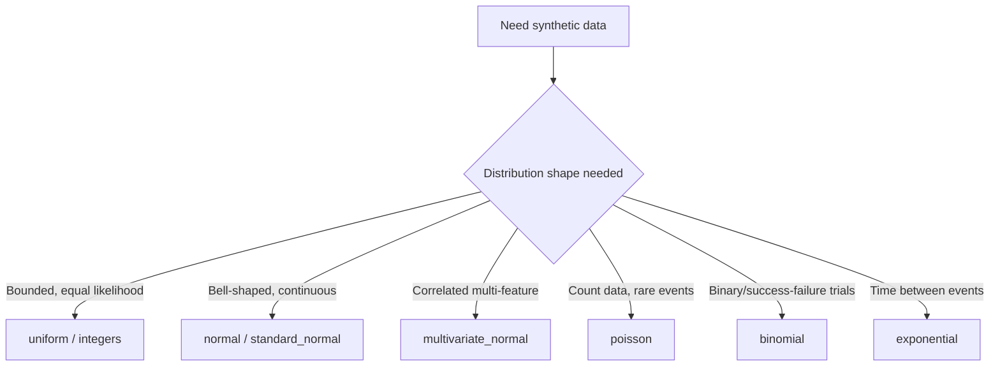

## Sampling Distributions for Simulation and ML Use Cases

### Overview

Sampling from probability distributions underlies synthetic data generation, Monte Carlo simulation, Bayesian methods, stochastic model components, and data augmentation. NumPy's `Generator` API exposes a substantial set of named distributions, each with documented parameters and support ranges. [Unverified] I cannot confirm the complete, current list of distributions available for any specific NumPy version without checking that version's documentation directly; the examples given here reflect commonly documented distributions, not an exhaustive or version-verified list.

### Uniform Distributions

```python
import numpy as np

rng = np.random.default_rng(seed=0)

rng.random(5)                        # continuous uniform [0, 1)
rng.uniform(low=-5, high=5, size=5)  # continuous uniform, custom range
rng.integers(low=0, high=100, size=5)  # discrete uniform integers
```

[Unverified] I have not executed this exact code in this session; the described ranges follow from the documented parameter definitions of these functions, and specific numeric output should be confirmed by running the code directly.

### Normal (Gaussian) Distribution

```python
rng.normal(loc=0, scale=1, size=1000)         # standard normal
rng.normal(loc=100, scale=15, size=1000)       # e.g., simulated IQ-like scores
rng.standard_normal(size=1000)                 # equivalent to normal(0, 1)
```

$$
f(x) = \frac{1}{\sigma\sqrt{2\pi}} e^{-\frac{(x-\mu)^2}{2\sigma^2}}
$$

[Unverified] I have not executed this exact code in this session; the probability density function shown is the standard, documented mathematical definition of the normal distribution, but specific generated sample values should be confirmed by execution if precision matters.

### Multivariate Normal Distribution

```python
mean = np.array([0, 0])
cov = np.array([[1, 0.5], [0.5, 1]])
samples = rng.multivariate_normal(mean, cov, size=1000)
```

This generates correlated samples according to the specified covariance structure, useful for simulating feature sets with known inter-feature correlation. [Inference] This description follows from the documented mathematical definition of the multivariate normal distribution and its role in generating correlated variables, but I have not executed this exact code in this session, so the specific empirical correlation of the generated sample should be checked directly (e.g., via `np.corrcoef`) rather than assumed to exactly match the input `cov` for any finite sample size.



### Discrete Distributions

```python
rng.binomial(n=10, p=0.5, size=1000)      # number of successes in n trials
rng.poisson(lam=3, size=1000)              # count of events in fixed interval
rng.geometric(p=0.3, size=1000)            # trials until first success
rng.negative_binomial(n=5, p=0.4, size=1000)
```

[Unverified] I have not executed these exact calls in this session; the described interpretations follow from standard, documented probability theory definitions of these distributions, and specific generated values should be confirmed by execution.

### Continuous Distributions Beyond Normal

```python
rng.exponential(scale=1.0, size=1000)     # time between Poisson-process events
rng.gamma(shape=2.0, scale=1.0, size=1000)
rng.beta(a=2.0, b=5.0, size=1000)          # bounded to [0, 1]
rng.chisquare(df=3, size=1000)
```

[Unverified] I have not executed these exact calls in this session; the described distribution properties reflect standard, documented probability theory, and specific generated values should be confirmed by execution against the specific NumPy version's implementation.

### Sampling With and Without Replacement

```python
population = np.arange(100)

rng.choice(population, size=10, replace=True)    # with replacement (default)
rng.choice(population, size=10, replace=False)   # without replacement
rng.choice(population, size=10, replace=False, p=custom_probabilities)
```

[Unverified] I have not executed this exact code in this session, and the `custom_probabilities` variable is illustrative rather than defined; the documented behavior of `replace` and `p` parameters is as described, but a specific working example with concrete probability values should be tested directly to confirm output.

**Key Points**
- `replace=False` requires `size` to not exceed the population length, or a `ValueError` is raised. [Unverified] I cannot confirm the exact error message text for the currently installed NumPy version without executing a failing example directly.
- The `p` parameter allows weighted sampling, where elements with higher associated probability are more likely to be selected. [Inference] This follows from the documented purpose of the `p` parameter, but I have not executed a specific weighted example in this session to confirm the exact empirical frequency distribution of a resulting sample.

### Custom Discrete Distributions via `p`

```python
outcomes = np.array(['A', 'B', 'C'])
probabilities = np.array([0.5, 0.3, 0.2])
samples = rng.choice(outcomes, size=1000, p=probabilities)
```

For a sufficiently large sample size, the empirical frequency of each outcome is expected to approximate the specified probabilities, per the law of large numbers. [Inference] This is a standard, documented result from probability theory (the law of large numbers), not a result verified by execution in this session — the actual empirical frequencies for this specific call should be checked directly (e.g., via `np.unique(samples, return_counts=True)`) rather than assumed to match `probabilities` exactly for any specific finite sample.

### Monte Carlo Simulation Pattern

```python
rng = np.random.default_rng(seed=1)

n_trials = 100_000
samples = rng.uniform(-1, 1, size=(n_trials, 2))
inside_circle = (samples[:, 0]**2 + samples[:, 1]**2) <= 1
pi_estimate = 4 * inside_circle.mean()
```

This is a documented, standard technique (Monte Carlo estimation of $\pi$) that relies on vectorized random sampling and boolean masking rather than explicit looped trials. [Inference] This describes the well-established mathematical basis for this simulation technique, but I have not executed this exact code in this session, so the specific resulting `pi_estimate` value should be confirmed by running the code directly — Monte Carlo estimates are inherently stochastic and will vary somewhat between runs even with different seeds, though they are expected to converge toward the true value as `n_trials` increases, per the law of large numbers.

### Bootstrap Resampling

```python
data = np.array([23, 45, 12, 67, 34, 89, 21])
n_bootstrap = 1000

bootstrap_means = np.array([
    rng.choice(data, size=len(data), replace=True).mean()
    for _ in range(n_bootstrap)
])
```

[Inference] This pattern reflects the standard, documented definition of the bootstrap resampling technique in statistics — repeatedly sampling with replacement from observed data to estimate a statistic's sampling distribution. I have not executed this exact code in this session, so specific resulting values should be confirmed directly. Note that this specific implementation uses a Python-level loop over `n_bootstrap` iterations; [Inference] a fully vectorized alternative (generating all bootstrap samples in a single call, if array shape permits) may reduce Python-level overhead relative to this loop-based version, consistent with general vectorization principles discussed elsewhere in this material, but the specific performance difference has not been benchmarked here.

### Data Augmentation via Sampling

```python
X = np.array([[1.0, 2.0], [3.0, 4.0], [5.0, 6.0]])
noise = rng.normal(loc=0, scale=0.1, size=X.shape)
X_augmented = X + noise
```

Adding small random perturbations sampled from a normal distribution is a documented, commonly used data augmentation technique for numeric features, though the specific effect on any particular model's performance is not something I can verify without testing that specific model and dataset. [Unverified]

### Reproducibility Considerations for Simulation Work

**Key Points**
- Using a fixed seed (`np.random.default_rng(seed=N)`) allows a simulation or sampling procedure to be reproduced exactly, given identical NumPy version and call sequence, per documented design intent.
- [Unverified] I cannot verify that reproducibility holds across different NumPy versions, operating systems, or hardware for any specific case without direct testing, and this should not be assumed as a universal guarantee.
- For multi-run experiments requiring independent but reproducible random streams, `SeedSequence.spawn()` (described in prior material on the `Generator` API) is the documented approach for generating multiple independent seeded generators from one base seed.

### Practical Relevance for Machine Learning Data Handling

- **Synthetic dataset creation** for testing preprocessing pipelines or model code commonly uses combinations of `normal`, `uniform`, and `multivariate_normal` sampling to create controlled test data with known statistical properties.
- **Bootstrap confidence intervals** for model performance metrics rely directly on the resampling-with-replacement pattern shown above.
- **Monte Carlo dropout and stochastic regularization techniques** in some model architectures rely on repeated random sampling during both training and, in some variants, inference. [Unverified] I cannot verify the specific internal random sampling implementation of any particular deep learning framework's dropout or stochastic regularization layers without checking that framework's own source code directly.
- **Class-imbalance handling via resampling** (oversampling minority classes, undersampling majority classes) commonly uses `rng.choice` with or without replacement as a foundational operation, sometimes wrapped by higher-level libraries with additional logic.

I cannot verify how any specific third-party library (for example, a particular version of a data augmentation or imbalanced-learning library) implements its internal sampling procedures, since that depends on that library's own source code and version, which is outside what I can confirm here. [Unverified]

### Disclaimer on Behavioral Claims

[Inference] The descriptions in this document reflect standard, documented probability theory definitions and commonly stated NumPy `Generator` API conventions. I cannot guarantee that any specific function signature, default parameter, numeric output, or performance characteristic described here is accurate for any particular NumPy version without direct execution or documentation lookup on that system. Behavior may vary across versions and is not guaranteed to remain unchanged in future releases. This disclaimer applies to the entire document, since some claims above rely on documented conventions rather than execution verified in this session.

**Related Topics**
- Vectorized bootstrap resampling without explicit Python loops
- `SeedSequence` for reproducible parallel simulation
- Monte Carlo methods for numerical integration and probabilistic inference
- Distribution fitting: estimating parameters from observed data versus generating synthetic samples
- Stochastic data augmentation techniques for tabular, image, and text ML data
- Importance sampling and variance reduction techniques in simulation