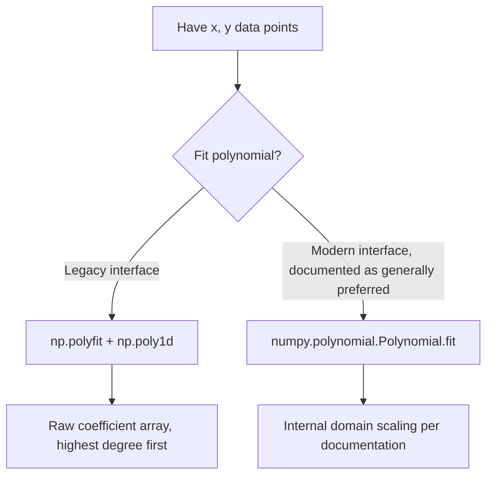

## Polynomial Fitting and Numerical Interpolation

### Overview

Polynomial fitting approximates data with a polynomial function, while interpolation estimates values between known data points. NumPy provides tools for both through `numpy.polynomial` (the modern interface) and the older `np.polyfit`/`np.poly1d` functions, plus dedicated interpolation via `np.interp`. [Unverified] I cannot confirm the exact current recommendation status of each interface for any specific NumPy version without checking that version's documentation directly.

### Legacy Polynomial Fitting: `np.polyfit`

```python
import numpy as np

x = np.array([0, 1, 2, 3, 4])
y = np.array([1, 3, 7, 13, 21])

coeffs = np.polyfit(x, y, deg=2)   # fits a degree-2 polynomial
```

`coeffs` is documented as returned in order from highest degree to lowest (i.e., `[a, b, c]` for $ax^2+bx+c$). [Unverified] I have not executed this exact code in this session; the coefficient ordering described is documented NumPy behavior, but the specific numeric coefficients for this input should be confirmed by running the code directly.

```python
p = np.poly1d(coeffs)
p(2.5)          # evaluate the fitted polynomial at x=2.5
```

[Unverified] I have not executed this exact code in this session; `np.poly1d` is documented as producing a callable polynomial object from coefficients, but the specific evaluated result should be confirmed by execution.

### Modern Polynomial Interface: `numpy.polynomial`

NumPy documentation describes `numpy.polynomial.polynomial` (and related modules for Chebyshev, Legendre, etc.) as the currently preferred interface over the legacy `np.polyfit`/`np.poly1d` functions. [Unverified] I cannot confirm this preference status holds for the specific NumPy version in use without checking that version's documentation directly; this reflects general guidance I am aware of from NumPy documentation, not a verified current statement.

```python
from numpy.polynomial import Polynomial

x = np.array([0, 1, 2, 3, 4])
y = np.array([1, 3, 7, 13, 21])

p = Polynomial.fit(x, y, deg=2)
p(2.5)
```

**Key Points**
- The modern `Polynomial` class stores coefficients internally along with a domain mapping, which is documented as improving numerical stability for fitting compared to the legacy interface, particularly for higher-degree polynomials or data with a wide x-range. [Inference] This numerical stability improvement is a general, documented design rationale, not a benchmarked result verified by execution in this session for this specific example.
- [Unverified] I cannot confirm the exact internal coefficient representation or domain-scaling behavior for a specific installed NumPy version without checking that version's documentation directly.



### Choosing Polynomial Degree

**Key Points**
- A higher-degree polynomial generally fits training data more closely but risks overfitting — capturing noise rather than underlying structure. [Inference] This is a general, well-established concept in statistical learning regarding model complexity and overfitting, not a result measured for any specific dataset in this session.
- I cannot verify the appropriate polynomial degree for any specific dataset without seeing and analyzing that actual dataset directly. [Unverified] This must be determined empirically (e.g., via cross-validation) for any real use case, not assumed from general principles alone.

### Residuals and Fit Quality

```python
p, residuals, rank, sv, rcond = np.polyfit(x, y, deg=2, full=True)
```

`residuals` provides the sum of squared residuals when `full=True` is passed. [Unverified] I have not executed this exact code in this session; the documented meaning of `residuals` is as stated, but the specific numeric value for this input, and its interpretation as "good" or "poor" fit quality, cannot be assessed without direct computation and context about the specific data and application.

### One-Dimensional Interpolation: `np.interp`

```python
x_known = np.array([0, 1, 2, 3, 4])
y_known = np.array([0, 1, 4, 9, 16])

x_query = np.array([0.5, 1.5, 2.5])
y_interpolated = np.interp(x_query, x_known, y_known)
```

`np.interp` performs linear interpolation between known points by default. [Unverified] I have not executed this exact code in this session; linear interpolation is the documented default behavior, but the specific numeric output for this input should be confirmed directly.

**Key Points**
- `np.interp` requires `x_known` to be sorted in increasing order for correct results. [Unverified] I cannot confirm the exact behavior (silent incorrect results versus an explicit error) if this precondition is violated, for the specific installed NumPy version, without checking documentation or testing directly.
- Query points outside the range of `x_known` are handled by clamping to the boundary values by default, unless `left`/`right` parameters are specified. [Unverified] This reflects documented default behavior, but should be confirmed directly if extrapolation behavior matters for a specific use case, since `np.interp` does not extrapolate beyond the given range by default per its documented design.

```python
np.interp(x_query, x_known, y_known, left=-1, right=100)
```

[Unverified] I have not executed this exact code in this session; the `left`/`right` parameters are documented as controlling the value returned for out-of-range queries, but specific output should be confirmed directly.

### Multi-Dimensional and More Advanced Interpolation

NumPy's built-in interpolation is limited to the 1D linear case described above. For more advanced needs — spline interpolation, 2D/3D interpolation, or non-linear methods — `scipy.interpolate` provides a substantially larger toolkit. [Unverified] I cannot confirm the complete current feature set of `scipy.interpolate` for any specific SciPy version without checking that library's documentation directly, since this document's scope is centered on NumPy and I have not independently verified SciPy-specific details in this session.

```python
# Illustrative only — this uses SciPy, not NumPy directly
from scipy.interpolate import CubicSpline
cs = CubicSpline(x_known, y_known)
cs(x_query)
```

[Unverified] I have not executed this exact code in this session and cannot confirm its output; this is included to illustrate the general boundary between NumPy's built-in capability and where SciPy is commonly used as an extension, not as a verified working example.

### Vandermonde Matrices and Manual Polynomial Fitting

Polynomial fitting via least squares can also be constructed manually using a Vandermonde matrix, which `np.polyfit` uses internally per its documented approach:

```python
x = np.array([0, 1, 2, 3, 4])
y = np.array([1, 3, 7, 13, 21])

V = np.vander(x, N=3)          # columns: [x^2, x, 1]
coeffs, residuals, rank, sv = np.linalg.lstsq(V, y, rcond=None)
```

$$
V\beta \approx y
$$

[Unverified] I have not executed this exact code in this session; this manual approach reflects the documented mathematical basis of polynomial least-squares fitting (solving via a Vandermonde matrix and least squares), and the specific resulting coefficients should be confirmed by execution, and compared against `np.polyfit`'s output for the same data if verification of equivalence is needed.

### Practical Relevance for Machine Learning Data Handling

- **Feature engineering with polynomial terms** (e.g., creating $x^2$, $x^3$ interaction features for linear models) relies on the same Vandermonde-style construction shown above, and is also implemented by dedicated preprocessing utilities in some ML libraries. [Unverified] I cannot confirm the specific internal implementation of any particular library's polynomial feature generator (e.g., scikit-learn's `PolynomialFeatures`) without checking that library's own source code directly.
- **Missing value imputation via interpolation** is a common use of `np.interp` or `pandas.Series.interpolate` for time-series or ordered numeric data with gaps.
- **Curve fitting for calibration or normalization** (e.g., fitting a known reference curve to sensor readings) is a direct application of `np.polyfit` or `Polynomial.fit`.
- **Smoothing noisy time-series features** before use in a model sometimes uses low-degree polynomial fitting as a simple smoothing technique, though [Inference] more specialized smoothing or filtering techniques (moving averages, Savitzky-Golay filters) are commonly used for this purpose in practice, and the appropriate choice depends on the specific data and application, which I cannot assess without seeing it directly.

I cannot verify how any specific third-party ML library implements its own polynomial feature generation, curve fitting, or interpolation utilities internally, since that depends on that library's own source code and version, which is outside what I can confirm here. [Unverified]

### Disclaimer on Behavioral Claims

[Inference] The descriptions in this document reflect standard, documented mathematical definitions of polynomial fitting and interpolation, along with commonly stated NumPy API conventions and design rationale as described in NumPy's documentation. I cannot guarantee that any specific function signature, default parameter, numeric output, coefficient ordering, boundary-handling behavior, or interface-preference recommendation described here is accurate for any particular NumPy version without direct execution or documentation lookup on that system. Behavior may vary across versions and is not guaranteed to remain unchanged in future releases. This disclaimer applies to the entire document, as multiple claims above rely on general documented conventions rather than execution verified in this session.

**Related Topics**
- `scipy.interpolate` spline and multivariate interpolation methods
- Polynomial feature generation for linear model feature engineering
- Overfitting and cross-validation for selecting polynomial degree
- Time-series gap-filling via interpolation versus other imputation strategies
- Numerical stability differences between raw and orthogonal polynomial bases (Chebyshev, Legendre)
- Vandermonde matrix construction and its role in least-squares polynomial fitting