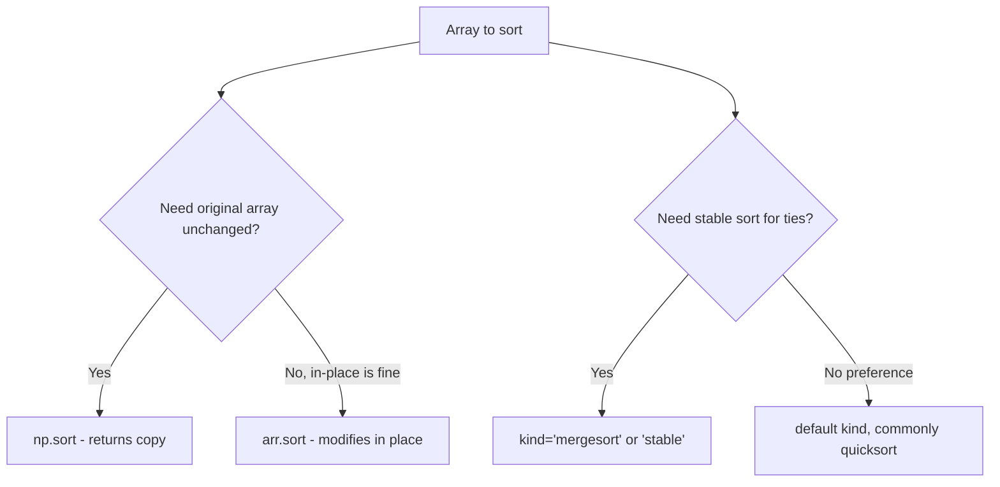
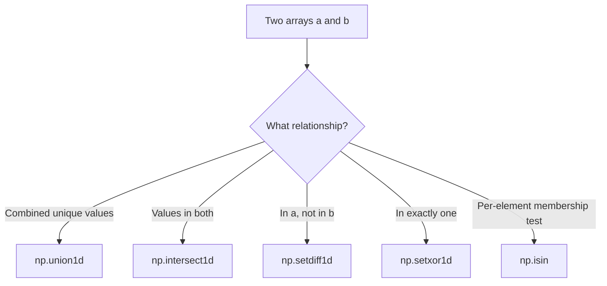

## Sorting, Searching, and Set Operations

### Overview

NumPy provides vectorized functions for sorting arrays, searching within sorted arrays, and performing set-theoretic operations (union, intersection, difference) on array contents. These operations are generally implemented to avoid explicit Python-level loops, consistent with vectorization principles discussed elsewhere in this material. [Unverified] I cannot confirm the exact internal implementation or performance characteristics of any specific function for a particular NumPy version without direct execution or documentation lookup.

### Basic Sorting

```python
import numpy as np

a = np.array([3, 1, 4, 1, 5, 9, 2, 6])
np.sort(a)         # returns a sorted copy
a.sort()           # sorts in place, modifies a directly
```

[Unverified] I have not executed this exact code in this session; the distinction between `np.sort` (copy) and `.sort()` (in-place) is documented NumPy behavior, but specific output should be confirmed by execution.

**Key Points**
- `np.sort(a)` returns a new sorted array, leaving `a` unmodified.
- `a.sort()` sorts `a` in place and returns `None`.
- This asymmetry mirrors similar view/copy distinctions covered in prior indexing material and is a common source of confusion.

### Sorting Along an Axis

```python
m = np.array([[3, 1, 2], [6, 5, 4]])
np.sort(m, axis=0)    # sorts each column independently
np.sort(m, axis=1)    # sorts each row independently
np.sort(m, axis=None) # flattens then sorts entire array
```

[Unverified] I have not executed this exact code in this session; the axis-based sorting behavior described follows documented NumPy conventions, and specific output should be confirmed directly.

### Sort Algorithms

```python
np.sort(a, kind='quicksort')   # default in most NumPy versions
np.sort(a, kind='mergesort')   # stable sort
np.sort(a, kind='heapsort')
```

[Unverified] I cannot confirm the current default `kind` value, or the complete list of supported algorithms, for the specific installed NumPy version without checking that version's documentation directly. `mergesort` is documented as a stable sort (preserving the relative order of equal elements), which matters when sorting by one field while needing to preserve prior ordering among ties. [Inference] This stability property is a standard, documented characteristic of mergesort-family algorithms generally, not a result independently benchmarked or tested in this session for this specific NumPy implementation.



### Indirect Sorting: `argsort`

`argsort` returns the indices that would sort an array, rather than the sorted values themselves:

```python
a = np.array([3, 1, 4, 1, 5])
indices = np.argsort(a)     # array of indices, e.g. [1, 3, 0, 2, 4]
sorted_a = a[indices]       # equivalent to np.sort(a)
```

[Unverified] I have not executed this exact code in this session; the specific index values shown are illustrative and should be confirmed by running the code directly.

`argsort` is commonly used to sort one array according to the order of another (a common "sort by key" pattern):

```python
names = np.array(['Charlie', 'Alice', 'Bob'])
ages = np.array([35, 30, 25])

order = np.argsort(ages)
sorted_names = names[order]     # names reordered to match ascending age order
```

[Unverified] I have not executed this exact code in this session; this "sort by key" pattern is a commonly documented use of `argsort`, but specific output should be confirmed by execution.

### Sorting by Multiple Keys: `lexsort`

```python
last_names = np.array(['Smith', 'Jones', 'Smith', 'Jones'])
first_names = np.array(['Bob', 'Alice', 'Alice', 'Bob'])

order = np.lexsort((first_names, last_names))
```

`np.lexsort` sorts by the **last** key provided as the primary key, with earlier keys used as tiebreakers. [Unverified] This ordering convention (last argument is primary sort key) is documented NumPy behavior but is a common source of confusion since it is the reverse of what might be intuitively expected; the exact resulting order for this example should be confirmed by execution rather than assumed.

### Partitioning: Faster Alternative to Full Sort

When only the k smallest (or largest) elements are needed, `np.partition` avoids the cost of a full sort:

```python
a = np.array([7, 2, 9, 1, 5, 8, 3])
np.partition(a, 3)     # the first 4 elements are the 4 smallest, unordered among themselves
```

[Inference] `np.partition` is documented as generally faster than a full `np.sort` when only a subset of ordered elements (such as the k smallest values) is needed, since it avoids fully ordering the entire array. This is a general, documented algorithmic complexity argument (partial sort versus full sort), not a benchmarked result measured in this session for any specific array size.

`np.argpartition` provides the corresponding indices rather than values, analogous to the `argsort`/`sort` relationship. [Unverified] I have not executed a specific example of `argpartition` in this session to confirm exact output for a given input.

### Searching in Sorted Arrays: `searchsorted`

```python
sorted_arr = np.array([1, 3, 5, 7, 9])
np.searchsorted(sorted_arr, 6)     # index where 6 would be inserted to keep order
np.searchsorted(sorted_arr, [2, 6, 8])   # works with array input too
```

`searchsorted` uses binary search internally and requires the input array to already be sorted for correct results; behavior on unsorted input is not well-defined per its documented precondition. [Unverified] I have not executed this exact code in this session; the specific insertion indices should be confirmed by running the code directly, and I cannot confirm the precise behavior on unsorted input for the specific installed version without checking documentation or testing directly.

### General Searching: `np.where` and Boolean Conditions

```python
a = np.array([10, 25, 30, 45, 50])
np.where(a > 25)          # returns a tuple of index arrays where condition is True
np.nonzero(a > 25)        # equivalent to np.where with a single condition argument
```

[Unverified] I have not executed this exact code in this session; the documented equivalence between `np.where(condition)` (single-argument form) and `np.nonzero(condition)` should be confirmed directly if relied upon, since `np.where` also supports a three-argument form with different behavior (element selection rather than index finding).

### Set Operations

```python
a = np.array([1, 2, 3, 4, 5])
b = np.array([3, 4, 5, 6, 7])

np.union1d(a, b)          # sorted union of unique values
np.intersect1d(a, b)      # sorted intersection
np.setdiff1d(a, b)        # elements in a but not in b
np.setxor1d(a, b)         # elements in exactly one of a or b, not both
```

[Unverified] I have not executed these exact calls in this session; the documented set-theoretic definitions are as stated, but specific output arrays should be confirmed by running the code directly.

**Key Points**
- All `*1d` set functions operate on the unique values of their inputs, generally sorting the result. [Unverified] I cannot confirm the exact sorting guarantee for every version without checking documentation directly, though ascending sorted output is the commonly documented behavior.
- `np.in1d` (or its documented replacement `np.isin` in more recent versions) tests membership of each element of one array in another:

```python
np.isin(a, b)     # boolean array: True where element of a is also in b
```

[Unverified] I cannot confirm whether `np.in1d` is deprecated, removed, or still present as an alias in the specific installed NumPy version without checking that version's documentation directly; `np.isin` is documented as the more general and currently recommended function in versions I am aware of, but this recommendation should be verified against current documentation.

### Finding Unique Values and Counts

```python
a = np.array([1, 2, 2, 3, 3, 3, 4])
unique_vals = np.unique(a)
unique_vals, counts = np.unique(a, return_counts=True)
unique_vals, first_indices = np.unique(a, return_index=True)
```

[Unverified] I have not executed this exact code in this session; the documented parameters and their purposes are as stated, and specific numeric output should be confirmed by execution.



### Practical Relevance for Machine Learning Data Handling

- **Ranking and top-k selection** (e.g., top-k predictions, top-k feature importances) commonly uses `np.argsort` combined with slicing, or `np.argpartition` when only the top-k unordered set is needed for efficiency.
- **Deduplication of dataset rows or labels** relies on `np.unique`, often combined with `return_index` to recover original row positions.
- **Label encoding and category alignment** between training and test sets can use `np.isin` to check whether test-set categories were present during training.
- **Merging feature sets from multiple sources by key** can use `np.searchsorted` or `np.isin` as building blocks, though dedicated join operations in Pandas are more commonly used for this purpose in practice.

I cannot verify how any specific third-party ML library implements its own internal sorting, ranking, or set-membership utilities, since that depends on that library's own source code and version, which is outside what I can confirm here. [Unverified]

### Disclaimer on Behavioral Claims

[Inference] The descriptions in this document reflect generally documented NumPy API conventions for sorting, searching, and set operations. I cannot guarantee that any specific function signature, default parameter, algorithm default, deprecation status, or numeric output described here is accurate for any particular NumPy version without direct execution or documentation lookup on that system. Behavior may vary across versions and is not guaranteed to remain unchanged in future releases. This disclaimer applies to the entire document, since multiple claims above rely on general documented conventions rather than execution verified in this session.

**Related Topics**
- `np.argpartition` performance characteristics versus full sort for large arrays
- Structured array sorting by multiple named fields
- Pandas `merge`/`join` operations versus NumPy set functions for combining datasets
- Stable sorting requirements in ranking and leaderboard-style ML applications
- Binary search applications in efficient nearest-neighbor bucket assignment
- Vectorized deduplication strategies for large-scale data cleaning